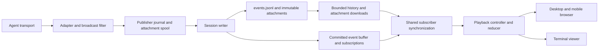
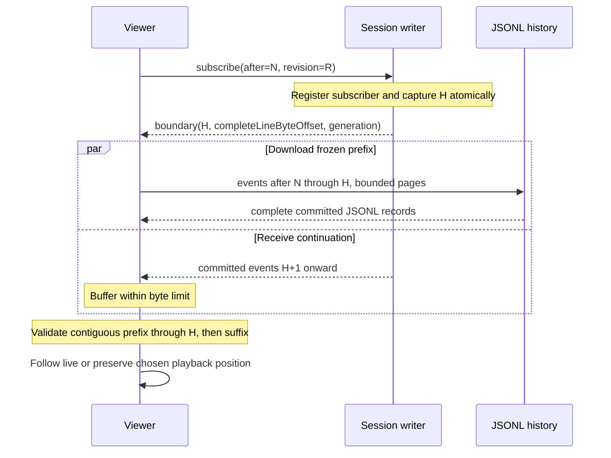

# AgentLive implementation plan

> Broadcast and replay coding-agent sessions.

**Date:** 2026-09-09  
**Status:** Implementation in progress; production exit gates remain open. See [current status](IMPLEMENTATION_STATUS.md). No deployed pilot has been verified.
**Target agents:** Claude Code, Codex, Kimi Code, and OpenCode.  
**Target viewers:** Desktop browser, mobile browser, and a separate terminal.  
**Working name:** AgentLive. Package, organization, and domain availability must be checked before publication.

This is the integrated planning document for the independent AgentLive project in `~/agentlive`. This document defines the target contract. Some commands, routes and formats are implemented; others remain planned. Use [current status](IMPLEMENTATION_STATUS.md) and the README for verified availability.

## 1. Product objective and release boundary

AgentLive lets a developer publish a coding-agent session to a server they choose. Viewers open one stable URL, watch events as they happen, pause or rewind while the agent continues, accelerate through recorded history, and return to the live position. After publishing ends, the same URL serves the recording.

The first public release must provide:

- Working live adapters for all four target agents, with an explicit compatibility and capture-fidelity matrix.
- Structured messages, tool calls and results, and inspectable file changes where the source supplies them.
- Captured user uploads, generated images, and versioned artifacts with viewer-accessible references and portable attachment bytes.
- A browser player that adapts to desktop and mobile, plus an interactive terminal viewer.
- Live following, pause, seek, step, replay with 0.5×/1×/2×/4×/8×/customizable speedup, optional idle compression, and jump to live.
- A self-contained server distributed through npm/npx and Docker.
- A centralized service configuration using the same server and protocol, supporting multiple publishers and anonymous viewing of public streams.
- Persistent recordings, durable publisher recovery across sleep/process restarts, subscriber reconnect/resynchronization, export/import, and documented operational limits.

The initial product is a spectator system. Viewers cannot submit prompts, approve tools, or execute commands on the broadcaster's machine. A local operator interface may drive an agent when required by its programmatic transport; that operator interface is separate from the public viewing API.

The initial release does not require native mobile apps, audio/video streaming, billing, a social feed, multi-region infrastructure, or arbitrary agent plugins. Session replay reconstructs captured observations; it does not rerun tools or restore a working directory.

### Architecture contract

A session is an ordered recording that can keep growing across publisher lifetimes. Persist the filtered recording locally until acknowledged, append it to one server JSONL log per session, and distribute committed additions through memory. Subscribers download a bounded prefix and subscribe to its continuation; their playback clocks run independently. Use the same protocol in standalone and multi-session hosted deployments. No database or external message broker is required initially.

| Invariant | Consequence |
| --- | --- |
| Stable session identity outlives sockets and processes | Join, exit, sleep, restart, and native-session resume preserve the URL; only explicit new-session intent creates another recording. |
| One authoritative writer per session | All event and lifecycle mutations are serialized; stale publisher connections are fenced. |
| Durable append before acknowledgment | A publisher can safely retry until ACK; the server only broadcasts its committed prefix. |
| Immutable event identity and attachment versions | Retries cannot duplicate content or alter earlier replay; a changed artifact is a new version. |
| Cursor continuity is checked end to end | Neither publisher nor subscriber advances across a missing or conflicting event. |
| Memory is disposable and bounded | Journals, files, and compatible checkpoints restore state; slow clients never require unbounded queues. |
| Disconnect, pause, and finish are distinct | A timeout cannot end a session; an intentional sharing pause survives restart. |
| All viewers consume the same filtered projection | Browser, mobile, terminal, and exports agree on content and available artifact versions. |
| Capture fidelity is explicit | Recoverable history is replayed; unavailable source deltas/timing produce visible gaps. |

Reliability means satisfying these invariants under the failure model in section 14. It does not imply unlimited offline storage, recovery of uncaptured source events, or survival after every durable copy has been lost.

### Why a new project is justified

The useful distinction is the combination of structured events, continuous live/replay behavior, browser and terminal viewers, and complete self-hosting. Individual features already exist elsewhere: claude-replay provides structured HTML replays, Campfire documents spectator links and replay, and Workflow TV advertises live catch-up and a stable replay URL. Assess these as competitors and potential sources of reusable ideas; do not claim category novelty. Their complete feature sets have not been independently tested here. [claude-replay](https://github.com/es617/claude-replay), [Campfire](https://github.com/stretchcloud/campfire), [Workflow TV](https://workflowtv.com/terminal-streaming)

## 2. Evidence and assumptions

### Evidence recorded in the original feasibility notes

| Evidence | Observation | Design implication |
| --- | --- | --- |
| claude-replay 0.11.0, commit `b20ef4142f232b9fa582617ba24ef78bb62208c6` | Its inspected watch path debounces rebuilding, polls for a version change, then reloads the document. | Build an incremental player whose inspection state survives incoming events. |
| Local Codex CLI 0.153.4 probe | 602 live text deltas arrived from 9.545–32.443 seconds; a 3,336-character assistant message was observed in the saved JSONL at 32.443 seconds. | Capture the live transport. The persistent transcript cannot recover the original text timing. |
| Local Claude Code 2.1.263 | CLI help exposes partial-message streaming; current documentation describes interactive `MessageDisplay` hooks. | Offer distinct programmatic-stream and interactive-hook integrations. |
| Local Kimi Code 0.41.0 | CLI exposes `acp` and `web`; current server docs describe text/tool deltas and transcript subscriptions. | Target current Kimi Code, not the older Python Kimi CLI's Wire interface. |
| OpenCode documentation | A server exposes SSE events and a client can connect to an existing instance. | Investigate subscription as the primary capture path. |

These are previously recorded observations, not new adapter validation performed during this design revision. Recheck upstream interfaces and versions in M0. The Codex probe was a single local experiment, stopped at a 55-second limit without observing `turn/completed`. It establishes a difference in observed data granularity, not a general performance claim. The Claude hook, Kimi server, and OpenCode adapter still require end-to-end experiments. Private session content must not become test fixtures; recreate representative workloads with synthetic repositories and prompts.

Sources: [inspected claude-replay watch implementation](https://github.com/es617/claude-replay/blob/b20ef4142f232b9fa582617ba24ef78bb62208c6/bin/claude-replay.mjs#L533), [Claude CLI streaming](https://code.claude.com/docs/en/headless#stream-responses), [Codex app-server](https://learn.chatgpt.com/docs/app-server), [Kimi server API](https://moonshotai.github.io/kimi-code/en/reference/server-api.md), [OpenCode server](https://opencode.ai/docs/server/).

### Assumptions to validate first

1. A developer can capture a useful live session without changing their agent account or supplying model credentials to AgentLive's server.
2. At least one supported transport per agent exposes incremental text before the corresponding message finishes.
3. Enough tool metadata is available to render useful edits; incomplete information can be represented honestly.
4. npm installation and filesystem append, flush, and atomic replacement behavior work on the supported operating systems.
5. A small VM can handle the initial workload once replay history, source state, uploads, and slow clients are bounded globally as well as per session.
6. Every adapter can identify resumed native sessions, declare its history-recovery fidelity, and expose supported file/artifact references without guessing from a working directory.
7. Browser cache eviction, mobile background suspension, and terminal restart can recover through the same cursor protocol without requiring persistent subscriber storage.

## 3. Technology decisions

| Layer | Initial choice | Implementation notes |
| --- | --- | --- |
| Language | TypeScript with strict checking | ESM packages; browser-compatible protocol and playback packages. |
| Runtime | Node.js 26, latest stable patch (26.8.1 verified 2026-09-09) | Node 26 only for development, CI, npm runtime, and Docker; pin the verified patch. |
| Workspace | pnpm workspaces | One lockfile and explicit package dependency boundaries. |
| Server | Hono, `@hono/node-server`, `ws` | HTTP API and bundled web assets; WebSocket publishing/subscription. |
| Schemas | Zod | Validate external input and generate a versioned protocol reference. |
| Web | React, esbuild, CSS | DOM-based text, responsive layout, accessible controls. |
| Large lists | TanStack React Virtual 3.14.11 | Measured dynamic rows, stable object keys, focus retention, and offscreen reference navigation; real-browser dynamic-height validation remains required. |
| Terminal | Ink and React | Share state reconstruction and controls, not browser layout components. |
| Storage | Per-session JSONL log and JSON metadata | Serialized appends; in-memory live delivery; rebuildable seek indexes and snapshots. Kernel advisory locks through `fs-native-extensions` protect local writer ownership across process suspension/death. |
| Tests | Vitest, Playwright | Deterministic reducers, transport failure tests, browser behavior. |
| Packaging | npm tarball and Docker image | Prebuilt browser assets; no frontend build required on the user's machine. |
| VM entry point | HTTPS reverse proxy and process supervision | Provide Docker Compose and a systemd example. |

Node 26 is the required runtime, currently the latest Current release line. Use the latest stable release of each runtime, package manager, library, and development tool when adding it; resolve registry versions rather than copying older examples. Pin exact direct dependency versions and commit the lockfile for reproducibility, then update to new stable releases with compatibility checks. Do not substitute Node 24. Installed agent versions in the evidence section are observations, not dependency pins; verify latest upstream releases during adapter validation. Hono documents the current Node WebSocket integration; use that integration rather than its deprecated `@hono/node-ws` package. [Node releases](https://nodejs.org/en/about/previous-releases), [Hono on Node](https://hono.dev/docs/getting-started/nodejs), [Ink](https://github.com/vadimdemedes/ink)

Use one server process and local filesystem storage initially in both deployment modes. Multiple sessions use independent directories and serialized writers in the same process; they do not require a database. Active subscriptions and bounded recent-event buffers live in memory. A database for richer account/query requirements, object storage, and multiple fan-out workers are later options.

### Model-provider independence

OpenCode may use any supported, available provider, including Gemini or a configured OpenAI-compatible third-party provider such as Krill. Provider selection belongs to the local agent configuration; AgentLive captures the agent transport and does not require a particular model vendor. Keep API keys in the local environment or agent credential store, never in recordings, attachment metadata, exports, or committed configuration. For Krill, use the endpoint and model identifiers actually configured and verified locally rather than assuming public OpenAI endpoints or model-name compatibility. Verify streaming, tool calls, errors, and resume behavior for each provider used in acceptance tests. The successful initial OpenCode streaming probe used an available Anthropic configuration; Krill credentials were detected but Krill inference has not yet been validated.

## 4. System boundaries



### Publisher

Owns persistent native-session bindings, source-event interpretation, broadcast filtering, local event/attachment journaling, and idempotent synchronization. In-memory adapter state must be recoverable from a compatible checkpoint and journal/source suffix. Upstream credentials remain on the source machine. A broadcast connection failure does not kill the coding agent.

### Server

Owns publisher authentication, stream ownership, event validation, durable ingestion, ordered delivery, history queries, visibility, and retention. It does not connect directly to arbitrary filesystem or shell APIs on the publisher.

### Shared subscriber synchronization

Owns protocol negotiation, history boundaries, cursor validation, retries, revision changes, cache restoration, and live handoff. Browser and terminal implementations supply transport/cache adapters to the same state machine. Network receipt, cached contiguous history, applied reducer state, and presentation position are distinct. Transport code never chooses a viewer's playback speed or scroll position.

### Supported client contracts

| Client | Durable state | Rejoin behavior |
| --- | --- | --- |
| Managed-launch publisher | Binding, secret, filtered journal, checkpoint, attachment spool | Launch/resume the verified native session and reconcile the same stream. |
| Attached publisher | Same durable publisher state | Reattach to the verified agent instance/session; agent lifetime is independent. |
| Installed hook/relay publisher | Same durable publisher state, plus source-specific relay cursor if available | Hook integration reaches the local recorder; cloud outages do not block hook execution indefinitely. Relay failure reports a gap unless the source can recover it. |
| Desktop browser | Optional evictable event/checkpoint cache and UI preferences | Restore compatible cache or fetch history; cursor-only storage is not sufficient. |
| Mobile browser | Same protocol; cache/background work may be unavailable | Revalidate on foreground and rebuild if evicted; no always-running socket assumption. |
| Interactive terminal | Optional bounded file cache and saved playback position | Restore or download again; exiting the viewer never affects publication. |
| Redirected terminal output | No implicit rewindable screen; optional explicit resume cursor | Stream sanitized plain output. Across process restarts, document possible duplicates after a lost output checkpoint; stdout is not transactionally coupled to local storage. |
| Offline terminal replay | Exported recording and optional UI preferences | Read local events/assets through the same history interface; there is no network or live subscription. |

### Playback engine

Owns reconstruction of captured state and the viewer's timeline. It has no DOM, terminal IO, network, or database dependency. All IO comes through interfaces so synthetic traces can exercise exactly the engine shipped to viewers.

### Renderers

Own viewport layout, input, scrolling, selection, and local expansion state. Incoming events update content without a page reload or resetting the viewer's inspection choices.

## 5. Deployment modes and command contract

| Property | Standalone | Centralized service |
| --- | --- | --- |
| Operator | Individual or organization | Hosted-service operator |
| Installation | npm/npx or Docker | Same server image, service configuration |
| Publishers | Local owner and explicitly issued publishing keys | Authenticated accounts with scoped keys |
| Public viewers | Anonymous | Anonymous |
| Data | Operator-selected persistent directory | Operator-managed persistent storage |
| Central account dependency | None | Required only to publish/manage hosted streams |
| Discovery | Stream links and optional local listing | Public listing added after the core release |

Standalone supports multiple streams and can run on a remote VM. A laptop installation is reachable only through its available network path; AgentLive should print local/LAN URLs accurately and explain when public reachability requires a tunnel or forwarding. It must not describe a loopback URL as public.

Proposed CLI:

```bash
# Self-contained server, loopback by default
npx agentlive serve --data ./agentlive-data

# Explicitly listen on a reachable interface behind HTTPS
agentlive serve --host 0.0.0.0 --port 7331 --data /var/lib/agentlive

# Authenticate to either a self-hosted or hosted server
agentlive login --server https://watch.example.com

# Launch through an adapter and publish; show an explicit capture mode
agentlive publish --agent claude --server https://watch.example.com

# Attach only where the adapter has verified support
agentlive publish --agent opencode --attach http://127.0.0.1:4096 \
  --session <native-session-id> --server https://watch.example.com

# View in a different terminal or replay an exported recording
agentlive watch https://watch.example.com/s/<stream-id>
agentlive replay ./session.agentlive --speed 4

# Diagnostics and recording portability
agentlive doctor
agentlive status <stream-id>

# Publication intent is distinct from closing a process
agentlive pause <stream-id>
agentlive publish --resume <stream-id>
agentlive finish <stream-id>
agentlive reopen <stream-id>
agentlive export <stream-id> --output ./session.agentlive
agentlive import ./session.agentlive
```

Before implementation, freeze argument behavior for interactive versus non-interactive use. Never forward a joined shell string when spawning an agent; preserve argument arrays. `--attach` must fail clearly for unsupported agent/version combinations.

Stopping publication is distinct from ending the agent session or finalizing its recording. A keyboard command can stop sharing while the coding workflow continues; persist this explicit pause so restart does not silently resume capture. Closing a process, sleeping a laptop, or losing a socket leaves the stream resumable at the same URL. Explicit finish reconciles queued events and then finalizes the recording; an offline finish is a durable pending intent, not a claim that the server has finished.

`pause` saves disabled sharing intent and stops capture at an explicit boundary while allowing the already captured prefix to drain. `publish --resume` is an explicit action that enables sharing again; automatic startup respects a saved pause. `finish` drains or reports a pending finish, and `reopen` enables further publication to an explicitly ended recording. `status` shows capture connection, sharing intent, oldest pending event, queued event/attachment bytes, last durable server ACK, and any recovery block without dumping event content.

On managed launch or a verified installed integration, identify the native agent session and automatically reuse its persisted publishing binding when sharing is enabled. Offer `agentlive publish --resume <stream-id>` for an explicit binding and `--new-stream` for an intentional new recording. Reusing a project directory alone is not proof of native session identity. Starting an unintegrated agent cannot launch AgentLive automatically; diagnostics must explain whether capture is attached, awaiting the source, paused, or recovering.

## 6. Agent adapter plan

Each adapter reports capabilities at session start and whenever they change:

```ts
interface CaptureCapabilities {
  text: 'delta' | 'line-batch' | 'completed-block';
  toolArguments: 'delta' | 'complete' | 'unavailable';
  toolResults: 'delta' | 'complete' | 'unavailable';
  fileChanges: 'patch' | 'summary' | 'unavailable';
  subagents: 'delta' | 'complete' | 'unavailable';
  attachExisting: boolean;
  history: 'events' | 'snapshot' | 'unavailable';
  resumeIdentity: 'stable-id' | 'verified-lineage' | 'manual-binding';
  sourceCursor: 'durable' | 'connection-only' | 'unavailable';
  uploads: 'bytes' | 'reference-only' | 'unavailable';
  generatedImages: 'bytes' | 'reference-only' | 'unavailable';
  artifacts: 'file' | 'bundle' | 'reference-only' | 'unavailable';
}
```

Store agent version, adapter version, transport, and fidelity in recording metadata. An advertised capability must have a captured fixture and an integration test. Do not infer token-level fidelity from a flag named `stream-json`.

### Claude Code

- Primary path: CLI/Agent SDK partial-message stream, with a local operator loop for prompts and approvals when needed.
- Optional path preserving the native terminal workflow: an explicitly installed hook integration, forwarding display batches and tool lifecycle events to a local relay.
- Keep those modes distinct in documentation and diagnostics. A script invoking programmatic mode is not transparent attachment to an already-running interactive terminal.
- Pair partial updates with completed messages by upstream identifiers; reconcile the final message without appending duplicate text.

`MessageDisplay` supplies completed-line batches for interactive assistant text. It does not supply tool output, and in programmatic mode it runs after the message completes. Keep its handler fast because display waits for it. Do not use it as the source of programmatic token deltas. Current Agent SDK documentation also limits subagent delta forwarding; capabilities must reflect that. [Display hooks](https://code.claude.com/docs/en/hooks#messagedisplay), [Agent SDK streaming](https://code.claude.com/docs/en/agent-sdk/streaming-output)

### Codex

- Primary path: the app-server connection associated with the target thread.
- Consume item lifecycle, agent-message deltas, tool execution output, and file-change events actually exposed by the tested protocol.
- Prove whether a second client can observe the active thread while the regular terminal remains usable, including connection lifecycle and unsubscribe behavior.
- If attachment is not supported in a tested arrangement, provide a managed launch path and label it accordingly. Starting a different app-server against stored history does not recover a live stream.

Keep the adapter versioned because the app-server transport includes experimental surfaces. Use generated schema artifacts from the tested CLI where available. [Codex app-server reference](https://learn.chatgpt.com/docs/app-server)

### Kimi Code

- Target the installed/current `kimi-code` generation, initially tested against 0.41.0.
- Prefer its local server transcript subscription at delta grade where validated; evaluate legacy delta notifications and ACP as alternatives.
- Validate both session creation and attachment to an already-running server. Do not assume a separate server receives deltas from an unrelated terminal process.
- Persist received volatile deltas in AgentLive. Upstream reconnect recovery may return a snapshot rather than the missing original delta sequence.
- Mark recovered spans as reconstructed and test the main/subagent transcript modes independently.

The current server reference documents experimental REST/WebSocket APIs, delta events, and transcript subscription grades. The older `kimi-cli --wire` design is not the target implementation. [Kimi Code server API](https://moonshotai.github.io/kimi-code/en/reference/server-api.md), [Kimi ACP](https://moonshotai.github.io/kimi-code/en/reference/kimi-acp)

### OpenCode

- Prefer the server SSE stream, connected to the target instance and filtered by session.
- Compare server events with plugin callbacks for message updates, tool lifecycle, and file edits.
- Test message-part updates for incremental content and final-message reconciliation; snapshots and deltas must not double-count the same content.
- Verify whether the normal terminal exposes an address usable by an external subscriber; otherwise start a managed server and connect the operator client to it.

The SDK supports connecting to an existing server, and plugins expose session/message/tool events. Exact delta coverage remains a feasibility test. [Server](https://opencode.ai/docs/server/), [SDK](https://opencode.ai/docs/sdk/), [Plugins](https://opencode.ai/docs/plugins/)

### Common adapter experiments

For each agent, capture a controlled session with: a long text response, a long-running command, a two-file edit, a failed tool, an approval pause, cancellation, and a subagent if supported. Compare the operator display with captured events using timestamps. Exercise reconnect during text generation and after a tool starts. Also capture an uploaded image/file and a generated image or local artifact where supported; test reference resolution, updates, and unavailable source handling. Save sanitized fixtures, a capability result, and exact version information.

Each adapter must additionally pass the same native-session restart, source replay/snapshot reconciliation, intentional pause, and attachment-version scenarios. Record unsupported cases in its capability matrix; shared network recovery cannot upgrade upstream capture fidelity.

Do not implement a generic transcript watcher as a silent fallback for a failed live adapter. A future import mode may ingest historical transcripts with explicit reduced fidelity.

## 7. Event protocol and ordering

### Ownership and identifiers

One broadcast stream has one active publisher lease. That publisher may aggregate events from a main agent and its children. Multiple independent publishers create separate streams in the initial protocol.

Use two sequence spaces:

- `producerSeq`: contiguous sequence within a `producerEpoch`, assigned after filtering and committed to the local spool.
- `serverSeq`: contiguous sequence within a stream, assigned by the server's serialized stream writer. This is the authoritative replay order.

An epoch is a persisted identifier for a publisher sequence space. A normal process restart reloads its existing epoch and unacknowledged spool; lease renewal does not reset event identity. A lost spool or explicit source replacement starts a new epoch through an authorized lease handoff and records a discontinuity within the same stream. Lease generations fence stale publishers. Producer checkpoints must never reuse a sequence for different content after spool compaction.

Clock segments are independent of producer epochs: restarting a process can reset its monotonic clock without resetting sequence identity. Each capture runtime starts a new persisted clock-segment ID with a wall-clock anchor and timing confidence. A suspend/resume boundary also starts a segment if monotonic sleep behavior cannot preserve elapsed timing reliably.

```ts
interface PublishedEvent {
  protocolVersion: 1;
  streamId: string;
  producerEpoch: string;
  producerSeq: number;
  source: {
    agent: 'claude' | 'codex' | 'kimi' | 'opencode';
    sessionId: string;
    agentId?: string;
    eventId?: string;
  };
  observedAt: string;        // UTC wall time, for display and diagnostics
  clockSegmentId: string;   // capture-clock lifetime, independent of retry identity
  elapsedMs: number;         // monotonic capture time within that segment
  kind: string;
  fidelity: 'delta' | 'line-batch' | 'block' | 'reconstructed';
  payload: unknown;          // validated discriminated union in implementation
}
```

The server adds `serverSeq`, `receivedAt`, and nondecreasing `timelineMs`. Map each clock segment to the stream timeline with persisted/rebuildable anchors. Offline batches retain capture spacing rather than acquiring their upload timing. Across sleep/restart, retain known elapsed gaps or label a wall-clock-derived estimate; never turn clock rollback into negative playback time. Preserve original source timestamps separately when available; never sort replay by a machine wall clock. On an offline restart where elapsed time cannot be established reliably, insert a discontinuity rather than inventing precise timing.

### Stored event envelope and control records

`serverSeq` is the public event ID: `(streamId, revision, serverSeq)` uniquely identifies an event for subscribers. Sequences begin at 1, and cursor 0 means before the first record. Use positive safe integers, reject overflow/invalid values, and define `afterServerSeq` as exclusive and `throughServerSeq` as inclusive throughout the protocol. Producer retry identity is internal to publishing; clocks and lease generations never serve as event IDs.

The server stores a versioned envelope containing `serverSeq`, `receivedAt`, `timelineMs`, kind/payload, and an origin union. Stream identity and current revision are supplied by the containing recording and transport response, rather than baked into every server envelope; restore can change the revision without rewriting all JSONL bytes. Original publisher stream identity remains provenance inside its immutable payload. A publisher origin carries the immutable `PublishedEvent` and its canonical digest. A server origin carries a durable operation ID for lifecycle transitions such as finish, reopen, or epoch handoff. Server records share the serialized log and consume server sequences, but never consume a producer sequence or fabricate native-agent activity. Their timeline position equals the current recorded timeline; receipt timestamps separately describe when the operation occurred. Connectivity/queue/heartbeat notifications are ephemeral status and do not consume event IDs.

Recording lifecycle is reconstructed from these log records; `metadata.json` caches that lifecycle but is authoritative for ownership, credential hashes, visibility, and retention. Never require an atomic commit across the event log and metadata cache. The serialized handler acknowledges a lifecycle operation only after its record is durable; retries return the existing result by operation ID. Finalize only at the requested producer cursor after fencing/draining the writer; reject stale requests if additional events already committed. Reopen and epoch handoff use lifecycle preconditions, so delayed retries cannot reopen a newer finished state.

Clock-segment anchors and timing confidence travel in durable capture metadata/events so both server and publisher rebuild timing after restart. A segment's first event establishes its mapping exactly once; retry never remaps it using current arrival time. Several events may share a timeline position and remain ordered by `serverSeq`.

### Initial event families

| Family | Representative events | Meaning |
| --- | --- | --- |
| Session | `session.started`, `session.metadata`, `session.ended` | Agent session state, separate from publication state. |
| Turn | `turn.started`, `turn.ended` | Boundaries for one operator request and its work. |
| Message | `message.started`, `message.text.append`, `message.reconciled`, `message.completed` | Incremental content with explicit final reconciliation. |
| Tool | `tool.started`, `tool.arguments.append`, `tool.arguments.ready`, `tool.output.append`, `tool.completed` | Proposed input, execution, and result remain distinct. |
| Files | `file.change.proposed`, `file.change.applied` | Structured path and patch when observed; never imply a proposed change was applied. |
| Agent tree | `agent.started`, `agent.ended` | Parent/child identity where the source exposes it. |
| Attachments | `attachment.pending`, `attachment.available`, `attachment.unavailable`, `artifact.version`, `reference.resolved` | Captured files, immutable artifact versions, and replacement of inaccessible source references. |
| Recording | `recording.created`, `recording.ended`, `recording.reopened`, `publisher.epoch.changed` | Server-authored durable lifecycle transitions, distinct from agent session events. |
| Capture | `capture.gap`, `capture.recovered`, `capture.capabilities` | Missing data, snapshot recovery, or fidelity changes. |

Permission status can be shown through an informational event; no viewer approval route exists. Only capture reasoning text that the upstream legitimately exposes. Do not attempt to retrieve hidden model state.

For message appends, use stable message/block IDs and event order. Preserve upstream offsets with their declared units inside adapter metadata; normalize them before applying text. Test Unicode, combining characters, and code points split across byte chunks. Completed snapshots replace or reconcile a known block through an explicit event; they are never treated as another append.

Major protocol versions are negotiated at connection time. Unknown major versions fail visibly. Optional extensions may be skipped, but an unknown event affecting reconstruction must mark the recording as partially understood. Old recordings retain a reducer/schema version and are migrated explicitly.

## 8. Ingestion, reconnect, and storage

### Durable ingestion contract

1. Normalize and filter source events locally.
2. Commit publishable events to the local spool.
3. Send ordered batches, initially capped at 100 events or 256 KiB, with at most 50 ms batching delay under normal load.
4. Server validates ownership, lease, schema, limits, and sequence continuity.
5. The serialized session writer assigns server sequence numbers and appends complete JSONL records containing publisher retry identities.
6. Flush the batch to durable storage before advancing the committed cursor, acknowledging, and broadcasting those events to viewers. The log is authoritative; metadata cursors are rebuildable caches.
7. Publisher removes acknowledged spool records according to its local retention policy.

Deduplication on `(streamId, producerEpoch, producerSeq)`, recovered from the log after restart, makes retry idempotent. A repeated key with different content is a protocol error. Reject a sequence gap and return the expected cursor. Acknowledgements always describe a contiguous durable prefix.

The delivery model is at-least-once with deduplication. There is no claim that the network itself provides exactly-once delivery.

### Session creation and binding

Before the first create request, the publisher durably saves a random creation-request ID and a randomly generated write secret. The authenticated creation API accepts that secret over TLS, stores only its hash, and returns the assigned stream ID/revision. This places secret generation in the publisher so a lost creation response does not strand a server-generated credential. The secret is generated once per binding and reused for reconnect; it is not a single-use token.

Persist the request ID, owner binding, and immutable creation parameters with the session. Retrying the same request ID and matching credential/parameters returns the same stream, never creates another one; conflicting reuse fails. Initialize a session in a temporary directory with metadata and the first durable lifecycle record, then atomically install it before responding. Rebuild the creation-request lookup from session metadata on startup. The publisher atomically saves the returned binding before sending events; if it crashes earlier, the saved creation request is retried. Creation requests include a persisted creation time within a documented server acceptance window. Look up existing requests first, then reject unseen requests older than that window; publishers with an expired never-accepted request obtain a new request ID explicitly. Deletion retains a creation tombstone at least until the acceptance window closes, so a late retry cannot resurrect a deleted session. Serialize concurrent requests for the same owner/request ID before directory installation.

### Durable publisher identity and local recovery

Publisher memory is a working cache. The local recording journal, checkpoints, and captured attachment bytes provide recovery without a working network connection. Use a publisher data directory independent of the terminal process and workspace lifetime:

```text
publisher-data/
  bindings.json                        # server origin + adapter + native session → stream
  streams/<local-binding-id>/
    identity.json                      # stable publisher ID, stream/revision, epoch, credential reference
    checkpoint.json                    # durable source/reducer cursor, seq floor, server ACK
    spool/*.jsonl                      # ordered filtered events not yet safely pruned
    attachments/<content-hash>          # captured upload bytes retained until committed
```

Store the write secret in an OS credential store where available or a restricted-permission local file; never place it in a shared repository. Bind identity to the server origin and native session namespace as well as native session ID. Persist enabled/paused sharing intent, adapter/schema/filter versions, stable source-to-message/tool/artifact mappings, reconstruction state, clock segments, and pending attachment/finish operations. Do not store vendor credentials or unfiltered source envelopes in this journal.

Checkpoint the source cursor and normalized reconstruction state only through events already durable in the spool. Write a checkpoint atomically with its exact log position; an older checkpoint plus retained log suffix must reconstruct the same state. Assign and persist event IDs before any network send. After restart, reconstruct the next producer sequence from the durable checkpoint floor and valid spool prefix, including when all acknowledged segments were deleted. Pending filtering buffers that cannot be safely persisted must be replayed from the source or reported as a capture gap; do not write raw sensitive buffers merely to preserve recovery.

Persist validated server acknowledgements and an adapter checkpoint covering any pruned reconstruction dependencies before pruning complete spool segments, and keep all local bytes needed by uncommitted attachment-reference events. A crash during ACK checkpointing or pruning can cause a resend but cannot remove the only copy of an unacknowledged event. The checkpoint includes stable source retry mappings through its position; preserve any mappings needed to deduplicate upstream replay after the corresponding event segments are pruned. A local per-binding lock prevents two publisher processes from allocating the same sequence space. File corruption or a checkpoint/log mismatch triggers explicit recovery rather than guessed sequence values.

### Publisher reconnect and resynchronization protocol

1. Load the persisted binding and spool, acquire the local lock, and resume the same stream. Capture may continue into the ordered spool while networking is unavailable, within configured limits.
2. Authenticate a resume request containing stream/revision, producer epoch, available local sequence range, last durable ACK, and an overlap event digest where available. The server returns its revision, current lease generation, contiguous committed producer cursor, corresponding server position, and expected next producer sequence. A reconnect acquires/renews a lease through the serialized session path; durably advance fencing generations before accepting writes and invalidate pre-restart connections.
3. Reconcile from the server's verified durable cursor, not a socket's last send or an optimistic local flag. If the ACK was lost and the server is ahead, verify matching overlap and acknowledge the already committed prefix. If the server is behind locally queued events, resend the missing suffix in order. Compare retry contents with canonical event digests that exclude connection-specific lease fields.
4. If the server reports a position below a previously durable local ACK, classify this as rollback/data loss (for example, an older backup restore). Restore only from a verified retained prefix under an explicit recovery procedure; if bytes are missing, report the loss. Never silently reset the local cursor, overwrite conflicting records, or claim successful synchronization. Recording replacement/restore uses a new revision so viewers invalidate stale caches.
5. Ensure referenced attachment bytes exist durably before sending their availability events. Query/retry uploads by content hash after a lost upload ACK; initial interrupted transfers may restart from zero, with incomplete temporary files never served as complete attachments. Chunk-level resume can be added later without changing event semantics.
6. Drain the backlog in bounded batches while newly captured events join the same queue. Do not let new live events overtake older offline events. Declare synchronization complete through a captured producer high-water mark, then continue pumping newly queued events. Report queue size and separate capture, network connection, and synchronization states.

ACKs carry stream/revision, epoch, and lease generation; accept only monotonic ACKs for the current connection generation and a sequence actually sent or verified during resume. Drop stale callbacks after connection replacement. Duplicate committed events return their existing ACK/server position; conflicting content is an error. Reject an out-of-order gap with the expected sequence; resynchronize instead of silently dropping it or buffering indefinitely.

Use capped exponential retry with jitter for transient transport/server failures, one active reconnect loop, heartbeat timeouts, and prompt reconnect on network restoration or wake. Expired short-lived leases can be reacquired with valid durable credentials. Revoked credentials, deleted streams, unsupported protocol versions, ownership conflicts, and content conflicts need distinct actionable states rather than endless retries. A second independent publisher cannot silently take over a live lease; explicit takeover fences the previous writer. A replacement connection from the same persisted publisher uses a persisted monotonically increasing connection-attempt number and fences its old connection. Reject delayed attempts with a lower number; an equal attempt is idempotent rather than another takeover. Lease tokens are bound to the granted attempt and generation. Migrating/copying publisher state to another machine requires explicit takeover; a secret alone does not establish that two running processes are the same writer.

### Resuming the underlying agent

Native agent session identity survives process identity where the source supports resume. Reattach to that same native session and retain the AgentLive stream, message/tool IDs, and producer sequence space. Persist source replay cursors where supported. For each source event, durably append its normalized effect before advancing the source checkpoint. Publisher source events mapping to several normalized events must journal their source cursor/mapping with the same recoverable prefix, so a crash halfway through normalization can replay the source and emit only its missing normalized suffix. On source replay, suppress already captured effects using stable source IDs/cursors and restored adapter state, not text equality alone.

If the source only supplies a transcript snapshot, reconcile known messages/tool states through explicit reconstruction events; do not append a completed message again after its captured deltas. If original missed deltas/timing are unavailable, record a capture gap and label recovered state as reconstructed. Open tools interrupted by a crash remain interrupted/unknown until source evidence resolves them. An ended native process or turn does not finalize the broadcast recording; the source session may resume later. If a resumed/forked source has a different native identity, require a supported resume lineage or explicit stream binding rather than guessing from matching paths/content.

### Filesystem layout and recovery

```text
data/
  service.json                         # service configuration
  accounts/<account-id>.json           # optional hosted identity/credential records
  tombstones/<stream-id>.json          # deletion and create-request replay protection
  sessions/<stream-id>/
    metadata.json                      # ownership, write-secret hash, revision, lifecycle cache
    events.jsonl                       # authoritative ordered event history
    attachments/<content-hash>         # immutable uploaded bytes
    snapshots/<server-seq>.json         # optional rebuildable playback checkpoints
    content/<page-hash>                 # optional derived transcript/snapshot pages
    index.json                         # optional rebuildable sparse byte-offset index
```

Use one serialized writer per session and one process owning the data directory. Batch asynchronous file writes and durable flushes rather than flushing each text delta. Metadata changes use temporary files, flush, atomic replacement, and directory synchronization where required for durability. Acquire an exclusive kernel advisory server data-directory lock at startup. Use the packaged prebuilt `fs-native-extensions` binding and verify Node 26 installation on supported platforms; no source patches or timeout-based stale-lock stealing. Never unlink or replace the lock inode while its directory is in use. Do not support concurrent server processes writing the same directory. Serialize metadata replacement with that session’s mutations; persist credential revocation and fencing changes before reporting success, and make service/account file changes under their own mutation locks. Rebuild directory listings and account-to-stream indexes from authoritative files; multi-file administrative workflows use recoverable operation intents rather than assuming filesystem-wide transactions.

On recovery, validate sequence continuity and rebuild committed cursors and publisher deduplication state from complete valid log records. An incomplete final line can be truncated before further appends; corruption within the log is an explicit recovery error. Validate every record with a canonical content checksum as well as schema and ordering; a parseable but altered record must not silently pass recovery. A checksum detects corruption, not authenticity. Only the uncommitted trailing incomplete line is automatically truncated; a malformed/checksum-invalid complete record quarantines the affected session. A batch is not an all-or-nothing transaction: a valid recovered prefix can survive, and publisher retries reconcile its suffix. Acknowledged records must survive the advertised crash-durability boundary. Recover a session before accepting its writes/subscriptions. Rebuild or validate its indexes incrementally without blocking unrelated sessions. Keep retry lookups disk-backed or paged rather than retaining a digest for every event in every historical session. Load historical sessions on demand and keep memory bounded; sparse indexes map sequence/timeline positions to complete-line byte offsets and can be rebuilt.

### Attachments and artifact publication

Capture user-uploaded files/images and agent-generated images, documents, and artifacts when exposed by the adapter and included in the broadcast policy. Local filesystem paths, localhost links, and provider-private artifact references are not viewer-accessible URLs. Resolve these on the publisher machine through verified adapter metadata or a supported source API, then upload the captured bytes to AgentLive. Do not assume any particular agent exposes a universal artifact API; each adapter must report and test its coverage.

The publisher pipeline is: detect reference → resolve allowed source → capture a stable copy → apply broadcast policy → spool bytes locally → upload → publish the attachment reference. Hash the final broadcast bytes after filtering/rewriting; retain filename and source-to-artifact mapping separately. A content hash identifies bytes, while an artifact ID identifies the evolving logical artifact. Prefer explicit attachment fields and tool-result metadata over guessing from prose. Text-only links can be resolved when their complete reference is available; do not scan or upload the whole working directory. Resolve filesystem paths against declared capture roots, including symlinks. Do not fetch arbitrary URLs found in agent text; remote resolvers use supported provider interfaces and explicit origin rules. Source credentials remain on the publisher.

The server computes/verifies a content hash, enforces declared size/type limits, writes a temporary file, flushes it, atomically installs it under `attachments/<content-hash>`, and makes the directory entry durable before acknowledging the upload. Deduplicate within the session. An event declaring an attachment available is committed only after its bytes are durable. Coordinate attachment installation, reference commits, and garbage collection under the session writer: pin an upload while its reference commit is pending and recheck existence at commit. Unreferenced uploads may expire after a declared grace period; a reconnect re-uploads from its retained local copy if needed. No garbage collector may delete bytes referenced by any retained event version, snapshot, or pinned export.

Persist portable structured references containing attachment ID/hash, display filename, media type, byte size, and artifact version. Render them as `/api/v1/streams/:id/attachments/:hash`; do not bake a deployment hostname or expiring viewing token into the recording. Normalize source links to these references before publishing where possible. For a reference discovered after text was already committed, emit an explicit reference-resolution event tied to the message/block; preserve the append-only history. Never modify the user's original files or the upstream agent transcript.

Use a stable artifact ID with immutable content versions. If a file changes, capture new bytes and emit a new artifact-version event; do not overwrite the bytes of a previously broadcast version. Prefer completion/save signals to capture partially written outputs, with stable-copy checks and retries where necessary. Replay selects the version available at that event position. Emit a pending artifact event promptly and finish uploads independently, allowing subsequent text events to continue. Assign the availability event a producer sequence only once its immutable upload is confirmed, so a large attachment does not occupy an unsendable hole in the ordered event queue. Availability timing is when the captured version became publishable; preserve original generation timing separately. A pending or inaccessible artifact is represented explicitly; later availability is another event. Attachment upload failures must not silently turn a private source URL into an apparently working public link.

HTML and other multi-file artifacts need their local dependencies captured as a bundle, with a manifest and rewritten internal references to the captured assets. Hash leaf bytes and the final manifest after rewriting; map safe bundle-relative paths through the manifest to avoid circular hashes in mutually referencing files. Bound dependency count, depth, and total bytes, and reject traversal/symlink escapes. Rewrite a broadcast copy, preserving the source. Dependencies outside the supported capture scope remain explicitly unavailable. Render static previews by default. Offer interactive HTML only as an explicit viewer action in a sandbox on an isolated origin without service credentials or unrestricted network access; ordinary images, PDFs, and downloads use appropriate media handling. Executing an artifact backend is outside the recording feature: unsupported interactive artifacts receive a source download or captured preview with a fidelity label.

Attachment access follows session visibility for downloads, previews, dependencies, and exports. A content hash is not authorization. Filtering covers attachment content and filenames; binary files that cannot be safely transformed must be excluded or published under an explicit inclusion policy. Export/import includes every referenced immutable version and preserves reference resolution without access to the original machine or provider. Session retention/deletion also removes its stored attachments.

### Reconnect and slow viewers

- A publisher follows the durable reconciliation protocol above; transport reconnection alone is not evidence that publisher and server histories agree.
- A viewer subscribes with `afterServerSeq` (zero for a first join) and a stream revision. In the serialized session path, the server registers the subscription and captures a committed high-water sequence and complete-line byte offset. The client downloads JSONL after its cursor through that boundary while buffering live events strictly after it, then applies the buffer and follows live. The download is bounded even as the file grows. Recent catch-up can use the in-memory buffer; older history uses the file. Byte offsets are an optimization tied to the recording revision; event sequences remain the public resume cursor.
- Exiting closes only the viewer subscription; it does not end publication. Clients can retain their last applied sequence for reconnect. If a cursor is unavailable after retention or a revision change, return an explicit resync response instead of silently skipping history.
- Clients deduplicate by server sequence. Slow clients have bounded queues and are disconnected with a resumable cursor before server memory grows without bound.
- A paused viewer may stop receiving full payloads and retain only a high-water notification; it can fetch the missing history when playback advances.
- Publisher spool exhaustion visibly stops capture and records a gap after recovery. It must not silently drop data while claiming a complete recording or block the coding agent indefinitely.
- Missing upstream deltas cannot be recreated by AgentLive's reconnect logic. Recover state from the upstream snapshot when possible and preserve the gap annotation.

### Recording lifecycle

Keep lifecycle, connectivity, synchronization, and completeness separate. A recording is `open` or explicitly `ended`; sharing intent is enabled or paused; publisher transport is connected or disconnected; synchronization is catching-up, synchronized-through-cursor, or blocked; completeness records known capture gaps. Present these together as useful viewer status. Heartbeat expiry only marks a disconnect and releases/expires the lease. No grace timeout finalizes a recording: sleeping overnight must allow the same session to resume. Retention may remove old sessions according to a declared policy and must then return an explicit expired/deleted response.

Explicit finalization waits for the intended producer prefix and required attachments, and is idempotent after a lost response. Persist a pending finish locally across restart. Appends to an ended recording require an explicit owner-authorized reopen of the same stream, recorded as a lifecycle transition; reopening append-only history does not change its revision. An intentional sharing pause does not upload activity from the paused interval on restart without explicit policy; show any omitted span honestly.

### Subscriber state recovery

Track the downloaded/validated contiguous cursor separately from the playback cursor. Pausing or rewinding moves presentation time, not the durable download position. A reconnect handshake includes stream revision and the last usable contiguous cursor. Persist a cursor only with the matching cached events or reducer checkpoint; a cursor alone cannot restore a transcript after the browser/terminal process restarts. If cache is absent, evicted, incompatible, or corrupt, restore a server snapshot plus its suffix or fetch history again. UI expansion, scroll position, playback speed, and follow-live preference are independent saved state.

Parse streamed JSONL incrementally and advance only after a complete validated event. Deduplicate overlapping history/socket delivery by server sequence; a gap or conflicting duplicate initiates resync. Discard partial trailing bytes on an interrupted download and retry after the last complete event. Validate snapshot sequence, stream revision, and reducer version before applying its suffix. A client recovering from background suspension rechecks the committed watermark, since it may have missed both events and status notifications.

Bound history download pages and concurrent live buffers by bytes as well as event count. If catch-up overflows, switch to watermark-only notifications and keep fetching bounded durable history pages at the consumer’s own pace. Reattempt payload subscription only when close enough to a fresh boundary; a viewer permanently slower than ingress remains in history mode. A compatible snapshot can accelerate an explicit seek/jump-to-live but must not silently skip content during sequential playback; never discard unseen events while advancing the cursor. Ignore stale history/socket callbacks from superseded attempts. Playback at recorded pace uses a local presentation clock; catch-up transport runs as fast as its bounded consumer permits. Subscribers joining/leaving never change publisher capture or session lifecycle.

### Resource bounds and multi-session scheduling

Set finite per-session and server-wide limits for queued bytes, open files, active writers, subscribers, upload concurrency, history readers, parser line size, and snapshot/reducer work. Fairly schedule append batches and history reads across sessions; one tool-output burst or slow disk operation must not monopolize the event loop. Publish configured limits and measured behavior in diagnostics; do not present finite offline capacity as unlimited capture.

Server ring buffers and per-subscriber queues are caches, never the only source of a committed event. Evict idle session runtime state after closing its handles safely; session files remain. Sparse indexes and old retry verification are read from disk as needed. Enforce attachment quotas before accepting bytes and reserve spool capacity for recovery metadata where practical. If storage is exhausted even for a gap marker, startup must recognize an unclean capture checkpoint and report possible missing data.

Apply retention to whole recordings initially; do not prune the middle or beginning of an open JSONL history. Protect live bounded downloads and exports using short-lived read pins; on explicit deletion, cancel readers/subscriptions, reject new writes, atomically install a deletion tombstone, and reclaim files asynchronously. Access checks precede serving file bytes; the data directory is not a public static-file tree. Revocation/visibility changes terminate affected live access and prevent future downloads, while bytes already downloaded cannot be recalled.

### Recovery scenarios and required outcomes

| Scenario | Required outcome |
| --- | --- |
| First creation response lost or publisher crashes before saving stream ID | Retry the persisted creation request and credential; exactly one stream/binding. |
| Laptop lid closes; wakes hours/days later | Same binding and URL, fresh transport/lease, durable backlog reconciliation, explicit timing boundary where needed; no automatic finalization. |
| Publisher exits or is killed during a batch | Recover valid local prefix and sequence floor; resend idempotently, including committed events with lost ACKs. |
| Agent exits and resumes the same native session | Reuse binding and source mappings; source catch-up or explicit reconstructed gap; no duplicate text/tools. |
| Sharing explicitly paused before restart | Preserve pause; do not silently resume or publish the intentionally omitted interval. |
| Network partition, reconnect flapping, half-open socket | Bounded retry loop and queues; stale connections fenced; no out-of-order publication. |
| Server crashes before/after flush or before ACK | Recover valid durable prefix; retry converges without duplicate logical events. |
| Publisher and server restart together | Recover independently from disk, authenticate and compare revisions/cursors, then reconcile. |
| Attachment upload is interrupted or ACK is lost | Retain local captured bytes; query/retry by hash; never publish an available reference to missing bytes. |
| Subscriber closes tab/terminal or sleeps mid-download | Restore matching cached state or reload; resume after a complete contiguous event and reestablish history/live boundary. |
| Viewer remains paused or is slower than live traffic | Bound memory; use history recovery without advancing unseen cursor or forcing jump-to-live. |
| Two publishers attempt the same session | Local lock and server fencing prevent concurrent writers; explicit takeover only for independent owners/process identities. |
| Local spool disk fills or source emits while capture is down | Report capture failure, retain existing durable data, mark unavailable span; reconstruct only what the source exposes. |
| Server disk fills or attachment quota is exceeded | Do not ACK unavailable data; publisher retains backlog and shows blocked status; viewers retain committed history. |
| Credentials revoked, session deleted, or retained history expired | Return explicit terminal/actionable response; do not create a replacement session silently. |
| Older backup restored or local publisher state lost | Detect revision/cursor discrepancy; verified recovery or explicit discontinuity, never fabricated continuity. |
| Slow catch-up repeatedly exceeds ring buffer | Watermark-only mode and paged durable reads make progress without a retry storm or implicit content skip. |
| Artifact reference races garbage collection | Serialized pin/recheck preserves referenced bytes or requests re-upload before event commit. |
| Finish/reopen response lost | Retry the persisted operation idempotently; recover the server's actual lifecycle before sending new events. |

The guarantee is recovery of retained, durably captured data after transient failures, within available storage and access. No network protocol can recover source events never captured or data whose only durable copies were lost. Expose these cases distinctly from temporary disconnection.

### Native history import and full-history live attachment

This is a required first-class feature for **Claude Code, Codex, Kimi Code, and OpenCode**, in addition to importing AgentLive's own portable recording format. Import supported native JSONL session files and native export bundles; do not assume every upstream agent stores its sessions as JSONL. Use supported export/history APIs for sources with other storage formats. Detect the source format/version and reject ambiguous input rather than interpreting arbitrary JSON as a valid session.

Provide `agentlive import <source> --agent <auto|claude|codex|kimi|opencode>` with artifact roots and an import report. A completed past session becomes a shareable ended recording with replay and the same browser/mobile/terminal views, even when no publisher is connected. Preserve native session, turn, item, tool, and parent/child identities as provenance. Historical timestamps determine recorded order/timing when available; do not invent token-level timing from completed blocks. Preserve errors, interruptions, retries, and observable authentication/subscription/credit failures as structured, redacted events. Session contents remain untrusted data and never execute during conversion or rendering.

Use the **same source-history converter and stable source-effect identities** for standalone import, installing AgentLive in the middle of a session, and resuming a preexisting native session. Default live attachment begins at the first retained message, uploads the converted history and accessible artifacts, then reaches the current point and continues live. Tail-only capture is an explicit exceptional mode that records the omitted-history boundary; it is not the default or an automatic shortcut. An already-imported session can continue through its existing binding when explicitly selected, with the normal revision/epoch/lifecycle checks rather than silently creating a duplicate recording.

Freeze a complete-record source boundary and establish live capture before or atomically with reading that boundary, according to the source's supported synchronization interface. Buffer or durably spool the concurrent suffix within configured limits. Convert history in source order; reconcile overlapping final snapshots/deltas using stable native item/effect identities; hand off only after the contiguous history prefix commits. Persist converter version, native identity, source prefix validation, offsets/cursors, source-to-event mappings, and pending artifact work so interruption/restart resumes the same import or binding. File append, partial final records, truncation, rotation, replacement, copied exports, and multiple readers require explicit identity/prefix checks. Never skip an unread interval simply because the live buffer overflowed; return to retained source history or report a real source gap.

Historical artifacts use the same detection, allowed-root resolution, stable byte capture, filtering, upload, immutable versioning, bundle dependency rewriting, and replacement-URL pipeline as live artifacts. Resolve local links on the importing machine, using explicitly selected artifact roots and source metadata. Accessible provider-private references use supported authenticated source APIs locally. Missing historical bytes, expired provider links, and uncaptured prior versions remain explicit unavailable attachments; do not substitute the current file for an older version without marking that provenance limitation. A portable source bundle can supply original bytes. History imports never require viewers to access the publisher's filesystem or vendor account.

Build imports in a staged recording and expose the final standalone import atomically after validating events and attachment references. Persist an idempotent import manifest so an interrupted import or lost completion response does not produce duplicate streams. Large inputs stream through bounded parsing, conversion, upload, and validation queues; no whole-corpus or whole-recording JSON arrays in memory. Preserve full supported history subject to declared storage quotas; report unsupported records and unavailable spans instead of silently dropping them. Partial or failed import reports must not claim complete-history preservation.

**Acceptance corpus:** Use the user's existing local Claude Code, Codex, Kimi Code, and OpenCode session histories, read-only, in addition to synthetic fixtures. Inventory and test every discoverable session; record skipped, corrupt, missing, unsupported-version, and unavailable-artifact cases explicitly. Exercise long/complex workloads, monitors and asynchronous tools, nested/subagent workflows, repeated resumes, relogins, credit/subscription failures, uploads, generated artifacts, and heterogeneous objects. Run real-history conversion and rendering against a local private test server. Keep raw histories, credentials, and private artifacts out of GitHub; commit sanitized regression fixtures and aggregate coverage only. Record per-adapter object coverage and render every supported event/object type in web/mobile/terminal views; unknown semantic objects receive an explicit unsupported representation and report.

Required tests include: full standalone import and replay for each agent; import restart at every durable checkpoint; first-time attachment during active generation from the first message; resume with older history and existing bindings; overlap deduplication; source truncation/replacement; historical artifacts with and without original bytes; subagent graph reconstruction; credential filtering; bounded memory on the largest available sessions; and equality of imported/live/replayed state at the same source boundary.

## 9. HTTP and WebSocket surfaces

| Interface | Proposed operation |
| --- | --- |
| `POST /api/v1/streams` | Idempotently create using a persisted creation-request ID and publisher-generated write secret; return stream ID/revision. Acquire the lease through publish resume. |
| `GET /api/v1/streams/:id` | Read authorized metadata and current high-water mark. |
| `GET /api/v1/streams/:id/events` | JSONL history with exclusive `afterServerSeq`, inclusive fixed `throughServerSeq`, revision, and finite page limits. |
| `POST /api/v1/streams/:id/attachments` | Authenticated bounded upload; acknowledge immutable bytes after durable storage. |
| `GET /api/v1/streams/:id/attachments/:hash` | Authorized attachment download or preview asset; same visibility as the stream. |
| `GET /api/v1/streams/:id/snapshot` | Closest compatible snapshot manifest at or before a target. |
| `GET /api/v1/streams/:id/content/:hash` | Authorized derived snapshot/transcript page with revision validation. |
| `POST /api/v1/streams/:id/end` | Idempotent explicit finalization at a reconciled producer prefix. |
| `POST /api/v1/streams/:id/reopen` | Owner-authorized idempotent reopening of the same recording. |
| `GET /api/v1/streams/:id/attachments/:hash/status` | Publisher-authenticated check for durably uploaded bytes. |
| `PATCH /api/v1/streams/:id` | Owner changes visibility/title/retention. |
| `DELETE /api/v1/streams/:id` | Owner removes stream and invalidates access. |
| `GET /api/v1/streams/:id/export` | Download a portable recording. |
| `POST /api/v1/imports` | Authorized, size-limited archive import. |
| `/api/v1/publish` | Authenticated WebSocket: hello, batch, ack, resume, heartbeat. |
| `/api/v1/watch` | Read-only WebSocket: subscribe, events, watermark, resync, status. |
| `/s/:id` | Stable browser watch/replay URL. |
| `/healthz`, `/readyz` | Liveness and writable-store readiness. |

All history, attachments, exports, and socket subscriptions enforce the same visibility rules. Cursor and snapshot endpoints return a revision so deletion or a future edited recording cannot accidentally reuse stale client state.

### Transport contract

Use HTTPS for history, metadata, and attachment transfer and WebSocket for publisher and viewer control/live events in v1. Both browser and terminal use the same messages; HTTP history alone remains sufficient to recover every committed event. SSE is a possible later transport adapter, not a second required implementation. WebSocket ordering is useful within a connection, but correctness comes from the durable sequence protocol across connections.

A successful viewer subscription returns a server-issued subscription generation, revision, committed sequence boundary, and complete-line byte offset. The server immediately streams only events after that boundary. A history request freezes its upper boundary across all pages; responses identify revision, first/last sequence, and continuation cursor. An empty page explicitly distinguishes reaching the boundary from an invalid cursor. The subscriber declares handoff complete only after its contiguous applied/downloaded prefix reaches the boundary and validates its buffered suffix.



Logical sequence cursors are the required interface. Optional HTTP byte ranges address an immutable prefix of the uncompressed JSONL representation and carry a revision/boundary validator; arbitrary offsets into partial UTF-8/JSON lines are not public resume cursors. Detect short/interrupted downloads and retain only verified complete records. Compression must not change the meaning of a byte-offset validator. Authorization applies to each history request and reconnect; history boundary tokens are not access credentials.

All control messages carry protocol version, stream/revision, and request/connection generation as applicable. Publish batches carry lease generation and producer identity; ACKs state the contiguous durable producer prefix and its server position. Status/watermark messages can be coalesced and missed without losing durable history. Clients reconcile current status on reconnect rather than replaying heartbeat messages as agent activity.

| Condition | Protocol result | Client action |
| --- | --- | --- |
| Duplicate matching append/operation | Existing durable result | Advance only through confirmed contiguous state. |
| Expected producer sequence missing | `sequence_gap` with expected cursor | Resend retained suffix or report unrecoverable capture loss. |
| Conflicting identity/content | `event_conflict` | Stop automatic publication; preserve local evidence for recovery. |
| Superseded connection or live writer conflict | `stale_lease` / `publisher_busy` | Old attempt stops; no automatic takeover loop. |
| Changed recording history | `revision_changed` | Invalidate affected cache; publisher enters explicit reconciliation. |
| Invalid/future subscriber cursor | `cursor_invalid` with current boundary | Reload compatible state; never silently accept missing history. |
| Queue pressure / rate limit / temporary storage fault | `resync_required` / `retry_later` with retry guidance | Bounded history mode or backoff; retain publisher spool. |
| Revoked/missing authorization | `unauthorized` / `forbidden` | Stop retrying until credential/access changes. |
| Deleted/expired recording | `stream_gone` | Stop; do not implicitly recreate it. |
| Unsupported protocol/reducer | `version_unsupported` | Explain required upgrade or read-only limitation. |

## 10. Playback and viewer behavior

### Shared engine

Implement a pure reducer `apply(state, event)` and a separate playback controller. The reducer produces messages, blocks, tools, file changes, agent relationships, and status. It does not include viewer expansion or scroll state.

The controller has three principal states: `following-live`, `paused`, and `playing-history`. During history playback, presentation time advances by elapsed viewer time multiplied by speed. At the live position, switch to following only if the viewer chose automatic catch-up. A manual jump to live is always available.

Snapshots are optional derived caches generated asynchronously from a committed prefix and published atomically with stream revision, exact sequence, reducer version, and content hash. A seek restores the closest earlier compatible snapshot and applies the required suffix. Freeze a target sequence before seeking or jumping live; append arrival cannot move the target during reconstruction.

Keep large transcript state paged, not merely its DOM rows. Closed messages/tool output and large text blocks live in derived immutable content pages referenced by a checkpoint manifest; keep the active working set and visible pages in memory. Provide a simple full-state reducer for bounded fixtures and verify that paged reconstruction is equivalent. Large single-tool outputs require chunked content references and bounded preview rendering. Snapshot manifests and pages are rebuildable from the canonical event log, served under session authorization, and included with snapshots in exports. Their absence makes seeking slower, not incorrect. Memory targets must include reducer state, caches, decoded attachments, and sockets, not just the live ring buffer.

Idle compression transforms presentation time only. It preserves recorded timestamps and event order and shows when a wait was compressed. If source timing is unavailable, label synthetic pacing explicitly. Replay speed does not accelerate the agent itself.

### Browser

| Desktop | Mobile |
| --- | --- |
| Transcript plus optional file/tool inspection panel | Single-column transcript |
| Persistent timeline and shortcuts | Touch controls with large hit areas |
| Side-by-side or unified diff | Unified diff and optional full-screen inspection |
| Resizable panels | Bottom sheet or dedicated inspection route |
| Text selection and search | Text selection, wrapping, internal code scrolling |

Both layouts render uploaded and generated images inline where supported, provide file downloads, and offer artifact previews with visible version and availability state. References resolve through the current server or imported recording.

Both layouts use the same URL and session state. Avoid whole-page horizontal overflow at 360 px width. Preserve the reading anchor when a streamed block grows or history is prepended. Auto-scroll only while following live and already near the active content.

Provide an optional “follow activity” mode that opens the current tool/edit. Manual interaction suspends automatic focus changes; a pinned inspector stays pinned. Show partial tool input as generating text until enough structure exists to render a valid diff. Mark applied changes only after an execution result confirms them.

Use semantic controls, visible focus, reduced-motion handling, and accessible status summaries. Do not announce every text delta through a screen reader. Frame-budgeted UI updates may combine renders without discarding recorded events. Lazy-load attachment bytes and release decoded images outside the working set. On mobile background suspension, stop assuming timers/sockets are active; foreground recovery uses the shared synchronization engine and preserves paused inspection. A following-live viewer catches up to current state on return; historical playback remains at its saved position rather than automatically consuming the entire background interval.

### Terminal

Support live viewing and offline replay with Space for pause/play, arrows for stepping, explicit speed controls, and a jump-to-live key. Display expandable messages/tools and unified diffs. Resize correctly, including an 80×24 terminal, and provide a plain-output mode for redirected stdout.

Show attachments as labeled links/downloads in the terminal, with an explicit action to open a supported preview.

Render text through a controlled terminal renderer. Agent output must not pass through arbitrary terminal escape sequences, clipboard commands, or cursor-control codes. The structured CLI viewer is not a byte-for-byte mirror of the broadcaster's terminal.

## 11. Access, filtering, and hosted accounts

### Visibility and credentials

Support `public`, `unlisted`, and `private` streams. Public viewing needs no account; unlisted links are absent from listings but can be shared by anyone possessing them. Private access requires an owner session or revocable, scoped viewing credential.

The publisher generates and durably saves a write secret once before the idempotent session-create request, then uses it for subsequent pushes and reconnects. The server persists only its hash and scope; it supports revocation/rotation. This is a reusable credential, not a single-use token. Viewer links never contain the write secret. JSON metadata suffices for the initial multi-session credential store. Rotate secrets with an owner-authenticated, idempotent operation and a publisher-persisted replacement; do not discard the old local credential before confirming the new one. Explicit revocation invalidates active leases, not just future handshakes.

Standalone bootstraps a local owner credential without contacting a central service. Centralized mode uses an established OIDC implementation for browser sign-in and a short-lived device-link flow for CLI login. Choose and validate the exact authentication library during the service phase; do not implement password storage or cryptographic primitives from scratch.

Keep publisher keys distinct from viewing keys. Store hashes server-side, restrict credentials to the appropriate server origin, and support revocation. Browser sockets authenticate with same-origin sessions or short-lived tickets rather than long-lived keys in URLs. Validate WebSocket origins and protect cookie-authenticated mutations against CSRF.

### Broadcast filtering

Filter before events enter the publisher's durable spool or leave the machine. Apply the same policy to text, tool arguments, results, paths, diffs, and attachments. Do not upload raw vendor envelopes by default: normalization selects fields intended for the broadcast.

Streaming introduces a concrete edge case: a credential can span several deltas. A regex run independently on each delta is insufficient. The filter needs per-content-stream buffering, known-secret matching, and a declared bounded detection policy. Sensitive structured fields can be suppressed as a whole; custom rules requiring an unbounded suffix require buffering the whole block. Test splits at every position of fixture secrets. No heuristic scanner guarantees detection of every confidential value.

When source offsets change after filtering, assign normalized append operations after redaction; do not reuse source offsets against altered text. All connected viewers and saved recordings receive the same filtered projection.

### Centralized-service essentials

Before accepting public publishers, add account isolation tests, per-account storage/ingress quotas, connection and message-size limits, retention enforcement, revocation, deletion, and an abuse-report/removal path. Logs and metrics must not contain event bodies or credentials. Viewer access remains read-only. These are hosting requirements arising from accepting public event streams, not a separate agent-control product.

## 12. Recording format and portability

Define `.agentlive` as a versioned ZIP container with:

```text
manifest.json
events.jsonl
snapshots/<server-seq>.json
content/<page-hash>                 # optional derived snapshot pages
attachments/<content-hash>
```

The manifest records protocol/reducer versions, source and adapter versions, capture capabilities, timestamps, completeness/gaps, counts, and file hashes. NDJSON/JSONL is the live durable event format and the export event format; it does not depend on the agent's persistent transcript.

Hash validation detects archive corruption, not publisher identity or authenticity. Import rejects path traversal, oversized expansions, unexpected executable content, duplicate archive paths, and unsupported versions. Import and default playback never execute embedded code, tool calls, or artifact backends. An optional interactive artifact preview follows the explicit isolated-preview policy in section 8.

Export a frozen committed prefix, with its revision/boundary and all referenced attachment versions and snapshot pages pinned until archive completion. Pending attachments remain pending in that prefix. Exclude write secrets, credential hashes, local bindings, source credentials, and unpublished spool data. Import validates into a temporary directory, assigns a new local stream identity/revision and owner, preserves source provenance, then atomically publishes the recording as ended; attachment references resolve relative to the imported stream.

Initially support offline terminal replay and server-hosted imported recordings. A browser file-open workflow can follow once large archive loading is bounded. A single self-contained HTML export is useful but secondary to a correct portable event format.

## 13. Hosting and AGIdock pilot

AGIdock is a candidate VM provider for a standalone instance and an initial centralized pilot. Its documentation describes Linux VMs, public IPv4, persistent volumes, and one Los Angeles site. It provides infrastructure rather than managed application/database hosting. A deployment has not been tested. [Platform scope](https://agidock.cloud/llms.txt), [VM documentation](https://agidock.cloud/docs/vm.md)

Proposed pilot:

- 4 GB RAM / 2 vCPU VM; Docker Compose or a supervised Node process.
- HTTPS proxy serving the bundled viewer and forwarding HTTP/WebSocket traffic.
- Data directory on persistent block storage; automated backups of committed recording prefixes and their referenced attachments to a separate failure domain.
- Health checks, process restart, disk-capacity alerts, connection counts, and measured ingest/seek latency.

Published rates checked on 2026-09-09 imply approximately $7.30/month for 4 GB RAM, 40 GB root disk, and IPv4, plus roughly $3/month for the minimum 500 GB volume. Traffic, snapshots, and external backups are additional. Recheck rates and actual workload before provisioning. [Pricing](https://agidock.cloud/pricing.html), [live price book](https://api.agidock.cloud/v1/billing/prices)

Measure publisher-to-viewer latency from Singapore and other intended audience locations. Validate WebSocket idle behavior, process/VM restart, volume recovery, and backup restoration. One-site hosting is suitable only within its accepted availability limits; a shared 10 Gbps host link is not a per-instance throughput guarantee.

Backups capture metadata under its mutation lock and each log at a committed complete-line byte boundary, including all attachments referenced by that prefix. Coordinate retention with backup so referenced files cannot disappear during copying. Include authoritative account/credential metadata in protected operational backups, unlike portable exports. Restore into an isolated data directory, validate event checksums and attachment hashes, and issue a fresh revision for restored histories before accepting clients. Normal process restart does not change the revision. Container replacement and npm upgrades preserve the data directory. Recording-format upgrades require a restorable backup and a documented rollback strategy.

## 14. Performance and correctness acceptance criteria

### Failure model and guarantees

Test network loss, duplication across retries, latency, half-open connections, process termination at every durability boundary, OS suspend/resume, disk-full errors, and supported-filesystem crash recovery. Assume one server process owns its local filesystem and durable flushes honor the documented platform/storage contract. A disconnected publisher may be offline for any duration within its local capacity and the server's declared session-retention policy. Machine/storage destruction requires a backup or retained second copy; source-history limits remain explicit. A filesystem write/flush error stops further commits for the affected session until recovery validates its prefix.

Safety criteria: no conflicting event identity, duplicate reconstructed effect, ACK ahead of durable storage, available attachment referencing missing bytes, stale-writer append, or unannounced history gap. Liveness criteria: after storage/network recover and credentials remain valid, retained publisher data eventually commits and subscribers can read it; convergence to the moving live edge additionally requires enough sustained throughput. A paused viewer is never required to reach that edge.

### Performance targets

The following are engineering targets, not measured claims. Record hardware, agent/version, payload distribution, network conditions, and browser for every benchmark.

| Scenario | Initial target or invariant |
| --- | --- |
| Controlled network: event available at adapter to DOM update | p95 ≤ 300 ms with a 50 ms RTT profile and defined small text payloads; separate filtering delay and upstream delay. |
| Idle network publisher batching | At most 50 ms configured batching delay under normal load. |
| Long replay | Seek into an 8-hour, 500,000-event synthetic trace in ≤ 1 second after required data is local. |
| Small VM workload | Test 10 publishers and 100 viewers on 2 vCPU / 4 GB, initially 20 normalized events/s/publisher at about 1 KiB each. |
| Burst workload | Test tool-output bursts and 100 events/s/publisher separately; publish the measured sustainable envelope. |
| Slow viewer | Server and client memory stay bounded; reconnect/history recovery works. |
| Socket reconnect | No duplicated reconstructed content; every durably acknowledged event remains available. |
| Server crash after commit, before ack | Retry does not create a second logical event. |
| Publisher/source failure | Any unavailable span is shown explicitly; no fabricated streaming history. |
| Browser resize | Usable at 360×800, 768×1024, and 1440×900; expansion and reading position survive. |
| Terminal | Usable at 80×24; resize and redirected output work. |
| Backup restore | Metadata, event count, final state hash, and attachments reconcile. |

Use monotonic timing locally and controlled clocks in tests. On geographically separated machines, avoid attributing raw timestamp differences to latency without clock synchronization; use measured round trips and tracing to explain uncertainty.

Correctness tests should cover:

1. Reducer equivalence: full replay and snapshot-plus-suffix produce identical content state.
2. Text finalization: partial updates plus a completed message never duplicate content.
3. Duplicate, missing, reordered, and conflicting publisher batches.
4. History-to-live handoff while new events arrive.
5. Paused inspection while thousands of later events are received or paged.
6. Publisher/server termination at durability boundaries and disk-full failures.
7. Redaction across delta boundaries, HTML injection, terminal escapes, and invalid archives.
8. Cross-account access to streams, history, sockets, attachments, and exports.
9. File-change semantics for multi-file patches, failures, and partial tool arguments.
10. Adapter compatibility using sanitized golden traces and controlled live sessions.
11. Uploads/generated images, local/private artifact resolution, changed artifact versions, interrupted uploads, unavailable sources, bundle dependencies, isolated previews, and export/import replay with the publisher offline.

### Required recovery verification

Implement the recovery scenario matrix as deterministic fault-injection integration tests. Exercise termination before/after local append, source checkpoint replacement, server flush, ACK delivery/checkpoint, spool pruning, attachment installation, and finish/reopen commit. Inject duplicate/out-of-order batches, dropped responses, stale-generation callbacks, interrupted JSONL lines, clock changes, slow clients, and revision rollback. Assert converged ordered event identities and reducer state, durable-ACK survival, no duplicate artifacts/text, bounded memory, retained pause intent, and explicit gaps wherever recovery is impossible. Test process restart using actual filesystem state, not just mocked socket reconnects. Validate real laptop suspend/resume behavior on each advertised platform during release checks. Include idempotent creation and credential rotation, all events already pruned locally before restart, source mappings spanning pruning, delayed lease acquisition, finish/reopen precondition races, artifact garbage collection, revision-bound byte downloads, corrupted complete records, and private-stream revocation during active transfer. Run the shared subscriber state-machine suite against browser and terminal adapters; separately exercise mobile foreground/cache eviction and redirected stdout semantics.

Live agent tests use explicit test accounts/sessions and bounded prompts. Routine CI replays fixtures without model calls. A release records the exact upstream versions tested rather than claiming all future versions work.

## 15. Implementation phases and exit gates

Phases are dependency-ordered. Calendar estimates should follow the adapter feasibility phase; native-terminal attachment and upstream recovery behavior are the largest unknowns.

| Phase | Concrete work | Exit gate |
| --- | --- | --- |
| **M0: Feasibility and identity** | Check name/package availability; initialize the repository in this project folder; capture controlled traces for all four agents; assess attach vs managed launch; test filesystem durability and package installation. | Four evidence-backed capability reports and a written launch/capture contract. Any missing delta transport is a blocker to advertising that agent as fully streaming. |
| **M1: Protocol and recorder** | Implement schemas and identity/clock rules, persisted bindings, source checkpoints, filtered event/attachment spool, reducer, export skeleton, and synthetic source. | Deterministic replay; chunk-split redaction tests; durable spool/checkpoint and attachment recovery with safe pruning; golden fixtures validate. |
| **M2: Server and first vertical slice** | Implement JSONL store, session write secrets, publish/watch sockets, bounded JSONL history downloads and attachment upload/download, minimal web/terminal output; integrate Codex first because it has a local delta probe. | A real session is visible in both clients, survives publisher/agent/server restart and viewer resync using the same stream, passes publisher/server and basic subscriber recovery cases for the synthetic source, and exports/replays identically. |
| **M3: Complete adapters** | Implement Claude, Kimi Code, and OpenCode; native-session resume; source reconciliation; upload/generated-image/artifact capture; approval/cancel handling; diagnostics. | The capture, restart, attachment-version, and fidelity scenarios pass for all four where supported, with explicit capability limits and no silent transcript fallback. |
| **M4: Playback and viewers** | Shared subscriber state machine, paged snapshots/content, seek/speed/idle compression, responsive browser, artifact previews, terminal controls/cache, preserved inspection state. | Desktop/mobile/terminal recovery and memory suites pass, including background suspension, cache eviction, slow catch-up, and replay while capture continues; the full cross-client recovery matrix passes. |
| **M5: Standalone release candidate** | npm packaging, Docker, recording-format upgrades, backup/restore, retention, exports/imports, owner credentials, deployment documentation. | A clean machine installs and serves a session; upgrade/restart preserves recordings; all four adapters pass release checks, including native past-session import, full-history live attachment, historical artifact conversion, and the local real-history corpus. |
| **M6: Centralized pilot** | OIDC/device login, account isolation, quotas, revocation, removal workflow, monitoring; deploy same server on candidate VM provider. | Several independent publishers broadcast concurrently; anonymous viewers can watch public streams; access and failure tests pass. |
| **M7: Public release** | Publish tested compatibility matrix, protocol docs, contribution guide, license, reproducible installation, sample recording, and measured limits. | External testers complete publish → watch → rewind → catch up → replay in both deployment modes. |

M2 is an internal proof, not the promised four-agent release. M6 is the completion gate for the centralized mode, not an optional substitution for standalone mode.

### Initial work items

- [ ] Confirm the AgentLive working name and available publishing coordinates.
- [ ] Record the JSONL/single-writer architecture contract and shared client state machines.
- [ ] Specify session creation, retry identity, clock segments, durable checkpoints, and lifecycle preconditions.
- [ ] Specify artifact version/reference resolution and bounded JSONL history/live handoff.
- [ ] Build four transport probes using synthetic sessions; retain no private user transcript content.
- [ ] Freeze protocol v1 and fixture shapes only after reviewing the probes.
- [ ] Build the recorder/reducer and failure tests before a polished interface.
- [ ] Demonstrate the first real live/replay vertical slice in both browser and terminal.
- [ ] Finish remaining adapters and the capability matrix.
- [ ] Implement mobile inspection and long-history behavior.
- [ ] Package and document the standalone server.
- [ ] Deploy and validate the centralized pilot.

## 16. Repository layout and project maintenance

```text
agentlive/
  apps/
    cli/                   # publish, serve, watch, replay, import/export
    web/                   # desktop and mobile viewer
  packages/
    protocol/              # schemas, version negotiation, public event types
    playback/              # reducer, snapshots, timeline controller
    client/                # shared subscriber sync; transport/cache interfaces
    publisher/             # bindings, filtering, durable spool/checkpoints, retry
    server/                # API, auth, session writers, JSONL recovery, subscriptions
    attachments/           # capture manifests, portable refs, immutable versions
    adapter-claude/
    adapter-codex/
    adapter-kimi/
    adapter-opencode/
  fixtures/                # synthetic and sanitized upstream traces
  tests/integration/
  tests/recovery/           # crash boundaries, client state machines, disk/network faults
  tests/performance/
  docs/
    protocol/
    adapters/
    deployment/
    decisions/
  deploy/                  # Docker, Compose, proxy, systemd examples
```

Publish one end-user CLI package with the server and browser assets bundled. Internal packages need not all become public npm packages on day one. Avoid installation scripts that silently edit agent configurations; hook installation is an explicit command with an uninstall path.

Run CI on macOS and Linux first; validate Windows/WSL and native dependencies before adding them to the support statement. Separate server platform support from agent availability on that platform. Use signed/provenance-enabled package publishing where the registry supports it, pinned release dependencies, and a release checklist that includes real capture compatibility.

Recommended license direction is MIT for protocol, adapters, server, and viewers, subject to maintainer confirmation before repository publication. Check the licenses and attribution requirements of any reused renderer code. The hosted service should run the same open-source core; hosted convenience is not required for basic self-hosted functionality.

## 17. Decisions still open

| Decision | Default recommendation | Resolve by |
| --- | --- | --- |
| Name, npm scope, organization, domain | AgentLive; unscoped npm package `agentlive` (available 2026-09-11, not yet published); domain open | M0 |
| Per-agent native-terminal experience | Prefer attachment when verified; explicit managed launch otherwise | M0 |
| Claude hook integration in initial release | Include only if it preserves usability and has clearly labeled line-batch fidelity | M3 |
| Exact normalized tool/file schemas | Preserve multi-file operations and proposed/applied distinction | M1 |
| Identity provider/library for hosted service | Established OIDC client and maintained session library | M6 |
| Default stream visibility | Unlisted; explicit public or private selection | M5 |
| Retention and account quotas | Configurable locally; bounded pilot limits based on measurements | M5–M6 |
| Hosting provider | AGIdock pilot after latency and recovery tests | M6 |
| License | MIT (adopted 2026-09-11) | Resolved |

The architecture decisions in section 1 are settled for the initial implementation. Remaining choices can be resolved at their stated gates; unsupported upstream capture/recovery capabilities must narrow the advertised matrix rather than weaken durability or invent missing history.

### Artifact provenance and durable publisher capture

Artifact capture must commit immutable local bytes and a stable source-reference/version binding before upload or announcing availability. Retries and publisher restarts reuse those bytes even if the original path changes or disappears. The binding includes the capture policy fingerprint; changing the policy requires explicit reconciliation instead of silently reusing a differently filtered artifact. Upload retries query the server by hash and size to reconcile a lost acknowledgment. Availability and resolved references follow server durability acknowledgment.

Historical imports label a local file without an original source hash as `current-file`. Only verified original bytes may be labeled `historical-version`; live captures use `live-capture`. Keep capture time, original-byte hash, and the filtered broadcast-byte hash separately. A missing original file must produce an unavailable representation, never a fabricated historical version. Resolve paths only within configured source roots, bound file sizes, reject malformed UTF-8 in declared text artifacts, filter known secrets before hashing broadcast bytes, and preserve immutable versions. Extend the same pipeline to inline images and authenticated provider artifact resolvers; those are separate implementation gates from local-file capture.

### Live file publishing checkpoint and acceptance boundaries

The implemented Codex `publish` path uses the same retained-history consumer as import, with stable per-native-session publisher state. Persist the source cursor only after durable event capture, validate its hash before restart, reconstruct converter state by backfill, and resend unacknowledged events using the existing producer epoch and sequence. Stopping publication detaches the client and leaves the recording open. Source catch-up must never be reported as remote durability: validation waits for the captured producer sequence at the server.

Keep explicit remaining acceptance work: live attach for Claude/Kimi/OpenCode; first-time offline capture; resumable artifact dependencies that do not block text conversion; ended-import reopening with converter/filter policy compatibility; multiple native files and subagent associations; scalable source integrity/checkpointing; and all subscriber/browser/deployment milestones above. Current cross-mode binding rejection protects existing recordings until migration is implemented. Local corpus normalization is necessary but does not substitute for transport, artifact, and viewer tests of the full range of native objects.

### Durable subscriber receipt and terminal watch checkpoint

`watch` now stores received events in a locked checksummed JSONL cache keyed by server origin and recording ID, with immutable revision metadata. Treat the recovered contiguous durable prefix as the subscriber receipt cursor. Reconstruct playback state from that prefix before reconnecting, validate a received batch before append, and acknowledge receipt only after persistence. Output failures may occur after durable receipt; recovery replays the cached events. Do not promise exactly-once display across process crashes.

Production acceptance still requires paged playback state/snapshots, independent playback and receipt cursors with pause/speed/seek, browser/mobile clients, bounded retention policy, token rendering, and full artifact previews. The current terminal reference implementation's explicit memory budget must be replaced by paged state before claiming support for arbitrarily large retained sessions.

### Claude retained-history live integration checkpoint

Claude Code now follows complete native JSONL records through the same durable publisher/network pipeline as Codex. Import and follow share a stateful consumer; a tool result appended after reconnect resolves the tool captured during backfill. Reject newly introduced foreign session identity before converting that record. Keep source receipt progress distinct from remote producer acknowledgments, and verify both boundaries in real native resume probes.

This covers one retained native file per publisher binding. Multi-file parent/subagent association, automatic installation/discovery, richer native object mappings, token stream capture, artifact dependency independence, and import/live lifecycle migration remain required for production completion.

### Kimi retained-wire live integration checkpoint

Kimi's single-agent wire log now uses the shared durable publishing path and the same stateful consumer as import. Reconstruct goal/task/interaction/plan maps during retained backfill before accepting appended state changes. Validate metadata consistency on live records as well as initial inspection. For moved wire files require explicit native session and agent identity; for native files derive identity from their session directory.

Production completion still requires coordinating all relevant agent logs within one native session rather than treating one wire file as the entire session. The current converter identity prevents accidental mixing but does not implement multi-file merging. Native session discovery must account for canonical workspace paths, as verified by the macOS Kimi CLI probe.

### Compatible imported-session continuation

Implemented `publish --resume-import` for the live Codex, Claude and Kimi adapters. Require the retained imported prefix, compatible conversion/filter/artifact settings, and a fully acknowledged ended producer prefix. Persist transition intent before remote reopening, reuse an idempotent lifecycle operation across failures, and persist completion before capture resumes. Prevent the import command from concurrently reusing a binding whose live transition has started. An explicit resume must fail if the original server/native-session binding cannot be found.

The same command can recover a response lost after the server reopened; reconstruct converter state from retained history and deduplicate prior effects before publishing new records. Source-prefix integrity verification must support valid closed exports lacking final LF without weakening line-boundary checks for reading new JSONL records. General converter migration, server relocation, unfinished-import continuation and OpenCode live integration remain separate acceptance work.

### OpenCode supported-server observation

OpenCode live integration begins with the native server's session/message endpoints and SSE notifications. Subscribe before the initial history read, retain an invalidation generation across awaited capture, and periodically reconcile current history to repair missed notifications. Reconnect by resubscribing and fetching retained state; native notifications do not supply AgentLive's durable replay cursor. The observer now provides this transport with bounded framing and identity validation.

The remaining conversion layer must reconcile changing message/part snapshots using durable identities, preserve incomplete-text secret filtering, handle terminal/error/revert state, and commit normalized effects before source receipt advances. Connect that layer to the existing publisher and CLI, then verify real native restart/resume and imported-session continuation. Full-history fetching is currently bounded but not paginated; production-scale histories require pagination or another supported incremental query.

### OpenCode durable snapshot reconciliation checkpoint

The snapshot converter now stages filtered normalized revisions before durable event capture, assigns monotonically increasing per-object generations, and restores unfinished revisions before processing a newer snapshot. Persist only filtered revision content and object identity/fingerprint state; incomplete-secret tails are re-derived from native snapshots. Repeated snapshots produce no duplicate effects, and returning to an earlier native value produces a new revision rather than being incorrectly deduplicated against older history.

The programmatic path has been exercised against a real OpenCode turn through AgentLive server replay. Complete the production publisher/CLI connection, native resume testing, direct delta fidelity, artifact conversion, import continuation, and explicit source deletion/reopen representations. Replace the current bounded whole-map checkpoint with scalable state before claiming coverage of the largest retained workloads.

### OpenCode publisher integration checkpoint

The OpenCode CLI publication path now targets a supported native server and explicit native session ID, with separate AgentLive destination configuration. Validate native credentials/identity before initial remote creation, persist conversion/filter/sharing policy, and keep the native observer independent from the durable network sender. Recover source updates retained during publisher detachment, and retain local capture during AgentLive outages. Cancellation should stop between durable revisions rather than discarding an unfinished source snapshot's effects.

Real native server restart, continuation of the same session, offline publication history and publisher restart are verified. Complete snapshot-to-import compatibility, direct delta capture, artifacts, richer source object state, scalability, and the remaining viewer/hosting/release gates before treating OpenCode or the overall product as finished.

### OpenCode file and tool-attachment conversion checkpoint

OpenCode imports and live capture now handle canonical base64 data URLs and permitted local file URLs, including tool attachment arrays. Validate native ownership where supplied, filter supported text before persistence, upload before announcement, and attach reference events to the owning message. Treat original embedded bytes as historical versions and unverified present-day local files as current-file copies. Never send raw data URLs in reference events.

Persist announced version identities so returning to an earlier captured source can reuse its reference without emitting duplicate availability. Live local roots are explicit and pinned. Remaining acceptance work includes authenticated provider URLs, additional encodings, local-file change observation, HTML bundles/previews, other native source attachment types, and decoupled artifact upload queues. OpenCode historical converter migration remains distinct from the new converter's attachment capability.

### Resumed and removed native objects

Keep completion and source presence as separate state. A message or tool may reopen under its existing identity; a removed object remains in recorded history but is hidden from the current-state view. Restoration uses the same identity and retains attachment versions. These transitions are durable events, so history download and live subscription apply the same reducer without inferring state from timestamps.

OpenCode snapshot capture now implements message/tool reopening and presence transitions for messages, tools, and attachments. Migrate earlier local checkpoints by reconstructing completion and presence from the durable publisher journal before accepting another snapshot. Validate duplicate snapshots, restart while hidden, restoration, stale legacy checkpoints, and hidden attachment updates. Native revert metadata, direct delta fidelity, and the complete multi-agent object matrix remain separate acceptance requirements.

### Artifact outcome identity and recovery

Bind every local-file outcome, including unavailable results, to a canonical request fingerprint covering artifact/source identity, resolved source path, historical provenance/hash, allowed roots, and filtering policy. Validate that binding before returning a cached outcome. Serialize resolver requests and copy caller inputs before queuing so concurrent conflicting requests cannot overwrite a stable result.

Earlier successful flat outcomes can migrate only after their attachment matches the durable spool binding. Earlier unavailable outcomes contain no request identity and cannot be silently trusted; report the missing migration evidence explicitly. A conflicting spool binding after a crash between capture and outcome persistence is a source conflict, not an unavailable file. Complete explicit migration/reconciliation for unverifiable legacy outcomes as part of the broader converter/policy migration gate.

### Timed terminal history playback

Connect presentation timing to recorded timeline positions through a monotonic, interruptible pacer. Preserve immediate transcript output for scripts; expose explicit speed and interactive pause/resume controls for history replay. Rebase rate changes at the current presentation position and exclude paused wall time. Cancellation must wake long or paused waits and restore terminal state.

The terminal history command now supports these controls. This does not complete the viewer gate: seeking requires source repositioning plus reducer reconstruction/redraw, and live pause must leave subscriber receipt and durable caching independent from presentation. Complete those paths, browser/mobile viewers, paged state, and source-clock fidelity before claiming full physical-time playback.

### Starting replay at a selected timeline position

The CLI accepts an initial timeline position through `--from-ms`. Reconstruct the complete prefix through that timestamp, including equal-time events and incomplete replacement transactions, render its current visible state, and then continue with the later suffix. Rebase timed presentation to the selected boundary after rendering reconstruction; clamp positions beyond the fixed history to its final state.

Current-state rendering covers the reducer's messages, tools, agents, file changes, artifact versions, tasks, goals, interactions, plans, explicit gaps, and unfinished work. Retain hidden objects and replacement buffers in reconstructed state without presenting hidden or uncommitted content. This initial-position path reads from the beginning; indexed snapshots, interactive reseeking/redraw, paged state, and independently advancing live receipt remain required.

### Independent live receipt and presentation

Run live receipt and presentation as separate asynchronous loops. Receipt commits schema-validated events to the durable subscriber JSONL prefix before advancing its cursor. Presentation reads fixed cache ranges from its own applied position and waits for durable appends without polling. Pausing or waiting for an asynchronous output sink must not hold receipt; presentation resumes in sequence from disk rather than an unbounded memory queue.

The reference watcher now implements that separation and interactive space/q controls. Cache byte quotas remain independent of the renderer's current memory budget. Cancellation releases waiting readers and the cache lock even when a custom output sink never resolves; custom sinks receive an abort signal. Synchronous blocking work on the Node event loop is still capable of delaying both loops. Complete paged reducer state, output isolation where needed, live seek/speed/follow modes, and full viewer controls before claiming the production viewer gate.

### Viewer presentation checkpoints

Keep optional presentation checkpoints separate from the durable receipt cursor. Bind each checkpoint to the server origin, stream, revision, event sequence, and JSONL prefix hash. Validate it against the retained cache before reconstructing state. Persist progress after successful output writes and at completed cached ranges; a failed output does not advance saved presentation.

The terminal watcher exposes opt-in `--resume-view` and an explicit `--restart-view` reset that retains receipt history. Restoration shows current state and continues with later events. Receipt recovery must work without this metadata, including when presentation metadata is corrupt. This does not provide exactly-once external output: a crash after output but before checkpoint persistence may repeat that output. Persisted pause/speed/follow preferences, indexed state snapshots, interactive reseeking, and paged state remain required.

### Claude retained file attachments

Claude native attachment rows include context/reminder records as well as file content. Convert only validated retained text-file, edited-snippet, and embedded-plan shapes into immutable attachments using their recorded bytes. Do not replace them with current filesystem contents. Label file excerpts with recorded line metadata and edit snippets as snippets, and filter supported text before persistence.

Embedded plans also update typed plan state with an attachment reference. A file reference alone does not establish activity, so plan status supports `unknown`. Other attachment/reminder forms, goal/task observations, monitor/ledger semantics, binary file forms, and multi-file associations remain required work.

This conversion advances Claude import/live policy identity to `claude-history-3`; earlier converter bindings require explicit migration or a separate publication binding. Do not silently reuse source-effect keys with different normalized content.

### Claude monitor snapshots

Represent recorded comment-monitor and automatic-reaction snapshots as typed `monitor.updated` events with stable per-kind, per-artifact identities. Use their native written/saved timestamps, retain explicit source state and observation flags, and omit account identifiers. Armed comment monitoring is distinct from tool execution; an automatic-reaction ledger does not prove activity, so retain unknown status unless interruption is explicit.

The converter supports the observed version-1 comment snapshots and empty-queue ledger shape. Non-empty or future ledger shapes remain explicit gaps until their contents and semantics are implemented. Monitoring does not activate remote monitors or send reactions. Native provider artifact content still needs authenticated resolution into owned attachments. This changes Claude conversion identity to history 4; older bindings require explicit migration.

### Bounded resident session ownership

Bound the number of resident session objects independently of the number of retained session directories. Store get/create operations acquire ownership; callers release it when their asynchronous work ends. HTTP handlers release request ownership, and publisher/subscriber sockets retain ownership until detach, unsubscribe, or failed-handshake cleanup. Cleanup waits for queued socket work before releasing its session.

Evict the least recently used idle session before opening another. If every resident session is owned, return retryable capacity pressure rather than closing active sessions. Reopening reconstructs durable revision, producer state, and history. Immutable attachment downloads retain their own file handles and survive session-cache eviction. The default capacity is 128 and the server CLI exposes `--max-cached-sessions`.

This bounds resident session objects/file stores, not total server memory: the creation-request directory index, per-session state size, active work, and retention policies still require their own scalability limits and operational evidence.

### Shutdown ownership and cleanup failures

Stop new HTTP/WS admission, terminate transports, and drain accepted HTTP handlers plus queued WebSocket work before closing session stores. Keep the directory lock until all session cleanup attempts settle. Session cleanup must attempt both attachment-store and event-log closure, even if one fails. Repeated close calls share the same completion result; surface aggregate cleanup failures after all attempts.

The server now follows this ordering. Validate delayed publisher writes, request handlers surviving transport closure, one failed session alongside another pending close, and attachment cleanup failure. Server shutdown now bounds the caller’s wait with `shutdownTimeoutMs` (default 30,000ms), exposed as `serve --shutdown-timeout-ms`. Expiry rejects `close()` with `ShutdownTimeoutError` / `shutdown_timeout`; it does not cancel uncertain writes or release ownership. Cleanup continues in the background, and `whenClosed()` exposes its actual completion or aggregate failure. Repeated `close()` calls retain their original result, including timeout. Validate timeout during accepted publisher work and session cleanup, lock exclusion until drain, durable writes after drain, late cleanup failures, and invalid deadlines. The CLI reports timeout even after SIGINT/SIGTERM. A supervisor must enforce a hard process deadline for stuck I/O or a blocked event loop; JavaScript timers cannot provide that guarantee. No library-level forced exit or forced unlock.


### Independent timed live presentation

`watch --speed <factor>` presents events against their recorded timeline while durable receipt continues independently. Default watch remains immediate catch-up. Interactive watch supports space to pause/resume, +/- to enter or adjust timed playback, `l` to resume immediate catch-up, and `q` to cancel. Switching modes wakes outstanding timing waits, preserves sequence order, and never discards the backlog. The live command unpauses explicitly; the shared pacer otherwise preserves pause when changing timing modes.

Anchor a fresh viewer at its first event. Restored viewers reconstruct their saved prefix and anchor timing at that prefix’s timeline position so later suffix delays are relative to the restored state. Receipt checkpoints remain independent of presentation speed, pause, or output latency. Validate receipt ahead of slow playback, ordered catch-up without skips, mode changes during waits, cancellation, terminal restoration, and real native publisher/restart workflows. Arbitrary interactive seeking, persistent speed/pause preferences, paged reconstruction, and browser/mobile controls remain required.


### Interactive cancellation during viewer join

Install watch and replay terminal controls before their initial network requests. Watch installs controls before initializing the subscriber cache and fetching session metadata. Route keyboard cancellation into the same signal used by the metadata request and both running loops. Quit and Ctrl-C must restore terminal settings and release cache ownership even if a metadata response never starts or stalls mid-body. Initialization errors still propagate when cancellation was not requested. Validate actual stalled HTTP responses, reopening the same cache after cancellation, and real PTY input during join. Synchronous cache recovery is still not preemptible.


### Embedded OpenCode attachment encodings

Use a shared bounded decoder for import and live capture of data URLs. Decode percent escapes as octets (including binary bytes), preserve literal plus signs, and support canonical base64 with percent-escaped alphabet characters. Accept omitted media type as text/plain and optional UTF-8/US-ASCII charset declarations. Validate recognized text as UTF-8 before it enters filtering; explicit US-ASCII also rejects high bytes. Preserve the existing UTF-8 treatment of text with no charset declaration. Unsupported charset/parameter forms, malformed escaping, media-type conflicts, and oversized data remain explicit unavailable outcomes.

Limits: 1 KiB header boundary, 32 MiB encoded payload, 24 MiB decoded bytes. Copy into the durable attachment spool, upload, and announce server-owned references through the existing path. Never publish the raw inline URL. Grammar is based on [RFC 2397](https://www.rfc-editor.org/rfc/rfc2397), with deliberately restricted parameters and text encodings compatible with the filtering pipeline.

This changes conversion identity to opencode-export-3 and opencode-live-2. Older bindings are rejected rather than silently reinterpreted; automatic migration remains required. Validate percent-encoded Unicode with filtering, binary octets, escaped base64, invalid inputs, download integrity, retry after source deletion, and real native capture.


### Compatible OpenCode live converter migration

Automatically migrate live converter 1 to 2 only when all other persisted publishing settings match: filter fingerprint, title, visibility, artifact roots, and manifest shape. Treat missing legacy roots as an empty set, never as permission to adopt newly supplied roots. Reject unknown converter versions and changed policies without modifying the manifest. Keep the original journal identity, credentials, producer epoch, acknowledgements, and existing events.

After recovering any staged capture intent and legacy object lifecycle metadata, atomically mark attachment encoding version 2. Invalidate only fingerprints of attachment entities that have no successfully announced version. Their next native snapshot produces an ordinary durable revision, potentially making previously unavailable data URLs viewable. Preserve successful attachment fingerprints so upgrade does not recapture historical local bytes or repeat available announcements. If restart occurs between manifest migration, capture migration, and snapshot arrival, reopening repeats only unfinished steps. Existing unavailable events remain in history; new outcomes append after them.

This migration covers live-1 to live-2 only. Historical export converter migration and import-to-live continuation remain separate unfinished requirements.


### OpenCode snapshot import-to-live continuation

New imports use opencode-snapshot-4 and the same durable snapshot converter as live publishing. Persist the capture checkpoint alongside the publisher journal during import, including object identities, completion state, attachment versions, and native fingerprints. Keep the legacy history converter available for existing format tooling; do not reinterpret old imported journals as snapshot-4.

`publish --agent opencode --source <original-export> --resume-import` verifies the exact export bytes and native session ID, original import policy, capture filtering fingerprint, durable acknowledgements, and remote ended lifecycle. Use the existing persisted reopen intent/receipt protocol to resume the same stream once. Subsequent publisher restarts verify the original export and resume the completed transition automatically. Inherit the import’s artifact roots/base directory unless explicitly supplying matching roots. A newly introduced native authentication secret must already be represented in the import filtering dictionary; changed capture policy is rejected before reopening.

The first unchanged live snapshot appends no duplicate messages/tools/attachments. Later changed snapshots append normal revisions to the original objects. Preserve the imported event prefix exactly, retain attachments in the original stream, and keep publisher credentials/epoch. Validate changed source/policy rejection before reopen, same-stream unchanged catch-up, publisher restart followed by native continuation, and a real installed agent’s imported first turn plus later live turns. Older export converter migrations remain outstanding.


### Durable viewer playback preferences

Store playback speed, pause, and immediate/timed mode as bounded versioned metadata bound to the subscriber origin, stream, and revision. Keep this separate from both the durable receipt cursor and hash-bound presentation position. Persist control changes even while presentation is paused; serialize and await writes before closing cache ownership. Copy caller settings before queuing writes. Reject malformed, oversized, or foreign metadata when restoring preferences, without making receipt recovery depend on it.

`--resume-view` restores preferences. Explicit speed overrides saved speed/mode, and programmatic playback controllers retain their controls. Interactive restart can remain paused but still shows the saved state snapshot; noninteractive restart restores rate/mode unpaused. `--restart-view` overwrites preferences with current defaults/explicit settings. Inputs made while joining take precedence over stored settings. Validate persistent paused controls, unpaused noninteractive restart, identity rejection independent of receipt, terminal restart, and live-agent viewer restoration. Arbitrary seek and paged/browser/mobile viewers remain required.


### Indexed subscriber timeline lookup

Subscriber caches expose inclusive `sequenceAt(timelineMs, throughServerSeq)` lookup against a frozen durable prefix. Keep one in-memory timeline anchor per 128 events, binary-search anchors, and verify the short suffix using the checksummed JSONL reader. Equal timestamps resolve to the final eligible sequence, including when they span anchors; a supplied receipt boundary prevents concurrent catch-up from extending the query. Rebuild anchors from JSONL on cache open. Index updates follow durable append, and failed commits cannot advance the index.

Validate monotonic timeline timestamps during commit and recovery; reject regressions without accepting an invalid new receipt. Validate empty/before-first/after-last queries, equal-time spans, fixed prefixes, invalid positions, restart rebuilding, and native recording comparisons. This is the storage lookup needed for viewer seek; state reconstruction, seek controls, and paged snapshots still require implementation.


### Initial live-viewer timeline positioning

Expose `watch --from-ms` using the cache’s indexed timeline lookup. Fetch a fixed remote history boundary before starting receipt and reject disagreement with a retained cache’s revision/high-water. Let receipt run independently while presentation waits for that prefix. Clamp requests beyond the boundary to the latest event, select the inclusive event prefix, and reconstruct its state without presenting earlier events as newly received output. Render that snapshot even while playback is paused; later suffix events still obey pause/speed and preserve order.

Explicit positioning overrides a saved presentation cursor. Save the selected cursor only after successful snapshot output when position persistence is enabled. Anchor recorded-time playback at the selected/clamped time; default immediate mode remains immediate. Subsequent receipt cannot extend the initial seek boundary. Initial seek requires remote metadata; ordinary watch retains offline cached presentation. The 64 MiB reconstruction budget remains, and arbitrary in-session seeking plus paged snapshots still require implementation.

Validate zero/interior/beyond-end positions, snapshot isolation from future events while paused, continued receipt and ordered suffix catch-up, terminal controls/seek output, and a real native recording’s reconstructed prefix.


### In-session live viewer seeking

Expose arbitrary time requests through PlaybackPacer.seek and completed position notifications through watch onPositioned. Interactive keys [ and ] move by 30 seconds; 0 returns to the beginning and pauses for inspection. Seek against the durable receipt boundary captured when requesting the move, using the sparse timeline index and reconstructing only that prefix. Receipt continues independently and does not reconnect for seeking.

Wake paused/timed presentation waits and waits for additional cache events when a seek arrives. Keep only the latest pending request. Finish accepted output before displaying a replacement snapshot, avoiding overlapping sink writes; process a newer pending request after the active reconstruction/output completes. Use the active target immediately for relative keypresses during snapshot rendering. Keep cancellation separate so quit can still stop a blocked output sink. Preserve pause for programmatic seeks, reset the timing anchor after reconstruction, and persist a selected sequence only after snapshot output succeeds.

Each reconstruction retains the existing 64 MiB event budget; reset that counter when replacing state so repeated seeks do not consume a cumulative budget. Seeking works on cached history during receipt outages and clamps beyond received history. Paged reconstruction, browser/mobile interfaces, and seek support in the standalone replay command remain separate work.


### Preserve selected timeline positions across restart

Presentation checkpoint version 2 stores timelineMs alongside the sequence and checksummed prefix binding. Validate the selected time within the saved event’s interval: at or after that event, and no later than the next cached event; at the receipt boundary it cannot exceed the final event time. Keep version-1 reading support by deriving its event timestamp, and preserve the existing sequence-only load API while exposing loadPresentationPosition for timeline-aware callers.

Watch reconstructs the saved event state, displays the selected timeline position, and anchors pacing there. Snapshot persistence and idle-loop checkpointing must retain this selected time instead of replacing it with the preceding event timestamp. New presented events advance the position normally. Validate a mid-gap seek through restart, malformed/out-of-interval metadata rejection, and legacy checkpoints. Clock-tick progress between events is not continuously persisted.


### Owner recording discovery

Expose owner-authorized GET /api/v1/streams with after-ID pagination and limits 1–100 (default 50), plus listRecordings client support and agentlive list. Return only ID, revision, title, visibility, and creation time. Exclude credentials, secret hashes, creation request digests, and producer/lease metadata. Filter by the server’s authenticated local owner; public visibility is not permission to enumerate recordings.

Select at most limit+1 IDs from the existing creation-request index and read summaries without opening event logs or acquiring resident session slots. Keep page-selection memory bounded. Validate response ordering and cursor progression on the client. Pages reflect current metadata, not a frozen multi-page snapshot; refresh from the beginning to discover new IDs inserted before a cursor. The existing creation-request index and startup scan still need independent scalability work.

Validate owner isolation, denied anonymous/publisher enumeration, pagination without overlap, input bounds, active publishing with a one-session cache, CLI output, server restart rebuilding, and discovery of a real installed-agent recording.


### Standalone CLI package and clean installation

Build one npm tarball containing bundled AgentLive workspace code, a CLI executable, documentation, exact external dependency versions, and npm shrinkwrap. Resolve runtime dependencies from reachable workspace manifests and reject unpinned/conflicting direct dependencies. Keep native file-locking dependencies external so npm installs their platform binaries normally. Build with pinned esbuild 0.28.2; its optional install script is disabled and the packaged platform binary is used. The artifact is named `agentlive`, MIT-licensed, and keeps `private: true` as a guard until the release step; no registry publishing occurs during build or verification.

`package:verify` installs the actual tarball outside the workspace with lifecycle scripts disabled and exercises server startup/native locks, import, listing, replay, retry identity, and clean shutdown. Remove Node path overrides so development resolution cannot hide missing dependencies. Run this check in macOS/Linux CI. Extend the installed Claude probe with --package to verify a real retained native recording through the standalone CLI. Keep raw history and generated distribution files out of Git. Shrinkwrap freezes an artifact’s resolved tree; fully reproducible rebuilds across changing registry state, browser assets, provenance/signing, Windows support, and public release remain separate gates.


### Reviewed runtime lock and repeatable package builds

Commit the complete resolved runtime shrinkwrap in packaging/runtime-lock.json. Normal package builds copy this reviewed tree instead of resolving transitive versions. Validate root package identity, engine, binary mapping, direct dependency versions, and pinned registry artifact references before packing. Provide a separate package:lock command for intentional dependency refresh and review.

Package verification rebuilds against an unreachable registry and compares tarball bytes in the same environment before isolated installation. This proves the build does not need runtime dependency resolution and is repeatable under the tested toolchain. Installation still fetches pinned artifacts when uncached. Cross-toolchain/platform artifact equivalence, release signatures/provenance, and public publishing remain separate gates.

### Bounded subscriber cancellation

`watch` accepts `--cancellation-timeout-ms` (default 30,000ms); the library accepts `cancellationTimeoutMs`. Start the deadline when cancellation is requested, including interactive quit, Ctrl-C, and internal failure. It covers joining, receipt, presentation, and cleanup rather than only the final cache close. Restore interactive terminal settings immediately on cancellation. Successful cleanup returns without waiting for the deadline.

Expiry reports `CancellationTimeoutError` (`cancellation_timeout`). It bounds the caller's wait, not the lifetime of accepted I/O. The original task continues draining and retains cache ownership until its normal cleanup completes. The error's `whenDrained` promise exposes eventual completion or failure; late rejection is observed even if a caller ignores it. Do not force-unlock the cache or terminate the process from library code. A restarted subscriber must wait for ownership or fail clearly, never overlap an uncertain writer. JavaScript deadlines require a responsive event loop; a supervisor is needed for a hard process termination deadline.

Validate a stalled receipt commit: cancellation reports timeout, another cache open remains excluded, releasing the commit completes cleanup, and reopening recovers the durable prefix. Also validate a cleanup failure after timeout: the original timeout result stays unchanged, `whenDrained` rejects with the late failure, and completed cleanup permits cache recovery. Validate invalid deadlines and existing stalled-output/join cancellation cases. This checkpoint applies to the reference watch client; other publisher and viewer cancellation policies must be assessed separately.


### Initial server-hosted browser viewer

Build the React viewer with the existing pinned esbuild dependency and CSS; bundle it during workspace/package builds and ship the three static assets in the tarball. This keeps installation free of frontend build steps. Serve only explicit asset paths with a restrictive same-origin CSP, frame denial, no-sniff, no-referrer, and no-store headers. Keep credentials in memory and out of URLs. Retain the credential associated with each join for attachment requests even if the input field later changes.

Use the shared subscriber transport and reducer. The initial receipt buffer permits at most 64 MiB of encoded events and starts at zero on refresh; this is not a total heap/DOM bound. Pausing and timed playback do not stop receipt. Seek reconstructs a contiguous prefix including every event at the selected timestamp; follow applies the latest receipt. Preserve first-event object ordering across different object types. Owner listing replaces one bounded page at a time. Attachment downloads are authenticated, bounded to 25 MiB, verified against the announced hash, and offered as opaque downloads.

This implementation establishes the browser transport/model and packaged delivery. Keep the full M4 gate: persistent/evictable browser cache, paged reducer and DOM, foreground revalidation, richer structured object presentation, safe image/artifact previews, and actual desktop/mobile interaction and visual checks remain required. A model test on Node is evidence for shared state/transport, not a rendered-browser test.


### Browser foreground recovery

A hidden page or pagehide suspends its subscriber after the current receipt operation drains. Keep the in-memory event prefix, revision, ordering index, playback position, pause/play intent, and follow choice. Foreground visibility, pageshow, focus, and online hints request a fresh subscription using the retained contiguous cursor. Serialize connection replacement through one subscriber instance; rapid lifecycle changes coalesce into the latest active state, never concurrent receipt loops. Ignore online/focus hints while the page remains hidden. Close removes waiting work, and unmount removes all page listeners.

The fresh handshake rechecks authorization, revision, and server boundary using the shared transport. A changed credential, revision, or rolled-back prefix must produce an explicit error without merging new data or silently resetting the retained recording. A successful reconnect catches up independently of the selected playback position. Foreground state recovery is distinct from cache persistence: tab eviction/reload still rebuilds from server history until persistent browser cache is implemented.

Timed playback excludes hidden time. If a foreground playback tick arrives more than two seconds after the last tick without an observed visibility event, treat it as an unobserved suspension: retain the selected time, revalidate the connection, and restart elapsed-time measurement. This intentionally excludes long event-loop stalls as well as OS sleep; it does not infer that all elapsed wall time was watched. Preserve speed and play intent, and resume timing from the new anchor. Actual desktop/mobile lifecycle behavior remains a release gate beyond deterministic event-target and network tests.


### Verified browser attachment inspector

Open one attachment version at a time in a native dialog. The loader validates the descriptor, caps announced size at 25 MiB, reads exactly that many bytes, and verifies SHA-256 before exposing a download or preview. Use the joined credential, omit ambient cookies, disable redirects/caching/referrers, and combine inspector cancellation with a 30-second network deadline. Do not await an underlying stream's cancellation callback indefinitely. Close/unmount cancels receipt and revokes all object URLs. Seeking to a prefix where the selected version is absent or hidden closes the inspector.

Offer downloads as application/octet-stream. Decode eligible text only as strict UTF-8, bounded to 1 MiB; HTML, XML, and SVG source remain escaped React text. Static PNG previews use a preflight derived from the [W3C PNG chunk layout and image header](https://www.w3.org/TR/png-3/): cap encoded content at 8 MiB, dimensions at 8192 per axis and 16 megapixels total, and chunk count at 4096. Reject truncated chunks, duplicate headers, trailing data, animation chunks, and compressed ancillary metadata before handing the image to the browser decoder. Native decode failure leaves the verified original available for download. This preflight bounds preview inputs; it is not a replacement PNG decoder or proof of browser heap usage.

Preserve the full artifact milestone: other raster formats, isolated rendered HTML/bundles, authenticated remote artifact rehosting, large content paging, and real browser/device rendering checks remain required. Do not label plain source display as a rendered artifact preview.


### Structured browser workflow presentation

Render canonical agents, tasks, goals, interactions, plans, and monitors as readable cards in the same first-event order as messages/tools/artifacts. Show explicit status, recorded descriptions, ownership and parent references, task detachment, goal criteria/reason/usage, question options and recorded responses, plan versions/captured files, and monitor baseline/thread state. Preserve zero counters, false flags, unknown states, and missing responses rather than inventing completion or root ownership.

Agent and tool references use recording-local anchors. Hide links to tools absent or invisible at the selected position. Plan source references are text, never direct native URL links; offer an inspector action only for the captured, visible attachment version in the current reducer state. Approval/question cards remain passive history and must not resemble executable approval controls. Keep an expandable Recorded data section for all canonical fields. This presentation does not fill gaps in adapter capture or infer uncaptured subagent relationships.

Validate production React card markup against synthetic lifecycle/visibility cases and retained native histories. Store only counts and hashes for corpus rendering. Server-side markup validation is not a substitute for browser layout, interaction, accessibility, or mobile checks.


### Evictable persistent browser receipt

Use browser-local IndexedDB as an optional copy of authoritative server JSONL history. Scope each copy by origin, recording ID, and revision. Bound stored encoded history to 64 MiB per recording, 256 MiB per site, and eight recordings. Evict least-recently-used entries transactionally. These are encoded-data bounds, not promises about total browser heap or database overhead. Do not cache credentials or attachments.

Persist canonical JSONL batches with a SHA-256 chain tied to their binding. Commit each batch, prefix cursor/hash/byte count, and any quota eviction in one transaction. A cache generation plus expected sequence/hash/byte count fences stale tabs; a competing writer or evicted copy falls back to memory rather than overwriting newer receipt. Browser storage is evictable and its completion is not a server durability acknowledgment. The hash chain detects accidental corruption; it is not an authenticity proof against an attacker who controls the browser profile.

Authenticate and read current metadata before accessing saved history. Validate the full saved prefix, schema, ordering, byte count, and chain before initializing the subscriber cursor. If the fixed saved prefix exceeds the first metadata boundary, fetch a fresh boundary to distinguish concurrent live advancement from rollback. A revision mismatch or server still behind that prefix requires explicit clearing/reconciliation. Corrupt batch data is discarded and refetched; unsupported/denied/quota-failed storage falls back to bounded memory. Saving is chosen at join. Clear saved histories disables current saving and deletes only the AgentLive cache; old handles cannot recreate it after deletion.

Keep cryptographic work outside IndexedDB transactions; enqueue database work only from active transaction/request callbacks, consistent with the [IndexedDB transaction lifecycle](https://www.w3.org/TR/IndexedDB/#transaction-lifetime). Bound cache operations with cancellation/deadlines and close connections on version changes. A blocked IndexedDB open/delete request cannot itself be cancelled; late opened connections are closed, and an explicitly authorized deletion may complete after the caller's deadline.

Validate reopen/suffix catch-up, auth-before-cache, atomic rollback, corrupted batches, origin/session/revision isolation, racing tabs, eviction, clear-with-open-handles, and storage fallback. Test doubles exercise transaction logic; real browser disk persistence, quota behavior, process crashes, mobile eviction, and blocked-tab behavior remain release gates. Playback checkpoints are specified below; paged cache reconstruction remains required separately from receipt persistence.


### Saved browser playback checkpoints

Store the exact presented server sequence, selected timeline position, speed, and paused/playing/follow mode as optional cache metadata. Bind it to a verified receipt prefix and revision. Restore paused/playing state by exact sequence, not timestamp alone: receipt may have added events at the same timestamp after presentation stopped. Validate the selected time against adjacent events. Ignore malformed or unbound preferences without discarding valid receipt.

Receipt transactions preserve the latest saved view. Preference transactions preserve the latest receipt and accept an older verified prefix in the same cache generation; eviction or deletion fences stale handles. Concurrent tabs keep independent active views and use the last preference transaction for future restoration. Authenticate before restoring either receipt or preferences. Store no credentials in the checkpoint.

Coalesce moving playback checkpoints at one-second intervals; user controls request immediate saves. Keep only one pending save plus a dirty flag, flush on hiding as best effort, and drain the final checkpoint before closing or rejoining. A browser process kill may lose recent unsaved view changes. Saving failure disables optional persistence while in-memory viewing remains available. Clear saved histories disables active saving before deleting receipt and preferences.

Validate exact paused restoration with equal-time future receipt, selected time/speed/playing intent, suffix catch-up without moving a paused view, cross-tab receipt/preference preservation, and malformed/unbound checkpoints. Exercise the same model with actual native-session probes. Test-double IndexedDB validation does not establish real browser disk, mobile lifecycle, layout, or interaction behavior; these remain release gates. Expanded card state and selected attachment restoration are separate viewer work.


### Windowed browser activity

Use `@tanstack/react-virtual` 3.14.11 (latest npm release checked on 2026-09-09) for the activity viewport, with the lockfile retaining its exact core dependency. Follow the maintained [React adapter](https://tanstack.com/virtual/latest/docs/framework/react/react-virtual) and [virtualizer APIs](https://tanstack.com/virtual/latest/docs/api/virtualizer) for measured elements, stable keys, ranges, and end anchoring.

Construct lightweight descriptors in first-event order and render full message/tool/edit/attachment/workflow cards only within the measured viewport plus four overscan rows on each side. Include capture notes in the same virtual list. Retain at most one additional focused offscreen row so scrolling does not remove the active control. Expansion choices live above virtual rows and survive unmount/remount for the lifetime of the joined viewer. They are separate from canonical playback state and are not yet persisted across viewer leave/reload.

Use a scrollable activity region with visible focus, list positions and total count, first/latest controls, and arrow/Home/End item navigation. Resolve ordinary recording-local agent/tool link activation through the descriptor index, scroll to the destination, then focus its mounted wrapper. Keep native modified-link behavior. Preserve recording-local fragments when joining the same URL, reveal their target once it is present, and handle hash navigation without repeatedly overriding manual scrolling. Seek hides objects absent from the selected state; if the focused object disappears, return focus to the activity region.

Measure row growth with the virtualizer's ResizeObserver integration. While following live, enable end anchoring and append following only within 48 pixels of the end; readers elsewhere retain their reading position. Historical playback does not enable automatic end following. Use immediate scrolling without animations. Verify dynamic-height diffs, expansion, keyboard focus, reading anchors, touch scrolling, and screen reader behavior in real desktop/mobile browsers before claiming the viewer gate.

The range/measurement test exercises 100,000 descriptors with a small mounted selection and changing row heights. Native probes and corpus validation render the actual production activity cards and retain aggregate counts/hashes. This does not prove rendered browser behavior. Descriptor/index storage, full reducer state, large single-card text, attachment version lists, and browser find across unmounted content still require paging/search work; windowed DOM alone is not the complete memory solution.


### Search across windowed activity

Provide explicit case-sensitive literal search across the selected canonical presentation, independent of DOM mounting. Pause presentation on submission while receipt continues. Search only the visible object descriptors for that exact applied sequence; do not reveal objects from later receipt or hidden canonical state. Include text/scalar fields in messages, tools, edits, attachments, workflows, and capture notes. Attachment bytes and earlier overwritten object versions are outside this snapshot search; full historical-version search remains separate work.

Return one match per object with its first matching field excerpt, at most 50 objects per page. A continuation begins at the next matching object rather than skipping an unreturned match. Limit queries to 256 UTF-16 code units. Scan strings in 16,384-unit chunks with query overlap so a boundary cannot hide a match; avoid full-text normalization copies or regular-expression execution. Excerpts retain complete surrogate pairs at their boundaries and remain bounded to the query plus small context. Render excerpts as escaped React text.

Yield to the event loop after bounded scanning work, check cancellation between fields/chunks, and cancel on query changes, position changes, explicit cancel, or unmount. Bind displayed pages to both query and presentation sequence, hiding stale results during render before effect cleanup. Keep result pages bounded rather than accumulating every match. Selecting a result opens the applicable tool/edit or recorded-data disclosure and uses the virtual feed's navigation/focus path.

Validate chunk-spanning Unicode/literal syntax, case distinction, bounded pages without duplicates, hidden-object exclusion, cancellation during large unmatched content, invalid inputs, and excerpt boundaries. Native probe verification locates an actual captured message through the same search API without logging its text. Real-browser interaction and accessibility checks, case-insensitive/normalization options, field-specific filters, and search over paged historical versions remain separate acceptance work.


### Bounded text pages inside activity cards

Render message text, tool input/output, diff patches, task descriptions, goal objectives, recorded interaction prompts, and formatted Recorded data through one shared PagedText component. Each field displays one 16,384-unit logical page, extending by at most one UTF-16 unit where needed to preserve a surrogate pair. Adjacent page boundaries coincide so concatenating all pages reproduces the source string exactly once, without omissions or duplicates. Do not truncate the canonical text or silently hide inaccessible suffixes.

Provide first/previous/next controls and an explicit Follow latest text toggle. Initially uninspected text follows its last page while the viewer follows live; persist that choice in the joined viewer before a pause so pausing does not jump back to page one. Manual page selection stops text following for that field. Clamp retained page numbers when seeking to shorter text without erasing the retained inspection choice.

Keep page choices and handled search-request generations above virtual rows. Unmount/remount must retain manual page choices and must not reapply an already handled search request. Search selection reveals the first matching page in applicable text fields, in addition to opening disclosures and focusing the row. These inspection preferences last for the joined viewer and are not yet saved across leave/reload.

Validate exact reassembly, supplementary Unicode at boundaries, offset-to-page lookup, empty text, retained-page clamping, invalid inputs, bounded production markup, and access to the final suffix. Exercise production card markup with retained native histories and fresh native-session probes. Real-browser paging, search-to-page focus/scroll interaction, and mobile control layout remain release gates.

This is bounded DOM presentation of text fields, not storage-backed transcript paging. Complete source strings remain in the reducer; Recorded data formatting can still allocate a full JSON string before slicing. Other long inline fields/collections and artifact-version lists remain subject to their current rendering behavior. Immutable content pages, bounded reconstruction working sets, and persisted inspection preferences still require implementation.


### Immutable text content storage foundation

TextStore owns a dedicated kernel lock and stores immutable, SHA-256-addressed JSON string pages plus version-1 manifests through the existing durable BlobStore. A page contains 16,384 UTF-16 units; JSON string encoding preserves exact units, including surrogate halves split across source chunks or content pages. A text reference carries manifest hash, encoded byte size, and total units. Publish the manifest only after all its page installations complete. Existing content is verified and its directory flushed before reuse, including retry after an earlier failed directory flush.

Bound one text to 4,096 pages, manifests/blobs to 1 MiB, input chunks to 65,536 units, and reads to 65,536 units. Default encoded storage quota is 512 MiB per store. Range reads verify the manifest and only the pages needed for that range; reject changed size/hash, invalid UTF-8/JSON, structural mismatches, and invalid offsets before returning a result. Empty-range reads verify the manifest, not every unrequested page. References and hashes provide integrity, not authorization; future server endpoints must enforce recording ownership and referenced-content scope.

Serialize store operations and admit at most 16 outstanding operations. Cancellation interrupts input waiting without awaiting an uncooperative iterator return. Yield while consuming many empty/small chunks so timers can request cancellation. Close stops new admission, cancels source ingestion, and retains ownership until accepted work and cleanup finish. It does not force-cancel filesystem operations; caller-level deadlines must retain that ownership if they stop waiting.

Interrupted writes may leave valid unreferenced pages, which can be reused by a retry and count toward quota. Safe collection requires the future snapshot/reference catalog and pins; do not infer unreferenced status from this store alone. The event log remains authoritative and these pages are derived content. This foundation does not yet integrate a paged reducer, snapshots, authenticated HTTP content delivery, browser/terminal page caches, or heap-bounded reconstruction.

Validate chunk-independent identity, exact Unicode/unit recovery, close/reopen, exclusive ownership, corruption before range exposure, quota/reuse at capacity, stalled and empty-input cancellation, bounded admission, and delayed-install drain. Use actual process termination both before manifest creation and after a durable reference is returned. Native probe verification stores captured message/tool/edit text in a private temporary store, reopens it, compares bounded ranges, and removes temporary bytes while reporting only counts.


### Paged snapshot storage foundation

Store reference-reducer snapshots as immutable content-addressed trees above TextStore. Bind each root manifest to its recording ID, revision, exact server sequence, timeline position, format version, and reducer version. Publish only a completed root after all referenced content writes have resolved durably. Creation requires an immutable input state; the boundary check detects sequence/time changes but is not synchronization for arbitrary concurrent mutation.

Keep short scalar strings inline and replace longer text with verified content references. Preserve ordered Maps (including numeric artifact-version keys), arrays, own undefined fields, and in-progress replacement state. Metadata leaves and branches have at most 32 entries/children, metadata JSON is capped at 32,768 UTF-16 units, and recursive value/tree traversal is limited to 64 levels. Creation uses a bounded cache of confirmed durable references to avoid repeated writes of identical content. Interrupted creation may leave reusable orphan content; publication catalogs, pins, and safe collection remain separate work.

Expose ordinal container ranges of at most 32 entries and text ranges of at most 65,536 units. Read only the intersecting tree paths and selected text pages. Validate node shapes, references, branch counts, manifest versions, recording/revision binding, root state fields, and event/time boundaries. Verify empty containers as well. A bounded materialization helper supports reference comparisons; it returns unknown data and does not substitute for validation of every nested canonical payload or for a production paged reducer.

Validate exact Unicode and nested Map recovery after reopening, pending replacement preservation, applying a suffix after restoration, bounded range reads across a multi-level map, mismatched versions/boundaries/counts, empty-container corruption, and cancellation after an accepted write. Compare a real native-session snapshot after reopening without retaining native content in repository evidence.

This checkpoint supplies the snapshot codec and reader. Production snapshot generation/selection, atomic catalog publication, authorized HTTP access, paged reducer updates/key lookup, viewer integration, content retention, and long-session performance gates remain required. Creation still starts from the full reference state in memory.


### Server snapshot publication and selection

Give each recording a lazily opened TextStore under `snapshots/` and an atomically replaced, revision-bound `catalog.json`. Keep up to 128 descriptors ordered by server sequence. The catalog selects the newest retained snapshot at or before the requested sequence; dropping a catalog descriptor does not delete content, so existing references remain readable within the store quota. Verify the selected manifest against its catalog sequence/time and recording identity before returning it. Bound catalog reads to 64 KiB and require a regular non-symlink file.

Build from an explicit, committed event prefix on a separate snapshot operation queue, allowing new publisher events to append concurrently. The transitional reference builder limits cumulative encoded input to 64 MiB; this is an admission limit, not a measured heap bound. Each recording's TextStore currently has its default 512 MiB encoded quota. Snapshot operations admit at most 16 requests. Continue toward a paged reducer rather than treating these limits as the long-session acceptance result.

Flush the recording parent when lazily creating the snapshots directory. Publish the catalog only after the content tree and root are durable and their boundaries have been verified. Retry an already cataloged sequence by returning its verified descriptor. Before catalog commit, cancellation can abandon content without publication; once commit starts, cancellation cannot retract the committed entry. A directory-sync failure has an uncertain publication result, so later operations read the catalog from disk rather than trusting a cached outcome. Session shutdown aborts snapshot generation and drains accepted snapshot work before closing the event log and releasing recording/store ownership.

Expose authenticated owner/publisher POST snapshot generation, readable-session GET selection, and readable-session bounded content reads. Require the current revision on all routes. Public/unlisted/private access follows the existing recording policy, and responses are no-store. Content reads use JSON strings to preserve exact UTF-16 slices. Do not treat these routes as completed read-only credential lifecycle, retention/GC, or client snapshot integration.

Validate HTTP authorization, wrong revisions and invalid boundaries, idempotent publication, restart selection, snapshot-plus-suffix equality, catalog corruption with authoritative history intact, and cancellation during a delayed durable write while publishing continues. Exercise publication and HTTP reconstruction on a real native-agent recording. Automatic scheduling, scalable generation, client-side integration, export/read pins, collection, and long-session performance remain required.


### Shared snapshot client transport

Expose `RecordingSnapshotClient` from the shared client package for publication and selection against an immutable recording ID/revision binding. Return a verified descriptor and lazy SnapshotReader, or null when selection has no retained snapshot. Share strict content-reference, descriptor, and selection-envelope schemas with the server through the protocol package. Validate identity, revision, requested sequence, root manifest sequence/time, response shape and exact decoded range length before handing data to callers.

Use the existing same-origin transport policy: explicit bearer headers, no ambient credentials, no redirects, no HTTP cache, and a 30-second deadline per request. Limit descriptor responses to 4 KiB and text responses to six bytes per requested UTF-16 unit plus 4 KiB of framing/error allowance. Admit at most 16 concurrent requests per client. Requests perform one bounded attempt; callers retain the fixed revision/target when retrying after transport failure. Do not silently retry corruption or binding errors.

Opening-operation signals remain attached to the resulting reader's network reads. Individual reads can also supply a cancellation signal. Closing the client aborts outstanding and future transport requests. HTTP body cleanup must observe cancellation errors without awaiting an uncooperative underlying stream cancellation promise; it does not own file-backed receipt writes or release their locks.

Validate malformed or mismatched selections before content fetching, partial content, missing publication descriptors, oversized bodies, stalled reads with uncooperative cancellation, concurrency admission, real private-server publication/selection, and exact Unicode range reads crossing a TextStore page boundary. Native verification must use this production client and compare reconstructed state strictly to reference replay. This supplies the common network loading path; automatic browser/terminal snapshot seeking and a paged active state remain required.


### Immutable key index for paged reducer state

Provide a content-addressed ordered index over string keys and opaque content references. Nodes use an explicit version, bounded leaves/branches, child key bounds and subtree counts. Look up one key or read an ordinal range without loading value content. A mutation rewrites only the selected path, splitting nodes when their entry count or encoded JSON size reaches its bound. Deletion prunes empty paths and collapses unary roots while preserving every previously returned root. Updating an identical reference or deleting a missing key performs no writes.

Support one-pass bulk construction from strictly sorted entries so initial snapshot/index creation does not durably rewrite paths for every key. Retain only bounded groups per tree level during construction. Limit keys to 512 UTF-16 units, nodes to 32 entries/children and 32,768 encoded JSON units, range requests to 32 entries, and traversal depth to 64. Validate exact reference shapes, node versions, sorted/disjoint key bounds, subtree counts and requested node length. The content provider verifies stored identity; values remain opaque and are verified when read through their content store.

Only return a new root after all referenced index writes have completed. Cancellation after a durable node write returns no changed root, leaving reusable orphan content. Callers own atomic root publication, recording/revision binding, retention/pins and collection; the index itself does not serialize concurrent logical mutations or choose which fork becomes authoritative. Keys sort by JavaScript UTF-16 lexical order, not native Map insertion order. The future paged Map layer must preserve insertion order separately and encode numeric or oversized source keys explicitly.

Validate a real-store 1,100-entry bulk build with at most 40 metadata writes; a point replacement with at most four node reads and writes; bounded cross-branch range reads after reopening; historical-root lookup after changes; duplicate/no-op behavior; reverse incremental insertion and full deletion with heavily JSON-escaped keys; corrupt counts/key bounds, unsupported versions, partial reads, and cancellation after an accepted write. Native probe verification bulk-indexes captured text references, reopens storage and verifies each key/reference before comparing its bounded text reads.

This supplies persistent key lookup and copy-on-write metadata, not an implemented paged reducer. Insertion-order maps, incremental large-text updates, event reduction, snapshot-format integration and production viewer use remain required. Metadata writes currently inherit TextStore's per-write durability cost; no throughput or long-session memory acceptance is claimed from these structural tests.


### Incremental immutable text append

Add `TextStore.append(baseReference, source, signal?)` using the same bounded string/async-string input contract as put. Verify the base manifest, retain its complete page descriptors, and load its partial final page only when the source supplies nonempty text. Rechunk that tail with new input and persist a new manifest after its new pages are durable. The result must have exactly the same reference as a complete put of the concatenated UTF-16 text, regardless of source chunk boundaries. Earlier references remain unchanged and readable.

Empty appends verify the base manifest, flush the content directory, and return the same reference without loading text pages or consuming additional quota. Complete prefix pages are not traversed to append; their descriptors are retained from the verified manifest, and their bytes are verified when read. Partial tails are verified before extension. Retain the existing 4,096-page/64-Mi-unit per-text bound, 65,536-unit input chunk bound, bounded pending text, operation admission and ownership/drain behavior. This format still rewrites its bounded page-descriptor manifest; it is not an unbounded text rope.

Share the streaming writer between put and append. Both observe cancellation after the final manifest installation before returning a reference. Cancellation can therefore leave durable orphan pages or a manifest; retry reuses that content while the previous root remains usable. Closing aborts stalled input without awaiting an uncooperative iterator return and retains ownership through accepted filesystem work. Logical publication and choosing between concurrent appended versions remain the caller's responsibility.

Validate unchanged prefix page descriptors and no prefix-page reads during a distinct suffix append, partial/full-page surrogate boundaries, identity against a complete write, empty append/no extra quota, corrupt tails, capacity rejection with the base intact, stalled input, cancellation after final manifest installation, and actual process death both before and after a completed append manifest. Native verification builds text references incrementally, compares them with complete writes, reopens storage and checks indexed bounded reads. Paged reducer integration, replacement-state integration and viewer use remain required.


### Persistent insertion-order maps

Build `OrderedContentMap` above the immutable ContentIndex with separate key-lookup and insertion-order roots. Store a versioned entry containing the original key, insertion ordinal and opaque value reference; both indexes point to that same entry. Hash canonical keys with SHA-256 for bounded index keys, and verify the original key after lookup. Order entries with fixed-width ordinal keys. Return both updated index roots together only after accepted content writes finish; the containing state owns atomic publication and recording/revision binding.

Preserve Map ordering for supported string and finite-number keys: replacing a value retains its position, deletion removes it, reinsertion appends at the end, numeric 1 differs from string "1", and negative zero uses zero's identity. Limit strings to 4,096 UTF-16 units, entry metadata to 32,768 units, and range results to 32 entries. Validate root version, size/counter consistency, entry keys/ordinals and both indexes' agreement for visited entries. Reject a digest collision or inconsistent root pair rather than returning a value under the wrong key. Values stay out of the heap during key lookup and ordered enumeration.

Keep old roots readable across updates, deletion and reopening. Identical writes and absent-key deletions write nothing. Cancellation between entry/key/order writes must return no new map root; retry reuses immutable content while the old root remains valid. Ordinal exhaustion is explicit, and the map does not silently reset counters or choose between concurrent forks.

Validate order against a JavaScript Map through inserts, updates, deletion/reinsertion, emptying and reuse; numeric/string/zero keys; long escaped and Unicode keys; reopen and historical reads; mixed root rejection; unsupported versions and key limits; and cancellation between index writes. Native verification stores text references under numeric keys, reopens storage and compares ordered ranges with the original sequence.

This completes the initial persistent map primitive, not production paged reduction. State/value codecs, applying every event kind with bounded active objects, snapshot-format integration, browser/terminal adoption, efficient bulk map creation, publication/pins/collection and measured long-session performance remain required. Writes currently inherit per-node TextStore durability cost.


### Persistent paged event reduction

Apply every canonical event family through `PagedReducer`, preserving reference replay semantics while keeping message/tool/edit text in immutable content references and object collections in persistent ordered maps. Pending replacements retain both chunk order and an aggregate reference across checkpoint recovery. Reference index keys are hashed with the original key retained and verified, so protocol-valid long references remain representable.

Publish only completed roots under caller-owned serialization and durable atomic publication. Cancellation can leave unreferenced content but cannot mutate the prior root. The versioned `agentlive.paged-state` checkpoint is distinct from the initial snapshot codec; server catalogs, client dispatch and viewers require explicit integration. See [PAGED_STATE.md](docs/protocol/PAGED_STATE.md) for API bounds and recovery semantics.

Validate every event kind against reference state after each application, reopen mid-replacement, retain old roots after cancellation, reject invalid transitions and artifact identity/version mismatches, and compare real native histories after checkpoint recovery. Production paged snapshot generation, browser/terminal adoption, browser content persistence, batching, pins/collection and long-session measurements remain required.


### Production paged snapshot generation and format dispatch

Server snapshot publication now reduces JSONL history through PagedReducer and publishes an explicitly tagged `agentlive.paged-state` descriptor. Resume from the latest earlier paged checkpoint using only its contiguous suffix, including after server restart. Remove the transitional cumulative 64 MiB history cap; retain event/object/content quotas and do not claim measured large-session performance before acceptance tests.

The shared snapshot client uses `openRecordingSnapshot` to dispatch validated descriptors. Missing format means the original codec, preserving existing catalog reads and exact-boundary retries. Paged readers expose lazy object lookup/ranges and text reads with a detached state-root accessor. Reject descriptor/manifest boundary or format mismatches without speculative fallback. Failed builds leave the last published catalog intact.

Validate suffix-only reconstruction after reopen, legacy catalog compatibility, incomplete suffix rejection, immutable reader roots, format/boundary mismatches, authorized HTTP Unicode range reads, packaged snapshot generation, and actual native-agent publication/reconstruction. Browser/terminal automatic snapshot seeking, browser content storage, batching, collection and performance acceptance remain required.


### Bounded browser snapshot range persistence

Add optional SnapshotReadCache support to the shared HTTP snapshot client and an IndexedDB BrowserSnapshotCache. Scope keys to normalized server/recording, revision, complete content reference and range. Verify a key/text checksum on local reads, preserve exact UTF-16 ranges, cap retention at 256 ranges of at most 65,536 units, and evict oldest writes atomically with insertion. Selection/publication still authorizes against the server.

Keep crypto outside transactions; bound admission, database work and even uncooperative cache implementations. Treat invalid derivative data as a miss and cache failures as network fallback, while preserving caller cancellation. Clear ranges with saved browser history. Verify persistence, corruption, eviction, clearing, revision isolation, cancellation and live native snapshot recovery after reopening IndexedDB. This supplies the read cache; production BrowserSession paged working state, automatic seeking and complete offline retention remain required.


### Portable content codec and writable IndexedDB content

Share TextContent page/manifest encoding, validation, bounded range reads and immutable append between filesystem TextStore and BrowserContentStore. Preserve exact existing filesystem references and crash/ownership semantics. Backend implementations retain checksum verification, admission, quota transactions and durability behavior.

The browser backend persists namespaced immutable blobs with atomic global quota accounting, rejects corrupt stored bytes, serializes a bounded queue and drains cancellation before database close. Version changes and the clear-saved-history action close/delete content storage. Verify cross-backend identity, concurrent quota, pending replacement recovery, corrupt bytes, stalled source shutdown and real native event reduction through both backends with identical checkpoint references.

Keep browser working-state publication, snapshot transport/local-content bridging, automatic seeking, asynchronous viewport reads and eviction recovery as required integration work. Do not describe the writable backend alone as a completed paged viewer. See [BROWSER_CONTENT.md](docs/protocol/BROWSER_CONTENT.md).


### Atomic browser paged-state publication

BrowserPagedState now serializes bounded event batches into PagedReducer and selects completed roots through BrowserContentStore's IndexedDB compare-and-set checkpoint pointer. Reopen the saved root and continue from its sequence without retaining the event prefix. Validate root binding/boundaries, reject divergent stale writers or backward replacement and permit exact publication retries. Keep latest reduced history separate from paused viewport position.

Only update in-memory state after pointer publication succeeds. Failed/cancelled batches can leave derivative pages but cannot claim a partial prefix. Reopen after an uncertain commit outcome. Verify simultaneous writers, suffix continuation, failed batches, cancellation during the actual pointer transaction and native recording recovery from the persisted pointer. Production BrowserSession receipt/viewport integration, snapshot import, historical checkpoint seeking and eviction recovery remain required.


### Asynchronous text pages in the activity renderer

The existing PagedText renderer now accepts immutable TextSource range readers as well as strings. BrowserPagedState provides recording/content-bound sources. Read one 16,384-unit page plus boundary units, preserving exact surrogate behavior, page controls and follow-latest selection. Resolve search reveal through bounded overlapping scans with periodic yields and cancellation.

Cancel obsolete source/page requests, hide mismatched results, show loading/error state and bound page/reveal waits. Verify parity with string paging, cross-chunk literal matches, partial-range rejection, stalled sources and native persisted text. Actual browser interaction and the BrowserSession receipt/row/viewport migration remain required.


### Frozen paged activity projections

BrowserPagedState now exposes a frozen PagedActivityView. Load a selected activity object and only its directly rendered links; pass immutable text sources into the existing card renderer. Preserve all card families and plan-version references. Page attachment descriptors in groups of at most 32, validating indexed identity/version before exposure.

ActivityFeed accepts the paged view and mounts asynchronous cards with cancellation, boundary checks, stale-result suppression, loading/error states and retry controls. Tests verify metadata isolation, no retained-text reads while loading a card, frozen views after visibility updates, workflow links, version pagination and native metadata/text equivalence. Production BrowserSession receipt, row enumeration, seek/search migration and actual browser interaction remain required.


### Persistent activity ordering and position lookup

ActivityIndex now derives seen/visible row trees from canonical events and matching paged reducer state. Preserve first-mention ordering, kind ties, capture-note placement and original position after hide/show. Include attachment descriptors in the shared mention helper used by BrowserSession.

Expose bounded row ranges and direct position lookup using ContentIndex subtree counts. Verify visited paired references, root sequence and binding; preserve old roots on cancellation. Checkpoint/reopen both trees together and compare native ordering and positions with reference activity. Production atomic pairing with browser reducer checkpoints, feed row/navigation queries, paged search and long-session acceptance remain required.

### Paired browser state and activity publication

BrowserPagedState publishes reducer and activity-index references together in one IndexedDB compare-and-set transaction. Both roots must match the stream/revision and applied sequence; gap counts must agree. Reopen discovers the pair, and frozen activity views provide bounded row ranges and direct positions from the saved index. Failed publication leaves the prior pair authoritative.

Legacy state-only browser checkpoints remain readable. Continuing reduction or indexed row access requires rebuilding the index from the caller's authoritative contiguous history prefix. Rebuild verifies the final reducer content reference matches the saved checkpoint before a same-sequence atomic upgrade. This checks resulting state equivalence, not a historical event-chain hash. Incomplete or conflicting prefixes leave the saved head intact. Each iterator read has a ten-second deadline; cancellation observes late iterator failures without waiting for uncooperative cleanup. Content written before cancellation can remain unreferenced until future collection.

Production BrowserSession adoption, snapshot-to-local-content bridging, viewport integration, and measured long-session bounds remain outstanding.

### Paged activity viewport and search

When supplied a frozen PagedActivityView, ActivityFeed gets its count from the persistent index, loads only 32-row pages intersecting the mounted viewport and retained focused row, and drops the previous window on replacement. It does not construct reference activityRows in this mode. Range loads, position lookups and navigation use cancellation and ten-second deadlines; failed range loads expose retry. Direct positions support first/latest, keyboard navigation, object links and search selection. Card content continues to load through frozen projections and asynchronous text sources.

Paged search scans 32 identities at a time and retains one card projection, reading text in bounded ranges. It searches selected-object metadata, all recorded artifact-version metadata pages and deferred text fields; attachment bytes remain excluded. Results retain the existing 50-match continuation contract and explicit cancellation. Searches remain tied to their frozen view. A 500,000-row simulated index verifies requested-page bounds only; it is not evidence of complete viewer heap or seek performance. Virtualizer metadata, production BrowserSession integration and actual browser interaction remain acceptance work. Browser discovery on 2026-09-10 again returned no connected browsers.

### Production paged browser session

With IndexedDB and Save history enabled, the application now opens BrowserPagedSession. Receipt publishes bounded event sub-batches through BrowserPagedState and resumes from its durable paired head. The UI receives a small presentation header plus a frozen PagedActivityView; row navigation/search/cards and attachment-version checks use that view. It retains no complete event-prefix array. Saving disabled or IndexedDB unavailable selects the existing memory reference viewer with its documented event limit. Corrupt/ahead storage and conflicting writers fail explicitly. Clearing saved histories drains/closes the viewer before deleting its content database.

Seeking reconstructs an immutable presentation independently of receipt. The shared history client exposes validated after/through ranges at a captured server revision/boundary. Forward selection can reuse the previous reduced prefix; backward selection can replay from zero. A superseded selection is cancelled without changing the durable receipt head. Its iterator reads and content operations remain bounded, and shutdown drains selections before closing content ownership. Paused position, exact event boundary (including timestamp ties), speed and playback mode are stored separately in scoped metadata with coalesced writes; reopen authenticates before recovering the saved view.

This is production paged receipt/viewer adoption, not completion of scalable seeking. Shared server snapshots, local seek-checkpoint catalogs, offline historical replay, garbage collection, virtualizer metadata bounds and the eight-hour/500,000-event acceptance workload remain required. Real browser UI/device validation is still outstanding. When no new presentation preference exists, the former browser history cache is verified and migrated with its playback preferences. Interrupted migration continues after the already published paged prefix; the legacy cache remains available until the preference transfer succeeds. This one-time migration retains the old 64 MiB event-array bound; subsequent paged operation does not retain the prefix. Old native/server recordings remain readable and any missing suffix is backfilled through the normal subscription.

### Bounded local seek-checkpoint catalog

The browser retains at most 128 paired reducer/activity descriptors in scoped IndexedDB metadata. At receipt batch boundaries, a checkpoint is sampled when at least 1,024 events or 10,000ms of recording time have elapsed since the last retained landmark. Receipt head and catalog changes commit in the same transaction. Catalog entries are validated for shape, sequence/time ordering and receipt bounds; selected roots additionally verify content, binding, sequence and gap agreement.

When the catalog fills, compaction removes a checkpoint from the densest interior sequence interval, retaining the first and last boundaries. Explicit user seeks also cache their reconstructed prefix, even if it is older than existing landmarks; the newly selected entry cannot be evicted by its own insertion. These publications leave the receipt head unchanged. Normal playback ticks do not publish explicit-seek checkpoints. Historical catalogs are derivative state, and future garbage collection must retain referenced content and active-view pins.

A selection chooses the furthest eligible prefix among current receipt, the previous selected root, and persisted checkpoints, then downloads only the remaining fixed-boundary suffix. Exact saved-prefix restoration can use the corresponding local checkpoint without reconstructing its event history. Missing eligible landmarks still require replay from zero, and authorization/suffix downloads remain online. This bounded catalog is not proof of the plan's long-session seek latency, total heap, or storage limits; server snapshot bridging, offline history, collection and measured acceptance remain required.

### Paired server snapshot descriptors and readers

SnapshotDescriptor now optionally carries an activity-index content reference alongside the paged reducer reference. New server snapshots reduce and checkpoint both roots; subsequent builds resume from a prior paired checkpoint and consume only its missing event suffix. Older legacy/state-only descriptors remain readable. If no prior paired checkpoint exists, a new snapshot rebuilds ordering from the full history prefix rather than inferring first mentions from the final object maps. Exact existing snapshot publications retain their descriptors.

PagedSnapshotReader validates activity binding, applied sequence and gap count before exposing bounded activityRows/activityPosition queries. Its activity root getter returns a detached copy; state-only snapshots report no activity root and reject indexed queries explicitly. Legacy codec descriptors cannot claim an activity index. The HTTP client freezes both descriptor references and applies its existing authorized, bounded range transport/cache to index content as well as state and text.

The browser and server now share the descriptor schema. Importing server snapshots into writable browser content remains required: the bridge must preserve content identities, load verified immutable content lazily, and avoid reconstructing an entire large text merely to fetch one page. Server snapshot selection/scheduling and local-content transfer still need production viewer adoption; the existing local seek catalog does not establish that integration.

### Verified snapshot blob transfer and initial browser adoption

The server exposes authorized, revision-bound snapshot-blobs reads. Each reply contains one exact codec blob (at most 1 MiB) in a base64 JSON envelope. File size and SHA-256 are verified on the server, the shared client bounds/decodes the reply and verifies the hash, and the browser backend verifies copied bytes again before atomically caching them with quota accounting. Decoding content semantics remains the shared TextContent codec's job. Existing corrupt local bytes fail explicitly; only absent blobs use the scoped loader. Cancellation does not await an uncooperative loader or allow its late completion to write after close.

A fresh browser playback cache selects an available paired server snapshot, loads/validates its reducer and activity roots, atomically adopts the prefix and starts subscription at that sequence. The remaining immutable pages are fetched only as reduction or presentation needs them. Local edits to reducer content preserve codec identity and can share imported pages. Prior local receipt/migration takes precedence, and absence of a suitable paired snapshot continues normal history backfill. The UI labels this storage as a playback cache: adopting a root does not imply every referenced page is present offline. Credentials and attachment bytes are not stored in this cache.

Snapshot selection/content reads now have bounded admission separate from generation. They can serve an already published prefix while a later build waits for history; lazy store initialization is shared, and close cancels/drains both readers and builds before releasing content ownership. This does not establish a bound on all HTTP connection or response-buffer resources.

Automatic server snapshot scheduling, remote snapshot selection for historical seeks, durable offline history, retention/read pins and content collection remain required. Future collection must account for clients that still reference imported but uncached pages. Real browser/device verification and the long-session latency/heap workload remain open acceptance gates.


### Historical browser snapshot selection

The snapshot selection endpoint and shared client accept an optional nonnegative playback-time bound in addition to the fixed sequence boundary. The browser's paged presentation considers a paired server snapshot after its local checkpoint lookup and replays only the missing suffix. Both initial adoption and historical selection validate reducer sequence/time and activity sequence/gap count before using imported roots. Historical selection never publishes the receipt head; explicit seeks may persist a derivative seek checkpoint. Saved paused positions use the same selection path with their exact sequence cap, preserving timestamp ties.

Integration verification covers a fresh cache adopting a latest snapshot, seeking through an older server snapshot, checking the HTTP suffix boundary, reopening paused presentation, and returning to live reduction. Snapshot-client checks reject a future time boundary before fetching content. Automatic scheduling, terminal adoption, offline history and the long-session/browser-device acceptance gates remain open.


### Automatic snapshot maintenance

RecordingStore owns one automatic snapshot worker and registers only loaded/cache-resident sessions. It admits one task at a time, rotates sessions after admission, and coalesces incoming receipt by selecting a fresh committed boundary on each admission. Defaults are a 1,000-event target increment, a 30-second interval for smaller open tails, a one-second poll and a 30-second cancellation deadline. Ended tails become eligible without waiting for the interval. Each task selects published state before building, so restart/manual publications can supply the next prefix. Failure delays retry by the interval; a timeout also halves the target increment down to one event. Manual snapshot generation retains its separate existing admission limits.

Eviction removes and cancels its registered job and waits for it before closing session files. Store shutdown cancels/drains the worker before closing sessions and releasing directory ownership. Background errors never reject publisher acknowledgment; aggregate registration/active/failure counts are available on the store without error bodies. Embedded callers may configure scheduling limits through RecordingStore.open or ServerOptions.snapshots. Durable event receipt does not wait for snapshot publication.

Tests cover fair rotation with a stalled build, coalesced receipt, target limits, failure backoff, adaptive timeout retries, ended-tail flushing, shutdown, actual automatic disk publication, suffix-only restart and cancellation during cache eviction while publisher writes continue. Limits apply to target increments: an old legacy/state-only checkpoint can still require activity reconstruction from the beginning under the existing builder. Collection, manual/automatic shared generation admission, uncached-session maintenance, measured throughput and long-session acceptance remain outstanding; polling and deadlines are not completion-latency promises.


### Filesystem snapshot content transfer

TextStore accepts an optional scoped immutable-blob loader for subscriber use. It fetches only missing blobs, verifies size and SHA-256 before installing copied bytes through the existing quota-controlled staging path, and preserves content identity for local paged updates. Local corruption is an error and never triggers a replacement download. Saving newly generated content checks only local presence, so writable reduction does not query the server for unknown local hashes. Reads combine caller and store cancellation; remote waits have a ten-second deadline and do not hold ownership indefinitely when a loader ignores cancellation. A late loader result cannot install content after close.

Filesystem tests verify bounded lazy transfer, offline reopen, appending across imported pages, corrupt local/remote bytes, quota refusal, stalled-loader cancellation and ownership reacquisition. HTTP integration imports paired reducer/activity roots through RecordingSnapshotClient, reduces an actual committed suffix, publishes local codec checkpoints, and reopens them with the client closed. This is the content-transfer prerequisite for paged terminal playback; terminal watch/replay still use their reference renderer and 64 MiB event limit until the remaining renderer, cache/checkpoint and seek integration is complete.


### Paged terminal rendering and replay adoption

PagedTerminalRenderer streams event output, pending work and selected-state summaries from the paged reducer. It reads text in 4,096 UTF-16-unit ranges, loads at most 32 objects/attachment versions per iteration, preserves terminal control escaping and carries a trailing high surrogate to the next output chunk so UTF-8 writes do not split valid pairs. Metadata-only events reuse the existing bounded-payload formatter. Rendering never materializes the complete reducer state or complete referenced message/tool/change text.

The production replay command now uses this renderer and filesystem paged reduction. With --from-ms it selects a compatible time/sequence-bounded server snapshot and downloads verified missing blobs through the scoped client before reducing the suffix. Without a suitable snapshot it reduces from history. Temporary content uses the existing 512 MiB quota and is removed on normal/handled exits; forced-death cleanup and collection remain open. Output writes observe cancellation and terminal mode is restored before content cleanup. Live watch remains on reference state pending its cache/checkpoint, receipt and seek integration.

Verification compares paged event and selected-state output against the independent reference renderer across every protocol event kind, including incomplete replacements, visibility and versioned attachments. Additional checks enforce bounded reads, UTF-8 equivalence across page boundaries, inert control sequences and cancellation without subsequent content reads. CLI subprocess verification exercises regular/timed replay and --from-ms with an explicitly published paged snapshot. This removes replay's 64 MiB reference event counter, but does not establish the long-session throughput, memory, disk or device acceptance targets.


### Paged live terminal watch and local seeking

The production watch command now reduces presentation with PagedReducer and streams PagedTerminalRenderer output. SubscriberCache remains the independently committed receipt prefix. TerminalWatchState stores derivative content under that cache ownership and retains a revision/origin/session-bound catalog of at most 32 checkpoints. Checkpoints are saved at presentation batch boundaries, each 256 events and explicit seeks; catalog sampling preserves the newly selected position when full. Seek reopens the closest eligible local checkpoint, validates its sequence/time and reduces only its missing cached suffix. Durable preferences still preserve the exact selected sequence/time independently of receipt.

Checkpoint content is durable before catalog publication. Opening rejects malformed/oversized catalogs, mismatched bindings and checkpoint sequences beyond receipt; opening a selected root checks descriptor agreement. Cleanup drains presentation/content before releasing event-cache ownership, and source receipt remains independent during paused, blocked-output and historical presentation. CLI now declares its direct protocol dependency. Event cache and derived content retain separate 512 MiB disk quotas. Remote snapshot acceleration for watch, content collection, long-session throughput/heap measurements and terminal resize/step/inspection improvements remain required.

Focused recovery tests verify pause/backlog, output blocking, saved-position reopen, timed playback, coalesced seeking and cancellation. New state tests verify suffix-only reconstruction after reopen, unchanged receipt during seeking, catalog bounds/older-position retention and corrupt/out-of-receipt descriptor rejection. Existing eventual presentation/seek checks now allow disk-backed reduction more than one second; receipt waits remain unchanged. These checks do not establish the plan's latency targets.


### Paged reduction measurements and grouped directory durability

The reproducible message-reduction probe now records bounded latency histograms, sampled heap/RSS, filesystem growth and content-operation timing, and verifies a final checkpoint plus independently derived first/last message text. Validated local runs cover 100 and 1,000 events, not the 500,000-event acceptance workload. See docs/performance/README.md and retained raw reports. The 1,000-event run completed in 64.095 seconds (15.60 events/s), with 30,394,616 bytes peak sampled heap and 3,785,369 encoded bytes in 8,133 blobs. File count and intermediate content growth remain unresolved.

TextContent now flushes its backend before returning any newly saved reference. TextStore groups directory durability across page/manifest installs for one operation while retaining each file's data sync. Default BlobStore attachment installs remain immediately directory-synced; only the internal text-save path requests deferral. A failed final sync rejects put/append, and retry must flush previously installed bytes before returning. Tests inject final-sync failure and stall it during close to verify rejection, retry and ownership draining, alongside existing real-process-death cases. This is a measured incremental improvement, not completion of scalable storage or end-to-end latency acceptance.


### Bounded append reduction at checkpoint boundaries

PagedReducer.applyBatch admits at most 256 original events/1 MiB, validates all schemas and cursor/timeline continuity, and groups only adjacent message-text/tool-argument/tool-output appends for the same object and field. Lifecycle and all other event kinds remain distinct transitions. The group is reduced without publishing any intermediate cursor or rewriting stored events. Its observer receives the original group; ActivityIndex advances only append groups that cannot change identity/order/visibility. Both roots are published together as before.

Server snapshots, browser receipt and historical seeks, terminal local-checkpoint seeks and replay's skipped --from-ms prefix use the batch path. Timed event output remains individual. Tests require exact state and activity checkpoint hash equivalence to individual reduction, including a split inside an append run, UTF-16 pairs across events, empty appends, every protocol event kind, lifecycle rejection, limits, cancellation and validation before writes. Existing root/content formats are unchanged.

Validated batched message probes completed 1,000 events in 3.051 seconds using 183,055 bytes/389 blobs, and 10,000 in 42.900 seconds using 4,872,819 bytes/5,367 blobs. This is a material reduction in intermediate writes; it does not prove the 500,000-event seek/heap gates or eliminate content-collection work. See docs/performance for raw measurements and latency-unit distinctions.


### Terminal single-event stepping

PlaybackPacer admits queued single-event steps while retaining paused mode. Each admission consumes one event even when timestamps tie, moves the playback clock to that event and leaves the next event waiting. Source anchoring preserves pending steps; explicit pause/resume and seeks discard them. Queue admission is bounded at 1,024 and step intent is transient rather than persisted. Terminal watch and replay bind period (`.`) to stepping and render the selected paged snapshot so text deltas and incomplete work are visible. Watch receipt remains independent. Tests cover ties, long gaps, resuming timing from the stepped position, cancellation, source anchoring and live receipt while paused between steps. Browser stepping, terminal replay seeking and device interaction verification remain open.


### Optional terminal idle-gap compression

Terminal watch/replay accept --idle-cap-ms with a finite nonnegative value. The pacer caps each recorded inter-event gap before playback-speed scaling by skipping only the excess presentation time; stored timestamps and event ordering are unchanged. Zero suppresses gaps and still admits every event, including ties. Short gaps retain their timing, paused wall time does not consume the remaining gap, and a stepped event becomes the next timing anchor. Explicit seek reset establishes a new gap origin. Supplying the option enables paced playback even without --speed; it overrides saved immediate mode when resuming watch. The cap is invocation-local, not a durable preference. Tests cover gap/speed/pause/step interactions, zero/tied events and byte-identical CLI output. Browser idle compression and persisted cross-client preferences remain required.


### Persisted terminal idle compression

Subscriber playback preferences accept an optional finite nonnegative idleCapMs while continuing to read older three-field preferences. Watch saves cap changes with --resume-view/--restart-view. On resume an omitted CLI option restores the saved cap, an explicit number overrides it, and --idle-cap-ms off clears it. Off requests timed playback with the original recorded gaps; live catch-up remains a separate control. Preference reset removes the cap unless explicitly supplied again. Runtime setting changes use the existing preference-save queue. Replay remains invocation-local. Tests cover legacy preference reads, zero/invalid values, paused persistence, actual watch restart, explicit override/off and CLI output equivalence.


### Browser exact-event stepping

The browser player exposes Previous event and Next event buttons with boundary disabling. Both memory and paged sessions pause/follow-off and reconstruct the adjacent sequence prefix rather than selecting all events at its timestamp. The paged path serializes with other selections, cancels superseded selection work, fetches the exact event time, caps checkpoint/suffix selection at the desired sequence and saves a derivative checkpoint/presentation. Memory mode directly reduces or rebuilds that exact prefix. Stepping at zero/latest clamps; neither mode changes receipt. Tests exercise equal timestamps, backward/forward selection, saved-prefix reopen, new live receipt while paused and both boundaries using actual HTTP sessions with simulated IndexedDB. Real rendered interaction/accessibility checks remain required.


### Idle-cap wait cancellation and changes

The pacer tracks each pending wait's reversible skipped-time adjustment and advances its last-event boundary only on admission. Changing the idle cap wakes and recalculates the active wait without consuming paused time. Cancellation removes that wait's adjustment; a reset generation prevents cleanup from an older wait from altering a newer seek anchor. Tests change and disable a cap during a timed wait, cancel a paused compressed wait and verify subsequent uncompressed timing, and reset before cancellation completes. These checks extend timing correctness without claiming browser/device performance acceptance.

### Real Chromium smoke verification

On 2026-09-10, local headless Chrome 152 passed 11 checks using an isolated context, actual IndexedDB and a synthetic private HTTP/WebSocket recording. Coverage includes tied-event stepping, paused receipt, saved-prefix recovery after Leave/reload, keyboard Next activation, follow-live, desktop/mobile viewport overflow, paged search, cache clearing and uncached stepping. Console/page errors and alerts fail the repeatable probe. Screenshot review fixed mobile Leave-button wrapping; a same-origin favicon removes the missing-resource error without broadening CSP. Retained report/screenshots and exact limits are in [browser evidence](docs/browser/README.md). Package install/reproducible-build verification also passed. Actual mobile hardware, screen readers, browser crash/quota/suspend, large recordings and latency/memory acceptance remain open.

### Terminal live-watch remote checkpoints

Watch presentation now opens a revision-bound authenticated snapshot client alongside its local derivative content store. A seek considers a newer paged server checkpoint capped by the exact selected sequence, imports verified codec pages lazily, validates the root boundary, and reduces only the remaining cached events. Exact local checkpoints avoid unnecessary selection requests. Retryable selection transport failures fall back to local reconstruction; protocol/authentication failures remain explicit. Snapshot-client shutdown follows content-store draining and precedes event-cache release. Full durable event receipt remains independent. Real HTTP tests cover suffix-only reduction, timestamp ties, local reopen of fetched content, cancellation and failure behavior. Missing imported pages still require the server; this does not establish complete offline history or scalable seek latency.

The rendered Chrome probe now also starts from a published server snapshot and verifies successful snapshot-blob transfers into fresh IndexedDB before rendering the expected text. All 12 checks pass with no console errors.

### Browser idle-gap compression and preferences

Both browser session modes now support an optional finite nonnegative inter-event gap cap. Each gap consumes at most the cap in recorded-time budget before speed scaling; the visible clock jumps across the remainder only when that wait completes. Ties and shorter gaps retain their ordering/timing. Explicit seek/step establishes a new gap anchor, and pause does not spend incoming elapsed time. Paged playback reads at most 256 events per lookahead range, retains no complete prefix array, and cancels pending lookahead/selection when playback or cap selection changes. It still incurs historical HTTP selection work; scalable latency remains unverified.

The browser control exposes original timing, skip gaps, one second and five seconds. Existing cached view records remain valid without a cap; both persistence backends validate and restore the optional value. Tests cover speed, partial waits, ties, zero cap, pause, seek, cancellation, reopen and clearing. Real Chrome now passes 13 checks including cap restoration and reset after cache clearing, with updated screenshots in docs/browser. Isolated package install/reproducible build passed.

### Capped browser wait recovery

A regression test demonstrated that leaving/rejoining halfway through a capped idle gap restarted the cap in both browser modes. Saved view records now include an optional gap anchor, preserving the elapsed portion of the wait. Readers accept older records, validate finite nonnegative anchors no later than the saved position, and clamp restored anchors to the selected state's last event. Explicit seeks still establish a fresh anchor. The new regression passes for both modes; malformed-anchor cache checks preserve valid receipt while ignoring invalid preferences. Real Chrome's 13-check smoke probe, TypeScript/build and isolated package/reproducible-build verification pass after the fix.

### Real renderer-crash recovery

The isolated Chrome probe now confirms an actual page crash via CDP and Playwright's crash event, opens a new tab in the same context, reauthenticates and verifies the exact committed selected prefix, cached text and idle-cap preference. Subsequent keyboard stepping, follow-live and cache clearing still pass; all 14 checks finish with no page/console errors. This establishes recovery of committed IndexedDB state after a renderer crash, not in-flight transaction durability or browser/storage-process termination. A controlled freeze/active attempt emitted no observable document lifecycle events in this headless configuration and is explicitly excluded from suspension evidence. See docs/browser for the retained result and scope.

### Automated browser accessibility checks

The real-Chrome probe now runs axe WCAG 2/2.1 A/AA checks at desktop and mobile viewport sizes and exercises Home/End focus in the one-row activity fixture. The initial scan identified 3.94:1 contrast in small eyebrow labels; their foreground color is now darker. The resulting 15-check probe passes, with 25 applicable axe rules passing per viewport and no violations. One symbolic-link color-contrast result remains incomplete for manual review and is retained in the report. This is not a full accessibility-conformance claim: screen readers, complete keyboard task flows and multi-row virtualized focus remain required. Isolated package installation/reproducible build also passed.

### Multi-row virtualized keyboard verification

The real browser probe now constructs 65 message rows, joins with and without persistent paging, pauses, and drives Home → End → ArrowUp → ArrowDown → Home. Every transition checks focus ordinal, list size and viewport intersection. Final mounted row counts are 12 (paged) and 7 (memory), below the probe limit of 30. The 16-check Chrome run passes with no page/console errors. Reports and screenshots are retained in docs/browser. This establishes that specific message-only navigation flow at a mobile viewport; richer content, live mutation, screen readers and long-session performance still require verification.

### Synthetic content-retention diagnostics

The reducer benchmark accepts --retention for a separate read-only reference traversal of the final checkpoint and the union of generated checkpoints. Unique verified codec bytes/files are counted without mutating storage; a shared-reference fixture verifies deduplication and exclusion of an unreferenced write. At 1,000 events, 183 KB total compares with 23 KB from the final root and 35 KB from all four checkpoints. At 10,000 events, 4.87 MB total compares with 166 KB from the final root and 810 KB from all 40 checkpoints. This provides evidence that retained intermediate versions dominate this workload, and motivates format-aware tracing/read pins/safe collection. The diagnostic itself must not authorize reclamation. Raw results and concurrency caveats are retained in docs/performance.

### Large-workload terminal result

The 500,000-event benchmark has terminated with a quota failure after 449,792 completed events. It reached 536,868,963 encoded bytes in 334,593 blobs against the unchanged 512 MiB quota. No final-checkpoint validation occurred. Temporary-store cleanup completed, and the raw report is retained as docs/performance/paged-reduction-500000-quota-failure.json. This is a failed acceptance workload, not a passing reduced-scope result. Read-only retention diagnostics motivate safe collection work; the complete workload must be rerun after a verified implementation.

### Verified codec dependency tracing

TextContent.trace now returns the complete unique manifest/page dependency set only after validating the manifest, every distinct page and descriptor consistency. Filesystem TextStore and BrowserContentStore expose it through their existing serialized admission/cancellation lifetimes. Reads remain bounded to individual pages; repeated identical pages deduplicate, and text that resembles a reference stays opaque. It does not trace application references embedded in text, pin roots or delete content. The synthetic retention diagnostic now uses this codec primitive for blob discovery while retaining its explicitly non-production generic JSON traversal above that layer.

Tests cover exact filesystem/browser dependency identity, shared pages, empty content, copied caller descriptors, cancellation, reopen, corrupted pages, opaque reference-shaped user text and read-only diagnostic behavior. All 26 focused tests pass; TypeScript/browser build and isolated package/reproducible build also pass. Format-aware reducer/activity/index tracing, pinned roots and safe reclamation remain required before addressing the large-workload quota failure.

### Format-aware index and ordered-map tracing

ContentIndex.trace now visits validated node references and opaque leaf-value references in key order. It uses the existing node/count/range validation and a depth-bounded traversal, without materializing all entries or reading application values. OrderedContentMap.trace visits both index trees, validates entry keys/ordinals and cross-checks their paired references before emitting each application value in insertion order. Callback descriptors are copied; cancellation, corrupt roots and callback errors fail the trace. Partial callback output is explicitly provisional until success and cannot authorize reclamation. Callers still own root pinning.

Nine focused index/map tests pass, covering shared opaque values, callback mutation isolation, cancellation/failure propagation, historical roots, string/numeric keys and mismatched same-size index pairs. Reducer/activity tracing, durable mark storage, root pins and crash-safe sweeping are still needed.

Full local regression verification following the tracing additions: 381/381 tests passed across 59 files with one worker in 108.47 seconds. TypeScript and browser build passed. The earlier disk-contention timeout run remains historical evidence; the current suite is green without the performance process running.

### Schema-aware paged-reducer tracing

PagedReducer.trace opens and validates a revision-bound checkpoint, traces each ordered map, validates object keys and metadata, and follows only declared text/content fields. Attachment-version metadata is validated against its artifact/version identity; attachment body hashes remain external. Unfinished replacements retain both combined text and ordered chunk references with count/length validation. User JSON remains opaque. Callback references are copied, and all output is provisional until completion; errors/cancellation invalidate the trace. Caller-managed root pins and codec-page tracing remain explicit requirements.

The every-event-kind fixture reconstructs final and unfinished-replacement states through a reader restricted to emitted references, with exact reference-reducer equivalence. Tests reject corrupt nested attachment metadata, wrong revisions, cancellation and callback failures, and prove that reference-shaped user JSON is not followed. All five paged-reducer tests pass, along with TypeScript/browser build and isolated package/reproducible-build verification. A 1,000-event schema-aware retention run reproduces the prior 23,039/35,277-byte final/all-checkpoint counts. Activity tracing, pins and safe reclamation remain outstanding.

### Activity and paired-checkpoint tracing

ActivityIndex.trace now validates and follows both seen and visible indexes, checks row keys/order/visibility against their paired references, and requires the complete declared set of gap rows. Historical and hidden rows remain retained. Callback references and input bindings are copied; errors/cancellation invalidate all provisional output.

The exported tracePairedSnapshot entry point first validates descriptor/reducer/activity sequence, timeline and gap-count agreement, then traces both roots. It rejects absent activity roots or mismatched boundaries before emitting references. A filesystem integration test copies only traced codec blobs into a fresh store, reconstructs exact reducer state and activity rows, and reopens fetched playback content offline. Activity tests cover hidden/restored rows, missing gaps, invalid pairings, wrong revision and cancellation/callback errors. Nine focused tests passed, along with TypeScript/browser build and isolated package/reproducible-build verification. This does not pin roots or reclaim blobs; those lifecycle mechanisms remain required before rerunning the capacity acceptance workload.

### In-process content pins and retention barrier

ContentPins provides bounded leases with copied validated references, atomic replacement and idempotent release. withBarrier captures a frozen deduplicated reference set and rejects new pins, updates and nested barriers until its accepted operation settles. Cancellation does not release exclusion early; callback errors and conflicting reference metadata restore admission only after failure. Released pins remain in an already captured set, favoring retention over deletion during that barrier.

Server snapshot text-range and raw-blob reads now hold operation-scoped pins until storage work settles, releasing them in finally paths. Raw-blob pins identify exact codec blobs; callers must distinguish them from manifest roots when tracing. These pins do not cover remote viewers between HTTP requests, durable catalog retention, or publication/writes. No collector invokes the barrier yet. A future collector must exclude writes, include durable/published roots and protect remote lazy readers before sweeping. Ten focused pin/snapshot tests, TypeScript/browser build and isolated package/reproducible-build verification pass. The capacity failure remains unresolved.

### Streaming blob sweep primitive

BlobStore.collectMarked streams directory entries and asks an asynchronous immutable mark source whether each blob is retained. It validates the cutoff and boolean mark results, aborts on lookup failure/cancellation, skips staging, and syncs all completed unlinks in a finally block even if a later operation fails. Existing set-based collection delegates through a copied retained set. Install/publication exclusion and complete retained roots remain caller responsibilities; the primitive is not wired into automatic text collection.

Tests verify interruption after a completed deletion, exact remaining-byte accounting after reopen, staged-upload survival and later installation, cancellation before deletion, invalid lookup responses and retained blobs. All 28 focused blob/text tests and TypeScript/browser build pass. This covers handled failure/reopen behavior; process-death sweep faults and durable mark-store lifecycle remain required.

### Disk-backed retention marks

ContentMarks now stores one collection attempt's unique blob hashes in Node's built-in SQLite, with a 2 MiB page-cache setting, file-backed temporary storage and mmap disabled. Marks are inserted in a transaction; negative membership lookups are prohibited until commit and directory sync complete. Invalid input, cancellation or lookup failure poisons the set. The sealed database is query-only. Private per-attempt directories are removed on close; there is deliberately no reopen/reuse path for potentially stale marks after a crash. Caller-managed root/write exclusion must span marking, sealing and sweeping.

Tests insert and deduplicate 10,000 marks, enforce build/seal/close transitions, reject partial cancelled/invalid sets, and integrate a sealed mark source with BlobStore.collectMarked. An unsealed source prevents deletion; a sealed source reclaims only the unmarked fixture and preserves exact quota accounting. Ten focused mark/blob tests, TypeScript/browser build and isolated package/reproducible-build verification pass. Automatic text collection, publication exclusion, remote-reader lifetimes and process-death fault coverage remain outstanding.

### Exclusive TextStore mark/seal/sweep

TextStore.collect now holds its serialized operation queue across scoped schema reads, codec marking, durable mark sealing and streaming blob sweeping. Queued content reads/writes cannot interleave. The scoped reader bypasses reentrant public admission, bounds outstanding operations, copies references and expires when the trace callback ends. Accepted scoped work drains before sealing or cleanup, and any failed dependency operation poisons the attempt even if the callback catches its rejection. Failed/cancelled marks never start a sweep. Raw-blob retention is available separately from whole-text retention.

An end-to-end reducer fixture reclaims more than half of its intermediate bytes and reopens the final checkpoint with exact text after restart. Race tests verify queued-write exclusion, invalid escaped scopes, swallowed dependency failures and cancelled tracing. All 25 focused collection/mark/text tests and TypeScript/browser build pass. Callers still must freeze root publication and supply every live/durable/export/remote root; the server does not yet schedule this collector automatically. Process-death sweep tests and the full 500,000-event rerun remain required.

### Collection process-death recovery

Real subprocess tests now SIGKILL a collector after marking retained text and, separately, after the first actual sweep deletion. Reopen preserves the retained text, reconstructs exact used-byte accounting from surviving files, and completes a new collection successfully. Mark-phase death removes no content. TextStore.open discards abandoned per-attempt mark directories only after acquiring the exclusive store lock; stale marks are never reopened. These tests establish process-death recovery at the tested boundaries, not machine-power-loss guarantees. All 25 focused collection/text tests pass.

The synthetic reducer benchmark now supports --collect, retaining the latest 128 generated checkpoint roots and collecting every 8,192 events plus finalization. It uses the exclusive TextStore collector and schema-aware reducer tracing. The workload still excludes activity/rendering and remote-reader lifetimes; this option measures local collection behavior and does not enable server collection.

Periodic collection pilot result: 10,000 events completed with final validation, retaining 809,813 bytes/1,128 blobs versus 4,872,819 bytes/5,367 blobs uncollected. The retained bytes exactly match the schema-aware checkpoint union. Two passes reclaimed 4,063,040 bytes and took 14.482 seconds; total run time was 58.516 seconds. Report: docs/performance/paged-reduction-10000-collected.json. This does not resolve the full workload gate; repeated shared-tree traversal and server lifetime protection remain outstanding.


### Collection trace reuse and typed pins

Complete codec traces are memoized in the attempt's SQLite database after validation and marking; raw-blob marks never count as complete text traces. Conflicting descriptors poison the attempt. Scoped metadata reads use a 128-entry / 1,048,576 UTF-16-unit LRU cache with cancellation checks on hits. The 10,000-event memoization-only pilot retained the exact prior union and reduced measured collection time from 14.482 to 9.594 seconds in single local samples. A 1,000-event pilot with both optimizations retained the exact 35,277-byte/92-blob union. Reports are retained in docs/performance. The 500,000-event collected rerun is active; no successful large-run result is asserted.

ContentPins now captures an explicit text/blob kind. Pin updates preserve their kind, the frozen barrier preserves both kinds when a hash is shared, and descriptor conflicts across kinds reject tracing. Server raw-blob reads use blob pins; range reads use text pins. This removes ambiguity for collector callers but does not supply remote leases or enable server collection. A collection/reopen fixture checks that whole pinned text and exact pinned page bytes survive, while the page's unpinned manifest and unrelated content are reclaimed.


### Remote snapshot retention integration constraints

Code inspection confirms that snapshot selection returns a descriptor without a lifetime token, and later range/blob requests carry only the recording revision and content reference. Browser and filesystem lazy loaders retain those references across requests and cached reopen. Consequently, retaining only the current 128 catalog roots and active HTTP read pins would permit deletion of content still needed by an earlier selected snapshot. A grace interval alone cannot cover an arbitrarily paused or offline viewer.

Before enabling collection, implement a revision-bound durable snapshot lease, returned atomically with selection under the same queue that serializes catalog publication and collection. Renewal and release must share that queue, and the lease must retain the entire paired snapshot dependency graph. Bound lease admission globally and per recording; capacity failure must leave existing leases intact. Reads must validate the lease before attempting to load content. Expiration must produce an explicit stale-lease outcome, and clients must either renew before expiry or reconstruct their selected prefix from authoritative history when renewal fails. Persist enough snapshot provenance beside cached derivative roots to recover after browser/terminal restart; a generic blob loader currently has only the reference and cannot infer which selected snapshot protects it.

Retain catalog roots, unexpired durable lease roots, accepted read pins and any export roots through one frozen trace/seal/sweep operation. Exclude snapshot builds from their first derivative write through durable catalog publication, using RecordingSnapshots' build queue around the complete collector. Reject unsupported legacy root formats before marking can authorize deletion. Verify select/build/renew/release/collect races, request cancellation, catalog rollover beyond 128 entries, process death at lease/catalog publication, expiry while paused, offline cached reopen, and reconstruction without available derivative blobs. Automatic collection remains disabled until these behaviors are implemented and verified.

Typed-pin validation: 16 focused pin/mark/collection/snapshot-blob tests passed before the final nested reference representation; all 11 pin/collection tests passed after it. TypeScript and browser build pass, and the final package passes isolated install and reproducible rebuild checks. The complete suite passed 399 tests in 63 files with one worker in 153.65 seconds while the collected benchmark remained active. This is local correctness evidence; the large-workload and client latency gates remain open.


Durable snapshot lease foundation: RecordingSnapshots now serializes leased selection, renewal and release with snapshot builds. A bounded revision-bound ledger atomically records up to 128 paired snapshot descriptors with random retention tokens and 15-minute expiry. Tokens confer no viewing authorization. Existing leases survive rejected admission; caller mutation cannot change stored roots. Retained-root enumeration durably prunes expired leases before returning, and records a clock high-water mark so rollback/restart cannot resurrect a lease whose dependencies may have been swept. Corrupt, duplicate-token or differently bound ledgers fail closed. Four focused tests cover capacity, expiry, restart, cancellation, corruption, and selection queued behind publication. HTTP authorization/lease routes, client renewal and cached provenance, global admission limits, crash fault injection and collector integration remain outstanding; automatic collection remains disabled.


Snapshot lease API: shared strict protocol schemas now describe paired-root leases and selection envelopes. Authorized POST /snapshot-leases selects and durably retains an available checkpoint; POST /snapshot-leases/:lease/renew and DELETE /snapshot-leases/:lease renew/release retention with recording revision checks. Tokens are not viewing credentials: private recordings still require normal authorization for every mutation. Existing snapshot routes remain available while clients migrate. HTTP coverage exercises no available snapshot, paired selection, unauthorized acquisition/renewal/release, revision mismatch, idempotent release and stale renewal. Client renewal/provenance and lease-gated blob reads, global limits and automatic collector admission remain unfinished.


Shared snapshot client lease transport now acquires, renews and releases durable retention using bounded authenticated requests. Selection validates recording binding, sequence/time bounds and paired-root schema; returned provenance is deeply frozen. Renewal rejects changed tokens, changed checkpoint roots, missing leases and shortened expiry. Stale-lease errors propagate; closed clients reject further requests. All 36 focused snapshot-client/HTTP tests pass. These explicit operations do not yet supply automatic renewal, persistent browser/terminal provenance or lease-gated content reads, so automatic server collection remains disabled.


Lease-aware content reads: snapshot range/blob endpoints accept an optional lease token. Supplied leases are checked against the durable ledger before loading; validation and the complete accepted read run inside the publication/lease queue, preventing release from overtaking an in-flight read. Authorization and revision checks remain independent. HTTP tests confirm successful leased reads and explicit stale-lease rejection after release; a delayed backend race confirms release waits for an accepted blob read. The client blob transport can carry the token. Forty focused HTTP/client/lease tests passed, followed by five lease tests including the added race. Optional legacy reads remain available during migration, and a valid lease does not certify membership of an arbitrary requested hash in that snapshot. Clients must carry correct snapshot provenance; global admission, automatic renewal/recovery and collector integration remain outstanding. No automatic collection is enabled.


Lease-aware client readers: openLease validates and copies paired lease provenance, then carries its token on every uncached HTTP range read used by the opened snapshot. Real HTTP tests open a retained paired snapshot successfully and verify stale-lease errors from both range opening and blob loading after release. All 36 focused HTTP/client tests pass. Cached ranges remain readable without a remote request. Automatic renewal and persisted client provenance remain outstanding.

Collected benchmark investigation: the original process remains live (PID 93771, tool session 13461), with last reported progress at 71,680 events. A macOS one-second process sample at 12:12 on 2026-09-10 shows the main event loop idle and an open collection mark database, rather than sustained tracing CPU or active file reads. Retained sample: docs/performance/paged-reduction-500000-active-sample.txt. This is evidence of a possible stalled collection, not a terminal result; no restart or successful capacity claim has been made. Diagnose the same live attempt before replacing it.


Live benchmark diagnosis: inspector heap analysis follows the pending TextStore collection promise through reducer/map/index tracing to OrderedContentMap.hash("message-328"), awaiting a native crypto.subtle.digest promise retained by a global handle. A fresh SHA-256 digest in the same process also failed to complete within a two-second diagnostic deadline; sampled libuv workers were idle. This identifies a native-digest wait, not a demonstrated collection queue cycle. The precise runtime cause remains unproven. Ordered-map hashing now observes cancellation while awaiting crypto and rejects with retry_later after 30 seconds, cleaning timers/listeners and observing late results. The running benchmark loaded the earlier code and remains live/stalled; it has not been restarted or counted as successful. Inspector was enabled on localhost for diagnosis; heap evidence remains local at /tmp/agentlive-stalled.heapsnapshot.


SnapshotRetention now supplies a shared renewable lease lifetime for lazy blob readers. Opening renews persisted provenance against the server; every renewal awaits caller persistence before updating the usable lease. A one-minute timer renews paused viewers, and a remote read checks elapsed monotonic time so delayed timers cannot skip renewal after suspension. Shared renewal work is coalesced; renewal/persistence failure stops subsequent remote reads. Explicit close stops timers/requests; release stops use and then releases the lease. Thirteen focused retention/client tests pass. Browser/terminal cache wiring, bounded persistence cancellation, retry/reconstruction policy and global lease limits remain outstanding. The original benchmark process remains live and stalled at the previously diagnosed native digest wait.


Retention callback cancellation: renewal, provenance persistence and release waits now have a 30-second deadline and observe cancellation independently of callback settlement. Late results cannot update the handle or restart its timer. Close interrupts a stalled persistence wait so release can proceed; timers/listeners are cleared. Per-read waits can be cancelled without cancelling a shared renewal. Fifteen focused retention/client tests pass, covering ignored cancellation, late persistence completion and zero leftover timers after release. Persistence backends must still fence transaction commits using the supplied signal; this helper cannot undo writes by a callback that ignores cancellation. Production browser/terminal cache integration and recovery remain incomplete.


Browser lease provenance storage: BrowserContentStore persists up to 128 paired lease records under its server/stream/revision scope in IndexedDB metadata. Compare-and-set renewal/removal requires the exact prior record, preserving snapshot identity and nondecreasing expiry. A delayed renewal cannot recreate a removed record. Admission at capacity fails without evicting existing roots; renewal and release still work at capacity. Transaction cancellation uses the store's abort path. Reopen, input-copy isolation, concurrent update conflict, revision isolation, cancelled removal and capacity tests pass (six browser-content tests; the preceding browser-content/retention run passed nine tests). Viewer adoption and transaction-level interrupted-commit fault coverage remain outstanding; these persistence methods are not yet wired to production snapshot loading.


Browser lease queue integration prerequisite: code inspection found that renewing inside a content loader would deadlock if provenance persistence re-entered the same content operation queue. Lease metadata now has an independent bounded (16 pending) queue using the same transactional metadata store, stop signal and operation deadlines. Close drains both queues before closing IndexedDB. An integration fixture loads real filesystem codec blobs while each loader call renews persisted provenance through the same browser store; reads and metadata updates complete, and post-close admissions reject. All 11 focused browser-content/retention tests pass. Production selection/adoption still needs cached-root provenance association and stale-lease reconstruction before automatic server collection can be enabled.


Browser recovery primitive: invalidateSnapshotRoots atomically compares the observed head and complete lease ledger before removing derivative receipt/seek roots and lease provenance. Concurrent publication or renewal causes conflict rather than deleting newer state. Saved view and immutable content remain available, and the separate authoritative history cache is untouched. Reopen tests confirm removal, view/content survival and rejection of stale root publication (eight browser-content tests pass). Callers must close active paged readers before invalidation; production recovery wiring remains outstanding.

Benchmark lifecycle update: after repeated live inspection established the stalled native digest, the original collected attempt was deliberately terminated with SIGTERM (exit 143). Its diagnostic record is docs/performance/paged-reduction-500000-stalled.json; 71,680 is the last reported progress, not an exact termination count. Temporary content and the local heap snapshot were preserved for diagnosis. A fresh 500,000-event collected run is active in tool session 40264 with bounded ordered-map digest waits. Neither run establishes successful long-session acceptance yet.


Production browser lease adoption is now wired. BrowserSnapshotRetention restores and renews persisted paired leases before opening cached derivatives; fresh and historical remote selection acquire/persist leases before adoption. Blob loads validate the retained import union and send a live token. Close stops renewal while preserving durable provenance for reopen. A stale lease on reopen invalidates derivative roots and reconstructs the former receipt from authoritative history in bounded batches, preserving the paused view. A durable recovery target survives interrupted reconstruction and is cleared only after receipt catches up. Existing snapshots are deduplicated; at 128 in-process retained imports, selection falls back to event history rather than evicting roots. Terminal adoption, legacy imported roots without provenance, recovery of expiry during an active session, multi-tab ownership/concurrent invalidation, global limits and server collection remain outstanding.

Validation: thirteen focused production session/content/stepping/idle tests passed; the expanded browser-content suite then passed nine tests including recovery-target reopen. The production HTTP session fixture deliberately releases persisted leases and verifies exact paused-prefix/text recovery and later live receipt. TypeScript/browser build and isolated package/reproducible rebuild pass. The current 500,000-event collected run has reported 30,720 completed events and remains active; acceptance is still pending.


Concurrent browser renewal: renewSnapshotLease atomically merges same-token/same-root expiry using the later value, allowing tabs to renew out of order without shortening retention or treating a benign concurrent renewal as fatal. Missing tokens return stale_lease and changed roots conflict; neither can recreate deleted provenance. Production browser renewal uses this path. Two independent IndexedDB connections verify merging and release fencing. A transaction-boundary fault test aborts immediately after put is issued and confirms the previous record survives. All 11 browser-content tests pass, and the production session/content run passed 11 tests before that added fault case. Package verification passes. Multi-tab root publication/recovery and active-session expiry recovery remain open; the full suite passed 419 tests in 65 files with one worker in 129.01 seconds while the collected benchmark was active. This is local correctness evidence, not completion of the performance or release gates.


Terminal replay lease adoption: snapshot-assisted --from-ms replay now acquires a paired lease and uses SnapshotRetention for renewal and lazy verified blob reads throughout rendering. The private temporary store is removed at exit and does not require persisted reopen provenance. Cleanup closes content before attempting a bounded lease release; server expiry remains the fallback when cleanup cannot reach the server. The subprocess CLI fixture checks unchanged output and an empty server lease ledger after successful replay. Initial fixture failure was an incorrect test path (serve stores sessions under stateDir/server); corrected to the actual layout. Terminal live-watch cached provenance and recovery remain outstanding, as does rebuilding during active replay if its lease expires. TypeScript/browser build and isolated package/reproducible rebuild pass.


Terminal live-watch lease persistence foundation: TerminalLeaseCatalog stores at most 128 paired lease records in a bounded, revision/origin-bound atomic JSON ledger under SubscriberCache ownership. Its independent 16-operation queue avoids content-loader renewal deadlocks. Compare-and-set updates preserve identity and monotonic expiry; stale renewal cannot resurrect removed provenance. Malformed, duplicate-token and differently bound ledgers reject instead of becoming an empty retained set. Cancellation is checked before publication; once atomic publication begins, close drains it before ownership can end. Three tests cover copied inputs, reopen, stale updates, cancellation, corruption, capacity and accepted-write draining. Live-watch acquisition/renewal and reconstruction are not yet wired to the catalog. The collected benchmark has reached 71,680 reported events and remains active.


Terminal live-watch lease integration: TerminalWatchState now restores/renews durable lease provenance before remote adoption, acquires paired leases for snapshot-assisted seeks, and routes lazy verified blob reads through the retained import union. Renewal persistence runs on the independent lease catalog queue. Close stops renewal and drains catalog publication before releasing content ownership. Reopen without a network client still uses locally fetched content. Stale saved leases invalidate the derivative checkpoint catalog before removing provenance, then reconstruct selected state from the independently durable subscriber event cache. The deliberate-release fixture confirms full cached-history reconstruction, exact message text and cleared stale provenance while remote selection is unavailable. All 46 focused watch-state/catalog/subscriber tests pass. Older unleased imported caches, failures during active presentation, comprehensive process-death recovery and server collection admission remain outstanding; automatic collection is still disabled.


Legacy browser derivative migration: production reopen now checks a per-recording retention-format marker. On its first use, one IndexedDB transaction preserves the maximum prior receipt/recovery target, removes potentially unleased derivative roots/catalog/provenance, and records the new format. Saved presentation and authoritative history remain available for bounded reconstruction. Subsequent opens preserve rebuilt roots, and interrupted migration resumes using the durable target. This conservatively rebuilds old locally produced derivatives too, since older metadata cannot distinguish their provenance. Thirteen focused content/production-session tests pass; TypeScript/browser build pass. The large collected benchmark is making progress (81,920 reported events), with active CPU work; its earlier quiet interval was tracing time rather than a demonstrated repeat stall.


Terminal legacy derivative migration: TerminalWatchState accepts and validates version-1 checkpoint catalogs, then atomically replaces them with an empty version-2 catalog because old roots may depend on unleased remote content. Subscriber event receipt and saved preferences are separate and remain intact. New checkpoints use version 2. The migration fixture verifies full cached-event reconstruction with exact text and unchanged receipt, then checkpoint reuse on subsequent reopen. Six focused watch-state/lease-catalog tests pass; TypeScript/browser build pass. Migration does not delete immutable content or source events. Automatic server collection and active-presentation recovery remain outstanding.


Terminal seek expiry recovery: TerminalWatchState.select now catches only stale_lease from a seek attempt, drains/invalidate imported retention and checkpoints, and retries once from committed subscriber events with remote snapshot acquisition disabled. Cancellation and authentication/integrity failures still propagate. The HTTP-backed watch fixture injects expiry during checkpoint opening and verifies complete local reconstruction and exact text, then successfully reacquires a later import. All three watch-state tests pass. This covers seek construction; expiry during already-running terminal rendering or live event reduction still requires broader presentation recovery. TypeScript/browser build pass and collection remains disabled.


Terminal live reduction expiry recovery: committed event presentation now goes through TerminalWatchState.advance. It enforces the next-sequence/receipt boundary and catches only stale_lease from reduction; recovery invalidates imported derivatives and reconstructs the accepted event prefix from local committed history without remote reacquisition. The production presenter renders a replacement snapshot when recovery occurs, avoiding use of expired previous-state references in incremental rendering. The regression case injects expiry during reduction and verifies exact reconstructed text and sequence. All 43 focused watch-state/subscriber tests pass. TypeScript/browser build and package checks pass. Failure during the renderer's own subsequent lazy reads remains a separate pending recovery case. The collected benchmark has reported 92,160 completed events and remains active.


Terminal renderer expiry recovery: both explicit position snapshots and live event output now use TerminalWatchState.render. A stale_lease from lazy rendering triggers one local cached-history reconstruction and a complete replacement view, separated from any emitted partial text by a newline. The generator does not retry output-sink failures, authentication or integrity failures; a failed replacement propagates instead of looping. Forty-three watch/subscriber tests pass, and the expanded three watch-state tests verify partial output followed by exact reconstructed text and a single failed replacement attempt. TypeScript/browser build pass. The collected benchmark has reported 102,400 completed events (11,265,314 bytes at that progress point); long-session acceptance is still pending.


Browser active seek construction now catches only stale_lease and retries once from initial reducer/activity state using authoritative history, bypassing selected/receipt/seek derivative roots and remote acceleration. The captured receipt boundary is retained, cancellation is rechecked, and receipt publication is unchanged. The focused test verifies a single remote failure, reconstruction from sequence zero, exact selected text, unchanged receipt head and explicit forbidden-error propagation. All 15 browser-paged-state tests pass; the production session also passed in the initial combined run. This does not yet recover lazy card/text reads after selection returns, nor failed live receipt reduction. Those and multi-tab recovery coordination remain required before automatic collection.


Browser frozen-view lazy-read recovery: PagedActivityView now retries stale_lease once for row ranges, position lookup, card/attachment loading and text ranges. Views created by production receipt or historical selection carry a history reconstruction callback bound to that view's original sequence/time. Reconstruction writes the same immutable dependencies locally and does not advance receipt or change the displayed view; simultaneous failures within a view share reconstruction work. Eighteen focused state/session/stepping tests pass, including separately injected post-selection row/card/text failures and assertions that receipt/head/selected sequence remain unchanged. TypeScript/browser build and package checks pass. Live receipt reduction and multi-tab recovery coordination remain outstanding. The benchmark has reached 112,640 reported events (13,921,613 stored bytes at that point), with no complete capacity result yet.


Browser live receipt recovery: production subscriber commits now provide authoritative history to BrowserPagedState.apply. If lazy imported state returns stale_lease during batch reduction, the existing receipt queue reconstructs the prior committed prefix in bounded batches, verifies reducer and activity checkpoint identities against the durable head, and retries the incoming batch once. No receipt advance occurs before the normal paired publication succeeds. A gated recovery test confirms a later batch cannot overtake reconstruction, the frozen paused view keeps its sequence, and final text/receipt are exact. Nineteen focused browser-state/session/step tests pass; TypeScript/browser build and package checks pass. Multi-tab coordination, global retention limits, server collection and full fault/performance acceptance remain unfinished.


Transient renewal recovery: SnapshotRetention now distinguishes retryable transport renewal failures from persistence/identity/authorization failures. A failed network renewal invalidates the local renewal freshness timestamp, retains scheduled retry, and requires renewal before the next remote read. Uncertain persistence remains terminal for that handle and requires reopen/reconciliation. The regression case verifies recovery after a background network failure and no further renewal/read after persistence fails. Twenty focused retention/client/browser-session/watch-state tests pass; TypeScript/browser build and package checks pass. This does not relax stale-lease, binding or integrity validation.


Repeated browser recovery now preserves the maximum durable reconstruction target when stale lease invalidation interrupts an earlier rebuild; the retention manager reloads that target after invalidation. The reopen regression test confirms a second invalidation with no root cannot erase the original receipt boundary. All 13 focused browser-content/session tests pass. A full suite run passed 426 tests in 66 files in 139.54 seconds before the subsequent virtual-row key fix. Rendered Chrome checks exposed repeatable ArrowUp focus outside the viewport because paged row keys changed with window loading. Keys now remain stable by immutable view sequence and row ordinal. Chrome then passed all 16 checks, including 65-row navigation in both cache modes; retained failure geometry and passing evidence are under docs/browser. TypeScript and browser/package builds pass. The collected 500,000-event benchmark has reported 122,880 events and remains active. Multi-tab recovery coordination, server collection integration, global limits and broader acceptance remain open.


Browser shared lease discovery: before remote blob reads or snapshot selection, each open retention manager now reloads the bounded IndexedDB lease ledger and adopts/renews imports added by another tab. Missing previously retained provenance fails with stale_lease; changed roots fail with event_conflict. A bounded 16-operation queue serializes discovery, selection and reads, preventing duplicate in-process adoption and draining on close with cancellation. Two-tab tests verify concurrent reads renew once before transfer, shared invalidation blocks reads without resurrecting metadata, and failed adoption renewal blocks transfer but permits a later transport retry. All 15 focused browser retention/content/production-session tests pass; TypeScript/browser builds pass. This addresses stale in-memory import sets; it does not make ledger inspection atomic with cross-tab root publication or invalidation, and automatic server collection remains disabled pending full lifecycle coordination.


Rendered follow-up qualification: the shared-retention build passed 15 Chrome checks but reproduced offscreen ArrowUp focus in cached 65-row navigation (row 64 top 1,621px versus viewport bottom 820px). Stable virtual keys alone did not establish reliable navigation despite the earlier passing sample. A subsequent animation-frame visibility attempt also failed and was removed. Retained diagnostics: docs/browser/chrome-shared-retention-navigation-failure-2026-09-10.json. Navigation acceptance remains open. Isolated install/reproducible package verification passed for shared retention; no full-suite claim is made for this latest change.


Keyboard navigation after asynchronous measurement: VirtualActivity now retains the explicit navigation target and checks its committed row geometry as virtual items change. If later card measurements move the focused target outside the viewport, it corrects the scroll offset. Wheel, touch, pointer interaction and leaving the region clear this navigation intent so manual scrolling is not overridden. This addresses the reproduced offscreen ArrowUp failure beyond the earlier stable-key change. Two successive Chrome runs passed all 16 checks; the second additionally verified that a 1,800px wheel scroll remains displaced after keyboard navigation in both cache modes. Twenty-one focused browser retention/state/session/step tests, TypeScript, browser/package builds and isolated install/reproducible rebuild passed. Evidence: docs/browser/chrome-navigation-geometry-2026-09-10.json. These synthetic 65-row checks do not establish physical-device, long-session or complete accessibility acceptance.


Browser publication generation fencing: each content-store connection captures a persisted per-recording generation on open. Root invalidation and first legacy-retention migration increment it atomically with deleting derivative roots/provenance. Receipt publication, seek-catalog publication and lease admission check that generation in their write transaction, including null-root and idempotent-root cases; stale connections reject with stale_lease and must reopen. Generation changes become locally usable only after transaction commit. Regression tests cover empty-root resurrection, idempotent publication bypass, and stale seek/lease admission after another connection migrates. Thirty-one focused content/retention/state/session tests passed; the expanded content suite then passed all 13 tests. TypeScript/browser builds pass, and Chrome passed all 16 checks including manual-scroll preservation. Report: docs/browser/chrome-generation-2026-09-10.json. Coordinated reopen after generation rejection, in-flight reader lifecycle and server collector integration remain outstanding; this does not enable collection.


Generation lifecycle follow-up: saved presentation writes and recovery-marker completion now use the same generation-checked transaction as root publication, preventing stale tabs from replacing preferences or clearing another generation's recovery state. A transaction-boundary fault test aborts immediately after issuing the generation write, verifies the old root and both connections remain valid, then verifies a later committed invalidation fences the stale connection. The fault also exposed cancellation reason masking by a subsequent inactive-transaction error; the IndexedDB helper now preserves the first failure. All 15 focused content/production-session tests pass after that fix; TypeScript/browser/package builds and diff check pass. A concurrent full suite passed 430 tests in 67 files in 112.75 seconds; the final first-failure helper adjustment is covered by the focused rerun, not claimed as part of that concurrent full result. Coordinated live reopen and server collector admission remain open.


Server lease process-death verification: a child-process fixture intercepts the real filesystem replacement rename and is terminated with SIGKILL before or after it, separately for acquisition, renewal and release. Reopen verifies the complete old ledger before rename and complete new ledger after rename, exact renewal expiry, retained paired-root identity, and released-token rejection. All six crash cases and five existing lease tests pass (11 total). The test exercises synced temporary files and replacement boundaries with production atomicJson; it does not simulate power failure, directory-sync loss, or collector/catalog process death. Automatic server collection remains disabled.


The second collected 500,000-event run is now terminal, not waiting: it was deliberately stopped with SIGTERM after diagnosing an idle runtime, and the tool confirmed exit 143. Its last reported completed count was 143,360 (a lower bound, not a terminal count). Heap inspection follows TextContent.manifest through TextStore.loadLocal to FileHandle.stat/fsCall(fstat) for manifest 624d5c47b1997093814250d539c40239b8181bc10f95e10280278d280feeda5b. The native sample showed all four libuv workers waiting, and a fresh in-process crypto.subtle.digest did not settle within two seconds while sampling timers continued. This differs from the first run's directly pending ordered-map digest and does not establish a crypto-only cause. The synthetic content directory and local heap were preserved. See docs/performance/paged-reduction-500000-second-stall.json. No complete capacity, final union or latency result exists; runtime-level investigation is required before another costly run.


Runtime stall isolation: scripts/probe-runtime-io.mjs runs filesystem open/stat/read/close plus verified WebCrypto SHA-256 in a child, with a parent watchdog that stops it after 30 seconds without a completed iteration and writes diagnostics synchronously. Node 26.8.1 macOS arm64 completed 100,000 cycles in 10.127 seconds and 1,000,000 cycles in 98.590 seconds. Reports are retained under docs/performance/runtime-io-100000.json and runtime-io-1000000.json. This simple workload did not reproduce the two long reducer stalls; SQLite tracing, content writes/fsync, reducer allocation and retained-root traversal are absent. The result narrows the reproducer but does not establish the cause or satisfy long-session capacity. The original failed stores remain preserved; no full 500,000-event rerun was started.


Runtime isolation now supports --marks, using production ContentMarks to insert a distinct hash and trace descriptor after each filesystem/digest cycle, validate trace memoization, seal the database, and verify every sealed mark. The 100,000-cycle Node 26.8.1 run passed in 12.048 seconds (docs/performance/runtime-io-marks-100000.json). This adds synchronous SQLite operations and the production bounded page-cache configuration but still omits reducer allocation and changing content files. The reducer benchmark now writes its report before deleting successful temporary stores and preserves stores on reduction or retention-audit failure. A 100-event collected smoke run passed; an injected applyBatch failure returned exit 1 and its report's preservedDirectory was verified to exist. No full 500,000-event acceptance claim follows.


The million-cycle runtime probe with production SQLite marks also passed, in 133.546 seconds on Node 26.8.1 macOS arm64. It completed and verified all 1,000,000 marks and removed its successful fixture. Report: docs/performance/runtime-io-marks-1000000.json. The latest heartbeat recorded 202.6 MB RSS; this is neither peak memory nor a reducer measurement. Adding SQLite marking did not reproduce the stalled runtime in this isolated workload.


Terminal replay active-expiry recovery: replay now catches stale_lease during snapshot opening, prefix/event reduction and streamed rendering, closes imported retention and reconstructs the exact required sequence from authoritative revision-bound history in batches of at most 256 events/1 MiB. It retries the failed step once without reacquiring a remote snapshot. Partial terminal output is separated from a full replacement snapshot by a newline. Failed replacement, authorization/integrity errors and output-sink errors propagate; sink failures remain outside the rendering generator's retry boundary. The HTTP-backed regression fixture verifies exact reconstructed text after partial output and reduction failure, one replacement attempt, forbidden propagation and no sink retry. Its first reduction-call assertion omitted the server-created initial event and was corrected to the actual stream boundary. The replay fixture and existing two CLI tests pass; TypeScript/browser/package builds and isolated install/reproducible rebuild pass. Full long-session replay performance and server collection remain open.


Replay lease-opening cleanup: replay retains the acquired lease descriptor independently of its renewal handle. If opening the handle fails, final cleanup now still attempts bounded release of the server-granted token. The HTTP-backed replay fixture injects both stale_lease and forbidden during opening, verifies exact history reconstruction only for stale_lease, and reads the server ledger to confirm no lease remains after either path. The expanded replay fixture, TypeScript and browser/package builds pass. Expiry remains the cleanup fallback if release cannot reach the server; this does not alter authorization handling.


Latest consolidated verification: all 437 tests in 69 files passed with one worker in 122.21 seconds after replay expiry recovery and lease-opening cleanup. This includes six real-process lease-ledger crash cases and browser generation/cancellation tests. TypeScript, browser/package builds, isolated install/reproducible rebuild, changed-file formatting and diff checks also pass. These correctness checks do not resolve the recorded runtime stalls or complete the remaining server collection, coordinated live browser reopen, global resource limits, long-session performance and M0–M7 release/acceptance work.


Watch interrupted-admission reconciliation: TerminalWatchState clears its restored-ledger flag before persisting a new snapshot lease. If persistence succeeds and renewal then fails, the next selection/read reloads that provenance and retries the saved token instead of leaving it outside the retained in-memory set. Persisted provenance is not released on uncertain opening failure because it may already protect derivative roots. A separate subscriber cache in the HTTP fixture verifies transport-failure fallback followed by renewal of the saved token, while preserving the original remote-blob-transfer assertions. All three expanded watch-state tests pass; TypeScript/browser/package builds pass. Global retained-import admission and full server collector lifecycle remain outstanding.


Terminal import invalidation now clears its bounded lease union with one atomic compare-and-set ledger replacement after checkpoint invalidation, replacing up to 128 individual durable rewrites. Expected records are copied at admission; changed provenance rejects cleanup, cancelled pre-publication cleanup preserves the ledger, and late renewal cannot recreate removed records. The watch state resets its restored flag before invalidation so interrupted cleanup remains eligible for reconciliation. All seven watch-state/lease-catalog tests pass, including reopen and cancellation/conflict assertions. TypeScript/browser/package builds pass. This local catalog cleanup does not release server tokens or enable collection; durable server expiry remains the existing fallback.


Terminal checkpoint publication lifecycle: TerminalWatchState serializes checkpoint saves through a bounded 16-operation queue, rejects new saves after close begins, combines selection/advance/render signals with its own stop signal, and drains accepted saves before closing lease/content stores. A regression test verifies concurrent saves preserve both catalog entries, close waits for a gated checkpoint operation to settle, interrupted save leaves the catalog unchanged, and post-close save/selection reject. All 44 watch-state/subscriber tests pass; TypeScript/browser/package builds pass. This addresses checkpoint save/close ordering; comprehensive simultaneous presentation/invalidation and server collector lifecycle still require completion.


Terminal save/invalidation ordering: checkpoint metadata publication and import invalidation now share a bounded queue. Invalidation advances an in-process generation so saves admitted before it reject rather than republishing after provenance cleanup. Checkpoint construction stays outside this metadata queue because its lazy reads can trigger invalidation; queuing construction would risk self-deadlock. Close drains both saves and accepted metadata publications. The gated regression pauses checkpoint construction, triggers stale-lease renderer recovery, then resumes the save and verifies stale_lease rejection plus an empty catalog, followed by successful reconstructed saves. All eight watch-state/lease-catalog tests pass; TypeScript/browser/package build checks pass. This proves the tested admitted-save race, not complete stale-state provenance across all concurrent presentation operations; server collection remains disabled.


Terminal returned-state provenance: selected and advanced states now carry their import generation in a WeakMap, avoiding retention of otherwise unreachable presentation states. Saving an old state after invalidation rejects even when the save itself was admitted later; advancing an old state reconstructs the accepted event prefix through the existing stale-lease path. Selection and reduction also check for generation changes across their asynchronous work before returning a state. Tests now explicitly reject previously returned invalidated states and reselect replacements, while preserving concurrent-save coverage. The 44 watch-state/subscriber tests passed, along with TypeScript/browser/package builds and isolated install/reproducible rebuild. A further focused assertion verifies recovered advancement returns a savable current-generation state. Complete concurrent lifecycle and server collection acceptance remain open.


Browser startup generation recovery: BrowserPagedSession.open retries one fully cleaned-up startup attempt when stale_lease is raised while opening storage, retention or reconstructing initial state. The second attempt reopens metadata/content connections against the current persisted generation. A second stale failure propagates; forbidden, corrupt_storage and event_conflict errors are not retried. The production HTTP/IndexedDB fixture verifies one successful retry plus explicit retry bounds and nonretryable errors. All 15 focused session/content tests pass; TypeScript/browser/package builds and isolated install/reproducible rebuild pass. This handles startup races only; coordinated replacement of an already-active browser session remains open.


Rendered startup-retry follow-up: the previously pending Chrome run completed all 16 checks and exited 0; its long quiet interval was within navigation, not evidence of a terminal stall. A heap was captured during investigation, perturbing that run, so no timing claim is made from it. The browser probe now writes progress reports before/after each check and before each cleanup stage, with per-check durations. An uninspected rerun passed all 16 checks and completed cleanup; the combined multi-row fixture took 26.754 seconds, including server setup/publication, joining, navigation, screenshots and manual scrolling, not per-action latency. Reports: docs/browser/chrome-startup-retry-2026-09-10.json and chrome-progress-timing-2026-09-10.json. This strengthens diagnostic evidence without satisfying long-session performance or physical-device acceptance.


Active browser generation recovery: stale_lease failures (including subscriber commit causes) capture a copied presentation descriptor before stopping playback. The UI permits one automatic reopen per explicit join, drains the old session, retains the session credential, and passes the exact displayed sequence/time, follow/playing mode, speed, gap anchor and idle cap into startup restoration. The replacement validates/persists that descriptor against rebuilt receipt before subscribing. A repeated failure remains visible instead of looping. The production test invalidates metadata through a second IndexedDB connection while paused, appends an event, and verifies exact view/time/preferences plus resumed receipt after reopen. The rendered probe separately invalidates the generation and triggers a preference save, verifies automatic reopen without Join, exact paused text/prefix and the changed cap. All 15 focused content/session tests and all 17 Chrome checks pass; TypeScript/browser/package builds, isolated install/reproducible rebuild and diff check pass. Report: docs/browser/chrome-active-recovery-2026-09-10.json. This does not complete arbitrary multi-tab races, device/suspend behavior, collection integration, or performance acceptance.


Browser repeated-recovery interaction: after the one automatic reopen allowance is consumed, stale-generation errors offer Reopen playback using the captured exact presentation and the existing session credential. Explicit reopening does not start an automatic retry loop. The Chrome active-generation fixture now invalidates twice, verifies the second error/action remains visible before user interaction, then clicks Reopen playback and checks exact prefix/text and idle-cap restoration. TypeScript/browser/package builds, isolated install/reproducible rebuild and diff check pass.


Persisted disclosure choices: cached BrowserPagedSession loads expanded disclosure keys from revision/origin-scoped IndexedDB metadata and saves individual changes atomically. ExpansionProvider uses those choices for controlled details, while memory-only viewers retain visit-local choices. At most 128 keys of at most 2,048 UTF-16 units are stored, keeping the most recently opened entries. Concurrent tabs merge individual changes; stale generations cannot write; root invalidation preserves inspection preferences. Accepted writes drain during normal session close. All 16 focused content/session tests passed, followed by the production session reopen assertion for a choice changed immediately before close. TypeScript/browser/package builds and isolated install/reproducible rebuild pass. Chrome passed all 17 existing checks (probe-results/browser-2026-09-10T06-18-42.183Z); that fixture does not yet directly click/reopen a rich disclosure. Text pages, attachment selection, rich-disclosure rendered verification and broader viewer acceptance remain open.


Rendered disclosure persistence verified: the Chrome probe appends a completed tool with synthetic input/output, navigates to its card, expands it, leaves/reloads/rejoins and verifies both open state and output text. It then collapses the card and rejoins again to verify the closed preference. All 18 checks passed with complete cleanup and no console errors. The first fixture attempt used the wrong singular tool anchor; corrected to the established tools- prefix. Report: docs/browser/chrome-disclosures-2026-09-10.json. This covers a completed tool disclosure; text-page and attachment-selection persistence remain open, as do broader viewer/performance/release gates.


Persisted text-page choices: cached sessions now restore explicit numeric pages and Follow latest text from revision/origin-scoped IndexedDB metadata. Individual updates merge atomically, stale generations reject writes, root invalidation preserves choices, and the catalog retains at most 128 entries with bounded keys. Normal session shutdown explicitly waits for accepted disclosure/text-page writes before closing content storage; the immediate-close integration test caught and now covers cancellation of a queued second inspection write. Automatic follow defaults stay in component state so mounted fields do not fill the metadata queue or repeatedly replace bounded choices. All 17 focused content/session tests pass. The three-page completed-tool Chrome fixture verifies page 2 after Leave/reload/rejoin, explicit latest after another reopen, and disclosure collapse after reopening. All 18 Chrome checks pass with complete cleanup, no console errors and zero automated axe violations. Evidence: docs/browser/chrome-text-pages-2026-09-10.json. TypeScript, browser/package builds and isolated install/reproducible rebuild pass. Attachment-selection persistence and the broader lifecycle, device, performance and release gates remain open.


Consolidated regression verification after text-page persistence and inspection-write shutdown draining: all 441 tests across 69 files pass (163.71 seconds). The 18-check Chrome report, TypeScript/browser/package builds, isolated installation/reproducible rebuild, formatting and diff checks also pass. These checks do not close the outstanding performance, fidelity, lifecycle, deployment or release acceptance gates.


Attachment inspector selection persistence: cached sessions save one protocol-validated attachment descriptor in revision/origin-scoped metadata, with atomic generation-checked replace/clear and shutdown draining through the inspection-write tracker. Root invalidation preserves the descriptor; stale writers cannot replace or clear it. Reopen validates artifact ID/version/hash against the displayed immutable prefix before showing the inspector and uses that prefix's authoritative attachment metadata. Explicit close clears the saved choice; an unavailable version at the selected prefix clears it without showing a preview. The 18 focused content/session tests pass, including mutation isolation, invalid input, stale clear rejection, invalidation/reopen preservation, explicit clearing and immediate-close session restoration. Chrome passes all 19 checks: two distinct uploaded versions prove version 1 remains selected across reload despite version 2 being available, explicit close survives rejoin, and reopening before both versions existed discards the saved selection. Report: docs/browser/chrome-attachments-2026-09-10.json. TypeScript, browser/package builds, isolated install/reproducible rebuild, formatting and diff checks pass. The full suite's latest 441-test result predates this change; the focused tests and rendered probe validate this addition. Broader concurrent inspection lifecycle, attachment-list pagination preferences, device and performance acceptance remain open.


Inspection lifecycle follow-up identified during plan review: automatic latest-text defaults currently live in each mounted text component. Verify and preserve the joined-viewer default across virtual row unmount/remount after pausing, as required by the text paging behavior above, without reintroducing persistent-write queue saturation or bounded-catalog eviction loops. Explicit numeric/latest choices are covered by the current reopen probe; that probe does not cover automatic-default remount behavior.


Automatic latest-text remount behavior is now implemented: TextPagesProvider retains up to 128 joined-viewer defaults in its in-memory position map, with persisted explicit choices taking precedence. Mounted text fields register their default on mount/follow transitions only; catalog eviction does not retrigger registration, and these automatic defaults do not write IndexedDB. Chrome confirms the last page of a three-page message remains selected after pausing, navigating Home until the message is detached, then navigating End to remount it. A subsequent manual page-2 selection survives the same remount in both cached and memory-only modes. All 20 Chrome checks pass with complete cleanup and no console errors; evidence is docs/browser/chrome-text-defaults-2026-09-10.json. TypeScript/browser/package builds, isolated installation/reproducible rebuild and diff checks pass. Defaults are bounded and visit-local; explicit choices retain the previously verified cached reopen behavior. Attachment-list pagination, broader concurrent inspection lifecycle, performance, devices and remaining M0–M7 gates stay open.


Consolidated verification after attachment selection and automatic text-default remount fixes: all 442 tests across 69 files passed in 130.21 seconds, alongside all 20 rendered Chrome checks and successful TypeScript/browser/package, isolated-install/reproducible-rebuild, formatting and diff validation. This supersedes earlier local test totals without changing outstanding M0–M7 acceptance gates.


Attachment-list page persistence: artifact version offsets now share the existing bounded inspection-page catalog under each artifact's /versions key. Cached sessions atomically persist explicit offsets using the existing generation fencing and shutdown-drain path; memory-only sessions retain them in the joined viewer. The shared catalog retains at most 128 explicit text/list choices. Both modes render at most 32 attachment-version buttons per card; memory mode iterates only to the selected window rather than materializing the entire version list into the DOM. Presentation clamps the stored offset to the selected history without overwriting the retained choice. Chrome's 65-version fixture verifies page 3 across actual virtual detach/remount in both modes, cached Leave/reload/rejoin, clamping to page 2 after stepping back to 64 versions, cached reopen while clamped, and restoration of page 3 when stepping forward to 65 versions. All 21 Chrome checks pass with complete cleanup and no console errors. Evidence: docs/browser/chrome-version-pages-2026-09-10.json. All 34 focused browser-content/paged-state/session tests, TypeScript/browser/package builds, isolated installation/reproducible rebuild, formatting and diff checks pass. The full suite's latest 442-test result predates this addition. Memory-only source state remains unbounded, and broader inspection concurrency, performance, fidelity, deployment and release gates remain open.


Memory-only paged playback foundation: MemoryContentStore implements the portable immutable text codec without IndexedDB or filesystem access. Default retained content limits are 64 MiB and 65,536 encoded blobs, with validated configurable hard ceilings; admission is bounded to 16 operations and operations have cancellation/deadlines. Each codec operation stages newly encoded or imported blobs and commits them together, so quota failure, source failure, corruption or cancellation discards that operation's partial pages. Imported bytes are copied and hash/size verified; returned raw blobs are copies. Close cancels/drains admitted operations and clears all retained bytes. Five new tests cover filesystem-identical Unicode put/append/trace, immutable historical references, mutation isolation, duplicate accounting, byte/entry quota rollback, source failure, an actually blocked source at shutdown, admission overflow, lazy paged-checkpoint import and extension matching filesystem reduction, partial-import corruption rollback and late loader completion after cancellation. All 27 focused memory-content/browser-content/paged-reducer tests pass; TypeScript, formatting and diff checks pass. This is a backend foundation, not a production memory-viewer replacement or heap acceptance result. BrowserPagedState still requires a storage interface plus visit-local checkpoint/view metadata, safe active-root collection and lease coordination before the uncached BrowserSession fallback can be replaced. At quota this backend rejects additional content; it does not yet collect unreachable versions. Existing cached playback remains unchanged.


Memory paged checkpoint integration: BrowserPagedState now accepts an owned PagedContentStore interface through openContent; the IndexedDB open path uses that same initialization and failure cleanup. MemoryPagedStore supplies paired reducer/activity checkpoint validation, atomic compare-and-set receipt publication, exact-publication retry, bounded seek landmarks, and visit-local playback/disclosure/text-list-page/attachment preferences. Metadata admission is independently bounded to 16 so validating roots can read content without queue re-entry. Public metadata inputs/results are copied, seek positions cannot exceed receipt, and mismatched roots or divergent writers cannot replace the head. Close cancels/drains metadata and content and clears the visit. The presentation descriptor validator is shared with IndexedDB. Four new memory-paged-state tests exercise receipt independent of a frozen exact tied prefix, historical text after receipt advance, seek catalog use, malformed/noncontiguous publication rejection, divergent concurrent writers, activity mismatch, cancellation, bounded inspection catalogs, mutation isolation, close, fresh-visit emptiness and owned-backend cleanup after revision mismatch. All 43 focused memory-paged-state/memory-content/browser-content/browser-paged-state/production-session tests pass, as do TypeScript/browser/package builds, isolated install/reproducible rebuild, formatting and diff checks. The uncached production BrowserSession is still unchanged: active-root collection, lease coordination and session/UI integration remain necessary before switching it to this backend. These tests do not establish long-session heap or latency acceptance.


Memory content collection primitive: MemoryContentStore can mark codec manifests emitted by a caller's typed root traversal and atomically sweep unmarked blobs after successful marking. The caller must freeze the complete root/pin set until collection completes. A content revision fences the sweep against all intervening successful writes, including deduplicated writes, and lazy imports; a changed revision rejects collection without deleting anything. Mark sets are bounded by the configured entry ceiling, overlapping collections reject, incomplete asynchronous marks reject, and swallowed mark failures still prevent sweeping. Trace failure, cancellation and shutdown leave no partial deletion; close interrupts a stuck root traversal. Four new tests verify unreachable-version reclamation, shared Unicode-page preservation, exact byte/entry accounting, idempotent subsequent collection, no sweep after trace/cancellation/deduplicated-write failure, swallowed corruption, concurrent collection admission, stuck traversal close and incomplete marks. All 13 memory collection/content/paged-state tests pass, plus TypeScript, formatting and diff checks. The initial test requested nine UTF-16 units for an eight-unit suffix and was corrected. Automatic invocation remains disabled: checkpoint/seek/active-view pin coordination and memory session lease wiring are still required. This primitive does not itself establish safe collection across arbitrary presentation lifetimes or the long-session memory target.


Memory checkpoint-aware collection: MemoryPagedStore now traces the union of its receipt head, bounded seek catalog and up to 128 explicit presentation pins through tracePairedSnapshot before sweeping codec blobs. Metadata serialization freezes that root union across collection. beginWork guards (at most 16) must span root construction through publication/pinning; collection rejects while any guard is held, and new guards reject during the sweep. Release is idempotent. Pins validate paired roots and remain separate from seek landmarks, so an uncataloged frozen historical presentation can survive receipt advance and collection. Two new tests verify an unpublished sequence-2 pin survives while receipt is sequence 3, then its checkpoint is reclaimed after pin release while receipt and sequence-1 catalog roots remain readable. Tests also cover unreachable content removal, exact historical/current text, guard admission/close behavior, pin capacity and replacement after release. These APIs remain explicitly caller-managed: BrowserPagedState/session construction, selection, rendering and text-read lifetimes must acquire/release guards and pins before automatic memory collection or the uncached production replacement is enabled. No long-session memory or complete concurrent-view lifecycle claim is made.


Paged-state construction guard integration: PagedContentStore exposes an optional beginWork lifecycle hook. BrowserPagedState acquires/releases it around owned-backend opening, snapshot adoption, activity rebuild, receipt application (including recovery), and historical selection/reconstruction. The guard spans asynchronous checkpoint construction through publication and releases on success, error or cancellation. IndexedDB stores omit the hook. Gated memory integration tests stop receipt immediately before publication and historical selection inside its source iterator; collectRetained rejects during both. Publication failure leaves the receipt head unchanged, releases the guard, and permits unreachable partial construction blobs to be collected; selection cancellation likewise releases the guard while preserving receipt. All 25 focused memory-pins/memory-paged-state/browser-paged-state/production-session tests pass; TypeScript/browser/package builds, isolated installation/reproducible rebuild, formatting and diff checks pass. Completed views and the selected-root reuse cache still require explicit lifetime pins and release wiring. Automatic collection and the production uncached-viewer replacement remain disabled until those presentation/read lifetimes and lease coordination are integrated.


Memory presentation lifetime integration: optional checkpoint pin/release hooks now connect BrowserPagedState to MemoryPagedStore. Historical selection constructs and pins its paired descriptor before releasing the construction guard. retainedView provides the asynchronous equivalent for current receipt; memory-backed synchronous view() rejects so it cannot silently return an unpinned presentation. Memory selection no longer reuses the unpinned previous-selection cache; exact reconstruction/checkpoint selection remains available. PagedActivityView.close rejects new row/card/attachment/text reads, drains admitted reads, then releases its pin; derived TextSource reads use the same lifecycle gate. Memory views are tracked for backend shutdown, which closes them before clearing storage; temporary recovery views are released. Tests verify a selected sequence-2 root survives collection with sequence-3 receipt, remains pinned during a gated text read after close begins, becomes reclaimable after read completion/close, rejects new derived reads, and reconstructs correctly after release. All 26 focused memory-pins/memory-paged-state/browser-paged-state/production-session tests pass, as do TypeScript/browser/package builds, isolated installation/reproducible rebuild, formatting and diff checks. Production session/UI must still use retainedView and close replaced views for memory playback, and memory lease coordination remains pending. Automatic collection and the uncached-viewer switch remain disabled; arbitrary raw state/text consumers are not covered by presentation pins, and long-session acceptance is still open.


Visit-local snapshot lease manager: MemorySnapshotRetention keeps up to 128 imported roots without IndexedDB metadata, uses the shared SnapshotRetention renewal implementation, and verifies the entire retained import union before remote blob transfer. Its serialized queue admits at most 16 operations with bounded caller waits. Duplicate acquired roots release the unused lease; failed adoption releases acquired provenance; successful imports remain until close. Close stops use, drains bounded caller work and attempts release of all retained tokens with deadlines; failed release is best-effort and server expiry remains the cleanup bound. A response arriving after cancelled acquisition is released when it arrives and cannot be adopted. At the import cap select returns null for authoritative-history fallback rather than evicting roots used by derivatives. Six tests cover deduplication and close, forbidden adoption and retry, queue bounds with late acquire response, inconsistent reused-token rejection, full-union renewal failure preventing transfer, and 128-root capacity without eviction. All 13 focused memory/shared/browser retention tests pass, plus TypeScript, formatting and diff checks. The production BrowserPagedSession has not yet been switched to this manager or memory storage. Session/UI retained-view replacement, collection scheduling and stale-lease recovery across the memory visit remain to be wired and verified before uncached production replacement; broader performance and release gates stay open.


Production presentation retirement: BrowserPagedSession now closes replaced views on restored selection, live presentation, seek and step. View replacement is synchronous with presentation-state updates; pending close tasks drain during shutdown before content storage closes. A selection that completes after cancellation is closed rather than installed, and a mismatched step result is closed before failing. The production session test verifies that a superseded view rejects subsequent reads. All 10 focused session/step/idle/memory-pin tests pass. Chrome passes all 21 checks with no console errors and complete cleanup, including live paused-prefix receipt, view recovery, virtualized navigation/text and attachment paging; report: docs/browser/chrome-view-retirement-2026-09-10.json. TypeScript/browser/package builds, isolated installation/reproducible rebuild, formatting and diff checks pass. This prepares view ownership for memory pins; the session still constructs cached receipt views synchronously and the uncached BrowserSession fallback has not switched backends. Asynchronous retained receipt acquisition, memory collection scheduling/backpressure, memory lease wiring and recovery remain open.


Asynchronous retained receipt presentation: BrowserPagedSession startup now receives an acquired initial view, and live presentation uses BrowserPagedState.retainedView through the serialized selection chain. Follow-live seeks return that acquisition task; subscriber commit waits for the followed presentation acquisition, providing backpressure instead of admitting unlimited live views. The acquired view's own timeline determines presentation time. Cancellation prevents installation and retires the acquired view. retainedView accepts authoritative history for the same stale-content reconstruction behavior as prior synchronous cached views and closes temporary recovery views. A gated production test completes acquisition, supersedes it with a paused seek, then releases it; the paused time/mode remain exact and the discarded view rejects reads. All 10 focused session/idle/step/memory-pin tests and all 21 Chrome checks pass, with complete cleanup/no console errors. Evidence: docs/browser/chrome-async-live-view-2026-09-10.json. TypeScript/browser/package builds, isolated installation/reproducible rebuild, formatting and diff checks pass. Memory store/lease backend selection, collection scheduling/backpressure and uncached stale recovery still need session integration before replacing BrowserSession's reference-reducer path. The remaining performance, fidelity, deployment and release gates remain open.


Production uncached paged backend switch: BrowserPagedSession now opens MemoryPagedStore through openContent and MemorySnapshotRetention when cache is disabled or IndexedDB is unavailable. Both modes use the same paged receipt, retained presentation, seek/step and inspection UI. Persistent legacy migration runs only for cached sessions. The session reports memory versus saved status; automatic/manual stale recovery carries the original cache mode, avoiding unintended persistent storage for an uncached visit. The legacy BrowserSession implementation remains for reference tests but is no longer selected by production BrowserPagedSession.open. A new memory variant of the real-server stepping test makes every IndexedDB open throw, verifies exact tied prefix stepping, independent receipt while paused, fresh-visit reset on reopen, return to live, and clean shutdown. All 10 focused step/session/memory-retention tests and all 21 Chrome checks pass, with complete cleanup and no console errors. The uncached virtual fixture mounts 8 of 65 rows. Evidence: docs/browser/chrome-memory-paged-2026-09-10.json. TypeScript/browser/package builds, isolated installation/reproducible rebuild and diff checks pass. Automatic content collection scheduling is not yet wired: the new memory backend enforces byte/entry quotas and stops at capacity rather than automatically reclaiming intermediate versions. Memory stale-lease recovery, collection/backpressure under sustained receipt and 500k/8h heap/latency acceptance remain open; this functional switch does not close scalable playback acceptance.


Automatic memory collection scheduling: guarded paged-state operations now call optional backend maintenance after releasing their construction guard. MemoryPagedStore triggers collection after 4 MiB of growth since the last successful pass or 256 completed operations; a configurable lower byte interval supports deterministic tests. A running peer postpones collection. New root work waits for active maintenance, and receipt/root snapshots are captured after guard acquisition so waiting cannot retain an unpinned superseded root. Retryable collection invalidation (including lazy content imports during tracing) defers to the next completed operation; no sweep occurs for that pass. The low-threshold integration fixture performs ten successive receipt appends, verifies an orphan is automatically reclaimed and confirms pinned paused and current text remain exact. All 18 focused memory/step/session tests and all 21 Chrome checks pass, with complete cleanup/no console errors; report: docs/browser/chrome-memory-collection-2026-09-10.json. TypeScript/browser/package builds, isolated install/reproducible rebuild, formatting and diff checks pass. Collection is now invoked automatically in uncached paged playback, but full pinned-root union capacity, quota failure within a single large batch, repeated lazy-import deferral, long-session throughput/heap and memory stale recovery still require acceptance work. The Chrome fixture is functional evidence, not a 500k/8h performance measurement.


Memory recovery without a covering snapshot: a fresh uncached reopen with resumeView now rebuilds missing receipt through the frozen server history boundary before validating/restoring that descriptor. Replay uses the existing 256-event/1-MiB batch bounds and paged memory maintenance. Previously, absent or older snapshots could leave receipt behind the requested paused prefix and cause CacheAheadError before live receipt started. The real-server memory stepping fixture now injects a production stale_lease selection failure, captures recoveryPresentation, closes/reopens with that descriptor and verifies exact paused sequence/text, speed 4, idle cap 200, full receipt and memory cache status while every IndexedDB open throws. The initial fixture used a distinct source ProtocolError class; it was corrected to the production dist import and all three step variants pass. TypeScript/browser/package builds, isolated install/reproducible rebuild, formatting and diff checks pass. This validates session-level recovery for a propagated stale error; actual remote lease expiry during lazy rendering and rendered automatic memory recovery still require direct coverage. Full regression is being rerun; it started before the test import correction and its known fixture failure must be recorded rather than counted as a complete pass.


Consolidated memory-playback regression verification: the corrected full suite passes all 468 tests across 74 files in 132.34 seconds. The preceding run passed 467/468 and had loaded the stale-error fixture before its ProtocolError import was corrected; that failure is superseded by the complete corrected run. This total covers the accumulated memory backend, pins, collection, production switch and session recovery tests but does not establish actual lease-expiry rendering, 500k/8h performance, device or release acceptance.


Real-server lazy memory lease recovery: a new parameterized integration fixture publishes a three-page message snapshot, opens the production uncached BrowserPagedSession, loads the first page, then invalidates its imported lease either through the server release operation or by moving the synthetic ledger expiry into the past. The next unfetched page request goes through the actual HTTP client/server and is observed to return stale_lease (the spy records and rethrows real responses; it does not synthesize the failure). The frozen view reconstructs from authoritative history and returns the exact last page, retains its paused sequence/mode with no session error, receives a subsequent text append independently, and follows live to the exact extended text. Both cases pass with normal cleanup. All 14 focused memory-lease-recovery/memory-retention/memory-pin tests, formatting and diff checks pass. No production code change was needed for these paths. This establishes real HTTP stale-content reconstruction for released and expired server tokens; expiry is accelerated by editing the synthetic ledger, not by real laptop suspension or a naturally elapsed lease interval. Whole-browser UI/device expiry, retained-union quota behavior and long-session acceptance remain open. The most recent full suite is the prior 468-test result and predates these two added cases.


Memory playback capacity measurements (Node 26.8.1, macOS arm64): scripts/measure-memory-playback.mjs now exercises production BrowserPagedState/MemoryPagedStore with 256-event receipt batches, a retained early presentation, current-view acquisition/release per batch, collection instrumentation, and three exact-prefix seeks with bounded row/card loading. It generates one message every 32 events with short deterministic appends and 10 ms timestamps, so it is not the eight-hour fixture or a browser/network benchmark. Reports are updated after each batch/collection, include sampled heap/RSS and encoded bytes/entries, and record completion/failure plus zeroed backend usage after close. A ten-minute abort bounds the run; production operation deadlines can fail earlier.

The 1,000-event run completed receipt in 96.91 ms and all work in 127.41 ms; 10,000 completed receipt in 1.562 s and all work in 1.636 s. The latter's three measured seeks were 65.41, 1.33 and 4.10 ms, sampled peak heap 87.07 MB, peak RSS 204.08 MB and peak encoded bytes 4.74 MB. Two collections reclaimed about 3.87 and 3.89 MB. These are single local runs and sampled peaks, not p95 or browser acceptance.

The 100,000-event attempt FAILED after 35,584 reported completed events, with TimeoutError at 67.32 seconds. Its sampled peak heap was 875.72 MB and RSS 1.110 GB despite peak encoded content below 10 MB. Thirteen successful collection passes grew from 169 ms to 10.09 seconds; the subsequent operation timed out. No final seeks or content validation completed for that run. The completed count is the last reported batch, not proof that no later root was published before maintenance failed. Backend close returned zero retained bytes/entries. This establishes a material traversal/working-set scaling problem and invalidates any claim that encoded-content quotas alone bound process heap acceptably. Repeated full retained-root traversal and transient codec/read allocations require investigation; exact allocation cause is not yet proven. Reports: docs/performance/memory-playback-1000.json, memory-playback-10000.json and memory-playback-100000.json. Do not run the 500,000-event memory workload until this failure is addressed.


Memory traversal allocation improvements: short memory content and metadata operations now use explicitly disposable deadline timers/parent abort listeners rather than leaving AbortSignal.timeout deadlines alive after completion. operationSignal tests verify 1,000 completed scopes leave zero timers, listeners are removed, cancellation reasons propagate, and expired/already-aborted signals remain correct. Frozen collection additionally reuses immutable decoded ranges in a per-pass cache bounded to 4 MiB of UTF-16 string/key payload and 4,096 entries; schema validation is still executed, no validation decisions are cached, and the cache is discarded after the pass.

Controlled staged measurements of the same 100,000-event attempted workload: baseline failed at 35,584 reported events with peak sampled heap 875.72 MB; deadline disposal alone failed at 41,728 with peak heap 91.54 MB; adding bounded range reuse failed at 49,920 with peak heap 89.94 MB and RSS 253.76 MB. Thus the timer/lifetime change removes most measured heap growth, but it does not solve retained-root traversal scaling. The final successful collection at 47,872 took 9.90 seconds; the next operation timed out at 93.63 seconds total. All failed runs closed with zero encoded content usage. No final seek acceptance exists for those attempts. The 10,000-event range-cache run completed in 1.328 seconds, with collections of 105 and 252 ms and sampled peak heap 66.51 MB. Reports: docs/performance/memory-playback-100000-disposed.json, memory-playback-10000-range-cache.json and memory-playback-100000-range-cache.json. These are single local backend runs, not browser or p95 claims. The next bottleneck is repeated typed traversal across many shared retained roots; deadlines were not raised to conceal it. All 19 focused operation-signal/memory content/pin/collection/real-lease-recovery tests, TypeScript/browser/package builds, isolated installation/reproducible rebuild, formatting and diff checks pass. Full 500k/8h acceptance remains blocked by measured scalability work, not an external dependency.


Bounded paired-root closure reuse (2026-09-10): MemoryPagedStore now memoizes only fully validated paired-root dependency sets under the complete descriptor and visit binding. Every collection still verifies the referenced codec pages before sweeping. Failed typed validation creates no reusable closure; missing dependencies abort without deletion. Closures for retired roots are pruned. The pool is capped at 65,536 references and each of at most 257 retained root closures uses an 8 KiB bitset; pool reset at 60,000 entries bounds retained metadata. The per-pass decoded-range cache remains bounded. Regression checks cover interrupted validation, reuse, missing dependencies, root release and collection safety.

The first completed 100,000-event memory workload used this implementation: receipt 82.430 s, total 86.591 s, sampled peak heap 125.35 MB/RSS 289.36 MB, peak encoded content 26.15 MB, final content 21.65 MB/33,875 entries, and zero usage after close. Seeks to 50,000/1/100,000 took 4,146.61/1.20/5.67 ms; the middle seek included a 4.066 s collection. All three exact sequence checks and the early pinned-message text check passed. Report: docs/performance/memory-playback-100000-root-cache.json. The prior report named root-cache in probe-results ran before the traversal was connected and failed at 49,920; it is not evidence for the active cache. This successful run overlapped local verification, so timing is not an isolated or repeated p95 measurement. It establishes backend fixture completion, not browser/network/eight-hour acceptance. The 500,000-event capacity run is now pending; collection latency and the cache reset boundary remain open scaling concerns. TypeScript/browser/package builds and isolated-install/reproducible-rebuild checks pass; 15 focused lifecycle/deadline tests pass, including the seven pin tests rerun after failure-injection coverage was added.


Closure-cache verification checkpoint: all 473 tests across 76 files pass, along with all 21 rendered Chrome checks (docs/browser/chrome-root-closure-cache-2026-09-10.json); accessibility reports have zero violations and one incomplete contrast rule in each viewport. The benchmark was subsequently strengthened to verify row counts/order and exact text from the first/last eight rows at each selected prefix, including partially appended boundary messages. Its 1,000-event smoke passed in 126.20 ms. The already-running 500,000-event attempt uses the prior sequence/pinned-text checks; do not attribute the stronger assertions to that process or the completed 100,000-event report.


Cached-root marking now first merges bitsets and verifies each distinct cached reference once per pass. The stronger boundary-text 100,000-event workload completed successfully in 78.532 s (receipt 74.853 s), with sampled peak heap 127.58 MB/RSS 295.04 MB and the same final 21,649,974 bytes/33,875 entries. Exact selected row counts, first/last row IDs and text at all three prefixes, plus the original pinned text, passed. The middle seek remains 3.670 s, including 3.584 s collection, above the long-replay latency target. Other seeks took 1.34/5.98 ms. Report: docs/performance/memory-playback-100000-closure-union.json. This overlapped the earlier 500k capacity run and is not an isolated performance comparison. Thirteen focused collection/pin/real-server-lease tests, TypeScript/browser/package builds, reproducible package verification, formatting and diff checks pass after the union change. The 473-test/21-Chrome result predates this small union optimization. The stronger 10,000-event run also passed (docs/performance/memory-playback-10000-boundaries.json).


The 500,000-event memory capacity attempt with per-root closure caching is terminal: quota failure after 190,720 reported completed events at 349.438 s. The last successful collection at 189,184 retained 42,124,209 bytes/63,518 blobs; peak sampled usage reached 65,479 blobs, close to the default 65,536-entry limit, while peak encoded bytes were 45.99 MB, below the 64 MiB byte quota. Sampled peak heap/RSS were 193.37/409.44 MB. The failing codec operation rolled back its staged blobs and close returned zero usage, but an earlier operation in the same batch may have left unreferenced content. No final seek or content checks ran. Report: docs/performance/memory-playback-500000-root-cache.json. This confirms a distinct retained-entry capacity limit, not another timeout; raising deadlines cannot address it. The run predates union marking and the subsequent codec-trace cache. Full 500k/eight-hour/one-second-seek acceptance remains open.


Codec-trace cache experiment rejected: caching fully validated codec dependency lists under immutable in-memory blobs, with a 65,536-total-reference LRU limit, passed mutation/removal/descriptor/eviction checks but did not improve the 100k workload. Receipt was 75.145 s without pruning and 76.319 s with obsolete-entry pruning, versus 74.853 s for the retained union-only implementation; sampled peak heap rose from 127.58 MB to 142.41/138.14 MB. Single-run noise limits precise comparisons, but there is no measured benefit to justify added persistent cache state. The experiment and its cache-specific tests were removed; the paired-root closure cache/union, disposable deadlines and per-pass range reuse remain. Experimental reports are retained as docs/performance/memory-playback-100000-codec-cache.json and memory-playback-100000-codec-pruned.json and must not be attributed to final production code.

The benchmark now records validation=boundary-text-v1 and supports --audit-head after its output path. This optional read-only typed/codec traversal reports the distinct latest-checkpoint blob union, with a separate diagnostic failure field; it does not delete roots or alter retention. The 100k audit measured 26,518 blobs/6,636,576 bytes for the latest checkpoint alone, versus 33,875 blobs/21,649,974 bytes in the retained store. Audit work is included in total elapsed and sampled peaks when enabled. These measured counts show both substantial optional-checkpoint byte overhead and substantial essential head entry cost. Next capacity work must address seek-catalog pressure and the default entry budget; simply optimizing traversal cannot remove this storage requirement. No new 500k run is active, and none completed successfully. Full M0–M7 scope, eight-hour/browser/network and one-second-seek acceptance remain open.


Memory pressure and seek working-set checkpoint (2026-09-10): automatic maintenance now watches entry growth as well as byte growth (up to 2,048 entries, scaled down to 10% for small configured stores). Frozen collection thins optional seek landmarks when either encoded usage reaches 60% of its quota, preserving endpoints, the receipt head and all independent presentation pins. Catalog removal commits only after a successful sweep. A failure-injection regression verifies no storage/catalog change on failed marking, a pinned historical view remains exact after thinning, and the same prefix reconstructs through history after pin release. Root-closure pool compaction now remaps live closures and drops retired IDs rather than invalidating all validations at 60,000 references; the 65,536-ID bound remains. The regression simulates this boundary and verifies typed reads are skipped while codec integrity checks still detect missing dependencies.

A deliberately constrained 10k workload (4,096 entries, 64 MiB) completed receipt but initially failed the middle seek at 4,095 entries. Historical replay now pins its temporary paired root after each bounded batch, releases its construction guard for maintenance, reacquires the guard, then releases the temporary pin before continuing. The identical fixture subsequently passed exact row/text checks for all three seeks, with peak 3,199 entries/1.43 MB encoded content, 64.19 MB sampled heap, middle seek 706.60 ms, total including head audit 2.793 s, and zero usage after close. Reports: docs/performance/memory-playback-10000-pressure-4096.json (failed) and memory-playback-10000-pressure-seek.json (passed). The 8,192-entry pilot also passed; it primarily exercises entry-growth collection rather than the pressure threshold. This does not prove 500k/eight-hour acceptance. History iterator deadlines additionally now dispose timers/listeners on each completed read, reusing operationSignal.

A 500k diagnostic is actively running with --max-entries=262144 and the unchanged 64 MiB byte limit, using the newly recorded storeOptions field and --audit-head. Production defaults remain 65,536 entries. Its report is probe-results/memory-playback-500000-pressure-262144.json; it loaded pressure thinning and entry-growth scheduling before live closure compaction and inter-batch seek maintenance were implemented, so those later changes must not be attributed to it. It has not completed acceptance. The full M0–M7 objective remains open.


Validation after pressure/seek changes: 33 focused paged-state, session, pin, operation-signal and real-server lease tests pass; after adding cancellation during temporary seek-pin maintenance, all nine pin tests pass. That regression explicitly collects while the temporary pin exists, cancels, verifies pin release and unchanged receipt, and reads exact current text afterward. TypeScript, browser/package builds, isolated installation/reproducible rebuild, formatting and diff checks pass. All 21 rendered Chrome checks pass with the final production code (docs/browser/chrome-pressure-seek-2026-09-10.json). The broader suite passed 474 tests/76 files, but started before the final seek-maintenance edits; use focused/Chrome evidence for those later edits. At 16:14 local the 500k diagnostic remains live in tool session 63224/PID 62669, last reported 194,816 events. It is not a completed or failed report yet; resume that handle before considering any restart. It predates closure-pool compaction and temporary seek-pin maintenance. Current defaults and full acceptance remain unchanged.


Latest 100k run with entry-pressure scheduling, closure-ID compaction and temporary seek pins completed all exact boundary-text checks under the default 65,536-entry/64 MiB limits. Receipt took 97.183 s and total including a head audit 98.689 s; sampled heap/RSS peaked at 133.34/297.86 MB and encoded storage at 24.55 MB/35,539 entries. Seeks to 50k/1/100k took 78.50/1.48/6.34 ms. Unlike prior runs, collection did not fall inside these seeks; the result does not establish a general latency improvement or p95. More frequent entry-driven maintenance increased receipt cost in this sample. The latest-head audit remained exactly 26,518 blobs/6,636,576 bytes; final retained store was 23,130,048 bytes/34,773 entries and close returned zero usage. Report: docs/performance/memory-playback-100000-pressure-compacted.json. It overlapped the older 500k diagnostic and predates only the later conflicting-manifest check; no full 500k acceptance follows.

The benchmark now supports --duration-ms=28800000 for an eight-hour recorded timeline and records CPU model/logical CPU count/system RAM. Its 1,000-event smoke passes (docs/performance/memory-playback-1000-eight-hour.json). This is accelerated timestamp coverage, not eight wall-clock hours, realistic mixed payload coverage or the complete 500k fixture. Existing running probes loaded before these options were added retain their original timeline.

Collection validation now rejects repeated manifest hashes with conflicting byteSize/units rather than returning early based solely on the hash. The regression verifies both conflict forms prevent deletion even if the root walker swallows the marker error. All 19 focused memory-content/collection/pin tests, TypeScript/browser/package builds, isolated installation/reproducible rebuild, formatting and diff checks pass. A fresh full suite is running separately. The older 500k pressure diagnostic is still active (session 63224), past 230k reported events, with collections approaching the existing ten-second metadata deadline; no completion claim or deadline increase.


Production status consolidated (2026-09-10): IMPLEMENTATION_STATUS.md now leads with a current M0–M7 gate table and local evidence, with prior entries explicitly historical. The 500k pressure diagnostic is terminal at 244,224 reported events on its ten-minute benchmark deadline (607.015 s total including final audit/cleanup). Last collection took 9.330 s; latest head required 64,752 blobs/16,377,322 bytes; peak heap/RSS 259.12/449.46 MB and peak encoded usage 40.67 MB/74,371 entries. Close returned zero usage; no final seeks ran. Report retained as docs/performance/memory-playback-500000-pressure-262144.json. No benchmark remains active. The full local suite passed 476 tests/76 files before the following readiness change.

Server readiness now performs bounded, read-only checks of recording root/session directory type and access plus filesystem available blocks. /readyz returns 503 and only {ready:false} on failure, including the one-second deadline; /healthz remains liveness. A single underlying probe and shared deadline result remain installed until every filesystem check settles, preventing repeated timed-out callers or an early sibling failure from launching unbounded probe work. Tests cover actual directory removal/restoration, exhausted/inaccessible storage, stalled probes, sibling failure, and 1,000 repeated callers sharing the settled timeout result. This does not guarantee a subsequent durable write, measure global/account quotas, or complete deployment/monitoring acceptance.


Execution priority update from the user (2026-09-10): prioritize missing main-production features before performance, lifecycle and other non-feature hardening. Start end-to-end .agentlive archive export/import, then complete agent workflows, artifacts/viewer functionality, hosted access/account flows and deployment/administration features. Return to measured resource bounds, collection/lifecycle and broad acceptance afterward. This changes scheduling only; all original M0–M7 requirements remain. See IMPLEMENTATION_STATUS.md for the current ordered feature backlog. No new performance benchmark is scheduled.


Portable recording feature checkpoint (2026-09-10): .agentlive version-1 ZIP writer/reader, GET /api/v1/streams/:id/export, owner-authorized POST /api/v1/imports, CLI export/import and offline replay --source are implemented. Exports freeze sequence/time and include every referenced available attachment version; imports stage/validate then publish a new private ended identity, preserving original manifest provenance and rebinding publisher stream IDs/digests. Offline replay uses the existing paged terminal controls. Derived snapshots are optional and omitted; malformed/unsupported ZIP entries, hashes, file sets, event boundaries, lifecycle and publisher provenance are checked. See docs/recording-archives.md and README for commands, format, limits and remaining broader acceptance.

Verification: all 490 tests/78 files passed before the final lifecycle validation tightening and added traversal case; afterward all 38 archive/HTTP/CLI tests passed and all nine archive tests passed. TypeScript/browser/package builds, isolated installation/reproducible rebuild and the enhanced package verifier pass. The installed package now verifies portable export, offline archive replay and reimport. Real CLI round trips preserve replay output; real HTTP live-prefix import preserves exact attachment bytes, assigns a new private ended identity and leaves the source live. No performance benchmarks were run. Next missing product feature: native session discovery/attach workflows, while archive failure/migration/platform acceptance remains in the broader gate.

Fresh Codex launch verification (2026-09-10): 17 CLI/managed-launch/Codex-family tests and three creation failure tests pass. Failure tests cover naming RPC failure, absent returned path and foreign rollout identity while retaining the saved native ID. The first mocked test fixture failed to intercept the native executable and was replaced with a controlled executable fixture; that initial test run is not counted as a pass. TypeScript, browser/package builds, isolated installation, reproducible rebuild, installed-package archive/discovery regressions and diff checks pass. The installed native helper probe separately confirms durable identity and separate-process resume with zero model turns; this does not establish real interactive or all-version acceptance. Fresh Kimi launch is next; performance remains paused.

Fresh Kimi launch (2026-09-10): `publish --agent kimi --launch [--include-children] --cwd <project>` now creates an empty session via ACP protocol 1, saves both the returned `session_` protocol ID and the existing suffix-based AgentLive identity, closes ACP, verifies the discovered main wire metadata, then starts capture and the native terminal. No model prompt is submitted. Twenty-one CLI/Kimi-history/managed-launch tests pass, including fresh family capture, late children and incomplete final-record failure. Three creation failure tests pass for missing source, conflicting metadata and unsupported native identity; the initial missing-source assertion used the wrong error wording and was corrected before the passing run. The installed helper probe verifies the retained wire log and separate-process ACP session listing without model turns/publication. An exploratory ACP load timed out, and the terminal probe reached native folder trust without completing interactive acceptance; these are not resume acceptance evidence. TypeScript, browser/package builds, isolated installation, reproducible rebuild, package regressions and diff checks pass. Fresh launch is now implemented for all four agents; supported-version/interactive acceptance, source/artifact fidelity, detailed lineage and historical-family import remain open. No performance benchmark ran.

Historical Kimi family import (2026-09-10): `import --agent kimi --include-children` now freezes and converts the selected main wire log plus discovered sibling agent logs. Child converters suppress duplicate recording starts and preserve agent-scoped identities. Import identity pins the ordered child paths and prefix boundaries alongside the main source; unchanged retries reuse the ended recording, while changed children/membership/scope fail explicitly. Each file has a frozen boundary; this does not claim an atomic native multi-agent snapshot. Thirteen Kimi/source-history tests passed, then 17 CLI/Kimi tests passed including server replay, unchanged retry, changed-child and scope rejection, and CLI export/offline replay equivalence for main/child messages. TypeScript, formatting/diff checks, browser/package builds, isolated install/reproducible rebuild and installed-package regressions pass. Historical Claude/Codex/OpenCode family import, family-import live migration and broader attachment/native fidelity acceptance remain open. No performance benchmark ran.

Historical Claude family import (2026-09-10): `import --agent claude --include-children` freezes the main transcript and bounded subagent files, pins child paths/prefixes in the import manifest, and uses scoped child conversion with a single recording start. Sidechain roots and conflicting child ownership are rejected; unchanged retries reuse the ended recording, while changed child histories or scope require explicit migration. Sixteen focused CLI/family-import tests pass, including repeated native UUIDs, exact downloadable image bytes from two children, ownership/root/scope rejection, and CLI export/offline replay equivalence. The initial image fixture expected only text message entries; it was corrected to assert both attachment messages/references and text. Existing Claude-history tests also passed in that initial run. TypeScript, formatting/diff checks, browser/package builds, isolated install/reproducible rebuild and installed-package regressions pass. Historical Codex/OpenCode family import, family-import live continuation and broader native/artifact acceptance remain open. No performance benchmark ran.

Historical Codex family import (2026-09-10): `import --agent codex --include-children --source-root <rollouts>` now freezes the selected main rollout and bounded explicitly related descendants. Import and live capture share discovery/parent-chain validation. Child conversion preserves scoped objects, skips validated copied ancestor metadata, and permits empty metadata-only descendants. Mixed-thread legacy response history remains explicitly unsupported. Child paths and prefix hashes are pinned in import identity, with unchanged retry reuse and changed source/scope rejection. Ancestor traversal stops at the selected root. Twenty-six focused CLI/family/source-history tests pass, including three generations, reused native item IDs, copied and empty-child metadata, changed lineage/unrelated metadata rejection, and CLI archive/offline replay equivalence. TypeScript, formatting/diff checks, browser/package builds, isolated install/reproducible rebuild and package regressions pass. Historical OpenCode family import, family-import live continuation, native fidelity and broader artifact acceptance remain open. No performance benchmark ran.

Historical OpenCode family import (2026-09-10): `import --agent opencode --source <root-export.json> --source-root <exports-directory> --include-children` now imports a bounded directory of native per-session JSON exports. Duplicate/unrelated exports, invalid parent chains, symbolic links and changed hashes fail explicitly. Every child uses its own persisted converter state in the root recording. A three-generation test uncovered parent placeholders overwriting already captured lineage; shared OpenCode capture now consults the durable journal before emitting an unknown-parent placeholder. Thirty-nine focused CLI/OpenCode tests pass, including reused message/part IDs, three parent generations, exact attachment bytes through export/private reimport, unchanged retries and changed-source/scope rejection. CLI archive/offline replay now covers family imports for all four agents. TypeScript, formatting/diff checks, browser/package builds, isolated installation/reproducible rebuild and package regressions pass. Full current-tree regression is running separately; no full-suite pass is asserted yet. Family-import live continuation and broader fidelity/artifact/production acceptance remain open. No performance benchmark ran.

Full local regression checkpoint (2026-09-10): 550 tests across 87 files passed in 162.04 seconds after fresh Codex/Kimi launch, all four historical family imports, and the OpenCode parent-placeholder fix. No source edits occurred during the run. This is current-tree local correctness evidence, not production-gate completion or long-session/native/platform acceptance. Next feature work is family-import continuation with pinned child-prefix verification before remote reopen. Performance benchmarks remain paused.

Kimi/Claude family-import continuation (2026-09-10): `publish --include-children --resume-import` now reopens imports made with the matching family converter and original title/filter/artifact/sharing options. Before remote reopen, every imported child path/layout and frozen prefix is verified, and missing live checkpoints are seeded without overwriting newer ones. Missing or rewritten child sources keep the recording ended. Kimi/Claude followers now preserve monotonically advancing child checkpoints while reconstructing converters. Thirty-three focused CLI/import/continuation tests pass, including new child discovery, appended child/main output, exactly one reopen across reattach, and an interrupted reconstruction retaining its imported checkpoint. TypeScript, formatting/diff checks, browser/package builds, isolated install/reproducible rebuild and package regressions pass. The prior 550-test full regression predates this change. Codex/OpenCode family continuation and single-session-to-family scope migration remain open; performance benchmarks stay paused.

Codex family-import continuation (2026-09-10): `publish --agent codex --include-children --resume-import` now validates discovered parent chains, imported child path/prefix ownership, retained checkpoint prefixes and native record format before reopening. Metadata-only prefixes do not force a legacy format; captured legacy child content rejects structured continuation. Codex child checkpoints now advance monotonically during reconstruction, matching Kimi/Claude. The initial 36-test run passed 35 and failed the CLI fixture because its source root included generated AgentLive files; native rollouts were moved to a dedicated source directory. All 21 CLI/family-continuation tests then pass, alongside the prior passing Codex-family/import regressions. Coverage includes rewritten/missing/reparented children leaving the recording ended, new child/main output, exactly one reopen across reattach, metadata-only root with legacy child, and CLI import/archive/live continuation. TypeScript, formatting/diff checks, browser/package builds, isolated install/reproducible rebuild and package regressions pass. OpenCode family continuation, single-to-family scope migration and broader artifact/fidelity requirements remain open; performance benchmarks remain paused.

OpenCode family-import continuation (2026-09-10): `publish --agent opencode --include-children --resume-import --source <original-root-export> --native-server <origin> --native-session <root-id>` now verifies all pinned child exports, bounded native family discovery, imported creation times/parents and retained converter policies before reopen. Missing/changed exports, native children missing from discovery, reparented native sessions and single/family scope mismatches leave the recording ended. Twenty-five focused OpenCode/family-continuation/import tests pass, including snapshot updates and unchanged restart without duplicate events. The existing 16 CLI tests passed; the added OpenCode CLI continuation case initially exposed a default-title mismatch and now passes after matching the imported default title on `--resume-import`. TypeScript, formatting/diff checks, browser/package builds and final isolated install/reproducible rebuild/package regressions pass. All four agents now have family-import continuation implementations. Original exports and compatible native-auth filtering remain required. Single-session-to-family scope migration, converter/filter policy migration, broader source/artifact fidelity and production acceptance remain open; performance benchmarks stay paused.

Explicit live file-family expansion (2026-09-10): `publish --include-children --expand-family` now permits the compatible Codex/Claude/main-Kimi single-to-family converter transition while preserving all other pinned policies, the recording identity and its event prefix. The family manifest is atomically persisted before capture, making retry with the resulting family scope idempotent. Changed title/filter/artifact options, shrinking scope and expansion without an existing live publication are rejected. Seven focused expansion/continuation tests passed, then all 18 expansion/CLI regressions passed after the new-publication rejection test. Integration evidence currently covers Kimi exact-prefix preservation, child capture and restart; comparator cases cover all three file converter transitions. TypeScript, formatting/diff checks, browser/package builds, isolated installation/reproducible rebuild and package regressions pass. OpenCode scope expansion, scope migration of import-origin bindings, general converter/filter migration, and native acceptance remain open. No performance benchmark ran.

Explicit live OpenCode family expansion (2026-09-10): `publish --agent opencode --include-children --expand-family` now upgrades only the pinned child-capture scope of an existing live publication. All other normalized manifest policies must match. The main converter state, recording identity and existing event prefix are preserved; child history/attachments append and unchanged reattach emits no duplicate content. Nine focused OpenCode/file-expansion tests pass, followed by all 16 CLI regressions. Coverage includes rejecting expansion on a new publication, policy changes and shrinking scope. TypeScript, formatting/diff checks, browser/package builds, isolated installation/reproducible rebuild and package regressions pass. Live scope expansion now exists for all four agents. Scope migration of bindings originating from imports, general converter/filter migration, and artifact/fidelity features remain open. No performance benchmark ran.

Scope expansion for file bindings originating from imports (2026-09-10): after completing the original single-session live-resume transition, Codex/Claude/main-Kimi recordings can use `--include-children --expand-family`. A durable expansion record retains the original verified import-resume identity and exact expanded policies; subsequent family attaches validate that provenance while preserving the imported event prefix. Expansion before completed resume, changed policies, modified expansion records and shrinking scope are rejected. Seven expansion cases cover all three agents with and without imports, including recovery after expansion-record persistence but before manifest update. All 23 expansion/CLI tests pass, with prior import/family-continuation regressions passing. An initial test expected the old generic policy error; its assertion was corrected to the specific provenance-policy rejection. TypeScript, formatting/diff checks, browser/package builds, isolated install/reproducible rebuild and package regressions pass. OpenCode expansion of import-origin bindings, general converter/filter migration, artifact fidelity and production acceptance remain open. No performance benchmark ran.

OpenCode scope expansion for import-origin bindings (2026-09-10): after the original single-session import has completed live resume, `--include-children --expand-family` now retains the verified import identity and prior live policies while pinning the new scope. Subsequent family attaches continue to validate the original export and resume transition. Expansion before completed resume, policy changes and shrinking scope fail explicitly. Fifteen focused OpenCode/file expansion tests pass, including imported and ordinary live histories, exact-prefix preservation, child attachments, restart deduplication and recovery from expansion-record persistence before manifest replacement. All 21 CLI/family-continuation regressions pass. TypeScript, formatting/diff checks, browser/package builds, isolated install/reproducible rebuild and package regressions pass. Scope expansion now exists across all four native agents, including import-origin bindings; general converter/filter migration, source/artifact fidelity, native acceptance and production gates remain open. No performance benchmark ran.


Authenticated remote artifact capture (2026-09-10): OpenCode publish/managed launch accepts `--remote-artifact-policy <file>` with explicit HTTP(S) origins and authorization values loaded from named environment variables. A bounded downloader rejects redirects/unlisted origins, mismatched MIME, oversized/stalled responses, invalid UTF-8 and unsupported declared text charsets; it verifies optional source hashes. Filtered bytes and request-bound outcomes are retained in the durable spool and reused after source disappearance. OpenCode captures have live-capture provenance without historical source hashes. Real HTTP tests cover family publication, immutable revisions, restart with an unavailable artifact endpoint, and exact archive/private-reimport bytes. The initial download test failed because it tried to view unannounced uploads; the corrected test verifies that protection and full publication tests verify downloadable bytes. All 30 focused artifact/publisher/CLI tests pass. TypeScript, formatting/diff checks, browser/package builds, isolated installation and reproducible rebuild/package regression checks pass. The full-suite checkpoint remains the earlier 550/87 result and predates these changes. Historical import policy integration, other adapters, bundles/dependency rewriting, general policy migration and independent artifact delivery remain open. See docs/remote-artifacts.md. No performance benchmark ran; production gates remain open.


Authenticated OpenCode historical import and continuation (2026-09-10): `import --agent opencode --remote-artifact-policy <file>` now uses the same bounded resolver as live publishing, including family imports. Policy identity and resolved authorization values are included consistently in import and live-resume fingerprints. Real HTTP tests run programmatic and actual CLI family imports, verify redacted downloadable bytes with live-capture provenance, expire the source endpoints, retry without refetch or duplicate events, reject changed policies while leaving the recording ended, and continue live under the original policy without refetch. All 33 focused remote-artifact/import/publisher/CLI tests pass. TypeScript, formatting/diff checks, browser/package builds, isolated installation, reproducible rebuild and package regressions pass. Full-tree regression remains the earlier 550/87 checkpoint, not a claim for this tree. Other-adapter remote attachment coverage, dependency bundles, general policy migration, independent artifact delivery and all production acceptance gates remain open. No performance benchmark ran.


Claude authenticated URL attachments (2026-09-10): image/document source blocks with `source.type: url` now use the shared remote resolver in historical import, live file publication, child capture and managed launch. CLI `--remote-artifact-policy` accepts Claude as well as OpenCode. The shared file publisher fingerprints the validated remote policy consistently with import, preserving resume checks. Programmatic and CLI family-import integration tests verify documents and binary image bytes, retry after source URLs expire without refetch, rejection of changed policy, live continuation, newly appended URL capture, credential redaction, generic published references and portable archive/private reimport. URL downloads have live-capture provenance. Sixteen Claude/family/history tests pass plus 30 CLI/OpenCode-import/expansion/remote-resolver regressions. TypeScript, formatting/diff checks, browser/package builds, isolated installation, reproducible rebuilding and package regressions pass. No full-current-tree suite is claimed; the earlier 550/87 checkpoint predates these changes. Codex/Kimi remote media coverage, dependency bundles, nested/source-object coverage, policy migration, independent artifact delivery and production acceptance remain open. No performance benchmark ran.


Kimi URL media conversion (2026-09-10): native image_url/audio_url/video_url parts in retained messages and content.part loop events now become immutable attachments with generic references. HTTP(S) capture uses the explicit remote policy; data URLs use bounded inline capture. Main and child import/live paths share the conversion. CLI policy support extends to Kimi, including launch. Kimi converter identity advances to history-4 because old media gaps must not be silently replaced under existing producer source identities; old import/live bindings require explicit migration. New version-4 family import/resume/expansion mappings are consistent. Upstream field evidence is pinned to MoonshotAI/kimi-cli af41060edf127d0f32efa58726fd17dea383e654 packages/kosong/src/kosong/message.py; installed-version media acceptance remains open. Thirty-four Kimi/history/family/expansion/CLI tests pass; three additional helper/media tests pass (two overlap that group). They cover programmatic and CLI imports, remote expiry/retry, old converter rejection, live continuation/new capture, inline audio/video exact bytes, and archive/private reimport. TypeScript, browser/package builds, isolated installation, reproducible rebuild and package checks pass. Full local regression is running separately; no current-tree full pass is asserted yet. Codex URL image conversion, bundles, rich previews, policy migration and production acceptance remain open. No performance benchmark ran.


Full regression after authenticated artifact work (2026-09-10): all 578 tests across 95 files passed in 206.93 seconds with source code unchanged during the run. This includes Claude/OpenCode remote import/live capture and Kimi version-4 URL media conversion, family continuation, archive round trips and CLI regressions. TypeScript and browser/package/isolated-install/reproducible-rebuild checks also pass. This is current-tree local correctness evidence, not native interactive/version, platform, capacity, deployment or production-gate completion. Next feature work is Codex URL image capture, followed by remaining artifact bundles/viewer functionality. Performance benchmarks remain paused.


Codex URL image conversion (2026-09-10): structured image/url user-input parts and legacy input_image/image_url content now use immutable media capture, supporting authenticated HTTP(S) origins and inline image data URLs. Import, live-follow, managed launch and child converters receive the same resolver. Source URLs are replaced by generic published references. Codex history converter advances to version 4; version-3 bindings require explicit migration, while new family import/continuation/expansion identities agree. The installed Codex 0.153.4 generated app-server schema confirms image/url input shape. Two real HTTP/CLI tests cover structured and legacy family imports, remote expiry/retry, old converter rejection, live continuation/new capture, historical inline versus live-download provenance, and exact archive/private-reimport image bytes. Initial fixtures lacked required cli_version and logical session_id metadata; corrected fixtures exercise intended native family semantics. All 47 adapter/history/CLI/family/expansion regressions pass, plus both new image tests. TypeScript, formatting/diff checks, browser/package builds, isolated installation, reproducible rebuilding and package regressions pass. The latest full suite is still the preceding 578/95 checkpoint and predates this Codex change. All four adapters now have remote-media paths; broader source/native-version acceptance, artifact bundles, rich previews, policy/converter migration and production gates remain open. No performance benchmark ran.


Artifact bundle foundation (2026-09-10): added a versioned self-contained manifest/blob envelope, browser-compatible verified decoder, bounded HTML/CSS dependency graph capture with parser-based rewriting, and an allowed-root/origin loader with stable local-copy checks. Manifest paths break dependency hash cycles; hashes cover filtered rewritten bytes. Explicit missing/outside-scope/unsupported/depth records preserve incomplete-capture evidence. Twenty-two focused bundle/archive/adapter tests pass, including cyclic HTML/CSS links, deterministic bytes, corruption/path/limit validation, cancellation, original-file preservation and real symlink-escape rejection. TypeScript, formatting/diff checks, browser/package builds, isolated installation and reproducible package checks pass. HTML/CSS parser dependencies and locks were updated. This is library implementation, not completed user-facing bundles: native/CLI spool publication, durable bundle version outcomes, recording round trips, dependency serving, srcset/base/script-module resolution and isolated previews remain open. See docs/artifact-bundles.md. The full-suite checkpoint remains 578/95 before later Codex and bundle changes. No performance benchmark ran; production gates remain open.


Durable bundle publication (2026-09-10): `--artifact-bundles` now flows through native import/publish, managed launch and family capture. The shared artifact resolver converts supported local, inline and authenticated remote HTML into one filtered bundle attachment and saves request-bound outcomes before upload. Bundle mode is pinned in import/live filter identities, including OpenCode resume; changing it requires migration. Inline resolution now copies queued input and bounds pending bytes. Three CLI/real-server tests capture local/inline/remote HTML+CSS+image graphs, remove source files or expire URLs, retry without recapture, reject disabling bundle policy and verify byte-exact recording archive/private reimport. Live OpenCode tests additionally verify inline/remote bundle revisions, restart deduplication and preservation of both versions through archive import. The 34 selected adapter/CLI/media regressions pass; all 11 final OpenCode publication tests pass, including the two added bundle cases. The earlier nine focused bundle/import tests also pass. TypeScript, formatting/diff checks, browser/package builds, isolated installation and reproducible rebuild/package regressions pass; runtime dependency lock updated for bundled parser use. Bundles carry live-capture provenance and require configured root directories to remain present on reattach. Dependency completeness (base/srcset/script modules/XML), static/isolated interactive previews, broader native acceptance and production gates remain open. Full-suite checkpoint remains 578/95 before Codex/bundle changes. No performance benchmark ran.


Expanded bundle dependencies (2026-09-10): bundle capture now resolves the first HTML base href, removes source base hrefs after rewriting, preserves same-document fragments, rewrites srcset/imagesrcset descriptors, and recursively captures JavaScript imports/reexports plus literal dynamic imports, including cyclic modules and inline module scripts. Computed/template imports, import maps/bare names and import.meta use remain explicit unsupported records; arbitrary application runtime requests are not evaluated. HTML base discovery is bounded to 100,000 nodes. Capture-policy marker advances to version 2; old policy bindings require explicit migration while envelope format stays version 1. Thirty-six selected bundle/publication/CLI tests pass before the final anchor correction; all ten final core/publication tests pass afterward, including the added fragment regression. Local/inline/remote CLI tests now publish six-file responsive-image/module graphs and retain byte-exact archive round trips. The isolated installed-package probe now actually captures and downloads a bundle, verifies leaf hashes and dependency rewriting, and reports artifactBundles=true. TypeScript, formatting/diff checks, browser/package builds, isolated installation and reproducible rebuilding/package regressions pass. Parser dependencies and runtime lock updated. Browser inspection/static previews, isolated interactive previews, XML/SVG and broader runtime dependency fidelity, migration and production gates remain open. Full-suite checkpoint remains the prior 578/95 result. No performance benchmark ran.


Browser bundle inspection and static preview (2026-09-10): attachment inspector now verifies the entire bundle, lists captured files, exposes exact per-file downloads and escaped source, and lists unavailable references. HTML uses parser-generated static markup with captured CSS/imports and bounded PNG assets; script/embedded/form content and active navigation are removed or disabled. A dedicated trusted preview wrapper with opaque sandbox origin and its own CSP hosts an inner script-disabled sandbox document, avoiding inherited main-page inline-style restrictions. Main CSP permits same-origin frames without relaxing its script/style policy. Real Chrome component/production-wrapper probe passes eight checks: rendered HTML/CSS/PNG, isolation/no external or service requests, missing-reference display, exact download, selection and mobile viewport. Desktop/mobile screenshots were produced and mobile reviewed. Fifty-four HTTP/CLI/bundle/publication regressions and two static-preview security/limit tests pass. TypeScript, formatting/diff checks, browser/package builds, isolated installation and reproducible rebuild pass; installed probe now verifies staticPreviewAssets=true and artifactBundles=true. See docs/artifact-bundles.md and scripts/probe-bundle-preview.mjs. Interactive previews, broader media/CSS fidelity, full attachment-dialog lifecycle/device acceptance and production gates remain open. Full suite remains the historical 578/95 checkpoint before subsequent changes. No performance benchmark ran.


Responsive bundle preview images (2026-09-10): static bundle previews now preserve picture/source media queries, srcset width/density descriptors and sizes while replacing only verified, bounded PNG candidates with local data URLs. Other media source elements remain excluded. Invalid/unavailable candidates produce notices; candidate processing is capped at 512 per preview and shares the PNG byte budget. Real Chrome probe passes nine checks including responsive source selection and no requests for an injected external candidate. Thirteen focused preview/bundle/publication tests pass, including malformed and over-limit candidates. TypeScript, formatting/diff checks, browser/package builds, isolated installation, static-preview asset verification and reproducible package checks pass. Broader image formats, interactive previews, CSS/media fidelity, dialog/device acceptance and all remaining production requirements stay open. Full-suite checkpoint remains the historical 578/95 result; no benchmark ran.


JPEG attachment and bundle previews (2026-09-10): a shared raster preflight now supports PNG and baseline/progressive 8-bit JPEG in attachment inspection, selected bundle files, CSS images and responsive picture/srcset candidates. JPEG marker parsing caps encoded bytes/dimensions/pixels/markers/scans, rejects incomplete framing, unsupported frame modes, trailing bytes and dynamic height updates; browser decoding remains authoritative for entropy validity. A Chrome-generated synthetic JPEG is committed with provenance notes. Thirteen preview/attachment tests passed, followed by both final JPEG tests after adding progressive/invalid-entropy marker cases. Real Chrome probe passes ten checks including actual JPEG rendering and existing isolation/no-network checks. TypeScript, builds, isolated installation, reproducible package verification and diff checks pass. Other raster formats, interactive previews, broader media/device/dialog acceptance and full production requirements remain open. No capacity benchmark ran; full-suite checkpoint is still the earlier 578/95 result.


Static WebP previews (2026-09-10): shared raster preview supports static WebP in attachment inspection, bundle files, CSS and responsive candidates. Bounded RIFF/VP8/VP8L/VP8X preflight verifies sizes/dimensions and canvas agreement; animation is download-only. Sixteen focused raster/attachment/bundle-preview tests pass, and the real Chrome probe passes eleven checks including actual WebP decoding and no external/service requests. Synthetic canvas-generated WebP fixture has provenance documentation. TypeScript, formatting/diff, browser/package builds, isolated installation and reproducible package verification pass. Animated media, interactive previews, broader fidelity/device acceptance and remaining production requirements stay open. No performance benchmark ran; earlier full-suite 578/95 evidence predates these changes.


Full artifact/viewer regression and attachment-dialog acceptance (2026-09-10): all 599 tests across 101 files passed in 192.13 seconds with production code unchanged during the run. This supersedes the earlier 578/95 checkpoint and includes Codex media, bundles/dependency rewriting, static preview and PNG/JPEG/WebP changes. The real Chrome bundle probe now enters through the production AttachmentViewer dialog, exercises authenticated attachment fetching, close/reopen/Escape, file selection/download and corrupt-byte rejection followed by successful retry; all fourteen checks pass. Production preview wrapper/CSP is used, with no external or service requests from hostile artifact markup. Mobile dialog screenshot reviewed; aggregate report saved to docs/browser/bundle-preview-2026-09-10.json. Diff/format checks pass. Installed build/package evidence remains the preceding successful final-code verification; this turn changes only probe/documentation files. Physical devices, broader fault/lifecycle/accessibility acceptance, interactive artifacts, hosted access, deployment and other production gates remain open. Benchmarks remain paused.


Standalone HTML attachment previews (2026-09-10): verified text/html attachments now use the shared static renderer and isolated preview wrapper without requiring bundle capture. Inline styles and supported markup render; separate dependencies are never fetched and receive notices. Source inspection and original verified downloads remain available, including when preview limits are exceeded. Thirteen preview/attachment regressions pass, and the real Chrome dialog probe passes fifteen checks including standalone styled HTML and continued script/network isolation. TypeScript, formatting/diff, browser/package builds, isolated installation and reproducible package verification pass. Full-suite checkpoint remains 599/101 from before this feature; interactive artifacts, broader fidelity/device acceptance, hosted access, deployment and other production gates remain open. No benchmark ran.


Terminal arrow parsing and watch backward stepping (2026-09-10): watch/replay share a bounded stateful terminal escape parser, including fragmented CSI/SS3 arrows and ignored bracketed paste. Escape-sequence brackets no longer trigger watch time seeks; ignored input no longer overrides saved watch preferences. Right Arrow aliases period for forward stepping in both commands. Watch additionally supports comma/Left Arrow and PlaybackPacer.stepBackward(), restoring the preceding exact event prefix, pausing, coalescing repeated requests and clamping at zero while receipt continues independently. Replay backward/interactive seeking remains open. All 53 focused parser/pacer/subscriber tests pass after correcting the new test callback variable scope; TypeScript, browser/package builds, isolated installation and reproducible package verification pass. The previously completed 19 parser/CLI tests cover the initial right-arrow change. README terminal documentation now reflects paged watch and current controls. Full-suite evidence remains 599/101 before standalone HTML and terminal changes; no performance benchmark ran and production gates remain open.


Interactive replay seeking (2026-09-10): replay now supports comma/Left Arrow for the preceding exact event prefix, bracket keys for 30-second time seeks and zero for the beginning. Keyboard seeks pause; Right Arrow/period advances one event; interactive playback stays open at its fixed end boundary until quit. Programmatic PlaybackPacer seeking/backward stepping and onPositioned callbacks share the path. Remote history and local archives both support repeated repositioning, bounded-batch prefix reconstruction and tied timestamps without admitting newer server events. History ranges accept independent cancellation so navigation interrupts stalled transport without closing the recording. Twenty-three focused tests across replay-seek, retention, history-download and CLI suites pass, including an unreachable-server offline archive path, long-wait interruption, beginning/end inspection and later publication exclusion. TypeScript, browser/package builds, isolated installation, reproducible rebuilding and format/diff checks pass. Repeated reseeks currently reconstruct from the beginning; remote reseeks require server history access. Resize behavior, accelerated repeated-seek performance, interactive HTML artifacts, other feature/acceptance work and all production gates remain open. Full-suite checkpoint remains 599/101 before later HTML/terminal changes. No performance benchmark ran.


Real terminal controls and resize probe (2026-09-10): a POSIX Python PTY driver now exercises the actual watch and offline replay CLI with synthetic data. Fourteen checks pass for raw mode, fragmented CSI/SS3 arrows, exact backward/forward text selection, bracketed-paste isolation, SIGWINCH at 120x40/60x20/80x24, q/Ctrl-C shutdown, terminal-attribute restoration and redirected output behavior. The probe found a replay race: Left Arrow during initial snapshot output used the previously reported sequence zero. Replay now binds navigation to the accepted state before yielding its first rendered bytes; the real PTY regression passes. Ten focused replay/retention/history/parser tests, TypeScript, browser/package builds, isolated installation, reproducible rebuilding and format/diff checks pass. See docs/terminal/README.md and the retained report. Transcript wrapping is delegated to the terminal; this verifies resize survival and input behavior, not visual reflow across emulators or screen-reader/platform acceptance. Full-suite checkpoint remains the earlier 599/101. Interactive HTML artifacts and other feature/acceptance work remain open; benchmarks remain paused and no production gate is closed.


Explicit interactive classic-script HTML previews (2026-09-10): verified standalone HTML and bundle HTML now offer Run/Stop interactive preview while static rendering remains the default. The initial subset supports inline/captured classic JavaScript, event handlers, canvas and basic controls, with a 2 MiB script-text budget. Captured external scripts use data URLs and preserve defer/async/nomodule attributes. Missing scripts and module/import-map execution are explicitly unsupported; static preview/download remain available. A separate trusted wrapper and child both use opaque sandbox origins; restrictive inherited CSP blocks tested resource requests, form submission and external/service frame navigation without relaxing the main application's script policy or transmitting viewer credentials. Blocked self-navigation can replace the child with an error document; Stop/Run restores it. Seventeen real Chrome checks pass, including a counter, external deferred script, standalone mode, parent isolation, navigation/fetch rejection and stop/restart; mobile screenshots reviewed. Sixty focused preview/HTTP/CLI/bundle/publication tests pass, plus TypeScript, browser/package builds, isolated installation, interactivePreviewAssets verification, reproducible rebuilding and format/diff checks. See docs/artifact-bundles.md and docs/browser/interactive-preview-2026-09-10.json. Module execution, broader fidelity/media, cross-browser/resource-exhaustion/security acceptance and all remaining production work stay open. Full-suite checkpoint remains the historical 599/101 result. Benchmarks remain paused.


Captured module execution in interactive previews (2026-09-10): explicit interactive HTML now supports captured static imports, re-exports, literal dynamic imports, cyclic dependencies, external module entries and inline modules. A bounded browser compiler assigns stable names before traversing each dependency and generates an import map of captured data URLs ahead of artifact scripts; original source addresses and service credentials are not needed. The JavaScript lexer build needs no eval/WebAssembly policy relaxation. Limits cover 256 modules, depth 128, 4096 references and shared 2 MiB script text. Missing modules, computed/template imports, import.meta, source import maps/bare names, attributes/type-only/nonstandard import phases remain explicit unsupported cases with static preview/download available. All 53 focused module/preview/bundle/publication/HTTP tests pass; 18 real Chrome checks execute cycles, re-export, dynamic and inline entries while retaining no-external/service-request and origin/navigation-isolation checks. TypeScript, browser/package builds, isolated installation, runtime lock update, reproducible rebuilding and format/diff checks pass. See docs/artifact-bundles.md and docs/browser/module-preview-2026-09-10.json. Broader HTML/media/module fidelity, cross-browser/resource-exhaustion/security acceptance and all other production gates remain open. Full-suite checkpoint remains historical 599/101 before subsequent HTML/terminal changes. No benchmark ran.


Standalone Docker/Compose deployment (2026-09-10): added a multi-stage Dockerfile consuming the staged release/shrinkwrap, a narrowly allowed build context, a Node 26.8.1 base pinned by manifest digest, non-root runtime, persistent /data, HTTP readiness healthcheck and exec-form Node entrypoint. Compose config validates and supplies loopback-only publishing, named volume, read-only root, temporary filesystem, dropped capabilities and 45-second shutdown grace. Documentation covers clean build/start, private owner-file transfer, publisher separation, Caddy HTTPS/WebSocket proxy guidance and upgrade/storage limits. A real Docker Desktop Linux image build passes; eight disposable-container checks verify non-root/read-only startup, health/browser/preview assets, private import/replay, expected graceful SIGTERM exit 143, replacement on the same volume, unchanged owner credential/permissions and exact archive/offline replay. Initial probe incorrectly expected exit zero; corrected to the existing CLI signal contract and verified replacement/replay. Probe container and volume removed, image retained. See deployment/README.md and deployment/container-probe-2026-09-10.json. This is local Linux-container evidence, not actual-host TLS/pilot, cross-architecture, backup/restore/migration, load or production-gate completion. Other main-product access/admin features remain open; benchmarks remain paused.


Offline operational backup command (2026-09-10): `agentlive backup --state-dir <state> --output <new-directory> [--owner-file <file>]` now holds server/owner locks, refuses a running server or existing/in-tree output, copies only server state plus persisted credentials using bounded streams, rejects links/special files and validates the copy through normal server recovery. Manifest completion records SHA-256 and sizes after validating event chains and referenced attachment bytes; source files remain unchanged. Backup is capped at 100 GiB/100,000 entries/depth 32 and protects copied files/directories with owner-only modes. Environment-only credentials require explicit persistence first. Seventeen backup/CLI integration tests pass, including live-lock rejection, corrupt events/attachments, original preservation, symlink rejection, cancellation and output cleanup. TypeScript, browser/package builds, isolated installation, reproducible package verification and format/diff checks pass. Installed probe now creates/verifies a real backup and reports serverBackup=true; its synthetic environment credential was explicitly persisted before backup. See docs/server-backups.md. Restore with fresh revisions, online backup, migrations and rollback remain unfinished; this does not close backup/restore or any production gate. The prior Docker image predates this command and needs rebuilding for it. Benchmarks remain paused.


Operational restore with fresh revisions (2026-09-10): `agentlive restore --source <backup-directory> --output <new-state-directory>` now validates a bounded versioned backup manifest, safe relative paths, exact file inventory, file sizes and SHA-256 while streaming copied files into an exclusively created destination. Source backups remain unchanged. Restore renews every recording revision, preserves canonical event bytes/attachments/credentials, removes old derivative snapshots/leases, and validates event chains/referenced attachments through session recovery. Destination ownership and a durable .restore-in-progress marker prevent server startup before completion; normal errors remove only the newly created destination. restore.json records revision mappings. Eighteen final backup/restore/server tests pass plus sixteen CLI regressions from the preceding run. The final snapshot assertion was corrected from undefined to the API's null absence value; HTTP stale-revision 409, publisher revision_changed, new-revision history reads, snapshot removal, credential/event preservation, corrupt bytes, traversal/symlink refusal and existing-destination protection pass. TypeScript, browser/package builds, isolated installed backup+restore, persisted revision checks, reproducible rebuilding and format/diff checks pass. See docs/server-backups.md. Existing publisher binding migration remains required for seamless continuation after restore; online backup, process-death fault acceptance, format migrations/automated rollback and deployed disaster-recovery acceptance stay open. Prior Docker image predates backup/restore and needs rebuilding. Full production gates remain open; no benchmark ran.


Explicit publisher recovery after server restore (2026-09-10): `agentlive recover-publisher --source <existing-hashed-binding-directory>` takes the journal lock, validates existing identity, compares every restored publisher event against the complete local journal, re-uploads immutable attachments needed by the lost suffix and atomically replaces revision/acknowledgement only after verification. A write-credential-only publisher-state endpoint supplies publisher/epoch/revision/boundary checks before and after work; viewer metadata remains unchanged. Normal reconnect still rejects revision changes and regressing ACKs. A real CLI test publishes beyond a backup, restores it, rejects a divergent local journal and corrupt suffix attachment without changing bindings, recovers ACK 3 to 1, and republishes events 2/3 with the attachment through normal network delivery. Thirty-five publisher/recovery/HTTP tests pass; the final added anonymous-endpoint test passes after correcting its expected missing-credential status to 401. Prior 23 publisher/CLI tests also passed before the final identity-endpoint addition. TypeScript, builds, isolated package backup/restore regressions, reproducible rebuilding and format/diff checks pass. See docs/server-backups.md. Capture/converter/filter identities are preserved, not migrated; changed origins, epoch handoff, import-origin upgrades, pruned source/attachment spools and full multi-adapter/crash acceptance remain open. Recovery requires other writers stopped and leaves ended recordings ended. No benchmark ran; production gates remain open.


Current full regression and container administration acceptance (2026-09-10): all 619 tests across 106 files pass in 193.00 seconds, with production code unchanged during the run. This supersedes 599/101 and includes standalone/interactive classic/module HTML previews, terminal input/seeking, operational backup/restore and publisher revision recovery. Rebuilt Docker image sha256:09f841d50ee133f8cbbc472b5c1b8996ce98896c54baa75322b100e687055dc9 passes 11 checks, including running-server backup refusal, offline backup/restore, fresh restored revision and exact replay. Probe container/volume removed; built image retained. Root Compose config validates; scripts formatting and diff checks pass. Deployment guide now documents external host backup storage, new-volume restore, separate-port verification and cutover limits. Current status/remaining-work summaries corrected to distinguish implemented features from old historical gaps. This is local correctness/container evidence, not CI, actual-host pilot, capacity, process-death, cross-platform or full production acceptance. Hosted access/account features and general migration/native fidelity remain next product work. No performance benchmark ran; all production gates remain open.


Viewing-grant storage foundation (2026-09-10): added a server-side ViewingGrants ledger with exclusive ownership, hashed random tokens, per-recording/revision scope, expiry, bounded issuance queues/counts/serialized storage, protected atomic persistence, idempotent scoped revocation and post-commit revocation notifications. Read authorization rejects other recordings, restored revisions and expired tokens. Two integration tests pass covering restart, secret-free disk/list output, duplicate/malformed records, quota/expiry refusal, failed durable revocation with unchanged live authorization, and successful persisted revocation. TypeScript and format/diff checks pass. This is a storage primitive only: server route/CLI/browser integration, active ticket/WebSocket/transfer invalidation and expiry handling remain the next feature work. No viewing credential is exposed to users yet; the feature and production gates remain open. The latest full suite remains 619/106 before this addition. No benchmark ran.


Viewing authorization lifetime foundation (2026-09-10): ViewingGrants.acquire now returns an abortable authorization lifetime for a scoped active operation. Successful durable revocation invalidates all readers using that grant while leaving unrelated grants active; expiry, parent cancellation, operation close and ledger shutdown also release registrations/timers. Active admission is bounded to 4096, closure is idempotent, and expiries beyond the platform timer maximum are rearmed without expiring early. Four focused grant-ledger/lifetime integration tests pass, including failed revocation persistence preserving active access, parent disconnect, shutdown, expiry and long-duration timers. TypeScript and format/diff checks pass. This remains internal foundation: HTTP/WS acceptance, ticket and response-stream wiring, CLI/browser grant management and complete access-control acceptance are still open. No grant is exposed to users yet, and no production gate is closed. Full-suite checkpoint remains 619/106 before these additions; benchmarks remain paused.


Scoped viewing-grant server integration (2026-09-10): server startup/shutdown now owns the durable grant ledger. Owner/publisher-authorized issue/list/revoke endpoints expose expiring revision-bound read-only tokens; private metadata/history/attachment/export/snapshot reads and watch-ticket/subscription paths recognize them. Response-body wrapping cancels underlying readers and stops further bytes when authorization ends. Grant-backed direct/ticket WebSockets close on revocation/expiry; unused revoked tickets cannot subscribe to private recordings. Viewer tokens cannot manage grants or obtain publisher state. Thirty-five grant/access/HTTP/backup tests pass before the final invalid-expiry error-code correction; all six final grant/access tests pass afterward. TypeScript, browser/package builds, isolated installation, reproducible rebuilding and diff/format checks pass. Installed probe issues/reads/revokes a grant and reports viewingGrants=true. See docs/viewing-credentials.md. CLI/browser sharing management and broader live-transfer/multi-client/fault acceptance remain open; public visibility still permits anonymous reads independent of a grant. Full-suite checkpoint remains 619/106 before viewing-grant changes; no benchmark ran and production gates remain open.


Viewing-grant CLI management (2026-09-10): added viewing-grant (issue), viewing-grants (list) and revoke-viewing-grant commands with stream scope, explicit timezone-bearing expiry, labels and grant IDs. Management uses existing owner-file/environment credentials; responses are validated and issuance returns the token once as JSON. List responses exclude token material and issuance does not retry an ambiguous response automatically. CLI now declares its existing runtime zod dependency directly. Three focused CLI/access tests pass, including scoped private replay, invalid expiry, privilege denial and post-revocation read denial; all 16 broader CLI regressions also pass. TypeScript, browser/package builds, isolated installation, reproducible rebuild and format/diff checks pass. Installed probe now exercises all three commands and reports viewingGrantCli=true. See docs/viewing-credentials.md for private output capture and lost-response handling. Browser sharing management, dedicated viewer credential-file ergonomics and broader access/fault acceptance remain open. Full-suite checkpoint remains 619/106 before grants; benchmarks remain paused and production gates remain open.


Browser viewing-access management (2026-09-10): owner/publisher users can issue, list and revoke expiring read-only credentials in the production browser. Issued tokens are masked, copied explicitly and cleared on panel close; recording links contain only the stream ID. Missing clipboard API produces manual-copy feedback. Eight real Chrome checks verify private reads, management denial for viewers, token clearing, durable list/reopen, revocation denial, mobile overflow and automated WCAG accessibility (zero violations/incomplete checks). Mobile screenshot reviewed. TypeScript, browser/package builds, isolated installation and reproducible rebuilding pass. See docs/viewing-credentials.md and docs/browser/sharing-2026-09-10.json. Dedicated viewer credential files, broader cross-browser/access/lifecycle acceptance and the full production gate remain open; 619/106 is still the pre-grant full-suite checkpoint. No benchmark ran.


Dedicated viewer credential files (2026-09-10): CLI watch/replay/export accept --viewer-file with the JSON returned by viewing-grant. The reader rejects unsafe permissions, symlinks/nonregular/oversized files, malformed tokens, different recording IDs and expired credentials; bounded reads and generic JSON errors avoid printing credential content. Explicit files override ambient owner credentials and never fall back after read/authorization failure; anonymous, owner-file and offline-source combinations are rejected. Twenty CLI/access regressions pass before the final live-watch addition; both final viewer-file tests pass afterward, including actual watch rendering with an invalid unused owner environment, replay/export, unsafe-file rejection and revoked-file denial despite a valid owner environment. TypeScript/build/package/isolated-install/reproducible-build checks pass; installed probe reports viewingCredentialFile=true. Documentation includes private-file usage and explicit trusted-server selection. Publisher rotation/revocation and hosted identities remain next feature work. Full-suite checkpoint remains pre-grant 619/106; production gates remain open and no benchmark ran.


Publisher credential rotation/revocation (2026-09-10): added owner-only GET/POST publisher-credential endpoints with revision/version preconditions, operation identity/digest, hashed replacements and durable lease-generation fencing. Last-operation retries return the committed result; stale requests cannot undo newer administration. Queued resume/attachment-status/lifecycle operations reauthorize at execution. CLI publisher-credential and revoke-publisher-credential expose inspection and explicit revision/version/idempotency arguments. rotate-publisher-credential locks an existing binding, durably saves a random replacement before installation, preserves the old local credential until confirmation, and recovers lost responses with the same operation; --restart-rotation explicitly supersedes a conflicting pending attempt. Normal publishing rejects unfinished rotation; event/source/epoch/ACK identity stays intact. Sixty-six broader server/HTTP/CLI/recovery/access tests pass before the final defensive nested-identity copy fix; both final credential tests pass afterward, including failed-save lease preservation, real CLI lost-response retry, continued append, restart persistence, revocation and explicit restart after intervening administration. TypeScript/browser/package/isolated-install/reproducible-build checks pass. Installed probe exercises repeatable CLI revocation and backup/restore. See docs/publisher-credentials.md. Full filesystem process-death, broader active-transfer/concurrent-administration, changed-revision recovery with pending rotation and hosted-account acceptance remain open. The pre-grant full-suite checkpoint is still 619/106; production gates stay open and benchmarks remain paused.


Hosted identity foundation (2026-09-10): added a private per-account JSON store keyed by exact verified OIDC issuer/subject, with stable IDs, profile updates, versioned disable/enable, exclusive lock, atomic writes, bounded admission and restart index reconstruction. Disabled accounts cannot be reactivated by login; profile results omit identity claims. Pinned openid-client 6.8.8 and iron-session 9.0.1 after registry/Node compatibility checks. OidcLogin now implements configured HTTPS discovery, fixed callback, authorization-code/S256 PKCE/state/nonce, explicitly enabled signature validation and five-minute sealed one-use attempts; validated claims resolve through the account store. Four focused integration tests pass with signed synthetic provider responses and real library validation, including signature/issuer/audience/nonce/expiry/state/callback/tamper/replay rejection, exact identity mapping, restart, disabled accounts, unsafe files and failed writes. TypeScript, browser/package builds, updated runtime lock, isolated installation/reproducible rebuilding and formatting/diff checks pass. No HTTP hosted login, browser session, device-link or account-based request authorization is exposed yet; these are the next feature integration work. See docs/hosted-identity.md. Actual provider/browser acceptance and all full production gates remain open; full-suite checkpoint remains pre-grant 619/106. No benchmark ran.


Hosted browser-session foundation (2026-09-10): added AccountSessions with iron-session sealed eight-hour cookies, durable session-ID hashes, expiry/account-disable/authentication-version checks, bounded admission, exclusive ownership and durable logout revocation. Account disable/enable advances a separate authVersion so existing sessions cannot revive after re-enable; old account records default to version zero. Added an unmounted hostedAuth Hono route module for login/callback/session/logout with Secure/HttpOnly/SameSite=Lax host-only cookies, no-store/referrer controls, fixed redirects and same-origin plus CSRF-token logout validation. Six account/OIDC/session integration tests pass, including signed fixture code flow through route handlers, cookie attributes, logout rejection/success, restart/revocation, tampered authenticated cookie bytes, expiry, key changes and failed persistence. iron-session intentionally ignores its unauthenticated version suffix; the initial suffix-tampering test was corrected to alter authenticated data. TypeScript/browser/package/isolated-install/reproducible-build checks pass. No production hosted route is mounted yet; configuration/startup/shutdown, browser controls, account-scoped request/WS authorization, active session invalidation and CLI device linking remain. See docs/hosted-identity.md. Full production gates stay open; no benchmark ran.


Hosted login server mounting/configuration (2026-09-10): startServer now opens account/session stores, performs OIDC discovery and mounts /auth login/callback/session/logout only when explicitly configured with an HTTPS publicOrigin. Discovery failure releases acquired stores; shutdown drains HTTP work before closing hosted state. Auth-config reports the mode without secrets. CLI serve --hosted-config loads bounded strict JSON with issuer/client ID/public origin and environment secret names, rejects inline secrets/non-HTTPS/URL credentials/symlinks, and registers resolved secrets for diagnostic redaction. Actual HTTP tests cover login redirect/cookies, missing-session/callback denial, Origin/CSRF prerequisites, shutdown/reopen and failed-discovery cleanup. All 53 tests in seven account/session/OIDC/config/server/HTTP/CLI files pass. TypeScript/browser/package/isolated-install/reproducible-build and formatting/diff checks pass. See docs/hosted-identity.md. Recording APIs still require existing owner/publisher/viewer credentials: account-scoped HTTP/WS authorization, browser sign-in controls, device linking and hosted publishing are not complete. Actual provider/browser and full production gates remain open; benchmarks stay paused.


Hosted account request authorization (2026-09-10): API middleware authenticates durable browser sessions only when no explicit Authorization header is present and requires exact Origin plus CSRF token for cookie mutations. Create/import assign authenticated owner IDs; listing isolates by account; private reads and grant/publisher-credential/snapshot/visibility management accept only matching account ownership or existing explicit credentials. Account watch tickets retain cookie authorization and recheck it on subscription; established sockets recheck session validity before every outgoing message, closing1008 after logout/expiry/disable rather than sending further data. Real two-account HTTP/WS integration verifies separate idempotent creation/listing, cross-account private metadata/events/export/snapshot/management denial, CSRF, invalid-bearer precedence, authorized management, live watch and post-logout ticket/socket denial. Thirty-five related regression tests pass before final added WS assertions; the final account test passes afterward. TypeScript/browser/package/isolated-install/reproducible-build and format/diff checks pass. Browser sign-in controls/cookie transport and CLI device linking remain next features; account attachment/import/export positive acceptance, active HTTP transfer cancellation and complete queued-operation/logout races remain open. See docs/hosted-identity.md. Full production gates remain open and benchmarks stay paused.


Hosted browser account controls/transport (2026-09-10): production UI now discovers hosted mode, loads bounded/cancellable session status, displays sign-in/account/sign-out controls, and enables owned recording listing without an access key. Same-origin accountFetch overrides credential omission only when an active account CSRF token exists and no explicit Authorization header is supplied; mutations carry CSRF, and foreign-origin/bearer requests do not inherit account authority. Paged history/snapshots/subscriptions, attachments, listing and sharing use this transport. Logout clears account authority, aborts joins/listings, closes the viewer and clears recording lists/keys; saved recording bytes remain separately clearable. Thirty-five focused transport/paged/browser regressions pass before final bounded-session-read/list-cancellation fixes. Final real Chrome HTTPS probe passes five hosted account checks for private listing/join, grant issue/revoke, sign-out denial/cleanup and reload using a preissued synthetic session; all eight standalone sharing Chrome checks also pass. TypeScript/build/package/isolated-install/reproducibility and format/diff checks pass. See docs/browser/hosted-account-2026-09-10.json and docs/hosted-identity.md. Actual provider browser redirect journey, multi-tab expiry/relogin, full account transfer/revocation and device linking remain open. CLI device linking is next feature work; benchmarks remain paused and full production gates open.


Device-link server and browser approval (2026-09-10): added bounded ten-minute device/user-code requests with five-second polling, explicit signed-in CSRF-protected approve/deny, and retryable approved polling results. Durable account sessions now distinguish browser versus device credential kinds; ald1_ bearer credentials use hashed ledger entries, eight-hour expiry, account authVersion checks and explicit revocation. Device bearer principals integrate with account HTTP authorization and watch-ticket/session checks without cookie CSRF fallback. Browser approval form explains granted access and accepts only an explicitly entered code. Eight related tests in five files pass before the added real HTTP device assertions; final account HTTP/WS test passes with start/approve/poll/use/revoke and cross-account denial. Six final real Chrome HTTPS checks pass, including approval form, device polling/private read/revocation and existing account/sharing/logout flows. TypeScript/build/package/isolated-install/reproducibility and format/diff checks pass. See docs/hosted-identity.md and docs/browser/hosted-account-2026-09-10.json. CLI login/logout/polling and origin-bound credential persistence remain next; pending links reset on restart, while approved credentials persist until expiry/revocation. Complete device administration/crash/abuse acceptance and full production gates remain open. No benchmark ran.


CLI hosted device login/logout (2026-09-10): added login/logout commands requiring explicit HTTPS --server and --account-file. Login validates same-origin approval URL, displays only user code/verification URL, performs cancellable bounded polling with retryable transport failures, then atomically persists private origin-bound token/expiry JSON under an exclusive lock without overwriting an existing file. Logout confirms revocation (or already-invalid 401) before unlink/directory sync and retains files on network/service failure. Shared account-file credential loading supports list/import/publish/watch/replay/export and scoped management, overrides ambient owner environment, rejects unsafe files/origin/expiry and incompatible credential modes, and never falls back. Actual CLI login/browser approval/private list/replay/logout passes the six-check HTTPS Chrome probe with temporary certificate trust and preissued synthetic browser session. Twenty CLI/access regressions pass before final safeParse error sanitization; both final account-login tests pass afterward, including polling retry/cancel, failed-logout retention, private files and foreign origins. TypeScript/browser/package/isolated-install/reproducibility and format/diff checks pass. See docs/hosted-identity.md and docs/browser/hosted-account-2026-09-10.json. Account-wide device listing/revocation, native hosted publish acceptance, real-provider browser journey and full crash/transfer/production acceptance remain open. Cancellation after approval can orphan a credential until its eight-hour expiry; automatic renewal is not implemented. Benchmarks stay paused.


Account-wide device listing/revocation (2026-09-10): device session records now have separate random management IDs and approval times. Signed-in browser users can list active account-owned devices and revoke one with Origin/CSRF-protected administration; responses omit tokens/hashes, unknown/other-account IDs cannot revoke and repeated revocation is harmless. Older credentials receive durable management IDs during listing without token replacement, with unknown creation time explicit. Production browser provides refresh/list/revoke controls and refreshes after device approval. Five final device/session/account-HTTP tests pass including legacy migration/restart, cross-account listing/revocation and CSRF rejection; seven final Chrome HTTPS checks pass including browser device revocation causing private CLI access denial followed by local logout cleanup. TypeScript/browser/package/isolated-install/reproducibility and formatting/diff checks pass. See docs/hosted-identity.md and docs/browser/hosted-account-2026-09-10.json. Full device lifecycle/crash, in-flight HTTP revocation, native hosted publishing and ownership/public/removal workflows remain open; benchmarks remain paused and the full production gate is not passed.


Hosted native publishing and portability acceptance (2026-09-10): expanded the real HTTPS Chrome/CLI probe to import synthetic Claude-format JSONL with an account credential, assert account ownership, launch the actual CLI live publisher, append a second native row and verify its text through account-authenticated replay. The subprocess is terminated/drained before cleanup. Account export/archive import also passes, with new private account-owned recording and exact replay equivalence. All nine final probe checks pass, retaining browser device approval/revocation, CLI login/logout, private account listing/join, grant management and browser sign-out. Aggregate report refreshed at docs/browser/hosted-account-2026-09-10.json; format/diff checks pass. This turn changes probe/documentation only; production/package verification remains the preceding successful checkpoint. Evidence uses synthetic Claude-format rows, not a real running native agent or all-agent/version validation. Remaining ownership/public/removal features, richer hosted archive/native acceptance, real-provider login and complete production gates stay open. No benchmark ran.


Public recording discovery (2026-09-10): added anonymous paginated /api/v1/public-recordings across owners using authoritative metadata, public-only filtering, bounded page selection and cancellation. Shared client validates public-only results; browser Browse public recordings and More recordings preserve public/owned discovery modes. Private/unlisted metadata and owner identities are excluded. Forty-six server/HTTP/public-listing tests pass, covering paginated isolation, restart, limits and cancellation. Ten real Chrome HTTPS checks pass, including signed-out public discovery/private exclusion/public join plus existing account/CLI/native/archive/device flows. TypeScript/browser/package/isolated-install/reproducibility and format/diff checks pass. Aggregate evidence refreshed at docs/browser/hosted-account-2026-09-10.json. Listing currently scans metadata under store serialization; scalable indexing/admission remains later capacity work. Visibility editing, removal/reporting workflows and full production gates remain open; benchmarks remain paused.


Versioned recording visibility management (2026-09-10): added owner/account-authorized GET/POST visibility state with revision/version preconditions and operation-id/digest retries, durable metadata replacement before subscriber invalidation, and legacy import-share fencing after explicit edits. Public/unlisted/private can change on live or ended recordings. Existing subscriptions reconnect and authorize again; anonymous tickets recheck current visibility, and socket output rechecks viewing authority to cover subscription races. Browser sharing panel adds visibility selection/save/refresh and retains uncertain operation retries. Thirty-one visibility/access/HTTP tests pass before final per-send authorization addition; all four final visibility/access/account tests pass afterward. Eleven Chrome HTTPS checks pass including private/public/private edits, public discovery membership and anonymous read denial. The initial browser probe selected a region instead of its combobox, then observed a response before completion; corrected to select by role and await/assert the exact POST response. TypeScript/browser builds and format/diff checks pass. See docs/hosted-identity.md and docs/browser/hosted-account-2026-09-10.json. In-flight HTTP visibility revocation remains unfinished; this does not close access-control or production acceptance. Removal/reporting and remaining product gates stay open; benchmarks paused.


HTTP public visibility revocation (2026-09-10): public GET operations acquire bounded per-session authorization lifetimes before route execution. Durable private visibility changes abort them, wrapped response sources cancel and no further bytes enqueue; responses finishing preparation after revocation cancel their body and return authorization failure. Response lifetime retains store ownership until completion/cancel to prevent eviction bypass. A full cache now rejects new-session admission while a public download is undrained, then permits it after drain; regression verifies both plus exact bytes. Thirty-two visibility/access/HTTP tests pass after fixing prepared-response status handling; all 28 final HTTP tests pass after adding the explicit admission assertion. TypeScript/browser/package builds and format/diff checks pass. Scope remains limited: pre-response computation may finish before denial, transferred bytes remain with clients, and account-session transfer revocation plus full crash/network acceptance remain open. No benchmark ran; production gates remain open.

Recording removal foundation (2026-09-10): added durable session tombstones and store-level owner/operator authorization with revision checks and idempotent repeats. Store get/create retries reject removed recordings before opening their data; creation-request metadata remains to prevent resurrection. Owned/public listing selection excludes tombstones before pagination. Removal fences queued session operations, publisher authorization, history/snapshot reads, public readers and subscribers, and unregisters automatic snapshot work. Removal details are omitted from public session info. Twenty-five tests across removal, public discovery, visibility, server and snapshot scheduler pass; TypeScript and diff checks pass. This is an internal foundation only: no HTTP/CLI/browser removal workflow or physical cleanup is implemented yet. Full private transfer fencing, persistence-failure/crash acceptance, backup/restore semantics and reporting remain open. Benchmarks remain paused and the full production gate stays open.

Recording removal HTTP and response lifetime (2026-09-10): added POST /api/v1/recordings/:id/removal outside stream-loading middleware so authorized retries work after tombstoning. Account ownership and operator credentials authorize removal; browser Origin/CSRF and explicit bearer precedence apply. All stream HTTP responses now acquire recording lifetimes and retain store ownership until response completion/cancel; removal cancels these independently of viewing-grant/public authorization, including private responses. Readable socket checks explicitly deny removed sessions. Thirty-five tests in five removal/HTTP/account/access/visibility files pass; additional account removal assertions are checked separately. Browser/package builds pass. Physical cleanup, CLI/browser controls, uncertain commit/process-death and backup/restore acceptance remain unfinished. See docs/recording-removal.md; no benchmark ran and production gates stay open.

Removal checkpoint final verification: the expanded hosted account HTTP/WS test passes with cross-account removal denial, CSRF denial, invalid-bearer precedence, successful owner removal/retry and removed read denial. Final TypeScript/diff checks and isolated package installation/reproducible rebuild pass. Package probe validates existing package workflows; removal-specific evidence comes from the focused integration tests, not the package probe.

Recording removal CLI/browser controls (2026-09-10): shared client validates removal identity/receipt and bounds responses. CLI remove requires stream/revision/operation ID and --confirm-removal, supports owner/account credentials, and returns the same receipt on retry. Browser owner management adds explicit checkbox confirmation, irreversible-service-removal explanation and retained operation identity for uncertain-response retries. Both document that physical files and existing copies remain. Twenty-one removal/CLI/account-login tests pass; the final real Chrome HTTPS probe passes twelve checks including owner confirmation/removal/read denial. TypeScript/browser/package builds, isolated-install/reproducible rebuild and diff checks pass. Evidence remains synthetic hosted identity/native data; physical cleanup, uncertain commit/process-death, backup/restore and full production acceptance remain open. Benchmarks remain paused. See docs/recording-removal.md and docs/browser/hosted-account-2026-09-10.json.

Removal physical cleanup and backup semantics (2026-09-10): removed sessions now drain held store users, close snapshot/log/blob resources, and delete all session entries except metadata.json. Tombstone metadata is the recoverable cleanup intent; startup resumes partial cleanup without recreating logs, and explicit removal retries retry cleanup. Backups recover tombstone copies without opening removed sessions; restore preserves removed revision/receipt and never opens removed event logs. Active recordings retain existing new-revision restore behavior. Uncertain metadata save failures fence session access and cancel readers/subscribers until reopen resolves disk state. Thirty-six removal/HTTP/account/backup tests pass, including held-user cleanup, partial-cleanup restart, tombstone backup/restore and injected failures before/after metadata replacement. TypeScript/browser/package/isolated-install/reproducibility checks pass before the final UI wording update; final browser/package rebuild passes afterward. Actual process-death/filesystem/network race acceptance remains open. Older pre-removal backups can restore content and require reapplying removal before service; cleanup does not modify existing backups or cached/exported copies. Removal retains full metadata for retry identity; broader retention/minimization/reporting/operator workflows remain open. Benchmarks paused; full production gates remain open.

Abuse-report intake foundation (2026-09-10): added bounded private report ledger under the server lock, durable receipts with operation identity, readable-recording POST intake and operator-only paginated GET listing. Reports retain category/explanation and recording/reporter identity without automatically copying event data. Intake is bounded to 32 new reports/minute, 32 queued mutations and 1000 retained records; uncertain ledger writes fail closed until reopen. Thirty-one report/HTTP/account/backup tests pass, covering authorization, receipt retries/conflicts, restart, pagination, private-file permissions and size/rate limits. TypeScript/browser/package builds pass. Browser reporting, operator decisions/report-to-removal, archive/capacity and broader abuse/fault acceptance remain unfinished. See docs/abuse-reports.md. Full production gates remain open and benchmarks paused.

Browser abuse-report submission (2026-09-10): viewer now offers a category/explanation form independent of owner management, explains saved report data/account association and displays a receipt. Pending submissions retain their operation ID and payload for uncertain-response retries; fields lock while pending, and unmount cancels work. Shared client validates bounded input/receipts. Three focused client/intake/account-transport tests pass including simulated lost response with identical retry payload. Thirteen real HTTPS Chrome checks pass, adding signed-out public-recording submission and operator-ledger verification. Initial probe timed out using an exact label selector for the category select; accessible combobox-role selection fixes it. TypeScript/browser/package builds, isolated install/reproducible rebuild and diff checks pass. Operator decisions/report-to-removal, report archival/capacity, broader hosted/browser/fault acceptance and production gates remain open. Benchmarks paused; docs/abuse-reports.md describes the reload retry-state limitation.

Operator report decisions (2026-09-10): added operator-only POST /api/v1/reports/:id/decision with report revision, operation identity, dismiss/remove action and bounded review note. Decisions are immutable once recorded; identical retries preserve resolved timestamps and changed decisions conflict. Removal durably saves status removing before invoking recording removal, then marks removed only after confirmation. Interrupted pending decisions remain visible across restart and can be explicitly retried with the saved decision; no automatic startup execution is claimed. Added encoded-ledger byte checks before persistence. Initial combined run passed 36/38 tests; two new fault tests incorrectly expected HTTP500 rather than the server's storage-failure503. Corrected final report suite passes all four tests, including interruptions before/after recording removal and restart retry. TypeScript/browser/package/isolated-install/reproducibility and diff checks pass. CLI/browser operator controls, restored-revision reconciliation, actual process/storage faults, archival/capacity and full production gates remain open; benchmarks paused. See docs/abuse-reports.md.

Operator report CLI (2026-09-10): added reports pagination and review-report dismiss/remove commands using operator credentials only; account-file is rejected. Decisions require report/revision/operation ID/action/note; removal additionally requires --confirm-removal. Shared client validates report pages, cursor ordering and exact decision receipts including terminal status and resolved time. Actual CLI integration verifies listing, publisher denial, account-file rejection, confirmation before mutation, successful removal, identical retry output and removed read denial. Twenty-two report/CLI/client tests pass; TypeScript/browser/package builds, isolated install/reproducible rebuild and diff checks pass. CLI report specifics are integration-tested; installed-package probe retains its existing workflow scope. Browser operator controls, restored-revision reconciliation and wider fault/capacity/production acceptance remain open. Benchmarks paused; docs/abuse-reports.md contains CLI usage.

Browser operator report review (2026-09-10): added explicit operator-key report panel with bounded page replacement/refresh/next navigation, text-only report rendering, review notes, dismiss/remove actions, confirmation before removal and retries of immutable saved decisions. Key changes reset and abort the panel. Refresh now derives action/note from saved pending decisions rather than stale local selections; confirmation is required before retrying a newly loaded removal. Fifteen real HTTPS Chrome checks pass, including normal operator removal and a saved interrupted removal adopted by refresh and explicitly retried. Initial expanded probe used an exact populated-textarea label and timed out; accessible textbox-role selection fixes it. Five report/client tests, TypeScript/browser/package builds, isolated install/reproducible rebuild and diff checks pass. Evidence remains synthetic identity/recordings. Restored-revision reconciliation, report retention/capacity, real-provider and full device/fault/production acceptance remain open; benchmarks paused. See docs/abuse-reports.md and retained browser report.

Restored-report reconciliation (2026-09-10): restore now reconciles unresolved reports before destination activation, preserving original reported revision/details and historical decision while assigning reviewRevision to the restored recording and reopening for fresh review. Old-revision and historical-operation retries cannot remove restored bytes. Terminal reports and unchanged tombstone revisions retain their state. Browser shows restored revision/history and submits against the current review revision; CLI exposes these fields through listing. History is bounded to 32 reconciliations with explicit failure before restore completion at capacity. Thirteen report/backup/removal/CLI tests pass, including real backup/restore and fresh HTTP-client removal; sixteen HTTPS Chrome checks pass including reconciled-report display/fresh dismissal. TypeScript/browser/package/isolated-install/reproducibility checks pass. Post-backup removals are not retroactively present in backups and must be reapplied. Broader actual provider/device/fault/capacity/release acceptance remains open; benchmarks paused.

Migration audit and current full regression (2026-09-10): inspected native import/live manifests, publisher binding identity and OpenCode production capture. Added docs/converter-migrations.md documenting distinct compatibility, changed-projection and origin-relocation requirements; no migration command is claimed. Full suite with one worker and unchanged production code completed 659/660 tests across125 files in231.61s. Archive backward seek stayed at seq3 instead of2; isolated replay suite passed afterward. Added immediate replay-failure propagation to polling diagnostics, without loosening deadlines or changing expected positions. Intermittent failure remains unresolved and current full-suite acceptance is not green. Native fidelity/converter migration remains feature work; benchmarks remain paused.

Archive cancellation diagnosis/fix (2026-09-10): deterministic archive iterator regression proves Node file-stream cancellation wrapped the supplied navigation reason in AbortError, while replay requires the original reason to continue navigation. Event iteration now checks cancellation before opening and before each buffered event and rethrows the original signal reason on stream failure. Test covers pre-read and after-event cancellation. Repetition also reproduced a distinct running-rewind test race (latest position41ms rather than transient0); corrected to inspect notifications since that seek while preserving exact paused-step assertions. Thirteen focused archive/replay/retention tests and final10 archive tests pass;12 post-fix replay repetitions all pass. TypeScript/browser/package/isolated-install/reproducibility and diff checks pass. No post-fix full-suite result is claimed; previous659/660 baseline remains historical failure evidence. Return to native fidelity/converter migration feature work; benchmarks paused and production gates open.

OpenCode revert snapshot fidelity (2026-09-10): checked installed OpenCode1.18.30 and its tagged SessionRevert.cleanup source. Production OpenCodeCapture now projects message/part revert boundaries before conversion, preserving native order/input and using existing stable object IDs/visibility/reconciliation generations. Message revert hides target/suffix; part revert keeps target prefix; unrevert restores observed objects. Invalid missing targets fail before capture. Existing history is retained, not erased. Thirty-one capture/family-import/publisher tests pass initially; final capture suite validates actual capturedThrough counters and reopen/idempotent unrevert. TypeScript/browser/package builds pass. No general converter migration or native interactive revert acceptance is claimed; see docs/opencode-revert.md. Benchmarks paused and production gates open.

Frozen OpenCode completeness reporting (2026-09-10): imports now return unfinishedMessages and withheldTextMessages aggregated across visible root/child snapshots, including buffered native error text. Redactor tails remain withheld and are never included in the report; counts inspect whether finalization would release buffered text without publishing it. Completed/reverted-away messages are excluded. Conversion/event identities are unchanged, preserving exact retries and original import manifests. Focused unit and real family-import/retry tests verify counts, ended lifecycle and absence of withheld text from stored messages. This is import-result reporting only; persisted viewer/archive completeness notices and general migration remain unfinished. Benchmarks remain paused and full production gates open.

Migration inspection foundation (2026-09-10): added inspect-migration CLI for an existing publisher binding. It acquires exclusive publisher ownership, reads bounded private non-symlink metadata, returns selected identities/policy versions/fingerprints/manifest hashes/source boundary/transition flags, and does not open/recover event journals or change authoritative manifests. It explicitly reports metadata-only verification and migrationImplemented:false. Seventeen inspection/CLI tests pass including actual subprocess output, concurrent-writer exclusion, credential/arbitrary-field omission, unchanged binding bytes and sanitized schema rejection. TypeScript/browser/package/isolated-install/reproducibility and diff checks pass. Source/remote verification, compatible checkpoint rebuild, changed-projection replacement and origin relocation remain unfinished; this command is not migration completion. Benchmarks paused; full production gates open.

Migration source verification (2026-09-10): inspect-migration accepts --native-source and verifies frozen import bytes under publisher ownership with bounded cancellable reads, exact prefix hashing, regular/non-symlink file checks and before/after identity/stat checks. Reports verified/remaining bytes and newline boundary without returning content. OpenCode requires exact frozen export size; JSONL suffixes require a complete-line prefix boundary. Changed/truncated candidates and cancellation are tested alongside actual CLI invocation for a moved source. Two inspection tests pass; TypeScript/browser/package builds pass. This is frozen-prefix verification only, not child/artifact/suffix/checkpoint/remote validation or implemented migration. General migration remains open and benchmarks paused.

Migration family verification (2026-09-10): inspect-migration --native-source --verify-family now verifies each pinned imported child at its saved path using the same bounded prefix/exact-export checks as the root. Validates manifest shape/duplicate identities, caps199 children and rejects unsafe aggregate sizes. Returns aggregate counts without child paths/content; root-only inspection does not traverse children. Three inspection tests pass including actual family CLI invocation, changed-child rejection despite valid root and required-root enforcement. TypeScript/package builds pass. Native parentage/new-child discovery, moved-child mapping, artifact/checkpoint/remote verification and migration execution remain unfinished. Benchmarks paused; production gates open.

Moved family-source inspection (2026-09-11): inspect-migration now accepts repeatable --family-source child-id=path with explicit family verification. Overrides apply only to known pinned child identities and must pass the same frozen-prefix checks; duplicate/unknown identities are rejected, paths may contain '=', and unmapped children use saved paths. Three expanded inspection tests pass including actual CLI moved-child verification, changed-child rejection and byte-identical import manifest preservation. TypeScript/package/isolated-install/reproducibility and diff checks pass. No durable path migration is implemented; parentage/artifact/checkpoint/remote validation and migration execution remain unfinished. Benchmarks paused and production gates open.

Frozen-import child relocation (2026-09-11): added relocate-import-sources with root/family hash verification, explicit child mappings, operation ID and expected import-manifest hash. Under publisher ownership it persists a before/after/mapping intent, atomically changes only child sourcePath fields and records completion. Same-request retries handle old or committed manifests; live/resume/credential-transition bindings and conflicting pending operations are rejected. Six inspection/OpenCode family-import tests pass after updating downstream fixture mutations to the renamed child path. Actual OpenCode import after relocation returns identical recording/event/report results and archive roundtrip remains valid. Added old-manifest intent-recovery assertion separately. TypeScript/package builds and pre-final-capacity-check installed-package probe pass; final package rebuild passes. Broader crash/IO/other-agent/resumed-live acceptance and converter/filter/server migration remain unfinished. Benchmarks paused; production gates open.

Relocation continuation acceptance (2026-09-11): extended OpenCode import-to-live integration to relocate a child before resume. Same stream reopens, restart captures fresh root/child text, imported prefix remains byte-for-byte equivalent in event comparison, and missing/reparented/changed child checks still apply at the moved path. Two targeted cases pass. Added pre-intent Claude/Kimi native-layout checks so byte-equivalent but incompatible child locations cannot be committed; rejection test verifies no manifest change or intent file. Broader native API/version and Codex discovery acceptance remains open; no general converter/filter migration completion is claimed. Benchmarks paused and full production scope remains active.

Codex relocation discovery validation (2026-09-11): frozen-import relocation now requires --source-root for Codex and validates all proposed child pointers against native family discovery before intent persistence. Reuses family root/parent-chain checks and verifies child logical session, first thread identity, parent metadata and copied ancestors. Added moved Codex child to full family import-to-live/restart integration; missing source-root fails without an intent. Ten inspection/family-resume tests pass; TypeScript/package builds pass. Synthetic native-file evidence does not close actual native-process/version or artifact/migration acceptance. General converter/filter/live/server migration remains open and benchmarks paused.

Relocated file-family continuation acceptance (2026-09-11): all 10 inspection/family-resume tests pass. Claude and Kimi source trees and the Codex child source are relocated before live continuation. Resume and restart retain the same recording and exact full imported event prefix, capture new activity, and preserve explicitly pinned original artifact policies. Evidence is synthetic native files; actual process/version, general converter/filter/server migration and full production acceptance remain open. Benchmarks paused.

Frozen-import replacement migration (2026-09-11): migrate-import now runs the current converter/filter/artifact policy into an independent private ended recording under a durable source-locked operation. It validates exact frozen root/family identity, pins target policy/retry identity, filters the title, records local lineage and explicitly retains or removes the original after verified upload. Fourteen focused tests pass across all four native families, including changed OpenCode artifact bytes, CLI retries, source/policy rejection and lost removal acknowledgement. Eighteen CLI/OpenCode regressions passed separately. TypeScript/browser/package/isolated-install/reproducibility checks pass; the installed-package probe now verifies replacement migration, stable retries and redacted target replay. Full regression is running. Server/archive lineage, compatible checkpoint rebuild, live/server migration and full fault/native acceptance remain open; benchmarks paused.

Current full regression (2026-09-11): **673 tests across 128 files passed** with one worker in 232.20 seconds. Production code was unchanged during the run. This includes the archive cancellation/replay fix, frozen-source relocation and replacement migration. TypeScript/browser/package builds and isolated-install/reproducible-rebuild checks also pass; the installed package now exercises replacement migration, stable retries and redacted target replay. This supersedes the historical 659/660 full-suite failure as current local regression evidence. Current container/deployed/native-device/fault/performance and remaining feature gates stay open; benchmarks remain paused.

Server/archive migration lineage (2026-09-11): replacement migration now persists immutable owner-authorized source/revision/converter/disposition provenance on the target before source removal. Exact retries survive removed sources; publisher and cross-account writes, conflicting lineage and stale target revisions are rejected. Exports, archive imports and operational backup/restore retain the historical lineage. Ambiguous metadata saves fence further access/mutations until reopen. Twenty-one broader migration/archive/backup/account/family tests passed; both new fault fixtures initially failed on their creation lifecycle precondition, then all four final migration tests passed after correction. TypeScript/browser/package/isolated-install/reproducibility checks pass, including installed replacement migration. The full 673-test checkpoint predates this addition. Compatible checkpoint rebuilding, live/server migration and full production acceptance remain open; benchmarks paused.

Cross-server frozen-import replacement (2026-09-11): migrate-import accepts an explicit destination origin and separate operator/account credential file. Destination authorization is checked before new intent; retries pin origin and identity. Source authorization/removal and destination upload/lineage use their respective credentials. External lineage records owner-declared source origin and survives archives. New replacements use a CLI-compatible stateDirectory; legacy layouts remain retryable. Nineteen focused tests pass, including two-server retain/remove, credential denial, destination-switch rejection, redaction, CLI retries and destination live resume/restart preserving the full imported prefix. Initial wrong-credential assertions were corrected from401 to the server's403 denial. TypeScript/browser/package builds and isolated-install/reproducible-rebuild verification pass; the installed-package probe includes same-server replacement, while cross-server flows are exercised through the built CLI. Compatible checkpoint rebuilding, existing live-binding migration, archive-only server transfer and broader production acceptance remain open. Benchmarks paused; full673-test evidence predates lineage/server migration additions.
