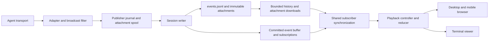
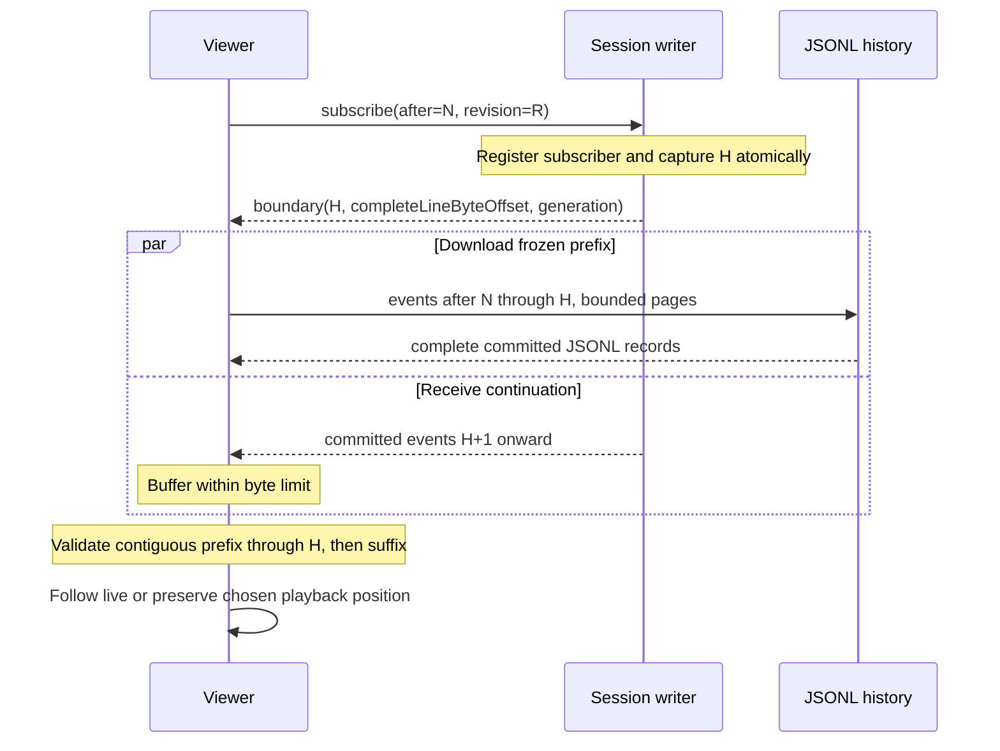

# AgentLive implementation plan

> Broadcast and replay coding-agent sessions.

**Date:** 2026-09-09  
**Status:** Proposed implementation plan; no application or infrastructure has been deployed.  
**Target agents:** Claude Code, Codex, Kimi Code, and OpenCode.  
**Target viewers:** Desktop browser, mobile browser, and a separate terminal.  
**Working name:** AgentLive. Package, organization, and domain availability must be checked before publication.

This is the integrated planning document for the independent AgentLive project in `~/agentlive`. Commands, package names, routes, and protocol examples below are proposed interfaces, not existing software.

## 1. Product objective and release boundary

AgentLive lets a developer publish a coding-agent session to a server they choose. Viewers open one stable URL, watch events as they happen, pause or rewind while the agent continues, accelerate through recorded history, and return to the live position. After publishing ends, the same URL serves the recording.

The first public release must provide:

- Working live adapters for all four target agents, with an explicit compatibility and capture-fidelity matrix.
- Structured messages, tool calls and results, and inspectable file changes where the source supplies them.
- Captured user uploads, generated images, and versioned artifacts with viewer-accessible references and portable attachment bytes.
- A browser player that adapts to desktop and mobile, plus an interactive terminal viewer.
- Live following, pause, seek, step, replay with 0.5×/1×/2×/4×/8×/customizable speedup, optional idle compression, and jump to live.
- A self-contained server distributed through npm/npx and Docker.
- A centralized service configuration using the same server and protocol, supporting multiple publishers and anonymous viewing of public streams.
- Persistent recordings, durable publisher recovery across sleep/process restarts, subscriber reconnect/resynchronization, export/import, and documented operational limits.

The initial product is a spectator system. Viewers cannot submit prompts, approve tools, or execute commands on the broadcaster's machine. A local operator interface may drive an agent when required by its programmatic transport; that operator interface is separate from the public viewing API.

The initial release does not require native mobile apps, audio/video streaming, billing, a social feed, multi-region infrastructure, or arbitrary agent plugins. Session replay reconstructs captured observations; it does not rerun tools or restore a working directory.

### Architecture contract

A session is an ordered recording that can keep growing across publisher lifetimes. Persist the filtered recording locally until acknowledged, append it to one server JSONL log per session, and distribute committed additions through memory. Subscribers download a bounded prefix and subscribe to its continuation; their playback clocks run independently. Use the same protocol in standalone and multi-session hosted deployments. No database or external message broker is required initially.

| Invariant | Consequence |
| --- | --- |
| Stable session identity outlives sockets and processes | Join, exit, sleep, restart, and native-session resume preserve the URL; only explicit new-session intent creates another recording. |
| One authoritative writer per session | All event and lifecycle mutations are serialized; stale publisher connections are fenced. |
| Durable append before acknowledgment | A publisher can safely retry until ACK; the server only broadcasts its committed prefix. |
| Immutable event identity and attachment versions | Retries cannot duplicate content or alter earlier replay; a changed artifact is a new version. |
| Cursor continuity is checked end to end | Neither publisher nor subscriber advances across a missing or conflicting event. |
| Memory is disposable and bounded | Journals, files, and compatible checkpoints restore state; slow clients never require unbounded queues. |
| Disconnect, pause, and finish are distinct | A timeout cannot end a session; an intentional sharing pause survives restart. |
| All viewers consume the same filtered projection | Browser, mobile, terminal, and exports agree on content and available artifact versions. |
| Capture fidelity is explicit | Recoverable history is replayed; unavailable source deltas/timing produce visible gaps. |

Reliability means satisfying these invariants under the failure model in section 14. It does not imply unlimited offline storage, recovery of uncaptured source events, or survival after every durable copy has been lost.

### Why a new project is justified

The useful distinction is the combination of structured events, continuous live/replay behavior, browser and terminal viewers, and complete self-hosting. Individual features already exist elsewhere: claude-replay provides structured HTML replays, Campfire documents spectator links and replay, and Workflow TV advertises live catch-up and a stable replay URL. Assess these as competitors and potential sources of reusable ideas; do not claim category novelty. Their complete feature sets have not been independently tested here. [claude-replay](https://github.com/es617/claude-replay), [Campfire](https://github.com/stretchcloud/campfire), [Workflow TV](https://workflowtv.com/terminal-streaming)

## 2. Evidence and assumptions

### Evidence recorded in the original feasibility notes

| Evidence | Observation | Design implication |
| --- | --- | --- |
| claude-replay 0.11.0, commit `b20ef4142f232b9fa582617ba24ef78bb62208c6` | Its inspected watch path debounces rebuilding, polls for a version change, then reloads the document. | Build an incremental player whose inspection state survives incoming events. |
| Local Codex CLI 0.153.4 probe | 602 live text deltas arrived from 9.545–32.443 seconds; a 3,336-character assistant message was observed in the saved JSONL at 32.443 seconds. | Capture the live transport. The persistent transcript cannot recover the original text timing. |
| Local Claude Code 2.1.263 | CLI help exposes partial-message streaming; current documentation describes interactive `MessageDisplay` hooks. | Offer distinct programmatic-stream and interactive-hook integrations. |
| Local Kimi Code 0.41.0 | CLI exposes `acp` and `web`; current server docs describe text/tool deltas and transcript subscriptions. | Target current Kimi Code, not the older Python Kimi CLI's Wire interface. |
| OpenCode documentation | A server exposes SSE events and a client can connect to an existing instance. | Investigate subscription as the primary capture path. |

These are previously recorded observations, not new adapter validation performed during this design revision. Recheck upstream interfaces and versions in M0. The Codex probe was a single local experiment, stopped at a 55-second limit without observing `turn/completed`. It establishes a difference in observed data granularity, not a general performance claim. The Claude hook, Kimi server, and OpenCode adapter still require end-to-end experiments. Private session content must not become test fixtures; recreate representative workloads with synthetic repositories and prompts.

Sources: [inspected claude-replay watch implementation](https://github.com/es617/claude-replay/blob/b20ef4142f232b9fa582617ba24ef78bb62208c6/bin/claude-replay.mjs#L533), [Claude CLI streaming](https://code.claude.com/docs/en/headless#stream-responses), [Codex app-server](https://learn.chatgpt.com/docs/app-server), [Kimi server API](https://moonshotai.github.io/kimi-code/en/reference/server-api.md), [OpenCode server](https://opencode.ai/docs/server/).

### Assumptions to validate first

1. A developer can capture a useful live session without changing their agent account or supplying model credentials to AgentLive's server.
2. At least one supported transport per agent exposes incremental text before the corresponding message finishes.
3. Enough tool metadata is available to render useful edits; incomplete information can be represented honestly.
4. npm installation and filesystem append, flush, and atomic replacement behavior work on the supported operating systems.
5. A small VM can handle the initial workload once replay history, source state, uploads, and slow clients are bounded globally as well as per session.
6. Every adapter can identify resumed native sessions, declare its history-recovery fidelity, and expose supported file/artifact references without guessing from a working directory.
7. Browser cache eviction, mobile background suspension, and terminal restart can recover through the same cursor protocol without requiring persistent subscriber storage.

## 3. Technology decisions

| Layer | Initial choice | Implementation notes |
| --- | --- | --- |
| Language | TypeScript with strict checking | ESM packages; browser-compatible protocol and playback packages. |
| Runtime | Node.js 26, latest stable patch (26.8.1 verified 2026-09-09) | Node 26 only for development, CI, npm runtime, and Docker; pin the verified patch. |
| Workspace | pnpm workspaces | One lockfile and explicit package dependency boundaries. |
| Server | Hono, `@hono/node-server`, `ws` | HTTP API and bundled web assets; WebSocket publishing/subscription. |
| Schemas | Zod | Validate external input and generate a versioned protocol reference. |
| Web | React, Vite, Tailwind/CSS | DOM-based text, responsive layout, accessible controls. |
| Large lists | Windowed rendering | Select and verify a virtualization library during the player phase; test dynamic-height diffs. |
| Terminal | Ink and React | Share state reconstruction and controls, not browser layout components. |
| Storage | Per-session JSONL log and JSON metadata | Serialized appends; in-memory live delivery; rebuildable seek indexes and snapshots. Kernel advisory locks through `fs-native-extensions` protect local writer ownership across process suspension/death. |
| Tests | Vitest, Playwright | Deterministic reducers, transport failure tests, browser behavior. |
| Packaging | npm tarball and Docker image | Prebuilt browser assets; no frontend build required on the user's machine. |
| VM entry point | HTTPS reverse proxy and process supervision | Provide Docker Compose and a systemd example. |

Node 26 is the required runtime, currently the latest Current release line. Use the latest stable release of each runtime, package manager, library, and development tool when adding it; resolve registry versions rather than copying older examples. Pin exact direct dependency versions and commit the lockfile for reproducibility, then update to new stable releases with compatibility checks. Do not substitute Node 24. Installed agent versions in the evidence section are observations, not dependency pins; verify latest upstream releases during adapter validation. Hono documents the current Node WebSocket integration; use that integration rather than its deprecated `@hono/node-ws` package. [Node releases](https://nodejs.org/en/about/previous-releases), [Hono on Node](https://hono.dev/docs/getting-started/nodejs), [Ink](https://github.com/vadimdemedes/ink)

Use one server process and local filesystem storage initially in both deployment modes. Multiple sessions use independent directories and serialized writers in the same process; they do not require a database. Active subscriptions and bounded recent-event buffers live in memory. A database for richer account/query requirements, object storage, and multiple fan-out workers are later options.

### Model-provider independence

OpenCode may use any supported, available provider, including Gemini or a configured OpenAI-compatible third-party provider such as Krill. Provider selection belongs to the local agent configuration; AgentLive captures the agent transport and does not require a particular model vendor. Keep API keys in the local environment or agent credential store, never in recordings, attachment metadata, exports, or committed configuration. For Krill, use the endpoint and model identifiers actually configured and verified locally rather than assuming public OpenAI endpoints or model-name compatibility. Verify streaming, tool calls, errors, and resume behavior for each provider used in acceptance tests. The successful initial OpenCode streaming probe used an available Anthropic configuration; Krill credentials were detected but Krill inference has not yet been validated.

## 4. System boundaries



### Publisher

Owns persistent native-session bindings, source-event interpretation, broadcast filtering, local event/attachment journaling, and idempotent synchronization. In-memory adapter state must be recoverable from a compatible checkpoint and journal/source suffix. Upstream credentials remain on the source machine. A broadcast connection failure does not kill the coding agent.

### Server

Owns publisher authentication, stream ownership, event validation, durable ingestion, ordered delivery, history queries, visibility, and retention. It does not connect directly to arbitrary filesystem or shell APIs on the publisher.

### Shared subscriber synchronization

Owns protocol negotiation, history boundaries, cursor validation, retries, revision changes, cache restoration, and live handoff. Browser and terminal implementations supply transport/cache adapters to the same state machine. Network receipt, cached contiguous history, applied reducer state, and presentation position are distinct. Transport code never chooses a viewer's playback speed or scroll position.

### Supported client contracts

| Client | Durable state | Rejoin behavior |
| --- | --- | --- |
| Managed-launch publisher | Binding, secret, filtered journal, checkpoint, attachment spool | Launch/resume the verified native session and reconcile the same stream. |
| Attached publisher | Same durable publisher state | Reattach to the verified agent instance/session; agent lifetime is independent. |
| Installed hook/relay publisher | Same durable publisher state, plus source-specific relay cursor if available | Hook integration reaches the local recorder; cloud outages do not block hook execution indefinitely. Relay failure reports a gap unless the source can recover it. |
| Desktop browser | Optional evictable event/checkpoint cache and UI preferences | Restore compatible cache or fetch history; cursor-only storage is not sufficient. |
| Mobile browser | Same protocol; cache/background work may be unavailable | Revalidate on foreground and rebuild if evicted; no always-running socket assumption. |
| Interactive terminal | Optional bounded file cache and saved playback position | Restore or download again; exiting the viewer never affects publication. |
| Redirected terminal output | No implicit rewindable screen; optional explicit resume cursor | Stream sanitized plain output. Across process restarts, document possible duplicates after a lost output checkpoint; stdout is not transactionally coupled to local storage. |
| Offline terminal replay | Exported recording and optional UI preferences | Read local events/assets through the same history interface; there is no network or live subscription. |

### Playback engine

Owns reconstruction of captured state and the viewer's timeline. It has no DOM, terminal IO, network, or database dependency. All IO comes through interfaces so synthetic traces can exercise exactly the engine shipped to viewers.

### Renderers

Own viewport layout, input, scrolling, selection, and local expansion state. Incoming events update content without a page reload or resetting the viewer's inspection choices.

## 5. Deployment modes and command contract

| Property | Standalone | Centralized service |
| --- | --- | --- |
| Operator | Individual or organization | Hosted-service operator |
| Installation | npm/npx or Docker | Same server image, service configuration |
| Publishers | Local owner and explicitly issued publishing keys | Authenticated accounts with scoped keys |
| Public viewers | Anonymous | Anonymous |
| Data | Operator-selected persistent directory | Operator-managed persistent storage |
| Central account dependency | None | Required only to publish/manage hosted streams |
| Discovery | Stream links and optional local listing | Public listing added after the core release |

Standalone supports multiple streams and can run on a remote VM. A laptop installation is reachable only through its available network path; AgentLive should print local/LAN URLs accurately and explain when public reachability requires a tunnel or forwarding. It must not describe a loopback URL as public.

Proposed CLI:

```bash
# Self-contained server, loopback by default
npx agentlive serve --data ./agentlive-data

# Explicitly listen on a reachable interface behind HTTPS
agentlive serve --host 0.0.0.0 --port 7331 --data /var/lib/agentlive

# Authenticate to either a self-hosted or hosted server
agentlive login --server https://watch.example.com

# Launch through an adapter and publish; show an explicit capture mode
agentlive publish --agent claude --server https://watch.example.com

# Attach only where the adapter has verified support
agentlive publish --agent opencode --attach http://127.0.0.1:4096 \
  --session <native-session-id> --server https://watch.example.com

# View in a different terminal or replay an exported recording
agentlive watch https://watch.example.com/s/<stream-id>
agentlive replay ./session.agentlive --speed 4

# Diagnostics and recording portability
agentlive doctor
agentlive status <stream-id>

# Publication intent is distinct from closing a process
agentlive pause <stream-id>
agentlive publish --resume <stream-id>
agentlive finish <stream-id>
agentlive reopen <stream-id>
agentlive export <stream-id> --output ./session.agentlive
agentlive import ./session.agentlive
```

Before implementation, freeze argument behavior for interactive versus non-interactive use. Never forward a joined shell string when spawning an agent; preserve argument arrays. `--attach` must fail clearly for unsupported agent/version combinations.

Stopping publication is distinct from ending the agent session or finalizing its recording. A keyboard command can stop sharing while the coding workflow continues; persist this explicit pause so restart does not silently resume capture. Closing a process, sleeping a laptop, or losing a socket leaves the stream resumable at the same URL. Explicit finish reconciles queued events and then finalizes the recording; an offline finish is a durable pending intent, not a claim that the server has finished.

`pause` saves disabled sharing intent and stops capture at an explicit boundary while allowing the already captured prefix to drain. `publish --resume` is an explicit action that enables sharing again; automatic startup respects a saved pause. `finish` drains or reports a pending finish, and `reopen` enables further publication to an explicitly ended recording. `status` shows capture connection, sharing intent, oldest pending event, queued event/attachment bytes, last durable server ACK, and any recovery block without dumping event content.

On managed launch or a verified installed integration, identify the native agent session and automatically reuse its persisted publishing binding when sharing is enabled. Offer `agentlive publish --resume <stream-id>` for an explicit binding and `--new-stream` for an intentional new recording. Reusing a project directory alone is not proof of native session identity. Starting an unintegrated agent cannot launch AgentLive automatically; diagnostics must explain whether capture is attached, awaiting the source, paused, or recovering.

## 6. Agent adapter plan

Each adapter reports capabilities at session start and whenever they change:

```ts
interface CaptureCapabilities {
  text: 'delta' | 'line-batch' | 'completed-block';
  toolArguments: 'delta' | 'complete' | 'unavailable';
  toolResults: 'delta' | 'complete' | 'unavailable';
  fileChanges: 'patch' | 'summary' | 'unavailable';
  subagents: 'delta' | 'complete' | 'unavailable';
  attachExisting: boolean;
  history: 'events' | 'snapshot' | 'unavailable';
  resumeIdentity: 'stable-id' | 'verified-lineage' | 'manual-binding';
  sourceCursor: 'durable' | 'connection-only' | 'unavailable';
  uploads: 'bytes' | 'reference-only' | 'unavailable';
  generatedImages: 'bytes' | 'reference-only' | 'unavailable';
  artifacts: 'file' | 'bundle' | 'reference-only' | 'unavailable';
}
```

Store agent version, adapter version, transport, and fidelity in recording metadata. An advertised capability must have a captured fixture and an integration test. Do not infer token-level fidelity from a flag named `stream-json`.

### Claude Code

- Primary path: CLI/Agent SDK partial-message stream, with a local operator loop for prompts and approvals when needed.
- Optional path preserving the native terminal workflow: an explicitly installed hook integration, forwarding display batches and tool lifecycle events to a local relay.
- Keep those modes distinct in documentation and diagnostics. A script invoking programmatic mode is not transparent attachment to an already-running interactive terminal.
- Pair partial updates with completed messages by upstream identifiers; reconcile the final message without appending duplicate text.

`MessageDisplay` supplies completed-line batches for interactive assistant text. It does not supply tool output, and in programmatic mode it runs after the message completes. Keep its handler fast because display waits for it. Do not use it as the source of programmatic token deltas. Current Agent SDK documentation also limits subagent delta forwarding; capabilities must reflect that. [Display hooks](https://code.claude.com/docs/en/hooks#messagedisplay), [Agent SDK streaming](https://code.claude.com/docs/en/agent-sdk/streaming-output)

### Codex

- Primary path: the app-server connection associated with the target thread.
- Consume item lifecycle, agent-message deltas, tool execution output, and file-change events actually exposed by the tested protocol.
- Prove whether a second client can observe the active thread while the regular terminal remains usable, including connection lifecycle and unsubscribe behavior.
- If attachment is not supported in a tested arrangement, provide a managed launch path and label it accordingly. Starting a different app-server against stored history does not recover a live stream.

Keep the adapter versioned because the app-server transport includes experimental surfaces. Use generated schema artifacts from the tested CLI where available. [Codex app-server reference](https://learn.chatgpt.com/docs/app-server)

### Kimi Code

- Target the installed/current `kimi-code` generation, initially tested against 0.41.0.
- Prefer its local server transcript subscription at delta grade where validated; evaluate legacy delta notifications and ACP as alternatives.
- Validate both session creation and attachment to an already-running server. Do not assume a separate server receives deltas from an unrelated terminal process.
- Persist received volatile deltas in AgentLive. Upstream reconnect recovery may return a snapshot rather than the missing original delta sequence.
- Mark recovered spans as reconstructed and test the main/subagent transcript modes independently.

The current server reference documents experimental REST/WebSocket APIs, delta events, and transcript subscription grades. The older `kimi-cli --wire` design is not the target implementation. [Kimi Code server API](https://moonshotai.github.io/kimi-code/en/reference/server-api.md), [Kimi ACP](https://moonshotai.github.io/kimi-code/en/reference/kimi-acp)

### OpenCode

- Prefer the server SSE stream, connected to the target instance and filtered by session.
- Compare server events with plugin callbacks for message updates, tool lifecycle, and file edits.
- Test message-part updates for incremental content and final-message reconciliation; snapshots and deltas must not double-count the same content.
- Verify whether the normal terminal exposes an address usable by an external subscriber; otherwise start a managed server and connect the operator client to it.

The SDK supports connecting to an existing server, and plugins expose session/message/tool events. Exact delta coverage remains a feasibility test. [Server](https://opencode.ai/docs/server/), [SDK](https://opencode.ai/docs/sdk/), [Plugins](https://opencode.ai/docs/plugins/)

### Common adapter experiments

For each agent, capture a controlled session with: a long text response, a long-running command, a two-file edit, a failed tool, an approval pause, cancellation, and a subagent if supported. Compare the operator display with captured events using timestamps. Exercise reconnect during text generation and after a tool starts. Also capture an uploaded image/file and a generated image or local artifact where supported; test reference resolution, updates, and unavailable source handling. Save sanitized fixtures, a capability result, and exact version information.

Each adapter must additionally pass the same native-session restart, source replay/snapshot reconciliation, intentional pause, and attachment-version scenarios. Record unsupported cases in its capability matrix; shared network recovery cannot upgrade upstream capture fidelity.

Do not implement a generic transcript watcher as a silent fallback for a failed live adapter. A future import mode may ingest historical transcripts with explicit reduced fidelity.

## 7. Event protocol and ordering

### Ownership and identifiers

One broadcast stream has one active publisher lease. That publisher may aggregate events from a main agent and its children. Multiple independent publishers create separate streams in the initial protocol.

Use two sequence spaces:

- `producerSeq`: contiguous sequence within a `producerEpoch`, assigned after filtering and committed to the local spool.
- `serverSeq`: contiguous sequence within a stream, assigned by the server's serialized stream writer. This is the authoritative replay order.

An epoch is a persisted identifier for a publisher sequence space. A normal process restart reloads its existing epoch and unacknowledged spool; lease renewal does not reset event identity. A lost spool or explicit source replacement starts a new epoch through an authorized lease handoff and records a discontinuity within the same stream. Lease generations fence stale publishers. Producer checkpoints must never reuse a sequence for different content after spool compaction.

Clock segments are independent of producer epochs: restarting a process can reset its monotonic clock without resetting sequence identity. Each capture runtime starts a new persisted clock-segment ID with a wall-clock anchor and timing confidence. A suspend/resume boundary also starts a segment if monotonic sleep behavior cannot preserve elapsed timing reliably.

```ts
interface PublishedEvent {
  protocolVersion: 1;
  streamId: string;
  producerEpoch: string;
  producerSeq: number;
  source: {
    agent: 'claude' | 'codex' | 'kimi' | 'opencode';
    sessionId: string;
    agentId?: string;
    eventId?: string;
  };
  observedAt: string;        // UTC wall time, for display and diagnostics
  clockSegmentId: string;   // capture-clock lifetime, independent of retry identity
  elapsedMs: number;         // monotonic capture time within that segment
  kind: string;
  fidelity: 'delta' | 'line-batch' | 'block' | 'reconstructed';
  payload: unknown;          // validated discriminated union in implementation
}
```

The server adds `serverSeq`, `receivedAt`, and nondecreasing `timelineMs`. Map each clock segment to the stream timeline with persisted/rebuildable anchors. Offline batches retain capture spacing rather than acquiring their upload timing. Across sleep/restart, retain known elapsed gaps or label a wall-clock-derived estimate; never turn clock rollback into negative playback time. Preserve original source timestamps separately when available; never sort replay by a machine wall clock. On an offline restart where elapsed time cannot be established reliably, insert a discontinuity rather than inventing precise timing.

### Stored event envelope and control records

`serverSeq` is the public event ID: `(streamId, revision, serverSeq)` uniquely identifies an event for subscribers. Sequences begin at 1, and cursor 0 means before the first record. Use positive safe integers, reject overflow/invalid values, and define `afterServerSeq` as exclusive and `throughServerSeq` as inclusive throughout the protocol. Producer retry identity is internal to publishing; clocks and lease generations never serve as event IDs.

The server stores a versioned envelope containing `serverSeq`, `receivedAt`, `timelineMs`, kind/payload, and an origin union. Stream identity and current revision are supplied by the containing recording and transport response, rather than baked into every server envelope; restore can change the revision without rewriting all JSONL bytes. Original publisher stream identity remains provenance inside its immutable payload. A publisher origin carries the immutable `PublishedEvent` and its canonical digest. A server origin carries a durable operation ID for lifecycle transitions such as finish, reopen, or epoch handoff. Server records share the serialized log and consume server sequences, but never consume a producer sequence or fabricate native-agent activity. Their timeline position equals the current recorded timeline; receipt timestamps separately describe when the operation occurred. Connectivity/queue/heartbeat notifications are ephemeral status and do not consume event IDs.

Recording lifecycle is reconstructed from these log records; `metadata.json` caches that lifecycle but is authoritative for ownership, credential hashes, visibility, and retention. Never require an atomic commit across the event log and metadata cache. The serialized handler acknowledges a lifecycle operation only after its record is durable; retries return the existing result by operation ID. Finalize only at the requested producer cursor after fencing/draining the writer; reject stale requests if additional events already committed. Reopen and epoch handoff use lifecycle preconditions, so delayed retries cannot reopen a newer finished state.

Clock-segment anchors and timing confidence travel in durable capture metadata/events so both server and publisher rebuild timing after restart. A segment's first event establishes its mapping exactly once; retry never remaps it using current arrival time. Several events may share a timeline position and remain ordered by `serverSeq`.

### Initial event families

| Family | Representative events | Meaning |
| --- | --- | --- |
| Session | `session.started`, `session.metadata`, `session.ended` | Agent session state, separate from publication state. |
| Turn | `turn.started`, `turn.ended` | Boundaries for one operator request and its work. |
| Message | `message.started`, `message.text.append`, `message.reconciled`, `message.completed` | Incremental content with explicit final reconciliation. |
| Tool | `tool.started`, `tool.arguments.append`, `tool.arguments.ready`, `tool.output.append`, `tool.completed` | Proposed input, execution, and result remain distinct. |
| Files | `file.change.proposed`, `file.change.applied` | Structured path and patch when observed; never imply a proposed change was applied. |
| Agent tree | `agent.started`, `agent.ended` | Parent/child identity where the source exposes it. |
| Attachments | `attachment.pending`, `attachment.available`, `attachment.unavailable`, `artifact.version`, `reference.resolved` | Captured files, immutable artifact versions, and replacement of inaccessible source references. |
| Recording | `recording.created`, `recording.ended`, `recording.reopened`, `publisher.epoch.changed` | Server-authored durable lifecycle transitions, distinct from agent session events. |
| Capture | `capture.gap`, `capture.recovered`, `capture.capabilities` | Missing data, snapshot recovery, or fidelity changes. |

Permission status can be shown through an informational event; no viewer approval route exists. Only capture reasoning text that the upstream legitimately exposes. Do not attempt to retrieve hidden model state.

For message appends, use stable message/block IDs and event order. Preserve upstream offsets with their declared units inside adapter metadata; normalize them before applying text. Test Unicode, combining characters, and code points split across byte chunks. Completed snapshots replace or reconcile a known block through an explicit event; they are never treated as another append.

Major protocol versions are negotiated at connection time. Unknown major versions fail visibly. Optional extensions may be skipped, but an unknown event affecting reconstruction must mark the recording as partially understood. Old recordings retain a reducer/schema version and are migrated explicitly.

## 8. Ingestion, reconnect, and storage

### Durable ingestion contract

1. Normalize and filter source events locally.
2. Commit publishable events to the local spool.
3. Send ordered batches, initially capped at 100 events or 256 KiB, with at most 50 ms batching delay under normal load.
4. Server validates ownership, lease, schema, limits, and sequence continuity.
5. The serialized session writer assigns server sequence numbers and appends complete JSONL records containing publisher retry identities.
6. Flush the batch to durable storage before advancing the committed cursor, acknowledging, and broadcasting those events to viewers. The log is authoritative; metadata cursors are rebuildable caches.
7. Publisher removes acknowledged spool records according to its local retention policy.

Deduplication on `(streamId, producerEpoch, producerSeq)`, recovered from the log after restart, makes retry idempotent. A repeated key with different content is a protocol error. Reject a sequence gap and return the expected cursor. Acknowledgements always describe a contiguous durable prefix.

The delivery model is at-least-once with deduplication. There is no claim that the network itself provides exactly-once delivery.

### Session creation and binding

Before the first create request, the publisher durably saves a random creation-request ID and a randomly generated write secret. The authenticated creation API accepts that secret over TLS, stores only its hash, and returns the assigned stream ID/revision. This places secret generation in the publisher so a lost creation response does not strand a server-generated credential. The secret is generated once per binding and reused for reconnect; it is not a single-use token.

Persist the request ID, owner binding, and immutable creation parameters with the session. Retrying the same request ID and matching credential/parameters returns the same stream, never creates another one; conflicting reuse fails. Initialize a session in a temporary directory with metadata and the first durable lifecycle record, then atomically install it before responding. Rebuild the creation-request lookup from session metadata on startup. The publisher atomically saves the returned binding before sending events; if it crashes earlier, the saved creation request is retried. Creation requests include a persisted creation time within a documented server acceptance window. Look up existing requests first, then reject unseen requests older than that window; publishers with an expired never-accepted request obtain a new request ID explicitly. Deletion retains a creation tombstone at least until the acceptance window closes, so a late retry cannot resurrect a deleted session. Serialize concurrent requests for the same owner/request ID before directory installation.

### Durable publisher identity and local recovery

Publisher memory is a working cache. The local recording journal, checkpoints, and captured attachment bytes provide recovery without a working network connection. Use a publisher data directory independent of the terminal process and workspace lifetime:

```text
publisher-data/
  bindings.json                        # server origin + adapter + native session → stream
  streams/<local-binding-id>/
    identity.json                      # stable publisher ID, stream/revision, epoch, credential reference
    checkpoint.json                    # durable source/reducer cursor, seq floor, server ACK
    spool/*.jsonl                      # ordered filtered events not yet safely pruned
    attachments/<content-hash>          # captured upload bytes retained until committed
```

Store the write secret in an OS credential store where available or a restricted-permission local file; never place it in a shared repository. Bind identity to the server origin and native session namespace as well as native session ID. Persist enabled/paused sharing intent, adapter/schema/filter versions, stable source-to-message/tool/artifact mappings, reconstruction state, clock segments, and pending attachment/finish operations. Do not store vendor credentials or unfiltered source envelopes in this journal.

Checkpoint the source cursor and normalized reconstruction state only through events already durable in the spool. Write a checkpoint atomically with its exact log position; an older checkpoint plus retained log suffix must reconstruct the same state. Assign and persist event IDs before any network send. After restart, reconstruct the next producer sequence from the durable checkpoint floor and valid spool prefix, including when all acknowledged segments were deleted. Pending filtering buffers that cannot be safely persisted must be replayed from the source or reported as a capture gap; do not write raw sensitive buffers merely to preserve recovery.

Persist validated server acknowledgements and an adapter checkpoint covering any pruned reconstruction dependencies before pruning complete spool segments, and keep all local bytes needed by uncommitted attachment-reference events. A crash during ACK checkpointing or pruning can cause a resend but cannot remove the only copy of an unacknowledged event. The checkpoint includes stable source retry mappings through its position; preserve any mappings needed to deduplicate upstream replay after the corresponding event segments are pruned. A local per-binding lock prevents two publisher processes from allocating the same sequence space. File corruption or a checkpoint/log mismatch triggers explicit recovery rather than guessed sequence values.

### Publisher reconnect and resynchronization protocol

1. Load the persisted binding and spool, acquire the local lock, and resume the same stream. Capture may continue into the ordered spool while networking is unavailable, within configured limits.
2. Authenticate a resume request containing stream/revision, producer epoch, available local sequence range, last durable ACK, and an overlap event digest where available. The server returns its revision, current lease generation, contiguous committed producer cursor, corresponding server position, and expected next producer sequence. A reconnect acquires/renews a lease through the serialized session path; durably advance fencing generations before accepting writes and invalidate pre-restart connections.
3. Reconcile from the server's verified durable cursor, not a socket's last send or an optimistic local flag. If the ACK was lost and the server is ahead, verify matching overlap and acknowledge the already committed prefix. If the server is behind locally queued events, resend the missing suffix in order. Compare retry contents with canonical event digests that exclude connection-specific lease fields.
4. If the server reports a position below a previously durable local ACK, classify this as rollback/data loss (for example, an older backup restore). Restore only from a verified retained prefix under an explicit recovery procedure; if bytes are missing, report the loss. Never silently reset the local cursor, overwrite conflicting records, or claim successful synchronization. Recording replacement/restore uses a new revision so viewers invalidate stale caches.
5. Ensure referenced attachment bytes exist durably before sending their availability events. Query/retry uploads by content hash after a lost upload ACK; initial interrupted transfers may restart from zero, with incomplete temporary files never served as complete attachments. Chunk-level resume can be added later without changing event semantics.
6. Drain the backlog in bounded batches while newly captured events join the same queue. Do not let new live events overtake older offline events. Declare synchronization complete through a captured producer high-water mark, then continue pumping newly queued events. Report queue size and separate capture, network connection, and synchronization states.

ACKs carry stream/revision, epoch, and lease generation; accept only monotonic ACKs for the current connection generation and a sequence actually sent or verified during resume. Drop stale callbacks after connection replacement. Duplicate committed events return their existing ACK/server position; conflicting content is an error. Reject an out-of-order gap with the expected sequence; resynchronize instead of silently dropping it or buffering indefinitely.

Use capped exponential retry with jitter for transient transport/server failures, one active reconnect loop, heartbeat timeouts, and prompt reconnect on network restoration or wake. Expired short-lived leases can be reacquired with valid durable credentials. Revoked credentials, deleted streams, unsupported protocol versions, ownership conflicts, and content conflicts need distinct actionable states rather than endless retries. A second independent publisher cannot silently take over a live lease; explicit takeover fences the previous writer. A replacement connection from the same persisted publisher uses a persisted monotonically increasing connection-attempt number and fences its old connection. Reject delayed attempts with a lower number; an equal attempt is idempotent rather than another takeover. Lease tokens are bound to the granted attempt and generation. Migrating/copying publisher state to another machine requires explicit takeover; a secret alone does not establish that two running processes are the same writer.

### Resuming the underlying agent

Native agent session identity survives process identity where the source supports resume. Reattach to that same native session and retain the AgentLive stream, message/tool IDs, and producer sequence space. Persist source replay cursors where supported. For each source event, durably append its normalized effect before advancing the source checkpoint. Publisher source events mapping to several normalized events must journal their source cursor/mapping with the same recoverable prefix, so a crash halfway through normalization can replay the source and emit only its missing normalized suffix. On source replay, suppress already captured effects using stable source IDs/cursors and restored adapter state, not text equality alone.

If the source only supplies a transcript snapshot, reconcile known messages/tool states through explicit reconstruction events; do not append a completed message again after its captured deltas. If original missed deltas/timing are unavailable, record a capture gap and label recovered state as reconstructed. Open tools interrupted by a crash remain interrupted/unknown until source evidence resolves them. An ended native process or turn does not finalize the broadcast recording; the source session may resume later. If a resumed/forked source has a different native identity, require a supported resume lineage or explicit stream binding rather than guessing from matching paths/content.

### Filesystem layout and recovery

```text
data/
  service.json                         # service configuration
  accounts/<account-id>.json           # optional hosted identity/credential records
  tombstones/<stream-id>.json          # deletion and create-request replay protection
  sessions/<stream-id>/
    metadata.json                      # ownership, write-secret hash, revision, lifecycle cache
    events.jsonl                       # authoritative ordered event history
    attachments/<content-hash>         # immutable uploaded bytes
    snapshots/<server-seq>.json         # optional rebuildable playback checkpoints
    content/<page-hash>                 # optional derived transcript/snapshot pages
    index.json                         # optional rebuildable sparse byte-offset index
```

Use one serialized writer per session and one process owning the data directory. Batch asynchronous file writes and durable flushes rather than flushing each text delta. Metadata changes use temporary files, flush, atomic replacement, and directory synchronization where required for durability. Acquire an exclusive kernel advisory server data-directory lock at startup. Use the packaged prebuilt `fs-native-extensions` binding and verify Node 26 installation on supported platforms; no source patches or timeout-based stale-lock stealing. Never unlink or replace the lock inode while its directory is in use. Do not support concurrent server processes writing the same directory. Serialize metadata replacement with that session’s mutations; persist credential revocation and fencing changes before reporting success, and make service/account file changes under their own mutation locks. Rebuild directory listings and account-to-stream indexes from authoritative files; multi-file administrative workflows use recoverable operation intents rather than assuming filesystem-wide transactions.

On recovery, validate sequence continuity and rebuild committed cursors and publisher deduplication state from complete valid log records. An incomplete final line can be truncated before further appends; corruption within the log is an explicit recovery error. Validate every record with a canonical content checksum as well as schema and ordering; a parseable but altered record must not silently pass recovery. A checksum detects corruption, not authenticity. Only the uncommitted trailing incomplete line is automatically truncated; a malformed/checksum-invalid complete record quarantines the affected session. A batch is not an all-or-nothing transaction: a valid recovered prefix can survive, and publisher retries reconcile its suffix. Acknowledged records must survive the advertised crash-durability boundary. Recover a session before accepting its writes/subscriptions. Rebuild or validate its indexes incrementally without blocking unrelated sessions. Keep retry lookups disk-backed or paged rather than retaining a digest for every event in every historical session. Load historical sessions on demand and keep memory bounded; sparse indexes map sequence/timeline positions to complete-line byte offsets and can be rebuilt.

### Attachments and artifact publication

Capture user-uploaded files/images and agent-generated images, documents, and artifacts when exposed by the adapter and included in the broadcast policy. Local filesystem paths, localhost links, and provider-private artifact references are not viewer-accessible URLs. Resolve these on the publisher machine through verified adapter metadata or a supported source API, then upload the captured bytes to AgentLive. Do not assume any particular agent exposes a universal artifact API; each adapter must report and test its coverage.

The publisher pipeline is: detect reference → resolve allowed source → capture a stable copy → apply broadcast policy → spool bytes locally → upload → publish the attachment reference. Hash the final broadcast bytes after filtering/rewriting; retain filename and source-to-artifact mapping separately. A content hash identifies bytes, while an artifact ID identifies the evolving logical artifact. Prefer explicit attachment fields and tool-result metadata over guessing from prose. Text-only links can be resolved when their complete reference is available; do not scan or upload the whole working directory. Resolve filesystem paths against declared capture roots, including symlinks. Do not fetch arbitrary URLs found in agent text; remote resolvers use supported provider interfaces and explicit origin rules. Source credentials remain on the publisher.

The server computes/verifies a content hash, enforces declared size/type limits, writes a temporary file, flushes it, atomically installs it under `attachments/<content-hash>`, and makes the directory entry durable before acknowledging the upload. Deduplicate within the session. An event declaring an attachment available is committed only after its bytes are durable. Coordinate attachment installation, reference commits, and garbage collection under the session writer: pin an upload while its reference commit is pending and recheck existence at commit. Unreferenced uploads may expire after a declared grace period; a reconnect re-uploads from its retained local copy if needed. No garbage collector may delete bytes referenced by any retained event version, snapshot, or pinned export.

Persist portable structured references containing attachment ID/hash, display filename, media type, byte size, and artifact version. Render them as `/api/v1/streams/:id/attachments/:hash`; do not bake a deployment hostname or expiring viewing token into the recording. Normalize source links to these references before publishing where possible. For a reference discovered after text was already committed, emit an explicit reference-resolution event tied to the message/block; preserve the append-only history. Never modify the user's original files or the upstream agent transcript.

Use a stable artifact ID with immutable content versions. If a file changes, capture new bytes and emit a new artifact-version event; do not overwrite the bytes of a previously broadcast version. Prefer completion/save signals to capture partially written outputs, with stable-copy checks and retries where necessary. Replay selects the version available at that event position. Emit a pending artifact event promptly and finish uploads independently, allowing subsequent text events to continue. Assign the availability event a producer sequence only once its immutable upload is confirmed, so a large attachment does not occupy an unsendable hole in the ordered event queue. Availability timing is when the captured version became publishable; preserve original generation timing separately. A pending or inaccessible artifact is represented explicitly; later availability is another event. Attachment upload failures must not silently turn a private source URL into an apparently working public link.

HTML and other multi-file artifacts need their local dependencies captured as a bundle, with a manifest and rewritten internal references to the captured assets. Hash leaf bytes and the final manifest after rewriting; map safe bundle-relative paths through the manifest to avoid circular hashes in mutually referencing files. Bound dependency count, depth, and total bytes, and reject traversal/symlink escapes. Rewrite a broadcast copy, preserving the source. Dependencies outside the supported capture scope remain explicitly unavailable. Render static previews by default. Offer interactive HTML only as an explicit viewer action in a sandbox on an isolated origin without service credentials or unrestricted network access; ordinary images, PDFs, and downloads use appropriate media handling. Executing an artifact backend is outside the recording feature: unsupported interactive artifacts receive a source download or captured preview with a fidelity label.

Attachment access follows session visibility for downloads, previews, dependencies, and exports. A content hash is not authorization. Filtering covers attachment content and filenames; binary files that cannot be safely transformed must be excluded or published under an explicit inclusion policy. Export/import includes every referenced immutable version and preserves reference resolution without access to the original machine or provider. Session retention/deletion also removes its stored attachments.

### Reconnect and slow viewers

- A publisher follows the durable reconciliation protocol above; transport reconnection alone is not evidence that publisher and server histories agree.
- A viewer subscribes with `afterServerSeq` (zero for a first join) and a stream revision. In the serialized session path, the server registers the subscription and captures a committed high-water sequence and complete-line byte offset. The client downloads JSONL after its cursor through that boundary while buffering live events strictly after it, then applies the buffer and follows live. The download is bounded even as the file grows. Recent catch-up can use the in-memory buffer; older history uses the file. Byte offsets are an optimization tied to the recording revision; event sequences remain the public resume cursor.
- Exiting closes only the viewer subscription; it does not end publication. Clients can retain their last applied sequence for reconnect. If a cursor is unavailable after retention or a revision change, return an explicit resync response instead of silently skipping history.
- Clients deduplicate by server sequence. Slow clients have bounded queues and are disconnected with a resumable cursor before server memory grows without bound.
- A paused viewer may stop receiving full payloads and retain only a high-water notification; it can fetch the missing history when playback advances.
- Publisher spool exhaustion visibly stops capture and records a gap after recovery. It must not silently drop data while claiming a complete recording or block the coding agent indefinitely.
- Missing upstream deltas cannot be recreated by AgentLive's reconnect logic. Recover state from the upstream snapshot when possible and preserve the gap annotation.

### Recording lifecycle

Keep lifecycle, connectivity, synchronization, and completeness separate. A recording is `open` or explicitly `ended`; sharing intent is enabled or paused; publisher transport is connected or disconnected; synchronization is catching-up, synchronized-through-cursor, or blocked; completeness records known capture gaps. Present these together as useful viewer status. Heartbeat expiry only marks a disconnect and releases/expires the lease. No grace timeout finalizes a recording: sleeping overnight must allow the same session to resume. Retention may remove old sessions according to a declared policy and must then return an explicit expired/deleted response.

Explicit finalization waits for the intended producer prefix and required attachments, and is idempotent after a lost response. Persist a pending finish locally across restart. Appends to an ended recording require an explicit owner-authorized reopen of the same stream, recorded as a lifecycle transition; reopening append-only history does not change its revision. An intentional sharing pause does not upload activity from the paused interval on restart without explicit policy; show any omitted span honestly.

### Subscriber state recovery

Track the downloaded/validated contiguous cursor separately from the playback cursor. Pausing or rewinding moves presentation time, not the durable download position. A reconnect handshake includes stream revision and the last usable contiguous cursor. Persist a cursor only with the matching cached events or reducer checkpoint; a cursor alone cannot restore a transcript after the browser/terminal process restarts. If cache is absent, evicted, incompatible, or corrupt, restore a server snapshot plus its suffix or fetch history again. UI expansion, scroll position, playback speed, and follow-live preference are independent saved state.

Parse streamed JSONL incrementally and advance only after a complete validated event. Deduplicate overlapping history/socket delivery by server sequence; a gap or conflicting duplicate initiates resync. Discard partial trailing bytes on an interrupted download and retry after the last complete event. Validate snapshot sequence, stream revision, and reducer version before applying its suffix. A client recovering from background suspension rechecks the committed watermark, since it may have missed both events and status notifications.

Bound history download pages and concurrent live buffers by bytes as well as event count. If catch-up overflows, switch to watermark-only notifications and keep fetching bounded durable history pages at the consumer’s own pace. Reattempt payload subscription only when close enough to a fresh boundary; a viewer permanently slower than ingress remains in history mode. A compatible snapshot can accelerate an explicit seek/jump-to-live but must not silently skip content during sequential playback; never discard unseen events while advancing the cursor. Ignore stale history/socket callbacks from superseded attempts. Playback at recorded pace uses a local presentation clock; catch-up transport runs as fast as its bounded consumer permits. Subscribers joining/leaving never change publisher capture or session lifecycle.

### Resource bounds and multi-session scheduling

Set finite per-session and server-wide limits for queued bytes, open files, active writers, subscribers, upload concurrency, history readers, parser line size, and snapshot/reducer work. Fairly schedule append batches and history reads across sessions; one tool-output burst or slow disk operation must not monopolize the event loop. Publish configured limits and measured behavior in diagnostics; do not present finite offline capacity as unlimited capture.

Server ring buffers and per-subscriber queues are caches, never the only source of a committed event. Evict idle session runtime state after closing its handles safely; session files remain. Sparse indexes and old retry verification are read from disk as needed. Enforce attachment quotas before accepting bytes and reserve spool capacity for recovery metadata where practical. If storage is exhausted even for a gap marker, startup must recognize an unclean capture checkpoint and report possible missing data.

Apply retention to whole recordings initially; do not prune the middle or beginning of an open JSONL history. Protect live bounded downloads and exports using short-lived read pins; on explicit deletion, cancel readers/subscriptions, reject new writes, atomically install a deletion tombstone, and reclaim files asynchronously. Access checks precede serving file bytes; the data directory is not a public static-file tree. Revocation/visibility changes terminate affected live access and prevent future downloads, while bytes already downloaded cannot be recalled.

### Recovery scenarios and required outcomes

| Scenario | Required outcome |
| --- | --- |
| First creation response lost or publisher crashes before saving stream ID | Retry the persisted creation request and credential; exactly one stream/binding. |
| Laptop lid closes; wakes hours/days later | Same binding and URL, fresh transport/lease, durable backlog reconciliation, explicit timing boundary where needed; no automatic finalization. |
| Publisher exits or is killed during a batch | Recover valid local prefix and sequence floor; resend idempotently, including committed events with lost ACKs. |
| Agent exits and resumes the same native session | Reuse binding and source mappings; source catch-up or explicit reconstructed gap; no duplicate text/tools. |
| Sharing explicitly paused before restart | Preserve pause; do not silently resume or publish the intentionally omitted interval. |
| Network partition, reconnect flapping, half-open socket | Bounded retry loop and queues; stale connections fenced; no out-of-order publication. |
| Server crashes before/after flush or before ACK | Recover valid durable prefix; retry converges without duplicate logical events. |
| Publisher and server restart together | Recover independently from disk, authenticate and compare revisions/cursors, then reconcile. |
| Attachment upload is interrupted or ACK is lost | Retain local captured bytes; query/retry by hash; never publish an available reference to missing bytes. |
| Subscriber closes tab/terminal or sleeps mid-download | Restore matching cached state or reload; resume after a complete contiguous event and reestablish history/live boundary. |
| Viewer remains paused or is slower than live traffic | Bound memory; use history recovery without advancing unseen cursor or forcing jump-to-live. |
| Two publishers attempt the same session | Local lock and server fencing prevent concurrent writers; explicit takeover only for independent owners/process identities. |
| Local spool disk fills or source emits while capture is down | Report capture failure, retain existing durable data, mark unavailable span; reconstruct only what the source exposes. |
| Server disk fills or attachment quota is exceeded | Do not ACK unavailable data; publisher retains backlog and shows blocked status; viewers retain committed history. |
| Credentials revoked, session deleted, or retained history expired | Return explicit terminal/actionable response; do not create a replacement session silently. |
| Older backup restored or local publisher state lost | Detect revision/cursor discrepancy; verified recovery or explicit discontinuity, never fabricated continuity. |
| Slow catch-up repeatedly exceeds ring buffer | Watermark-only mode and paged durable reads make progress without a retry storm or implicit content skip. |
| Artifact reference races garbage collection | Serialized pin/recheck preserves referenced bytes or requests re-upload before event commit. |
| Finish/reopen response lost | Retry the persisted operation idempotently; recover the server's actual lifecycle before sending new events. |

The guarantee is recovery of retained, durably captured data after transient failures, within available storage and access. No network protocol can recover source events never captured or data whose only durable copies were lost. Expose these cases distinctly from temporary disconnection.

### Native history import and full-history live attachment

This is a required first-class feature for **Claude Code, Codex, Kimi Code, and OpenCode**, in addition to importing AgentLive's own portable recording format. Import supported native JSONL session files and native export bundles; do not assume every upstream agent stores its sessions as JSONL. Use supported export/history APIs for sources with other storage formats. Detect the source format/version and reject ambiguous input rather than interpreting arbitrary JSON as a valid session.

Provide `agentlive import <source> --agent <auto|claude|codex|kimi|opencode>` with artifact roots and an import report. A completed past session becomes a shareable ended recording with replay and the same browser/mobile/terminal views, even when no publisher is connected. Preserve native session, turn, item, tool, and parent/child identities as provenance. Historical timestamps determine recorded order/timing when available; do not invent token-level timing from completed blocks. Preserve errors, interruptions, retries, and observable authentication/subscription/credit failures as structured, redacted events. Session contents remain untrusted data and never execute during conversion or rendering.

Use the **same source-history converter and stable source-effect identities** for standalone import, installing AgentLive in the middle of a session, and resuming a preexisting native session. Default live attachment begins at the first retained message, uploads the converted history and accessible artifacts, then reaches the current point and continues live. Tail-only capture is an explicit exceptional mode that records the omitted-history boundary; it is not the default or an automatic shortcut. An already-imported session can continue through its existing binding when explicitly selected, with the normal revision/epoch/lifecycle checks rather than silently creating a duplicate recording.

Freeze a complete-record source boundary and establish live capture before or atomically with reading that boundary, according to the source's supported synchronization interface. Buffer or durably spool the concurrent suffix within configured limits. Convert history in source order; reconcile overlapping final snapshots/deltas using stable native item/effect identities; hand off only after the contiguous history prefix commits. Persist converter version, native identity, source prefix validation, offsets/cursors, source-to-event mappings, and pending artifact work so interruption/restart resumes the same import or binding. File append, partial final records, truncation, rotation, replacement, copied exports, and multiple readers require explicit identity/prefix checks. Never skip an unread interval simply because the live buffer overflowed; return to retained source history or report a real source gap.

Historical artifacts use the same detection, allowed-root resolution, stable byte capture, filtering, upload, immutable versioning, bundle dependency rewriting, and replacement-URL pipeline as live artifacts. Resolve local links on the importing machine, using explicitly selected artifact roots and source metadata. Accessible provider-private references use supported authenticated source APIs locally. Missing historical bytes, expired provider links, and uncaptured prior versions remain explicit unavailable attachments; do not substitute the current file for an older version without marking that provenance limitation. A portable source bundle can supply original bytes. History imports never require viewers to access the publisher's filesystem or vendor account.

Build imports in a staged recording and expose the final standalone import atomically after validating events and attachment references. Persist an idempotent import manifest so an interrupted import or lost completion response does not produce duplicate streams. Large inputs stream through bounded parsing, conversion, upload, and validation queues; no whole-corpus or whole-recording JSON arrays in memory. Preserve full supported history subject to declared storage quotas; report unsupported records and unavailable spans instead of silently dropping them. Partial or failed import reports must not claim complete-history preservation.

**Acceptance corpus:** Use the user's existing local Claude Code, Codex, Kimi Code, and OpenCode session histories, read-only, in addition to synthetic fixtures. Inventory and test every discoverable session; record skipped, corrupt, missing, unsupported-version, and unavailable-artifact cases explicitly. Exercise long/complex workloads, monitors and asynchronous tools, nested/subagent workflows, repeated resumes, relogins, credit/subscription failures, uploads, generated artifacts, and heterogeneous objects. Run real-history conversion and rendering against a local private test server. Keep raw histories, credentials, and private artifacts out of GitHub; commit sanitized regression fixtures and aggregate coverage only. Record per-adapter object coverage and render every supported event/object type in web/mobile/terminal views; unknown semantic objects receive an explicit unsupported representation and report.

Required tests include: full standalone import and replay for each agent; import restart at every durable checkpoint; first-time attachment during active generation from the first message; resume with older history and existing bindings; overlap deduplication; source truncation/replacement; historical artifacts with and without original bytes; subagent graph reconstruction; credential filtering; bounded memory on the largest available sessions; and equality of imported/live/replayed state at the same source boundary.

## 9. HTTP and WebSocket surfaces

| Interface | Proposed operation |
| --- | --- |
| `POST /api/v1/streams` | Idempotently create using a persisted creation-request ID and publisher-generated write secret; return stream ID/revision. Acquire the lease through publish resume. |
| `GET /api/v1/streams/:id` | Read authorized metadata and current high-water mark. |
| `GET /api/v1/streams/:id/events` | JSONL history with exclusive `afterServerSeq`, inclusive fixed `throughServerSeq`, revision, and finite page limits. |
| `POST /api/v1/streams/:id/attachments` | Authenticated bounded upload; acknowledge immutable bytes after durable storage. |
| `GET /api/v1/streams/:id/attachments/:hash` | Authorized attachment download or preview asset; same visibility as the stream. |
| `GET /api/v1/streams/:id/snapshot` | Closest compatible snapshot manifest at or before a target. |
| `GET /api/v1/streams/:id/content/:hash` | Authorized derived snapshot/transcript page with revision validation. |
| `POST /api/v1/streams/:id/end` | Idempotent explicit finalization at a reconciled producer prefix. |
| `POST /api/v1/streams/:id/reopen` | Owner-authorized idempotent reopening of the same recording. |
| `GET /api/v1/streams/:id/attachments/:hash/status` | Publisher-authenticated check for durably uploaded bytes. |
| `PATCH /api/v1/streams/:id` | Owner changes visibility/title/retention. |
| `DELETE /api/v1/streams/:id` | Owner removes stream and invalidates access. |
| `GET /api/v1/streams/:id/export` | Download a portable recording. |
| `POST /api/v1/imports` | Authorized, size-limited archive import. |
| `/api/v1/publish` | Authenticated WebSocket: hello, batch, ack, resume, heartbeat. |
| `/api/v1/watch` | Read-only WebSocket: subscribe, events, watermark, resync, status. |
| `/s/:id` | Stable browser watch/replay URL. |
| `/healthz`, `/readyz` | Liveness and writable-store readiness. |

All history, attachments, exports, and socket subscriptions enforce the same visibility rules. Cursor and snapshot endpoints return a revision so deletion or a future edited recording cannot accidentally reuse stale client state.

### Transport contract

Use HTTPS for history, metadata, and attachment transfer and WebSocket for publisher and viewer control/live events in v1. Both browser and terminal use the same messages; HTTP history alone remains sufficient to recover every committed event. SSE is a possible later transport adapter, not a second required implementation. WebSocket ordering is useful within a connection, but correctness comes from the durable sequence protocol across connections.

A successful viewer subscription returns a server-issued subscription generation, revision, committed sequence boundary, and complete-line byte offset. The server immediately streams only events after that boundary. A history request freezes its upper boundary across all pages; responses identify revision, first/last sequence, and continuation cursor. An empty page explicitly distinguishes reaching the boundary from an invalid cursor. The subscriber declares handoff complete only after its contiguous applied/downloaded prefix reaches the boundary and validates its buffered suffix.



Logical sequence cursors are the required interface. Optional HTTP byte ranges address an immutable prefix of the uncompressed JSONL representation and carry a revision/boundary validator; arbitrary offsets into partial UTF-8/JSON lines are not public resume cursors. Detect short/interrupted downloads and retain only verified complete records. Compression must not change the meaning of a byte-offset validator. Authorization applies to each history request and reconnect; history boundary tokens are not access credentials.

All control messages carry protocol version, stream/revision, and request/connection generation as applicable. Publish batches carry lease generation and producer identity; ACKs state the contiguous durable producer prefix and its server position. Status/watermark messages can be coalesced and missed without losing durable history. Clients reconcile current status on reconnect rather than replaying heartbeat messages as agent activity.

| Condition | Protocol result | Client action |
| --- | --- | --- |
| Duplicate matching append/operation | Existing durable result | Advance only through confirmed contiguous state. |
| Expected producer sequence missing | `sequence_gap` with expected cursor | Resend retained suffix or report unrecoverable capture loss. |
| Conflicting identity/content | `event_conflict` | Stop automatic publication; preserve local evidence for recovery. |
| Superseded connection or live writer conflict | `stale_lease` / `publisher_busy` | Old attempt stops; no automatic takeover loop. |
| Changed recording history | `revision_changed` | Invalidate affected cache; publisher enters explicit reconciliation. |
| Invalid/future subscriber cursor | `cursor_invalid` with current boundary | Reload compatible state; never silently accept missing history. |
| Queue pressure / rate limit / temporary storage fault | `resync_required` / `retry_later` with retry guidance | Bounded history mode or backoff; retain publisher spool. |
| Revoked/missing authorization | `unauthorized` / `forbidden` | Stop retrying until credential/access changes. |
| Deleted/expired recording | `stream_gone` | Stop; do not implicitly recreate it. |
| Unsupported protocol/reducer | `version_unsupported` | Explain required upgrade or read-only limitation. |

## 10. Playback and viewer behavior

### Shared engine

Implement a pure reducer `apply(state, event)` and a separate playback controller. The reducer produces messages, blocks, tools, file changes, agent relationships, and status. It does not include viewer expansion or scroll state.

The controller has three principal states: `following-live`, `paused`, and `playing-history`. During history playback, presentation time advances by elapsed viewer time multiplied by speed. At the live position, switch to following only if the viewer chose automatic catch-up. A manual jump to live is always available.

Snapshots are optional derived caches generated asynchronously from a committed prefix and published atomically with stream revision, exact sequence, reducer version, and content hash. A seek restores the closest earlier compatible snapshot and applies the required suffix. Freeze a target sequence before seeking or jumping live; append arrival cannot move the target during reconstruction.

Keep large transcript state paged, not merely its DOM rows. Closed messages/tool output and large text blocks live in derived immutable content pages referenced by a checkpoint manifest; keep the active working set and visible pages in memory. Provide a simple full-state reducer for bounded fixtures and verify that paged reconstruction is equivalent. Large single-tool outputs require chunked content references and bounded preview rendering. Snapshot manifests and pages are rebuildable from the canonical event log, served under session authorization, and included with snapshots in exports. Their absence makes seeking slower, not incorrect. Memory targets must include reducer state, caches, decoded attachments, and sockets, not just the live ring buffer.

Idle compression transforms presentation time only. It preserves recorded timestamps and event order and shows when a wait was compressed. If source timing is unavailable, label synthetic pacing explicitly. Replay speed does not accelerate the agent itself.

### Browser

| Desktop | Mobile |
| --- | --- |
| Transcript plus optional file/tool inspection panel | Single-column transcript |
| Persistent timeline and shortcuts | Touch controls with large hit areas |
| Side-by-side or unified diff | Unified diff and optional full-screen inspection |
| Resizable panels | Bottom sheet or dedicated inspection route |
| Text selection and search | Text selection, wrapping, internal code scrolling |

Both layouts render uploaded and generated images inline where supported, provide file downloads, and offer artifact previews with visible version and availability state. References resolve through the current server or imported recording.

Both layouts use the same URL and session state. Avoid whole-page horizontal overflow at 360 px width. Preserve the reading anchor when a streamed block grows or history is prepended. Auto-scroll only while following live and already near the active content.

Provide an optional “follow activity” mode that opens the current tool/edit. Manual interaction suspends automatic focus changes; a pinned inspector stays pinned. Show partial tool input as generating text until enough structure exists to render a valid diff. Mark applied changes only after an execution result confirms them.

Use semantic controls, visible focus, reduced-motion handling, and accessible status summaries. Do not announce every text delta through a screen reader. Frame-budgeted UI updates may combine renders without discarding recorded events. Lazy-load attachment bytes and release decoded images outside the working set. On mobile background suspension, stop assuming timers/sockets are active; foreground recovery uses the shared synchronization engine and preserves paused inspection. A following-live viewer catches up to current state on return; historical playback remains at its saved position rather than automatically consuming the entire background interval.

### Terminal

Support live viewing and offline replay with Space for pause/play, arrows for stepping, explicit speed controls, and a jump-to-live key. Display expandable messages/tools and unified diffs. Resize correctly, including an 80×24 terminal, and provide a plain-output mode for redirected stdout.

Show attachments as labeled links/downloads in the terminal, with an explicit action to open a supported preview.

Render text through a controlled terminal renderer. Agent output must not pass through arbitrary terminal escape sequences, clipboard commands, or cursor-control codes. The structured CLI viewer is not a byte-for-byte mirror of the broadcaster's terminal.

## 11. Access, filtering, and hosted accounts

### Visibility and credentials

Support `public`, `unlisted`, and `private` streams. Public viewing needs no account; unlisted links are absent from listings but can be shared by anyone possessing them. Private access requires an owner session or revocable, scoped viewing credential.

The publisher generates and durably saves a write secret once before the idempotent session-create request, then uses it for subsequent pushes and reconnects. The server persists only its hash and scope; it supports revocation/rotation. This is a reusable credential, not a single-use token. Viewer links never contain the write secret. JSON metadata suffices for the initial multi-session credential store. Rotate secrets with an owner-authenticated, idempotent operation and a publisher-persisted replacement; do not discard the old local credential before confirming the new one. Explicit revocation invalidates active leases, not just future handshakes.

Standalone bootstraps a local owner credential without contacting a central service. Centralized mode uses an established OIDC implementation for browser sign-in and a short-lived device-link flow for CLI login. Choose and validate the exact authentication library during the service phase; do not implement password storage or cryptographic primitives from scratch.

Keep publisher keys distinct from viewing keys. Store hashes server-side, restrict credentials to the appropriate server origin, and support revocation. Browser sockets authenticate with same-origin sessions or short-lived tickets rather than long-lived keys in URLs. Validate WebSocket origins and protect cookie-authenticated mutations against CSRF.

### Broadcast filtering

Filter before events enter the publisher's durable spool or leave the machine. Apply the same policy to text, tool arguments, results, paths, diffs, and attachments. Do not upload raw vendor envelopes by default: normalization selects fields intended for the broadcast.

Streaming introduces a concrete edge case: a credential can span several deltas. A regex run independently on each delta is insufficient. The filter needs per-content-stream buffering, known-secret matching, and a declared bounded detection policy. Sensitive structured fields can be suppressed as a whole; custom rules requiring an unbounded suffix require buffering the whole block. Test splits at every position of fixture secrets. No heuristic scanner guarantees detection of every confidential value.

When source offsets change after filtering, assign normalized append operations after redaction; do not reuse source offsets against altered text. All connected viewers and saved recordings receive the same filtered projection.

### Centralized-service essentials

Before accepting public publishers, add account isolation tests, per-account storage/ingress quotas, connection and message-size limits, retention enforcement, revocation, deletion, and an abuse-report/removal path. Logs and metrics must not contain event bodies or credentials. Viewer access remains read-only. These are hosting requirements arising from accepting public event streams, not a separate agent-control product.

## 12. Recording format and portability

Define `.agentlive` as a versioned ZIP container with:

```text
manifest.json
events.jsonl
snapshots/<server-seq>.json
content/<page-hash>                 # optional derived snapshot pages
attachments/<content-hash>
```

The manifest records protocol/reducer versions, source and adapter versions, capture capabilities, timestamps, completeness/gaps, counts, and file hashes. NDJSON/JSONL is the live durable event format and the export event format; it does not depend on the agent's persistent transcript.

Hash validation detects archive corruption, not publisher identity or authenticity. Import rejects path traversal, oversized expansions, unexpected executable content, duplicate archive paths, and unsupported versions. Import and default playback never execute embedded code, tool calls, or artifact backends. An optional interactive artifact preview follows the explicit isolated-preview policy in section 8.

Export a frozen committed prefix, with its revision/boundary and all referenced attachment versions and snapshot pages pinned until archive completion. Pending attachments remain pending in that prefix. Exclude write secrets, credential hashes, local bindings, source credentials, and unpublished spool data. Import validates into a temporary directory, assigns a new local stream identity/revision and owner, preserves source provenance, then atomically publishes the recording as ended; attachment references resolve relative to the imported stream.

Initially support offline terminal replay and server-hosted imported recordings. A browser file-open workflow can follow once large archive loading is bounded. A single self-contained HTML export is useful but secondary to a correct portable event format.

## 13. Hosting and AGIdock pilot

AGIdock is a candidate VM provider for a standalone instance and an initial centralized pilot. Its documentation describes Linux VMs, public IPv4, persistent volumes, and one Los Angeles site. It provides infrastructure rather than managed application/database hosting. A deployment has not been tested. [Platform scope](https://agidock.cloud/llms.txt), [VM documentation](https://agidock.cloud/docs/vm.md)

Proposed pilot:

- 4 GB RAM / 2 vCPU VM; Docker Compose or a supervised Node process.
- HTTPS proxy serving the bundled viewer and forwarding HTTP/WebSocket traffic.
- Data directory on persistent block storage; automated backups of committed recording prefixes and their referenced attachments to a separate failure domain.
- Health checks, process restart, disk-capacity alerts, connection counts, and measured ingest/seek latency.

Published rates checked on 2026-09-09 imply approximately $7.30/month for 4 GB RAM, 40 GB root disk, and IPv4, plus roughly $3/month for the minimum 500 GB volume. Traffic, snapshots, and external backups are additional. Recheck rates and actual workload before provisioning. [Pricing](https://agidock.cloud/pricing.html), [live price book](https://api.agidock.cloud/v1/billing/prices)

Measure publisher-to-viewer latency from Singapore and other intended audience locations. Validate WebSocket idle behavior, process/VM restart, volume recovery, and backup restoration. One-site hosting is suitable only within its accepted availability limits; a shared 10 Gbps host link is not a per-instance throughput guarantee.

Backups capture metadata under its mutation lock and each log at a committed complete-line byte boundary, including all attachments referenced by that prefix. Coordinate retention with backup so referenced files cannot disappear during copying. Include authoritative account/credential metadata in protected operational backups, unlike portable exports. Restore into an isolated data directory, validate event checksums and attachment hashes, and issue a fresh revision for restored histories before accepting clients. Normal process restart does not change the revision. Container replacement and npm upgrades preserve the data directory. Recording-format upgrades require a restorable backup and a documented rollback strategy.

## 14. Performance and correctness acceptance criteria

### Failure model and guarantees

Test network loss, duplication across retries, latency, half-open connections, process termination at every durability boundary, OS suspend/resume, disk-full errors, and supported-filesystem crash recovery. Assume one server process owns its local filesystem and durable flushes honor the documented platform/storage contract. A disconnected publisher may be offline for any duration within its local capacity and the server's declared session-retention policy. Machine/storage destruction requires a backup or retained second copy; source-history limits remain explicit. A filesystem write/flush error stops further commits for the affected session until recovery validates its prefix.

Safety criteria: no conflicting event identity, duplicate reconstructed effect, ACK ahead of durable storage, available attachment referencing missing bytes, stale-writer append, or unannounced history gap. Liveness criteria: after storage/network recover and credentials remain valid, retained publisher data eventually commits and subscribers can read it; convergence to the moving live edge additionally requires enough sustained throughput. A paused viewer is never required to reach that edge.

### Performance targets

The following are engineering targets, not measured claims. Record hardware, agent/version, payload distribution, network conditions, and browser for every benchmark.

| Scenario | Initial target or invariant |
| --- | --- |
| Controlled network: event available at adapter to DOM update | p95 ≤ 300 ms with a 50 ms RTT profile and defined small text payloads; separate filtering delay and upstream delay. |
| Idle network publisher batching | At most 50 ms configured batching delay under normal load. |
| Long replay | Seek into an 8-hour, 500,000-event synthetic trace in ≤ 1 second after required data is local. |
| Small VM workload | Test 10 publishers and 100 viewers on 2 vCPU / 4 GB, initially 20 normalized events/s/publisher at about 1 KiB each. |
| Burst workload | Test tool-output bursts and 100 events/s/publisher separately; publish the measured sustainable envelope. |
| Slow viewer | Server and client memory stay bounded; reconnect/history recovery works. |
| Socket reconnect | No duplicated reconstructed content; every durably acknowledged event remains available. |
| Server crash after commit, before ack | Retry does not create a second logical event. |
| Publisher/source failure | Any unavailable span is shown explicitly; no fabricated streaming history. |
| Browser resize | Usable at 360×800, 768×1024, and 1440×900; expansion and reading position survive. |
| Terminal | Usable at 80×24; resize and redirected output work. |
| Backup restore | Metadata, event count, final state hash, and attachments reconcile. |

Use monotonic timing locally and controlled clocks in tests. On geographically separated machines, avoid attributing raw timestamp differences to latency without clock synchronization; use measured round trips and tracing to explain uncertainty.

Correctness tests should cover:

1. Reducer equivalence: full replay and snapshot-plus-suffix produce identical content state.
2. Text finalization: partial updates plus a completed message never duplicate content.
3. Duplicate, missing, reordered, and conflicting publisher batches.
4. History-to-live handoff while new events arrive.
5. Paused inspection while thousands of later events are received or paged.
6. Publisher/server termination at durability boundaries and disk-full failures.
7. Redaction across delta boundaries, HTML injection, terminal escapes, and invalid archives.
8. Cross-account access to streams, history, sockets, attachments, and exports.
9. File-change semantics for multi-file patches, failures, and partial tool arguments.
10. Adapter compatibility using sanitized golden traces and controlled live sessions.
11. Uploads/generated images, local/private artifact resolution, changed artifact versions, interrupted uploads, unavailable sources, bundle dependencies, isolated previews, and export/import replay with the publisher offline.

### Required recovery verification

Implement the recovery scenario matrix as deterministic fault-injection integration tests. Exercise termination before/after local append, source checkpoint replacement, server flush, ACK delivery/checkpoint, spool pruning, attachment installation, and finish/reopen commit. Inject duplicate/out-of-order batches, dropped responses, stale-generation callbacks, interrupted JSONL lines, clock changes, slow clients, and revision rollback. Assert converged ordered event identities and reducer state, durable-ACK survival, no duplicate artifacts/text, bounded memory, retained pause intent, and explicit gaps wherever recovery is impossible. Test process restart using actual filesystem state, not just mocked socket reconnects. Validate real laptop suspend/resume behavior on each advertised platform during release checks. Include idempotent creation and credential rotation, all events already pruned locally before restart, source mappings spanning pruning, delayed lease acquisition, finish/reopen precondition races, artifact garbage collection, revision-bound byte downloads, corrupted complete records, and private-stream revocation during active transfer. Run the shared subscriber state-machine suite against browser and terminal adapters; separately exercise mobile foreground/cache eviction and redirected stdout semantics.

Live agent tests use explicit test accounts/sessions and bounded prompts. Routine CI replays fixtures without model calls. A release records the exact upstream versions tested rather than claiming all future versions work.

## 15. Implementation phases and exit gates

Phases are dependency-ordered. Calendar estimates should follow the adapter feasibility phase; native-terminal attachment and upstream recovery behavior are the largest unknowns.

| Phase | Concrete work | Exit gate |
| --- | --- | --- |
| **M0: Feasibility and identity** | Check name/package availability; initialize the repository in this project folder; capture controlled traces for all four agents; assess attach vs managed launch; test filesystem durability and package installation. | Four evidence-backed capability reports and a written launch/capture contract. Any missing delta transport is a blocker to advertising that agent as fully streaming. |
| **M1: Protocol and recorder** | Implement schemas and identity/clock rules, persisted bindings, source checkpoints, filtered event/attachment spool, reducer, export skeleton, and synthetic source. | Deterministic replay; chunk-split redaction tests; durable spool/checkpoint and attachment recovery with safe pruning; golden fixtures validate. |
| **M2: Server and first vertical slice** | Implement JSONL store, session write secrets, publish/watch sockets, bounded JSONL history downloads and attachment upload/download, minimal web/terminal output; integrate Codex first because it has a local delta probe. | A real session is visible in both clients, survives publisher/agent/server restart and viewer resync using the same stream, passes publisher/server and basic subscriber recovery cases for the synthetic source, and exports/replays identically. |
| **M3: Complete adapters** | Implement Claude, Kimi Code, and OpenCode; native-session resume; source reconciliation; upload/generated-image/artifact capture; approval/cancel handling; diagnostics. | The capture, restart, attachment-version, and fidelity scenarios pass for all four where supported, with explicit capability limits and no silent transcript fallback. |
| **M4: Playback and viewers** | Shared subscriber state machine, paged snapshots/content, seek/speed/idle compression, responsive browser, artifact previews, terminal controls/cache, preserved inspection state. | Desktop/mobile/terminal recovery and memory suites pass, including background suspension, cache eviction, slow catch-up, and replay while capture continues; the full cross-client recovery matrix passes. |
| **M5: Standalone release candidate** | npm packaging, Docker, recording-format upgrades, backup/restore, retention, exports/imports, owner credentials, deployment documentation. | A clean machine installs and serves a session; upgrade/restart preserves recordings; all four adapters pass release checks, including native past-session import, full-history live attachment, historical artifact conversion, and the local real-history corpus. |
| **M6: Centralized pilot** | OIDC/device login, account isolation, quotas, revocation, removal workflow, monitoring; deploy same server on candidate VM provider. | Several independent publishers broadcast concurrently; anonymous viewers can watch public streams; access and failure tests pass. |
| **M7: Public release** | Publish tested compatibility matrix, protocol docs, contribution guide, license, reproducible installation, sample recording, and measured limits. | External testers complete publish → watch → rewind → catch up → replay in both deployment modes. |

M2 is an internal proof, not the promised four-agent release. M6 is the completion gate for the centralized mode, not an optional substitution for standalone mode.

### Initial work items

- [ ] Confirm the AgentLive working name and available publishing coordinates.
- [ ] Record the JSONL/single-writer architecture contract and shared client state machines.
- [ ] Specify session creation, retry identity, clock segments, durable checkpoints, and lifecycle preconditions.
- [ ] Specify artifact version/reference resolution and bounded JSONL history/live handoff.
- [ ] Build four transport probes using synthetic sessions; retain no private user transcript content.
- [ ] Freeze protocol v1 and fixture shapes only after reviewing the probes.
- [ ] Build the recorder/reducer and failure tests before a polished interface.
- [ ] Demonstrate the first real live/replay vertical slice in both browser and terminal.
- [ ] Finish remaining adapters and the capability matrix.
- [ ] Implement mobile inspection and long-history behavior.
- [ ] Package and document the standalone server.
- [ ] Deploy and validate the centralized pilot.

## 16. Repository layout and project maintenance

```text
agentlive/
  apps/
    cli/                   # publish, serve, watch, replay, import/export
    web/                   # desktop and mobile viewer
  packages/
    protocol/              # schemas, version negotiation, public event types
    playback/              # reducer, snapshots, timeline controller
    client/                # shared subscriber sync; transport/cache interfaces
    publisher/             # bindings, filtering, durable spool/checkpoints, retry
    server/                # API, auth, session writers, JSONL recovery, subscriptions
    attachments/           # capture manifests, portable refs, immutable versions
    adapter-claude/
    adapter-codex/
    adapter-kimi/
    adapter-opencode/
  fixtures/                # synthetic and sanitized upstream traces
  tests/integration/
  tests/recovery/           # crash boundaries, client state machines, disk/network faults
  tests/performance/
  docs/
    protocol/
    adapters/
    deployment/
    decisions/
  deploy/                  # Docker, Compose, proxy, systemd examples
```

Publish one end-user CLI package with the server and browser assets bundled. Internal packages need not all become public npm packages on day one. Avoid installation scripts that silently edit agent configurations; hook installation is an explicit command with an uninstall path.

Run CI on macOS and Linux first; validate Windows/WSL and native dependencies before adding them to the support statement. Separate server platform support from agent availability on that platform. Use signed/provenance-enabled package publishing where the registry supports it, pinned release dependencies, and a release checklist that includes real capture compatibility.

Recommended license direction is MIT for protocol, adapters, server, and viewers, subject to maintainer confirmation before repository publication. Check the licenses and attribution requirements of any reused renderer code. The hosted service should run the same open-source core; hosted convenience is not required for basic self-hosted functionality.

## 17. Decisions still open

| Decision | Default recommendation | Resolve by |
| --- | --- | --- |
| Name, npm scope, organization, domain | AgentLive; scoped npm package if necessary | M0 |
| Per-agent native-terminal experience | Prefer attachment when verified; explicit managed launch otherwise | M0 |
| Claude hook integration in initial release | Include only if it preserves usability and has clearly labeled line-batch fidelity | M3 |
| Exact normalized tool/file schemas | Preserve multi-file operations and proposed/applied distinction | M1 |
| Identity provider/library for hosted service | Established OIDC client and maintained session library | M6 |
| Default stream visibility | Unlisted; explicit public or private selection | M5 |
| Retention and account quotas | Configurable locally; bounded pilot limits based on measurements | M5–M6 |
| Hosting provider | AGIdock pilot after latency and recovery tests | M6 |
| License | MIT | Before publication |

The architecture decisions in section 1 are settled for the initial implementation. Remaining choices can be resolved at their stated gates; unsupported upstream capture/recovery capabilities must narrow the advertised matrix rather than weaken durability or invent missing history.

### Artifact provenance and durable publisher capture

Artifact capture must commit immutable local bytes and a stable source-reference/version binding before upload or announcing availability. Retries and publisher restarts reuse those bytes even if the original path changes or disappears. The binding includes the capture policy fingerprint; changing the policy requires explicit reconciliation instead of silently reusing a differently filtered artifact. Upload retries query the server by hash and size to reconcile a lost acknowledgment. Availability and resolved references follow server durability acknowledgment.

Historical imports label a local file without an original source hash as `current-file`. Only verified original bytes may be labeled `historical-version`; live captures use `live-capture`. Keep capture time, original-byte hash, and the filtered broadcast-byte hash separately. A missing original file must produce an unavailable representation, never a fabricated historical version. Resolve paths only within configured source roots, bound file sizes, reject malformed UTF-8 in declared text artifacts, filter known secrets before hashing broadcast bytes, and preserve immutable versions. Extend the same pipeline to inline images and authenticated provider artifact resolvers; those are separate implementation gates from local-file capture.

### Live file publishing checkpoint and acceptance boundaries

The implemented Codex `publish` path uses the same retained-history consumer as import, with stable per-native-session publisher state. Persist the source cursor only after durable event capture, validate its hash before restart, reconstruct converter state by backfill, and resend unacknowledged events using the existing producer epoch and sequence. Stopping publication detaches the client and leaves the recording open. Source catch-up must never be reported as remote durability: validation waits for the captured producer sequence at the server.

Keep explicit remaining acceptance work: live attach for Claude/Kimi/OpenCode; first-time offline capture; resumable artifact dependencies that do not block text conversion; ended-import reopening with converter/filter policy compatibility; multiple native files and subagent associations; scalable source integrity/checkpointing; and all subscriber/browser/deployment milestones above. Current cross-mode binding rejection protects existing recordings until migration is implemented. Local corpus normalization is necessary but does not substitute for transport, artifact, and viewer tests of the full range of native objects.

### Durable subscriber receipt and terminal watch checkpoint

`watch` now stores received events in a locked checksummed JSONL cache keyed by server origin and recording ID, with immutable revision metadata. Treat the recovered contiguous durable prefix as the subscriber receipt cursor. Reconstruct playback state from that prefix before reconnecting, validate a received batch before append, and acknowledge receipt only after persistence. Output failures may occur after durable receipt; recovery replays the cached events. Do not promise exactly-once display across process crashes.

Production acceptance still requires paged playback state/snapshots, independent playback and receipt cursors with pause/speed/seek, browser/mobile clients, bounded retention policy, token rendering, and full artifact previews. The current terminal reference implementation's explicit memory budget must be replaced by paged state before claiming support for arbitrarily large retained sessions.

### Claude retained-history live integration checkpoint

Claude Code now follows complete native JSONL records through the same durable publisher/network pipeline as Codex. Import and follow share a stateful consumer; a tool result appended after reconnect resolves the tool captured during backfill. Reject newly introduced foreign session identity before converting that record. Keep source receipt progress distinct from remote producer acknowledgments, and verify both boundaries in real native resume probes.

This covers one retained native file per publisher binding. Multi-file parent/subagent association, automatic installation/discovery, richer native object mappings, token stream capture, artifact dependency independence, and import/live lifecycle migration remain required for production completion.

### Kimi retained-wire live integration checkpoint

Kimi's single-agent wire log now uses the shared durable publishing path and the same stateful consumer as import. Reconstruct goal/task/interaction/plan maps during retained backfill before accepting appended state changes. Validate metadata consistency on live records as well as initial inspection. For moved wire files require explicit native session and agent identity; for native files derive identity from their session directory.

Production completion still requires coordinating all relevant agent logs within one native session rather than treating one wire file as the entire session. The current converter identity prevents accidental mixing but does not implement multi-file merging. Native session discovery must account for canonical workspace paths, as verified by the macOS Kimi CLI probe.

### Compatible imported-session continuation

Implemented `publish --resume-import` for the live Codex, Claude and Kimi adapters. Require the retained imported prefix, compatible conversion/filter/artifact settings, and a fully acknowledged ended producer prefix. Persist transition intent before remote reopening, reuse an idempotent lifecycle operation across failures, and persist completion before capture resumes. Prevent the import command from concurrently reusing a binding whose live transition has started. An explicit resume must fail if the original server/native-session binding cannot be found.

The same command can recover a response lost after the server reopened; reconstruct converter state from retained history and deduplicate prior effects before publishing new records. Source-prefix integrity verification must support valid closed exports lacking final LF without weakening line-boundary checks for reading new JSONL records. General converter migration, server relocation, unfinished-import continuation and OpenCode live integration remain separate acceptance work.

### OpenCode supported-server observation

OpenCode live integration begins with the native server's session/message endpoints and SSE notifications. Subscribe before the initial history read, retain an invalidation generation across awaited capture, and periodically reconcile current history to repair missed notifications. Reconnect by resubscribing and fetching retained state; native notifications do not supply AgentLive's durable replay cursor. The observer now provides this transport with bounded framing and identity validation.

The remaining conversion layer must reconcile changing message/part snapshots using durable identities, preserve incomplete-text secret filtering, handle terminal/error/revert state, and commit normalized effects before source receipt advances. Connect that layer to the existing publisher and CLI, then verify real native restart/resume and imported-session continuation. Full-history fetching is currently bounded but not paginated; production-scale histories require pagination or another supported incremental query.

### OpenCode durable snapshot reconciliation checkpoint

The snapshot converter now stages filtered normalized revisions before durable event capture, assigns monotonically increasing per-object generations, and restores unfinished revisions before processing a newer snapshot. Persist only filtered revision content and object identity/fingerprint state; incomplete-secret tails are re-derived from native snapshots. Repeated snapshots produce no duplicate effects, and returning to an earlier native value produces a new revision rather than being incorrectly deduplicated against older history.

The programmatic path has been exercised against a real OpenCode turn through AgentLive server replay. Complete the production publisher/CLI connection, native resume testing, direct delta fidelity, artifact conversion, import continuation, and explicit source deletion/reopen representations. Replace the current bounded whole-map checkpoint with scalable state before claiming coverage of the largest retained workloads.

### OpenCode publisher integration checkpoint

The OpenCode CLI publication path now targets a supported native server and explicit native session ID, with separate AgentLive destination configuration. Validate native credentials/identity before initial remote creation, persist conversion/filter/sharing policy, and keep the native observer independent from the durable network sender. Recover source updates retained during publisher detachment, and retain local capture during AgentLive outages. Cancellation should stop between durable revisions rather than discarding an unfinished source snapshot's effects.

Real native server restart, continuation of the same session, offline publication history and publisher restart are verified. Complete snapshot-to-import compatibility, direct delta capture, artifacts, richer source object state, scalability, and the remaining viewer/hosting/release gates before treating OpenCode or the overall product as finished.

### OpenCode file and tool-attachment conversion checkpoint

OpenCode imports and live capture now handle canonical base64 data URLs and permitted local file URLs, including tool attachment arrays. Validate native ownership where supplied, filter supported text before persistence, upload before announcement, and attach reference events to the owning message. Treat original embedded bytes as historical versions and unverified present-day local files as current-file copies. Never send raw data URLs in reference events.

Persist announced version identities so returning to an earlier captured source can reuse its reference without emitting duplicate availability. Live local roots are explicit and pinned. Remaining acceptance work includes authenticated provider URLs, additional encodings, local-file change observation, HTML bundles/previews, other native source attachment types, and decoupled artifact upload queues. OpenCode historical converter migration remains distinct from the new converter's attachment capability.

### Resumed and removed native objects

Keep completion and source presence as separate state. A message or tool may reopen under its existing identity; a removed object remains in recorded history but is hidden from the current-state view. Restoration uses the same identity and retains attachment versions. These transitions are durable events, so history download and live subscription apply the same reducer without inferring state from timestamps.

OpenCode snapshot capture now implements message/tool reopening and presence transitions for messages, tools, and attachments. Migrate earlier local checkpoints by reconstructing completion and presence from the durable publisher journal before accepting another snapshot. Validate duplicate snapshots, restart while hidden, restoration, stale legacy checkpoints, and hidden attachment updates. Native revert metadata, direct delta fidelity, and the complete multi-agent object matrix remain separate acceptance requirements.

### Artifact outcome identity and recovery

Bind every local-file outcome, including unavailable results, to a canonical request fingerprint covering artifact/source identity, resolved source path, historical provenance/hash, allowed roots, and filtering policy. Validate that binding before returning a cached outcome. Serialize resolver requests and copy caller inputs before queuing so concurrent conflicting requests cannot overwrite a stable result.

Earlier successful flat outcomes can migrate only after their attachment matches the durable spool binding. Earlier unavailable outcomes contain no request identity and cannot be silently trusted; report the missing migration evidence explicitly. A conflicting spool binding after a crash between capture and outcome persistence is a source conflict, not an unavailable file. Complete explicit migration/reconciliation for unverifiable legacy outcomes as part of the broader converter/policy migration gate.

### Timed terminal history playback

Connect presentation timing to recorded timeline positions through a monotonic, interruptible pacer. Preserve immediate transcript output for scripts; expose explicit speed and interactive pause/resume controls for history replay. Rebase rate changes at the current presentation position and exclude paused wall time. Cancellation must wake long or paused waits and restore terminal state.

The terminal history command now supports these controls. This does not complete the viewer gate: seeking requires source repositioning plus reducer reconstruction/redraw, and live pause must leave subscriber receipt and durable caching independent from presentation. Complete those paths, browser/mobile viewers, paged state, and source-clock fidelity before claiming full physical-time playback.

### Starting replay at a selected timeline position

The CLI accepts an initial timeline position through `--from-ms`. Reconstruct the complete prefix through that timestamp, including equal-time events and incomplete replacement transactions, render its current visible state, and then continue with the later suffix. Rebase timed presentation to the selected boundary after rendering reconstruction; clamp positions beyond the fixed history to its final state.

Current-state rendering covers the reducer's messages, tools, agents, file changes, artifact versions, tasks, goals, interactions, plans, explicit gaps, and unfinished work. Retain hidden objects and replacement buffers in reconstructed state without presenting hidden or uncommitted content. This initial-position path reads from the beginning; indexed snapshots, interactive reseeking/redraw, paged state, and independently advancing live receipt remain required.

### Independent live receipt and presentation

Run live receipt and presentation as separate asynchronous loops. Receipt commits schema-validated events to the durable subscriber JSONL prefix before advancing its cursor. Presentation reads fixed cache ranges from its own applied position and waits for durable appends without polling. Pausing or waiting for an asynchronous output sink must not hold receipt; presentation resumes in sequence from disk rather than an unbounded memory queue.

The reference watcher now implements that separation and interactive space/q controls. Cache byte quotas remain independent of the renderer's current memory budget. Cancellation releases waiting readers and the cache lock even when a custom output sink never resolves; custom sinks receive an abort signal. Synchronous blocking work on the Node event loop is still capable of delaying both loops. Complete paged reducer state, output isolation where needed, live seek/speed/follow modes, and full viewer controls before claiming the production viewer gate.

### Viewer presentation checkpoints

Keep optional presentation checkpoints separate from the durable receipt cursor. Bind each checkpoint to the server origin, stream, revision, event sequence, and JSONL prefix hash. Validate it against the retained cache before reconstructing state. Persist progress after successful output writes and at completed cached ranges; a failed output does not advance saved presentation.

The terminal watcher exposes opt-in `--resume-view` and an explicit `--restart-view` reset that retains receipt history. Restoration shows current state and continues with later events. Receipt recovery must work without this metadata, including when presentation metadata is corrupt. This does not provide exactly-once external output: a crash after output but before checkpoint persistence may repeat that output. Persisted pause/speed/follow preferences, indexed state snapshots, interactive reseeking, and paged state remain required.

### Claude retained file attachments

Claude native attachment rows include context/reminder records as well as file content. Convert only validated retained text-file, edited-snippet, and embedded-plan shapes into immutable attachments using their recorded bytes. Do not replace them with current filesystem contents. Label file excerpts with recorded line metadata and edit snippets as snippets, and filter supported text before persistence.

Embedded plans also update typed plan state with an attachment reference. A file reference alone does not establish activity, so plan status supports `unknown`. Other attachment/reminder forms, goal/task observations, monitor/ledger semantics, binary file forms, and multi-file associations remain required work.

This conversion advances Claude import/live policy identity to `claude-history-3`; earlier converter bindings require explicit migration or a separate publication binding. Do not silently reuse source-effect keys with different normalized content.

### Claude monitor snapshots

Represent recorded comment-monitor and automatic-reaction snapshots as typed `monitor.updated` events with stable per-kind, per-artifact identities. Use their native written/saved timestamps, retain explicit source state and observation flags, and omit account identifiers. Armed comment monitoring is distinct from tool execution; an automatic-reaction ledger does not prove activity, so retain unknown status unless interruption is explicit.

The converter supports the observed version-1 comment snapshots and empty-queue ledger shape. Non-empty or future ledger shapes remain explicit gaps until their contents and semantics are implemented. Monitoring does not activate remote monitors or send reactions. Native provider artifact content still needs authenticated resolution into owned attachments. This changes Claude conversion identity to history 4; older bindings require explicit migration.

### Bounded resident session ownership

Bound the number of resident session objects independently of the number of retained session directories. Store get/create operations acquire ownership; callers release it when their asynchronous work ends. HTTP handlers release request ownership, and publisher/subscriber sockets retain ownership until detach, unsubscribe, or failed-handshake cleanup. Cleanup waits for queued socket work before releasing its session.

Evict the least recently used idle session before opening another. If every resident session is owned, return retryable capacity pressure rather than closing active sessions. Reopening reconstructs durable revision, producer state, and history. Immutable attachment downloads retain their own file handles and survive session-cache eviction. The default capacity is 128 and the server CLI exposes `--max-cached-sessions`.

This bounds resident session objects/file stores, not total server memory: the creation-request directory index, per-session state size, active work, and retention policies still require their own scalability limits and operational evidence.

### Shutdown ownership and cleanup failures

Stop new HTTP/WS admission, terminate transports, and drain accepted HTTP handlers plus queued WebSocket work before closing session stores. Keep the directory lock until all session cleanup attempts settle. Session cleanup must attempt both attachment-store and event-log closure, even if one fails. Repeated close calls share the same completion result; surface aggregate cleanup failures after all attempts.

The server now follows this ordering. Validate delayed publisher writes, request handlers surviving transport closure, one failed session alongside another pending close, and attachment cleanup failure. Server shutdown now bounds the caller’s wait with `shutdownTimeoutMs` (default 30,000ms), exposed as `serve --shutdown-timeout-ms`. Expiry rejects `close()` with `ShutdownTimeoutError` / `shutdown_timeout`; it does not cancel uncertain writes or release ownership. Cleanup continues in the background, and `whenClosed()` exposes its actual completion or aggregate failure. Repeated `close()` calls retain their original result, including timeout. Validate timeout during accepted publisher work and session cleanup, lock exclusion until drain, durable writes after drain, late cleanup failures, and invalid deadlines. The CLI reports timeout even after SIGINT/SIGTERM. A supervisor must enforce a hard process deadline for stuck I/O or a blocked event loop; JavaScript timers cannot provide that guarantee. No library-level forced exit or forced unlock.


### Independent timed live presentation

`watch --speed <factor>` presents events against their recorded timeline while durable receipt continues independently. Default watch remains immediate catch-up. Interactive watch supports space to pause/resume, +/- to enter or adjust timed playback, `l` to resume immediate catch-up, and `q` to cancel. Switching modes wakes outstanding timing waits, preserves sequence order, and never discards the backlog. The live command unpauses explicitly; the shared pacer otherwise preserves pause when changing timing modes.

Anchor a fresh viewer at its first event. Restored viewers reconstruct their saved prefix and anchor timing at that prefix’s timeline position so later suffix delays are relative to the restored state. Receipt checkpoints remain independent of presentation speed, pause, or output latency. Validate receipt ahead of slow playback, ordered catch-up without skips, mode changes during waits, cancellation, terminal restoration, and real native publisher/restart workflows. Arbitrary interactive seeking, persistent speed/pause preferences, paged reconstruction, and browser/mobile controls remain required.


### Interactive cancellation during viewer join

Install watch and replay terminal controls before their initial network requests. Watch installs controls before initializing the subscriber cache and fetching session metadata. Route keyboard cancellation into the same signal used by the metadata request and both running loops. Quit and Ctrl-C must restore terminal settings and release cache ownership even if a metadata response never starts or stalls mid-body. Initialization errors still propagate when cancellation was not requested. Validate actual stalled HTTP responses, reopening the same cache after cancellation, and real PTY input during join. Synchronous cache recovery is still not preemptible.


### Embedded OpenCode attachment encodings

Use a shared bounded decoder for import and live capture of data URLs. Decode percent escapes as octets (including binary bytes), preserve literal plus signs, and support canonical base64 with percent-escaped alphabet characters. Accept omitted media type as text/plain and optional UTF-8/US-ASCII charset declarations. Validate recognized text as UTF-8 before it enters filtering; explicit US-ASCII also rejects high bytes. Preserve the existing UTF-8 treatment of text with no charset declaration. Unsupported charset/parameter forms, malformed escaping, media-type conflicts, and oversized data remain explicit unavailable outcomes.

Limits: 1 KiB header boundary, 32 MiB encoded payload, 24 MiB decoded bytes. Copy into the durable attachment spool, upload, and announce server-owned references through the existing path. Never publish the raw inline URL. Grammar is based on [RFC 2397](https://www.rfc-editor.org/rfc/rfc2397), with deliberately restricted parameters and text encodings compatible with the filtering pipeline.

This changes conversion identity to opencode-export-3 and opencode-live-2. Older bindings are rejected rather than silently reinterpreted; automatic migration remains required. Validate percent-encoded Unicode with filtering, binary octets, escaped base64, invalid inputs, download integrity, retry after source deletion, and real native capture.


### Compatible OpenCode live converter migration

Automatically migrate live converter 1 to 2 only when all other persisted publishing settings match: filter fingerprint, title, visibility, artifact roots, and manifest shape. Treat missing legacy roots as an empty set, never as permission to adopt newly supplied roots. Reject unknown converter versions and changed policies without modifying the manifest. Keep the original journal identity, credentials, producer epoch, acknowledgements, and existing events.

After recovering any staged capture intent and legacy object lifecycle metadata, atomically mark attachment encoding version 2. Invalidate only fingerprints of attachment entities that have no successfully announced version. Their next native snapshot produces an ordinary durable revision, potentially making previously unavailable data URLs viewable. Preserve successful attachment fingerprints so upgrade does not recapture historical local bytes or repeat available announcements. If restart occurs between manifest migration, capture migration, and snapshot arrival, reopening repeats only unfinished steps. Existing unavailable events remain in history; new outcomes append after them.

This migration covers live-1 to live-2 only. Historical export converter migration and import-to-live continuation remain separate unfinished requirements.


### OpenCode snapshot import-to-live continuation

New imports use opencode-snapshot-4 and the same durable snapshot converter as live publishing. Persist the capture checkpoint alongside the publisher journal during import, including object identities, completion state, attachment versions, and native fingerprints. Keep the legacy history converter available for existing format tooling; do not reinterpret old imported journals as snapshot-4.

`publish --agent opencode --source <original-export> --resume-import` verifies the exact export bytes and native session ID, original import policy, capture filtering fingerprint, durable acknowledgements, and remote ended lifecycle. Use the existing persisted reopen intent/receipt protocol to resume the same stream once. Subsequent publisher restarts verify the original export and resume the completed transition automatically. Inherit the import’s artifact roots/base directory unless explicitly supplying matching roots. A newly introduced native authentication secret must already be represented in the import filtering dictionary; changed capture policy is rejected before reopening.

The first unchanged live snapshot appends no duplicate messages/tools/attachments. Later changed snapshots append normal revisions to the original objects. Preserve the imported event prefix exactly, retain attachments in the original stream, and keep publisher credentials/epoch. Validate changed source/policy rejection before reopen, same-stream unchanged catch-up, publisher restart followed by native continuation, and a real installed agent’s imported first turn plus later live turns. Older export converter migrations remain outstanding.


### Durable viewer playback preferences

Store playback speed, pause, and immediate/timed mode as bounded versioned metadata bound to the subscriber origin, stream, and revision. Keep this separate from both the durable receipt cursor and hash-bound presentation position. Persist control changes even while presentation is paused; serialize and await writes before closing cache ownership. Copy caller settings before queuing writes. Reject malformed, oversized, or foreign metadata when restoring preferences, without making receipt recovery depend on it.

`--resume-view` restores preferences. Explicit speed overrides saved speed/mode, and programmatic playback controllers retain their controls. Interactive restart can remain paused but still shows the saved state snapshot; noninteractive restart restores rate/mode unpaused. `--restart-view` overwrites preferences with current defaults/explicit settings. Inputs made while joining take precedence over stored settings. Validate persistent paused controls, unpaused noninteractive restart, identity rejection independent of receipt, terminal restart, and live-agent viewer restoration. Arbitrary seek and paged/browser/mobile viewers remain required.


### Indexed subscriber timeline lookup

Subscriber caches expose inclusive `sequenceAt(timelineMs, throughServerSeq)` lookup against a frozen durable prefix. Keep one in-memory timeline anchor per 128 events, binary-search anchors, and verify the short suffix using the checksummed JSONL reader. Equal timestamps resolve to the final eligible sequence, including when they span anchors; a supplied receipt boundary prevents concurrent catch-up from extending the query. Rebuild anchors from JSONL on cache open. Index updates follow durable append, and failed commits cannot advance the index.

Validate monotonic timeline timestamps during commit and recovery; reject regressions without accepting an invalid new receipt. Validate empty/before-first/after-last queries, equal-time spans, fixed prefixes, invalid positions, restart rebuilding, and native recording comparisons. This is the storage lookup needed for viewer seek; state reconstruction, seek controls, and paged snapshots still require implementation.


### Initial live-viewer timeline positioning

Expose `watch --from-ms` using the cache’s indexed timeline lookup. Fetch a fixed remote history boundary before starting receipt and reject disagreement with a retained cache’s revision/high-water. Let receipt run independently while presentation waits for that prefix. Clamp requests beyond the boundary to the latest event, select the inclusive event prefix, and reconstruct its state without presenting earlier events as newly received output. Render that snapshot even while playback is paused; later suffix events still obey pause/speed and preserve order.

Explicit positioning overrides a saved presentation cursor. Save the selected cursor only after successful snapshot output when position persistence is enabled. Anchor recorded-time playback at the selected/clamped time; default immediate mode remains immediate. Subsequent receipt cannot extend the initial seek boundary. Initial seek requires remote metadata; ordinary watch retains offline cached presentation. The 64 MiB reconstruction budget remains, and arbitrary in-session seeking plus paged snapshots still require implementation.

Validate zero/interior/beyond-end positions, snapshot isolation from future events while paused, continued receipt and ordered suffix catch-up, terminal controls/seek output, and a real native recording’s reconstructed prefix.


### In-session live viewer seeking

Expose arbitrary time requests through PlaybackPacer.seek and completed position notifications through watch onPositioned. Interactive keys [ and ] move by 30 seconds; 0 returns to the beginning and pauses for inspection. Seek against the durable receipt boundary captured when requesting the move, using the sparse timeline index and reconstructing only that prefix. Receipt continues independently and does not reconnect for seeking.

Wake paused/timed presentation waits and waits for additional cache events when a seek arrives. Keep only the latest pending request. Finish accepted output before displaying a replacement snapshot, avoiding overlapping sink writes; process a newer pending request after the active reconstruction/output completes. Use the active target immediately for relative keypresses during snapshot rendering. Keep cancellation separate so quit can still stop a blocked output sink. Preserve pause for programmatic seeks, reset the timing anchor after reconstruction, and persist a selected sequence only after snapshot output succeeds.

Each reconstruction retains the existing 64 MiB event budget; reset that counter when replacing state so repeated seeks do not consume a cumulative budget. Seeking works on cached history during receipt outages and clamps beyond received history. Paged reconstruction, browser/mobile interfaces, and seek support in the standalone replay command remain separate work.
