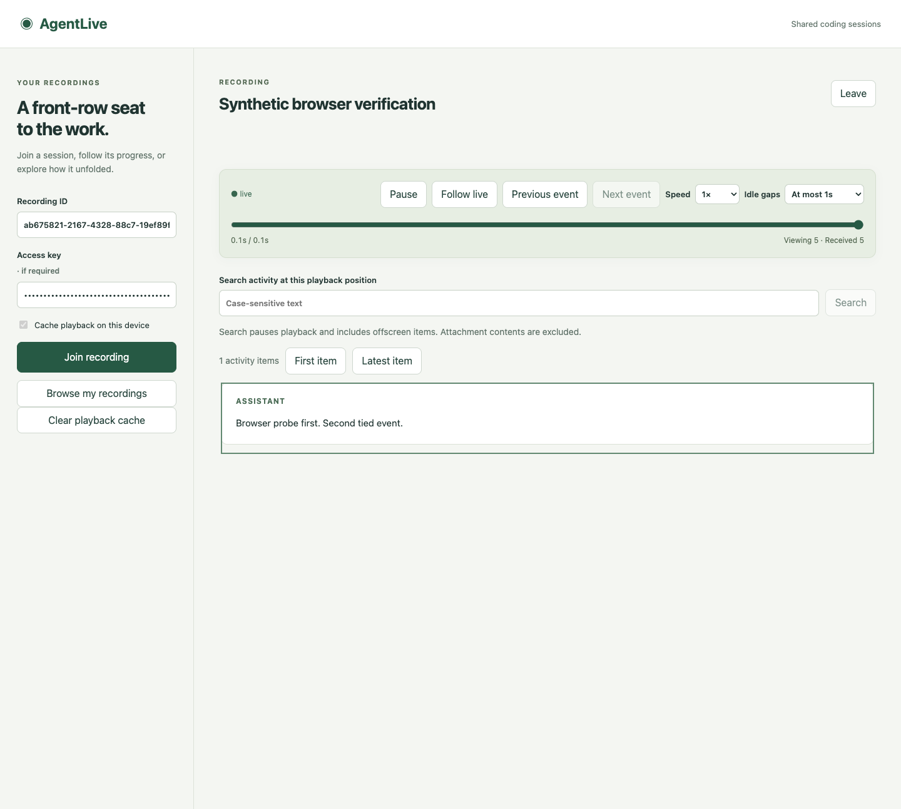
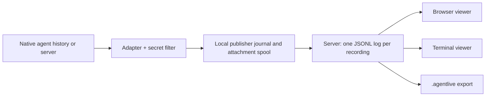

# AgentLive

Broadcast and replay coding-agent sessions from one stable URL.

AgentLive publishes a Claude Code, Codex, Kimi Code or OpenCode session to a server you choose. Viewers open the recording in a browser or a terminal, watch it live, pause or rewind while the agent keeps working, replay at up to 8× with idle-gap compression, and jump back to live. When publishing ends, the same URL serves the recording. Messages, tool calls, file changes, subagents and versioned attachments are captured as structured events, not screen video.



> **Status: pre-release.** The standalone server, CLI, browser and terminal viewers, all four adapters and portable recordings are implemented and covered by an offline test suite of 680+ tests (CI is configured for Linux and macOS). Production release gates remain open: real-device and native-version acceptance, a deployed hosted pilot, long-session performance targets and external testing. See [implementation status](IMPLEMENTATION_STATUS.md) for what is verified and what is not. No npm release has been published yet.

## Features

- **Four agents.** Import retained history, follow a session live, or launch the native agent under AgentLive with `--launch`. Parent and subagent sessions can join one recording with `--include-children`. See the [compatibility matrix](docs/compatibility.md) for exactly what each adapter captures.
- **Durable publishing.** Events are filtered for known secrets and written to a local journal before delivery. Laptop sleep, network loss or a server restart does not lose captured events; the publisher reconnects and resumes the same recording.
- **Independent playback.** Every viewer has its own clock: pause, step event by event, seek, change speed, cap idle gaps, search the activity feed, and return to live while receipt continues in the background.
- **Browser and terminal viewers.** A responsive React viewer with paged, cached playback state and a verified attachment inspector (text, PNG/JPEG/WebP, isolated HTML and captured artifact bundles), plus an interactive terminal viewer.
- **Portable recordings.** Export a `.agentlive` archive, replay it offline, or import it into another server.
- **Self-hosted first.** One Node process with filesystem storage; no database or message broker. Docker/Compose, offline and online backup/restore are included. An optional hosted mode adds OIDC accounts, device login, public listing, sharing grants and abuse reporting on the same server.
- **Private by default.** Recordings start private. Share with scoped, revocable viewing grants or make them unlisted/public explicitly. Viewers can never send input to the publishing machine.

## Quick start

Requirements: Node.js 26.8.1 or newer within Node 26, and pnpm 12.3.4 to build from source.

```sh
git clone https://github.com/bojieli/agentlive.git
cd agentlive
npx --yes pnpm@12.3.4 install --frozen-lockfile
npx --yes pnpm@12.3.4 package:build
npm install --global ./dist/release/agentlive-0.1.0.tgz
agentlive doctor
```

Try the viewer without an agent or server by replaying the bundled [sample recording](docs/sample/README.md):

```sh
agentlive replay --source docs/sample/agentlive-sample.agentlive --interactive
```

Start a local server. It listens on `http://127.0.0.1:7331` and stores data and an owner credential under `~/.agentlive`:

```sh
agentlive serve
```

In another terminal, publish a session. For example, start a new Claude Code session under AgentLive:

```sh
agentlive publish --agent claude --launch --cwd ~/my-project
```

or follow an existing native session selected by ID:

```sh
agentlive discover --agent codex
agentlive publish --agent codex --native-session <id>
```

The publisher prints a `publishing` event with a `viewerUrl`. Open it in a browser, or watch it in another terminal:

```sh
agentlive watch <viewer-url> --interactive
```

Recordings are private: in the browser, use the owner secret from `~/.agentlive/owner.json` as the access key, or issue a scoped, revocable viewing grant with `agentlive viewing-grant --stream <id> --expires-at <time>`. Keys are never placed in share URLs.

Control a publication without touching the agent:

```sh
agentlive status             # local bindings, pending events, viewer URLs
agentlive pause --stream <id>
agentlive resume --stream <id>
agentlive finish --stream <id>
agentlive export --stream <id> --output session.agentlive
agentlive replay --source session.agentlive --interactive
```

`agentlive --help` lists every command. The [usage guide](docs/usage.md) documents each one in detail.

## Documentation

| Topic | Document |
| --- | --- |
| Commands, publishing, viewers, limits | [Usage guide](docs/usage.md) |
| Per-agent capture fidelity | [Compatibility](docs/compatibility.md) |
| Enforced limits and measured performance | [Limits](docs/limits.md) |
| Docker, HTTPS reverse proxy | [Deployment](deployment/README.md) |
| Backup, restore and publisher recovery | [Server backups](docs/server-backups.md) |
| Hosted accounts and OIDC | [Hosted identity](docs/hosted-identity.md) |
| Sharing and credentials | [Viewing credentials](docs/viewing-credentials.md), [publisher credentials](docs/publisher-credentials.md) |
| Portable `.agentlive` files | [Recording archives](docs/recording-archives.md) |
| Artifacts | [Remote artifacts](docs/remote-artifacts.md), [artifact bundles](docs/artifact-bundles.md) |
| Protocol and storage internals | [docs/protocol](docs/protocol) |
| Product contract and milestones | [Implementation plan](IMPLEMENTATION_PLAN.md) |
| Verified state and open gates | [Implementation status](IMPLEMENTATION_STATUS.md), [remaining work](REMAINING_WORK.md) |

## How it works



The publisher owns native-session bindings, conversion, filtering and a durable local journal. The server serializes one writer per recording, appends to a checksummed JSONL log with immutable attachment files, and fans committed events out over WebSocket with bounded history downloads. Viewers share one synchronization and playback engine; receipt, cached state and presentation position are independent. Details are in the [implementation plan](IMPLEMENTATION_PLAN.md).

| Package | Responsibility |
| --- | --- |
| `packages/protocol` | Versioned event schemas, identifiers, canonical JSON, errors |
| `packages/storage` | Checksummed append-only logs, atomic JSON, kernel file locks, content stores, archives |
| `packages/publisher` | Bindings, journal, secret filtering, artifact spool, delivery and recovery |
| `packages/adapters` | Claude, Codex, Kimi and OpenCode import, follow, launch and family capture |
| `packages/server` | HTTP/WebSocket API, sessions, snapshots, accounts, grants, backups |
| `packages/client` | Shared history, subscription and snapshot clients |
| `packages/playback` | Reference and paged reducers, playback clock, terminal renderer |
| `packages/cli` | The `agentlive` command |
| `apps/web` | Browser viewer |

## Development

```sh
npx --yes pnpm@12.3.4 install --frozen-lockfile
npx --yes pnpm@12.3.4 check          # format, typecheck, build, offline tests
npx --yes pnpm@12.3.4 package:verify # build and verify the standalone tarball
```

Tests make no model calls. Opt-in probes under `scripts/` exercise installed agents and may incur provider charges. See [CONTRIBUTING.md](CONTRIBUTING.md), [RELEASING.md](RELEASING.md), and report security issues as described in [SECURITY.md](SECURITY.md).

## License

[MIT](LICENSE)
