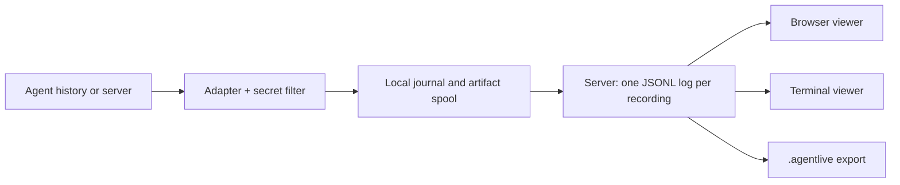

<h1 align="center">AgentLive</h1>

<p align="center">
  <strong>Broadcast and replay coding-agent sessions from one stable URL.</strong><br>
  Claude Code · Codex · Kimi Code · OpenCode
</p>

<p align="center">
  <a href="https://www.npmjs.com/package/agentlive"></a>
  <a href="https://github.com/bojieli/agentlive/actions/workflows/ci.yml"></a>
  <a href="LICENSE"></a>
  
</p>

<p align="center">
  <a href="#quick-start">Quick start</a> ·
  <a href="docs/">Documentation</a> ·
  <a href="docs/compatibility.md">Compatibility</a> ·
  <a href="docs/limits.md">Measured limits</a> ·
  <a href="CONTRIBUTING.md">Contributing</a>
</p>

---

Someone on your team is running a coding agent. You want to watch it work — now, or tomorrow, from a link.

AgentLive publishes that session to a server **you** choose. Viewers open one URL and watch events arrive live, pause or rewind while the agent keeps going, replay at 8× with idle gaps compressed, and jump back to live. When the session ends, the same URL serves the recording.

It captures **structured events** — messages, tool calls and results, file changes, subagents, versioned attachments — not screen video. So a recording is searchable, diffable, exportable, and still readable in a terminal.


> [!IMPORTANT]
> **Pre-release — `0.1.0` is the first published version.** Everything described here is implemented and covered by 807 offline tests running on Linux and macOS in CI. It has been deployed to a real host, driven against real installed agents, and given a security review. It has **not** had a public pilot or outside testers, and several limits are measured and published rather than solved. `0.x` makes no production-readiness claim: see [implementation status](IMPLEMENTATION_STATUS.md) for what is verified and what is not, and [limits](docs/limits.md) for the numbers.

## Why

A coding agent's work is mostly invisible to everyone but the person running it. Screen sharing is synchronous and lossy; a terminal recording is a wall of text you cannot search. AgentLive keeps the structure the agent already produces, so a session becomes something you can watch, rewind, search, share and archive.

- **Watch live, or rewind while it runs.** Your clock is yours; pausing never pauses the agent or loses events.
- **It stays yours.** One Node process, filesystem storage, no database and no model credentials on the server. Run it on a laptop or a VM.
- **Private by default.** Recordings start private. Share with scoped, revocable grants, or make one public deliberately. Viewers can never send input to the publishing machine.
- **Honest about fidelity.** What an agent does not expose is recorded as an explicit gap, never invented. Known secrets are filtered from text _and_ captured file bytes before anything is stored.

## Quick start

Needs [Node.js 26.x](https://nodejs.org) (26.8.1 or newer) on Linux or macOS, and nothing else — no database, no account, no API key.

```sh
npm install --global agentlive
```

### 1. See it work — no server, no agent, 20 seconds

```sh
curl -LO https://raw.githubusercontent.com/bojieli/agentlive/main/docs/sample/agentlive-sample.agentlive
agentlive replay --source agentlive-sample.agentlive --interactive
```

That is a real recording playing back from a single file. Press `space` to pause, `[` to rewind, `q` to quit.

### 2. Record your own session

Two terminals. In the first, start a server that keeps your recordings:

```sh
agentlive serve
```

In the second, launch your agent under AgentLive and work exactly as you normally would:

```sh
agentlive publish --agent claude --launch --cwd ~/my-project
```

It prints a `viewerUrl`. Open it in a browser — or watch from a third terminal:

```sh
agentlive watch <viewer-url> --interactive
```

Pause it. Press `[` to rewind thirty seconds, then `l` to catch back up. The agent never noticed; your clock is yours.

### 3. Keep it

```sh
agentlive status                    # what this machine is publishing
agentlive finish --stream <id>      # deliver everything captured, then end it
agentlive export --stream <id> --output session.agentlive
agentlive doctor                    # check runtime, credentials, server, agents
```

`--agent` takes `claude`, `codex`, `kimi` or `opencode`. Already have sessions on disk? `agentlive import --agent claude --source <transcript>` turns past work into a recording. Full detail: [installing](docs/install.md) · [recording](docs/recording.md).

## What it captures

|                              | Claude Code | Codex | Kimi Code | OpenCode |
| ---------------------------- | :---------: | :---: | :-------: | :------: |
| Import past sessions         |     ✅      |  ✅   |    ✅     |    ✅    |
| Follow a live session        |     ✅      |  ✅   |    ✅     |    ✅    |
| Launch under AgentLive       |     ✅      |  ✅   |    ✅     |    ✅    |
| Subagents in one recording   |     ✅      |  ✅   |    ✅     |    ✅    |
| Images, documents, artifacts |     ✅      |  ✅   |    ✅     |    ✅    |

Text appears as each agent writes it to its own history — records or snapshots, not individual tokens. Exactly what each adapter does and does not capture is in [compatibility](docs/compatibility.md).

## Documentation

**Using it** — [install](docs/install.md) · [record a session](docs/recording.md) · [watch and replay](docs/viewing.md) · [share and move recordings](docs/sharing.md) · [troubleshooting](docs/troubleshooting.md)

**Running a server** — [operate](docs/operating.md) · [deploy with Docker](deployment/README.md) · [backups](docs/server-backups.md) · [hosted accounts](docs/hosted-identity.md)

**Knowing what you get** — [compatibility](docs/compatibility.md) · [limits and measured performance](docs/limits.md) · [implementation status](IMPLEMENTATION_STATUS.md)

**Contributing** — [contributing](CONTRIBUTING.md) · [security](SECURITY.md) · [testing guide](docs/testing.md) · [protocol internals](docs/protocol/) · [the full plan](IMPLEMENTATION_PLAN.md)

## How it works



The publisher owns the binding to a native session, converts its records, filters known secrets, and writes to a durable local journal **before** anything is delivered — so sleep, a network drop or a server restart loses nothing. The server serializes one writer per recording, appends to a checksummed JSONL log with immutable attachment files, and fans committed events out over WebSocket. Viewers share one synchronization engine; receipt, cached state and where you are looking are independent.

<details>
<summary>Package layout</summary>

| Package              | Responsibility                                                          |
| -------------------- | ----------------------------------------------------------------------- |
| `packages/protocol`  | Versioned event schemas, identifiers, canonical JSON                    |
| `packages/storage`   | Checksummed logs, atomic JSON, kernel locks, content stores, archives   |
| `packages/publisher` | Bindings, journal, secret filtering, artifact spool, delivery, recovery |
| `packages/adapters`  | The four agent adapters: import, follow, launch, family capture         |
| `packages/server`    | HTTP/WebSocket API, sessions, snapshots, accounts, quotas, backups      |
| `packages/client`    | Shared history, subscription and snapshot clients                       |
| `packages/playback`  | Reference and paged reducers, playback clock, terminal renderer         |
| `packages/cli`       | The `agentlive` command                                                 |
| `apps/web`           | Browser viewer                                                          |

</details>

## Contributing

Issues and pull requests are welcome. `npx --yes pnpm@12.3.4 check` runs formatting, documentation links, the type build and the offline tests — no model calls, no network. Please read [CONTRIBUTING.md](CONTRIBUTING.md) first; it explains the durability invariants that shape the design.

Found a way to read someone's private recording, or a secret that survived filtering? Please report it privately — [SECURITY.md](SECURITY.md).

## License

[MIT](LICENSE) © Bojie Li
